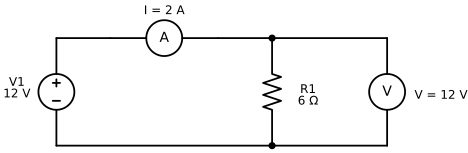
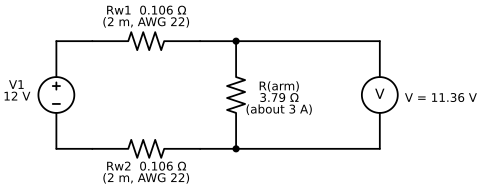
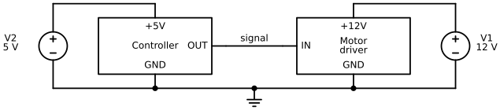
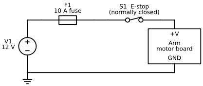

# Electricity, Power, and Safety Basics

## Summary

This chapter covers the electricity you need to power an arm safely: voltage, current, power supplies, wire gauge, and connectors. It pairs each idea with the core safety habits for working near a powered arm, such as pinch points, work envelopes, emergency stops, and supervision. After this chapter, you will be able to power an arm and follow a safe power-up sequence.

## Concepts Covered

This chapter covers the following 25 concepts from the learning graph:

| Concept | Concept Impact Score |
|---------|-----------------------|
| Voltage | 1858 |
| Robot Safety | 146 |
| Current | 129 |
| Emergency Stop | 64 |
| Power Supply | 58 |
| Hardware E-Stop | 27 |
| Software E-Stop | 27 |
| Ohm's Law | 22 |
| Wire Gauge | 19 |
| Safe Power-Up Sequence | 15 |
| Current Rating | 10 |
| Collision | 10 |
| Pinch Point | 8 |
| Risk Assessment | 7 |
| Electrical Power | 5 |
| Fuse | 5 |
| Adult Supervision | 5 |
| Power Budget | 4 |
| Power Connectors | 4 |
| Voltage Rating | 3 |
| Safe Work Envelope | 3 |
| Battery | 1 |
| Common Ground | 1 |
| Mains Power Safety | 1 |
| Supervised Operation | 1 |

## Prerequisites

This chapter builds on concepts from:

- [Chapter 1: Setting Up Python for Robotics](../01-python-setup-for-robotics/index.md)
- [Chapter 2: Anatomy of a Robot Arm](../02-anatomy-of-a-robot-arm/index.md)

---

!!! mascot-welcome "Power On, Safely!"
    { class="mascot-admonition-img" }
    Every joint I have is a motor, and every motor is hungry for electricity. In this chapter you will learn how to feed me the right amount, and how to stay safe while I move. By the end you will be able to size a power supply, pick wire and a fuse, and power me up with a checklist in Python. Let's move it!

Chapter 2 gave you the words for the arm's shape. This chapter looks at what makes the arm move: electricity. Every motor in an arm turns electrical energy into motion, and every wire between the supply and a motor is a path where things can go right or wrong. A wire that is too thin gets warm. A supply that is too small makes the arm twitch and reset. A supply with the wrong voltage can destroy a motor in a second.

The chapter has two halves that depend on each other. The first half builds the electrical picture, starting with the three quantities every circuit has (voltage, current, and resistance) and ending with a *power budget* that tells you what supply to buy. The second half is about **robot safety**, the habits and design choices that keep people, the arm, and the table around it from harm. Power and safety belong in one chapter because electricity is also the arm's energy source for hurting something. The rule that runs through both halves is Servo's favorite: *simulate first, then power on*.

## Electricity Basics

Three ideas explain almost everything in this chapter: voltage, current, and resistance. Learn them with a picture of water in pipes. The picture is not exact, but it gets the right answers for the circuits in this book.

### Voltage

**Voltage** is the electrical push that moves charge around a circuit. It is measured in **volts** (V). In the water picture, voltage is the pressure difference between the two ends of a pipe. A tank on a high roof pushes water down a pipe harder than a low tank does, and a higher voltage pushes more electricity through a wire.

Voltage is always measured *between two points*. There is no such thing as "the voltage of one wire" unless someone has agreed on the second point. A 12 V supply has a **positive terminal** that sits 12 V above its **negative terminal**. If you connect a **voltmeter**, the instrument that measures voltage, between the two terminals, it reads 12 V. If you connect it between the positive terminal and a wire that goes nowhere, it reads nothing useful. Later in this chapter you will see that engineers pick one point, call it ground, and measure every other voltage from there.

The electricity in this book is **DC**, short for direct current. In DC the push always points the same way, so each wire has a fixed plus or minus. Batteries and the small power supplies for robot arms make DC. The wall outlet makes **AC**, alternating current, whose push reverses many times a second. A power supply's job is to turn the wall's AC into the steady, low-voltage DC that an arm can use. The table lists the voltages you will meet in this book.

| Where you meet it | Voltage | Kind | Source |
|---|---|---|---|
| A USB port on your computer | 5 V | DC | USB standard |
| SO-ARM101 supply, with 7.4 V motors | 5 V | DC | SO-ARM100 repository parts list |
| SO-ARM101 supply, with the 12 V motors | 12 V | DC | SO-ARM100 repository parts list |
| reBot-DevArm B601-DM | 24 V | DC | reBot-DevArm repository |
| reBot-DevArm B601-RS | 48 V | DC | reBot-DevArm repository |
| A wall outlet | about 120 V (North America) or 230 V (Europe) | AC | Local mains standard |

The voltages in the first five rows are called *low voltage*. They are far below the wall outlet's voltage, which is why the arms in this book are reasonable projects for a classroom. The sixth row is not low voltage, and the section on mains power safety later in this chapter explains why you never touch it.

Here is a worked example of why you must say *where* you measured. Suppose you set a multimeter to DC volts, touch the black probe to the supply's negative terminal and the red probe to its positive terminal, and read 12.0 V. Now the arm lifts a weight and draws more current, and you measure again at the arm's own power connector. The meter reads 11.4 V. The supply did not change. The wire between the two places lost 0.6 V. You will calculate exactly how much a wire loses in the section on wire gauge.

!!! mascot-thinking "Voltage Is a Difference"
    { class="mascot-admonition-img" }
    A voltage is never "at" one place. It is the *difference* between two places, the way a hill has a height only compared with the ground below it. Whenever you read or write a voltage, ask: measured from where to where?

### Current

**Current** is the flow of electric charge, and it is measured in **amperes**, or **amps** (A). In the water picture, current is how many litres per second pass a point in the pipe. Voltage is the push, and current is the flow that the push produces. A motor that is lifting hard asks for more current than one that is idle.

By a very old convention, engineers draw current as flowing out of the positive terminal, around the circuit, and back into the negative terminal. This is called **conventional current**. (The electrons really move the other way, but the maths comes out the same either way, and every diagram in this book uses conventional current.) For a current to flow at all, the path must be a **circuit**, a complete closed loop. If you break the loop anywhere, with a switch or a loose wire, the current stops everywhere at once. That is how switches, fuses, and emergency stops all work.

Current is not "used up" as it goes around a simple loop. The same number of amps leaves the positive terminal and returns to the negative terminal. What the load changes is the *voltage*: charge arrives at the load with a push and leaves with none, because the load has used the push to do something, such as turning a motor.

Two meters let you see both quantities. A voltmeter goes *across* a part, connected to the two points you want to compare. An **ammeter**, which measures current, goes *in series*, which means you break the loop and put the meter in the gap so that all the current passes through it. The next figure shows a supply, an ammeter, a resistor as the load, and a voltmeter. A **resistor** is a part that opposes current, and the next section explains it in detail. The figure marks the ammeter with an A and the voltmeter with a V.

!!! mascot-tip "Ammeter in Series, Voltmeter Across"
    { class="mascot-admonition-img" }
    Say it as a rhyme: *amps go through, volts go across*. Never connect an ammeter straight across a supply, because it gives the current an almost empty path and can blow the meter's fuse or damage the meter.

#### Diagram: Ohm's Law Measurement Circuit

<figure markdown="span">
  
  <figcaption>A 12 V supply drives 2 A through a 6 Ω resistor. The ammeter A is in series, so all the current passes through it. The voltmeter V is across the resistor and measures its voltage. Source: diagrams/ohms-law-circuit.py.</figcaption>
</figure>

Follow the loop with your finger: out of the top of the supply, through the ammeter, through the resistor, and back along the bottom wire. The voltmeter has its own branch, but an ideal voltmeter draws almost no current, so the 2 A all goes through the resistor. Now connect the figure to the arm. The motor board in an arm plays the role of the load. A single STS3215 motor (the kind in the SO-ARM101) is listed with a no-load current of about 0.15 A and a stall current of about 2.0 A at 6 V. *Stall* means the motor is pushing but cannot turn, for example against a table. Those two numbers are 13 times apart, which is why a motor's current changes so much with its job. Chapter 5 measures real motor currents.

!!! mascot-thinking "Current Needs a Loop"
    { class="mascot-admonition-img" }
    Electricity does nothing in a wire that does not go back to where it started. Whenever a circuit "does not work", trace the loop out and back with your finger and look for the break. You will use this trick again in the section on common ground.

### Ohm's Law

**Resistance** is how strongly a part opposes current. It is measured in **ohms**, written with the Greek letter omega (Ω). A thin pipe has more resistance to water than a fat one, and a thin wire has more resistance to current than a fat one. **Ohm's law** connects the three quantities of a simple resistor circuit:

\[ V = I \times R \]

where \( V \) is the voltage across the resistor in volts, \( I \) is the current through it in amps, and \( R \) is its resistance in ohms. In words: for a given resistor, the current is proportional to the voltage across it. Double the push, and you double the flow. The same equation can be rearranged to find whichever quantity is missing.

| You know | You want | Use | Example |
|---|---|---|---|
| V and R | I | \( I = V / R \) | 12 V and 6 Ω give 2 A |
| V and I | R | \( R = V / I \) | 12 V and 3 A give 4 Ω |
| I and R | V | \( V = I \times R \) | 2 A and 8 Ω give 16 V |

Here is the worked example from the figure above. The supply is 12 V and the resistor is 6 Ω, so \( I = 12 / 6 = 2 \) A. If you replace the resistor with a 12 Ω one, the current falls to \( 12 / 12 = 1 \) A. If you keep the 6 Ω resistor and raise the supply to 24 V, the current rises to 4 A. A straight proportion like this holds for a plain resistor. It does not hold for a motor, whose current depends on how hard it is working, so treat Ohm's law as the model for wires and heaters, and as a rough guide for motors.

!!! mascot-encourage "Rearranging Is a Skill"
    { class="mascot-admonition-img" }
    Most people have to stop and think when they rearrange an equation, even after years of practice. You already rearranged formulas in Python when you solved for a variable, so this is the same move. Write the three forms in the table on a sticky note, and check each answer by putting it back into \( V = I \times R \).

### Electrical Power

**Electrical power** is the rate at which electrical energy is used or delivered. It is measured in **watts** (W). Power is the product of the push and the flow:

\[ P = V \times I \]

where \( P \) is power in watts, \( V \) is volts, and \( I \) is amps. Because \( V = I \times R \), two other forms follow, \( P = I^2 R \) and \( P = V^2 / R \). The first form is the one to remember for wire: **heat** in a wire grows with the *square* of the current, so doubling the current makes four times as much heat.

A short Python calculation shows the idea. The program multiplies a voltage by a current and prints the power. The `:` in each f-string field is a format code, and `.1f` means one digit after the decimal point:

```python linenums="1"
volts = 12
amps = 3
watts = volts * amps
print(f"{volts} V x {amps} A = {watts} W")

wire_ohms = 0.2118   # a pair of 2 m wires of AWG 22, from the wire gauge section
heat_w = amps ** 2 * wire_ohms
print(f"Heat in the wires: {heat_w:.1f} W")
```

```text
12 V x 3 A = 36 W
Heat in the wires: 1.9 W
```

The motor board uses 36 W. The two wires use 1.9 W as heat. That sounds small, but it comes out of a thin wire with a small surface to cool it, and it is power that never reaches the motor. Energy is power multiplied by time. The usual unit on a battery label is the **watt-hour** (Wh): a 10 W load running for 3 hours uses 30 Wh.

The next MicroSim turns the figure into a model you can change. Sliders set the supply voltage and the resistance. The orange dots show conventional current, and they move faster when the current is larger. The readouts give the current and the power. After you explore, the Challenges mode gives five targets: set the free slider so that the current, or the power, hits the target.

#### Diagram: Ohm's Law Explorer

<iframe src="../../sims/ohms-law-explorer/main.html" height="562px" width="100%" scrolling="no"></iframe>

[Run the Ohm's Law Explorer MicroSim fullscreen](../../sims/ohms-law-explorer/main.html){ .md-button .md-button--primary }

<details markdown="1">
<summary>Ohm's Law Explorer</summary>
Type: microsim
**sim-id:** ohms-law-explorer<br/>
**Library:** p5.js<br/>
**Status:** Specified<br/>
**Bloom Level:** Apply<br/>
**Bloom Verb:** calculate<br/>
**Learning Objective:** The learner will calculate the resistor or supply voltage that gives a target current or power in a simple loop, in five challenges, with at least 4 of 5 correct on the first attempt.

**Prerequisites:** voltage, current, circuit, resistance, Ohm's law, electrical power, conventional current (all defined in the sections above this block).

**Evidence of Mastery:** In Challenges mode the learner sets the one free quantity (supply voltage or resistance) and commits with Check. A challenge is correct when the resulting current (or power, for challenge 5) equals the target within 0.001. Mastery is 4 of 5 correct on the first attempt. Moving the sliders in Explore mode is exploration, not evidence.

**Misconceptions:** (1) A higher supply voltage gives less current. (For a fixed resistor, current rises in proportion to voltage.) (2) Current is used up as it goes around the loop. (The same current flows through every part of a simple loop.) (3) A voltmeter carries the load's current. (An ideal voltmeter draws almost none.)

**Instructional Rationale:** An Apply-level calculate objective needs practice solving a rearranged equation on new numbers with an immediate check. Letting the learner see the ammeter and the dots respond first builds the proportional sense, and the committed challenges then test whether the learner can run the equation backwards to hit a target.

**Content:**

The circuit is the schematic in the chapter figure: a supply V1, an ammeter in series, a load resistor R1, and a voltmeter across R1, with the return wire closing the loop. Orange dots show conventional current leaving the supply's positive terminal. Dot spacing is constant and dot speed is proportional to the current. No dots flow through the ideal voltmeter. Readouts: I = V / R and P = V × I.

| Quantity | Min | Max | Step | Default | Unit |
|---|---|---|---|---|---|
| Supply voltage V | 0 | 24 | 1 | 12 | V |
| Load resistance R | 1 | 24 | 1 | 6 | Ω |

Five challenges in this fixed order. In each, one slider is locked and the other starts at the value shown.

| # | Challenge text | Locked | Starting V, R | Target | Correct setting | Why (shown as feedback) |
|---|---|---|---|---|---|---|
| 1 | Supply fixed at 12 V; set R so the current is 3 A | V | 12 V, 6 Ω | I = 3 A | R = 4 Ω | R = V / I = 12 / 3 = 4 Ω. |
| 2 | Supply fixed at 12 V; set R so the current is 1 A | V | 12 V, 6 Ω | I = 1 A | R = 12 Ω | R = V / I = 12 / 1 = 12 Ω. |
| 3 | Supply fixed at 24 V; set R so the current is 4 A | V | 24 V, 12 Ω | I = 4 A | R = 6 Ω | R = V / I = 24 / 4 = 6 Ω. |
| 4 | Resistor fixed at 8 Ω; set the supply so the current is 2 A | R | 12 V, 8 Ω | I = 2 A | V = 16 V | V = I × R = 2 × 8 = 16 V. |
| 5 | Supply fixed at 12 V; set R so the resistor dissipates 12 W | V | 12 V, 6 Ω | P = 12 W | R = 12 Ω | P = V² / R, so R = V² / P = 144 / 12 = 12 Ω. |

**Provenance:** The values are illustrative and written for this sim. The equations come from the chapter sections "Ohm's Law" and "Electrical Power". The schematic is drawn from the same design as `diagrams/ohms-law-circuit.svg`.

**Rules:** I = V / R and P = V × I, with the load an ideal resistor and the meters ideal. A challenge is correct when |measured value − target| < 0.001. The sim states that a real motor is not a fixed resistor, because its current changes with load (Chapter 5).

**Learner Activity:**

1. In Explore mode (the starting mode) the learner moves the V and R sliders. The readouts and the dot speed update at once. The learner should notice that doubling V doubles I, doubling R halves I, and the dot speed follows the ammeter.
2. The learner switches to Challenges mode. Challenge 1 appears with its locked slider disabled and the free slider set to its starting value.
3. The learner moves the free slider until the live readout shows the target, then presses Check to commit.
4. The sim shows whether the answer was correct, the correct setting and the Why text, and disables both sliders until the learner presses Next challenge.
5. After challenge 5 the sim shows the score. The learner can press Try again, which restarts at challenge 1 with the score cleared, or switch back to Explore.

**Feedback:** Five challenges, fixed order, one attempt each. Correct: "Correct: <setting>. <Why>". Incorrect: "Not quite. The answer is <setting>. <Why> Your setting gave <value>." The correct setting is revealed after each commit. A running count "Correct: n of 5" is shown and the final screen says whether mastery (4 of 5) was reached.

**Starting State:** Explore mode with V = 12 V and R = 6 Ω, the ammeter reading 2 A, and the readouts I = 2 A and P = 24 W.

**Chapter Anchors:** The chapter's worked example is 12 V and 6 Ω giving 2 A and 24 W. Challenge 4 uses 2 A × 8 Ω = 16 V. The sim has five challenges and mastery is 4 of 5.
</details>

## Power Sources and Ratings

You now have the equations. This section covers the real parts that supply the voltage and current, and the ratings that tell you what each part can safely do.

### Power Supply

A **power supply** is a device that converts one form of electrical power into the form a load needs. The supplies for robot arms plug into the wall and produce steady DC at a fixed voltage. They are sometimes called wall adapters, "bricks", or, for a larger lab version, bench supplies. A supply has three ratings printed on its label: the output *voltage*, the maximum *current*, and often the maximum *power*, which is the voltage times the current.

The most misunderstood rating is the current. The label "5 V 4 A" does not mean the supply pushes 4 A into the arm. It means the supply *can deliver up to* 4 A while holding 5 V. The *load* decides how much current really flows, as Ohm's law showed. A bigger current rating never harms a load, and it is the safe direction to be wrong in. A smaller one means the supply cannot keep up, its voltage sags, and the arm resets or behaves oddly. The voltage is the opposite: it must match the load. A supply with the right voltage and a larger current rating is correct; a supply with a different voltage is wrong.

The supply is also where polarity is fixed. Small supplies use a round **barrel jack**, and the usual convention puts the positive voltage on the centre pin. Check the symbol printed beside the plug, because a supply with reversed polarity can damage a motor board.

| Arm | Supply voltage | Notes from the project | Source |
|---|---|---|---|
| SO-ARM101, 7.4 V motors | 5 V | One supply per arm, 5.5 × 2.1 mm barrel jack in the parts list | SO-ARM100 repository |
| SO-ARM101, 12 V motors | 12 V, 5 A or more | The project says the 12 V motors need a 12 V supply of 5 A or more instead of a 5 V one | SO-ARM100 repository |
| reBot-DevArm B601-DM | 24 V | Damiao motors | reBot-DevArm repository |
| reBot-DevArm B601-RS | 48 V | The project recommends a 48 V, 12.5 A supply, and a 48 V, 25 A supply for full performance | reBot-DevArm repository |

The specifications were checked on 2026-10-07, and projects update them, so confirm the numbers on the project's page before you buy. The sizing question, which current rating to choose, is answered by the power budget later in this chapter.

### Voltage Rating

A **voltage rating** is the range of supply voltage a part is designed for. Motors, motor boards, and chargers all have one. Below the range the part works badly or not at all, and above it the part can be damaged, often at once. A rating is a promise only inside its range.

The SO-ARM101's motors show why the label matters. The STS3215 comes in a 7.4 V version, listed for 6 to 7.4 V, and a 12 V version. The SO-ARM100 repository says the 7.4 V motors have a stall torque of 16.5 kg·cm at 6 V and the 12 V version has 30 kg·cm. The project's own parts list pairs the 7.4 V motors with a 5 V supply, so read the project's list as well as the motor's label. The 7.4 V motors and the 12 V motors look almost identical.

!!! mascot-warning "Check the Voltage Label Before You Plug In"
    { class="mascot-admonition-img" }
    Two motors that look the same can need different voltages, and plugging a 12 V supply into a 7.4 V motor board can destroy it. Before the first power-up, read the voltage on the motor label, the motor board, and the supply, and write the three numbers down. If they do not agree, stop and ask the person who sold you the kit.

### Battery

A **battery** stores chemical energy and releases it as DC at a roughly fixed voltage. A single lithium-polymer (LiPo) cell has a nominal voltage of 3.7 V and is full at 4.2 V. Cells are joined in series to make higher voltages, and the number of cells in series is written with an S. A "3S" pack has 3 cells, so it is 11.1 V nominal and 12.6 V when full. A battery's *capacity* is written in milliamp-hours (mAh) or amp-hours (Ah), and multiplying by the voltage gives energy in watt-hours.

Here is a worked example of runtime. A 3S 2200 mAh pack stores \( 11.1 \times 2.2 = 24.4 \) Wh. An arm whose motors average 20 W would run for \( 24.4 / 20 \approx 1.2 \) hours in the ideal case, and less in practice because batteries cannot be fully emptied. The arms in this book run from wall supplies, because a supply never runs out in the middle of a lesson and it is safer to keep near a classroom. LiPo cells can catch fire if they are punctured, shorted, or overcharged, so use a battery only with the charger made for it and with an adult present.

### Mains Power Safety

**Mains power** is the high-voltage AC from the wall outlet. It is the one voltage in this chapter that can seriously hurt or kill a person, because it can push enough current through a body to stop the heart. The low-voltage DC on the arm side of the supply cannot do that. All the dangerous voltage in your project is *inside* the supply, and a certified supply keeps it there.

Four habits cover almost everything. Use only a supply with a recognised safety mark, such as UL or CE. Never open a supply, because its capacitors can hold a charge after it is unplugged. Never cut, splice, or repair a mains cord, and replace any cord with a cracked or taped insulation. Keep water and drinks away from the supply and the power strip. If you need an emergency stop, build it on the low-voltage DC side of the supply, never the mains side.

## Wires, Fuses, and Connectors

The wire between the supply and the arm is part of the circuit, with its own resistance, its own heating, and its own limits. Three parts keep that path safe: the right wire, a fuse, and the right connector.

### Wire Gauge

**Wire gauge** is a number that describes a wire's thickness. This book uses the American Wire Gauge (**AWG**), where a *larger* number means a *thinner* wire. Every 3 gauge numbers halve the wire's cross-section area, and every 6 halve its diameter. Thicker copper has less resistance and carries more current before it heats up. The diameter of a wire follows \( d = 0.127 \times 92^{(36-n)/39} \) millimetres for gauge \( n \). Here is the table of six gauges that fit hobby arms. The resistance column is for one metre of copper wire. The *limit* column gives conservative teaching values for short, bundled hobby wiring: each sits at or below the 60 °C ampacity column of the American National Electrical Code table, as reproduced in Wikipedia's AWG article. Treat the limits as a rule of thumb, and check the data sheet of your own wire.

| AWG | Diameter (mm) | Resistance (mΩ per metre) | Teaching limit (A) |
|---|---|---|---|
| 14 | 1.628 | 8.28 | 15 |
| 16 | 1.291 | 13.17 | 10 |
| 18 | 1.024 | 20.95 | 7 |
| 20 | 0.812 | 33.31 | 5 |
| 22 | 0.644 | 52.96 | 3 |
| 24 | 0.511 | 84.22 | 2 |

A current always needs *two* wires: a **lead** wire to the load and a **return** wire back. A wire drops voltage just as a resistor does, so the load receives the supply voltage minus the **voltage drop** across both wires. Here is the worked example behind the next figure. The arm draws 3 A through 2 m of AWG 22 wire in each direction. The two wires have a combined resistance of \( 2 \times 2 \times 0.05296 = 0.212 \) Ω, so the drop is \( 3 \times 0.212 = 0.64 \) V, and the arm sees \( 12 - 0.64 = 11.36 \) V. The wire also turns \( 3^2 \times 0.212 = 1.9 \) W into heat.

#### Diagram: Wire Voltage-Drop Circuit

<figure markdown="span">
  
  <figcaption>Each 2 m run of AWG 22 wire is drawn as a 0.106 Ω resistor. With the arm drawing 3 A, the wires drop 0.64 V and the arm receives 11.36 V. Source: diagrams/wire-voltage-drop.py.</figcaption>
</figure>

How much loss is acceptable? A practical rule is the **5 percent rule**: keep the drop below 5 percent of the supply voltage. At 12 V that is 0.6 V. The example above loses 5.3 percent, so it fails by a small margin. Move to AWG 20 and the drop falls to 0.40 V, or 3.3 percent. At AWG 18 it is 0.25 V, or 2.1 percent. The rule matters more for the low-voltage arms. At 5 V, 5 percent is only 0.25 V.

!!! mascot-tip "Shorten the Cable Before You Thicken It"
    { class="mascot-admonition-img" }
    Wire resistance grows with length, so halving the cable halves the drop, and it costs nothing. If an arm resets when it lifts, measure the voltage at the motor board while it moves. A drop of more than 5 percent from the supply's voltage means the cable is too long, too thin, or both.

In the next MicroSim you choose a wire gauge, a length, and a load current for a 12 V supply. The wire is drawn with a thickness that follows the gauge, so you can see why AWG 14 is stout and AWG 24 is thin. The dots move faster when the current rises, and a wire that is past its teaching limit turns red. After you explore, five challenges ask you to find the thinnest wire that keeps the drop under 5 percent and stays inside its current limit.

#### Diagram: Wire Voltage-Drop Explorer

<iframe src="../../sims/wire-voltage-drop-explorer/main.html" height="562px" width="100%" scrolling="no"></iframe>

[Run the Wire Voltage-Drop Explorer MicroSim fullscreen](../../sims/wire-voltage-drop-explorer/main.html){ .md-button .md-button--primary }

<details markdown="1">
<summary>Wire Voltage-Drop Explorer</summary>
Type: microsim
**sim-id:** wire-voltage-drop-explorer<br/>
**Library:** p5.js<br/>
**Status:** Specified<br/>
**Bloom Level:** Apply<br/>
**Bloom Verb:** solve<br/>
**Learning Objective:** The learner will solve five wire-selection problems by choosing the thinnest wire gauge that keeps the voltage drop within 5% of a 12 V supply and the current within the wire's limit, with at least 4 of 5 correct on the first attempt.

**Prerequisites:** voltage, current, resistance, Ohm's law, wire gauge, AWG, lead and return wires, voltage drop, the 5 percent rule, teaching limit (all defined in the section "Wire Gauge" above this block).

**Evidence of Mastery:** In Challenges mode the learner chooses a gauge from the six listed and commits with Check. A choice is correct when it equals the thinnest gauge (largest AWG number) that passes both rules in Rules. Mastery is 4 of 5 correct on the first attempt. Changing gauge, length and current in Explore mode is exploration, not evidence.

**Misconceptions:** (1) Any wire that fits the connector is fine. (Thin wire can lose too much voltage or overheat.) (2) A thin wire is always safe when the current is small. (A long thin wire can still lose more than 5%.) (3) Wire loses no voltage. (Every wire has resistance, and the drop is current times resistance.)

**Instructional Rationale:** An Apply-level solve objective needs the learner to run a procedure on new inputs: compute resistance, then drop, then compare with two limits. Seeing the wire thickness, the heat and the dots change in Explore mode first builds the intuition that the challenges then test.

**Content:**

Fixed: supply 12 V. The drop limit is 5% of 12 V, which is 0.6 V. The load draws exactly the set current. The two wires are the same gauge and the same length.

| AWG | Diameter (mm) | Resistance (mΩ per metre) | Teaching limit (A) |
|---|---|---|---|
| 14 | 1.628 | 8.28 | 15 |
| 16 | 1.291 | 13.17 | 10 |
| 18 | 1.024 | 20.95 | 7 |
| 20 | 0.812 | 33.31 | 5 |
| 22 | 0.644 | 52.96 | 3 |
| 24 | 0.511 | 84.22 | 2 |

| Quantity | Min | Max | Step | Default | Unit |
|---|---|---|---|---|---|
| Wire gauge | 14 | 24 | list: 14, 16, 18, 20, 22, 24 | 22 | AWG |
| Length of each wire | 0.5 | 5 | 0.5 | 2 | m |
| Load current | 1 | 8 | 0.5 | 3 | A |

Five challenges in this fixed order. In each, the length and current are fixed and the learner chooses the gauge. Drops are in volts and percent of 12 V.

| # | Load current (A) | Length of each wire (m) | Correct gauge | Why (shown as feedback) |
|---|---|---|---|---|
| 1 | 3 | 2 | AWG 20 | AWG 22 drops 0.64 V (5.3%), too much. AWG 20 drops 0.40 V (3.3%) and 3 A is inside its 5 A limit. |
| 2 | 1 | 1 | AWG 24 | AWG 24 drops 0.17 V (1.4%) and 1 A is inside its 2 A limit, so the thinnest wire works. |
| 3 | 6 | 1 | AWG 18 | AWG 20 drops only 0.40 V but its limit is 5 A, below 6 A. AWG 18 drops 0.25 V (2.1%) and its limit is 7 A. |
| 4 | 4 | 4 | AWG 16 | AWG 18 drops 0.67 V (5.6%), too much. AWG 16 drops 0.42 V (3.5%) and its limit is 10 A. |
| 5 | 8 | 3 | AWG 14 | AWG 16 drops 0.63 V (5.3%), too much. AWG 14 drops 0.40 V (3.3%) and its limit is 15 A. |

**Provenance:** Diameters and resistances follow the AWG table (Wikipedia, American wire gauge), rounded to the values above. The teaching limits are conservative values for short bundled hobby wiring, at or below the 60 °C ampacity column of the National Electrical Code table as reproduced in that article, and are labeled "teaching limit" in the sim. The currents and lengths in the challenges are illustrative.

**Rules:** For a gauge with resistance \( r \) (mΩ per metre), one-way length L (m) and current I (A): total wire resistance R = 2 × L × r / 1000 ohms; drop = I × R volts; percent = 100 × drop / 12; load voltage = 12 − drop; heat in the wires = I² × R watts. A gauge passes when drop <= 0.6 V and I <= its teaching limit. The correct challenge answer is the passing gauge with the largest AWG number. The wire is shown as overheating (red) when I exceeds its teaching limit.

**Learner Activity:**

1. In Explore mode the learner changes the gauge, the length and the current. The voltage at the arm, the drop, the percent drop and the heat update at once, the wire thickness follows the gauge, and the dots speed up with the current.
2. The learner notices that doubling the length or the current doubles the drop, and that a wire past its limit turns red.
3. The learner switches to Challenges mode. Challenge 1 shows its current and length. The length and current controls are locked and the gauge starts at AWG 22.
4. The learner chooses a gauge and presses Check to commit.
5. The sim shows whether the choice was correct and the Why text, then disables the gauge control until the learner presses Next challenge. After challenge 5 it shows the score.

**Feedback:** Five challenges, fixed order, one attempt each. Correct: "Correct: AWG <gauge>. <Why>". Incorrect: the sim says whether the chosen gauge dropped more than 5%, exceeded its limit, or worked but was thicker than needed, then names the correct gauge and its numbers. The correct gauge is revealed after each commit. A running count "Correct: n of 5" is shown and the final screen says whether mastery (4 of 5) was reached.

**Starting State:** Explore mode with AWG 22, 2 m, 3 A. The arm receives 11.36 V, the drop is 0.64 V (5.3%), and the sim says the drop is too large.

**Chapter Anchors:** The chapter's worked example is AWG 22, 2 m, 3 A: resistance 0.212 Ω, drop 0.64 V, 11.36 V at the arm, 1.9 W of heat, and 5.3% loss. AWG 20 gives 3.3% and AWG 18 gives 2.1%. The six gauges and teaching limits are those in the table. The sim has five challenges and mastery is 4 of 5.
</details>

### Current Rating

A **current rating** is the largest current a part is designed to carry continuously. Every part in the power path has one: the supply, the wire, the connector, the fuse, and the switch. The circuit can safely carry only as much current as its *weakest* part, so the weakest rating is the rating of the whole path.

Here is a worked example for a 5 V arm that peaks at 3.6 A. The supply is rated 5 A. The cable is AWG 22 with a teaching limit of 3 A. The connectors are XT30 plugs, listed at about 15 A. Each part is fine on its own, except the cable: at 3.6 A it is above its 3 A limit and runs warm. Swapping it for AWG 18 (7 A) fixes that, and now the weakest part is the supply at 5 A, which is above the arm's peak.

| Part | Rating | Above the 3.6 A peak? |
|---|---|---|
| Supply | 5 A | Yes |
| Cable, AWG 22 | 3 A | **No** |
| Connectors, XT30 | about 15 A | Yes |
| Cable, AWG 18 (replacement) | 7 A | Yes |

### Fuse

A **fuse** is a deliberately weak link: a thin strip of metal inside a small case that melts and opens the circuit when the current stays too high. It protects the *wire* and prevents fire. It does not protect the motor, because a motor can be damaged by heat or stalling at a current well below the fuse rating. Common types are glass tube fuses, flat plastic blade fuses (the kind in cars), and resettable fuses that recover after cooling.

The fuse goes in series with the positive wire, as close to the supply as possible, so that it protects as much wire as possible. Choose the rating inside a window. It must be *above* the highest current the arm normally draws, with some margin, or the fuse will blow during normal work. It must also be *below* the teaching limit of the thinnest wire it protects, or the wire could overheat before the fuse acts. For the 5 V arm above with its AWG 18 cable, the normal peak is 3.6 A, a 25 percent margin gives 4.5 A, and the wire limit is 7 A. Any rating from 4.5 A to 7 A fits, and 5 A is a standard blade-fuse value.

!!! mascot-warning "Never Swap in a Bigger Fuse"
    { class="mascot-admonition-img" }
    A fuse that keeps blowing is telling you something is wrong, such as a short, a stalled motor, or an undersized supply. Replacing it with a bigger fuse, or with a wire, removes the protection and leaves the fault. Find the cause first, then fit a fuse of the same rating.

### Power Connectors

**Power connectors** join the supply, the cable, and the arm, and they carry the full current. Good ones are *keyed*, which means they only fit one way round, so you cannot reverse the polarity by mistake. The barrel jack on small supplies is common and cheap, but its centre-positive convention is only a convention. The XT-series connectors (XT30 and XT60) are polarised and marked with + and −. Vendors list the XT30 for about 15 A of continuous current, and the XT60 for much more, so either is generous for a desktop arm. Pick the connector whose rating is above your peak current, and tug-test every crimp before you power on.

### Common Ground

A **common ground** is a shared reference point that two or more circuits agree to measure their voltages from. Suppose a controller on a 5 V supply sends a signal wire to a motor driver on a separate 12 V supply. The signal is a voltage on one wire, and a voltage has meaning only compared with a second point. A current also needs a complete loop, so a signal current needs a way back. The way back is the shared ground wire. Without it the driver's input has no reference, and it can read anything.

The figure shows the correct wiring. Each box has its own supply for its own power. Only the *grounds* are tied together. The positive rails stay separate, because joining two different supplies' positive rails would let one supply push current into the other.

#### Diagram: Common Ground Between Supplies

<figure markdown="span">
  
  <figcaption>A controller on a 5 V supply signals a motor driver on a 12 V supply. One bottom wire joins every ground, and the two positive rails stay separate. Source: diagrams/common-ground.py.</figcaption>
</figure>

In the next MicroSim you predict what the driver's input reads in five situations, with and without the ground wire. After you commit to a prediction, the circuit runs, and the signal's orange current dots go out on the signal wire and come home on the ground wire, or fail to when the wire is missing.

#### Diagram: Common Ground Loop

<iframe src="../../sims/common-ground-loop/main.html" height="562px" width="100%" scrolling="no"></iframe>

[Run the Common Ground Loop MicroSim fullscreen](../../sims/common-ground-loop/main.html){ .md-button .md-button--primary }

<details markdown="1">
<summary>Common Ground Loop</summary>
Type: microsim
**sim-id:** common-ground-loop<br/>
**Library:** p5.js<br/>
**Status:** Specified<br/>
**Bloom Level:** Understand<br/>
**Bloom Verb:** infer<br/>
**Learning Objective:** The learner will infer what a motor driver's signal input reads when a controller on a separate supply sends it a signal and the supplies' grounds are, or are not, joined, in five situations, with at least 4 of 5 correct on the first attempt.

**Prerequisites:** voltage, current, circuit, power supply, common ground (all defined in the sections above this block).

**Evidence of Mastery:** For each of five situations the learner commits one of three choices before the circuit runs. A choice is correct when it matches the Correct column in Content. Mastery is 4 of 5 correct on the first attempt. Changing the ground wire and the output in Explore mode is exploration, not evidence.

**Misconceptions:** (1) The signal wire alone is enough. (A signal current needs a return path.) (2) The two supplies' positive rails must also be joined. (Only the grounds are joined.) (3) A LOW signal does not need the shared ground. (A LOW is measured from the same reference as a HIGH.)

**Instructional Rationale:** An Understand-level infer objective asks the learner to apply a rule to a new case and commit to a result. Predicting before the circuit runs forces the learner to use the loop idea, and watching the dots appear or fail confirms or corrects the prediction.

**Content:**

The circuit is the schematic in the chapter figure: a 5 V supply powering a controller, a 12 V supply powering a motor driver, one signal wire from the controller's OUT pin to the driver's IN pin, and a ground wire along the bottom that is either connected or missing in the middle. Each supply's own loop shows orange dots. When the ground wire is connected and the output is HIGH, signal dots also go out on the signal wire and return on the ground wire (signal dot speed is not to scale, because real signal currents are tiny). When the ground wire is missing, the driver's input reading flickers randomly between HIGH and LOW.

Choices for every situation: (a) Reads HIGH, (b) Reads LOW, (c) Unpredictable. Five situations in this fixed order:

| # | Ground wire | Controller output | Note shown | Correct | Why (shown as feedback) |
|---|---|---|---|---|---|
| 1 | Connected | HIGH | none | (a) Reads HIGH | The ground wire completes the loop, so the driver sees the controller's HIGH. |
| 2 | Connected | LOW | none | (b) Reads LOW | The grounds are joined, so both boxes measure from the same 0 V and the LOW is read as LOW. |
| 3 | Not connected | HIGH | none | (c) Unpredictable | With no ground wire the signal has no return path, so the input floats and its reading is unpredictable. |
| 4 | Not connected | LOW | none | (c) Unpredictable | A LOW needs the shared ground as much as a HIGH does. Without it the input still floats. |
| 5 | Connected | HIGH | The +5 V and +12 V supplies are not joined to each other. | (a) Reads HIGH | Only the grounds need joining. The two positive rails stay separate, and the signal is read correctly. |

**Provenance:** The situations are written for this sim from the chapter section "Common Ground". The schematic is drawn from the same design as `diagrams/common-ground.svg`. The behavior of a floating input is a standard electronics fact, shown here as random flicker for teaching.

**Rules:** Ground connected: the input reads the controller's output (HIGH or LOW). Ground not connected: the input is floating and its reading is unpredictable. The sim shows it as a flicker between HIGH and LOW, changing about every 0.14 seconds. Signal dots flow only when the ground wire is connected and the output is HIGH. In Explore mode the learner can connect or remove the ground wire and flip the output between HIGH and LOW. The reading shows "?" before the learner commits in Predict mode.

**Learner Activity:**

1. The learner reads situation 1: whether the ground wire is connected and what the controller outputs. The circuit is shown idle with the input reading "?".
2. The learner chooses (a), (b) or (c), which commits the answer.
3. The circuit runs: the dots flow, the reading appears, and the sim shows whether the answer was correct and the Why text.
4. The learner presses Next situation. After situation 5 the sim shows the score and unlocks Explore mode.
5. In Explore mode the learner connects or removes the ground wire and flips the output, and watches the signal dots and the reading change.

**Feedback:** Five situations, fixed order, one attempt each. Correct: "Correct: <choice>. <Why>". Incorrect: "Not quite. The result is: <choice>. <Why>". The correct result is revealed after each commit. A running count "Correct: n of 5" is shown and the final screen says whether mastery (4 of 5) was reached.

**Starting State:** Predict mode, situation 1 of 5, with the ground wire shown connected, the controller output HIGH, and the question "What does the motor driver's input read?"

**Chapter Anchors:** The chapter says only the grounds are joined and the positive rails stay separate, and that a missing ground leaves the input floating. The sim has five situations and mastery is 4 of 5.
</details>

### Power Budget

A **power budget** is a list of every electrical load in a system, with the current each draws, added up and compared with what the supply can deliver. It answers the buyer's question: how big a supply do I need? The method has three steps. First, list the current of each motor and board in a realistic busy moment. Second, add them. Third, multiply by a **margin factor** (this book uses 1.25) so that the supply is never running at its limit. Pick a supply whose current rating is at least that number.

Here is a worked example for the SO-ARM101 follower, with illustrative currents. In a busy moment the shoulder-lift and elbow motors lift the arm and draw 1.2 A each, and the other four motors draw 0.3 A each. The total is \( 1.2 + 1.2 + 4 \times 0.3 = 3.6 \) A. With the margin it is \( 3.6 \times 1.25 = 4.5 \) A, so a 5 A supply fits and a 4 A supply does not. At 5 V the supply delivers \( 5 \times 3.6 = 18 \) W at that moment.

Do not size the supply for every motor stalling at once. Six motors at the 2.0 A stall current is 12 A, and no sensible 5 V supply is chosen for that. You protect against a stall by other means: a fuse, the motors' own torque limits (Chapter 5), and not driving the arm into a stop. The lab at the end of this chapter turns this method into Python.

The next MicroSim practises the method on four arm setups. For each one, you calculate the current the supply must deliver, and then choose among three supplies.

#### Diagram: Power Budget Sizer

<iframe src="../../sims/power-budget-sizer/main.html" height="620px" width="100%" scrolling="no"></iframe>

[Run the Power Budget Sizer MicroSim fullscreen](../../sims/power-budget-sizer/main.html){ .md-button .md-button--primary }

<details markdown="1">
<summary>Power Budget Sizer</summary>
Type: microsim
**sim-id:** power-budget-sizer<br/>
**Library:** p5.js<br/>
**Status:** Specified<br/>
**Bloom Level:** Apply<br/>
**Bloom Verb:** calculate<br/>
**Learning Objective:** The learner will calculate the supply current needed for four arm setups by adding the motor currents and applying a 1.25 margin factor, to within 0.05 A, with at least 3 of 4 correct on the first attempt.

**Prerequisites:** current, electrical power, power supply, current rating, power budget, margin factor (all defined in the sections above this block).

**Evidence of Mastery:** For each of four setups the learner types the needed supply current in amperes and commits. A typed value is correct when it is within 0.05 A of the Needed column in Content. Mastery is 3 of 4 correct on the first attempt. Choosing a supply after the number is committed is a follow-up that is shown with feedback but is not scored.

**Misconceptions:** (1) The supply should match the total of the stall currents. (Size for a realistic busy moment, plus margin.) (2) A supply with a larger current rating can damage the arm. (The load decides the current, so a larger rating is safe.) (3) The margin factor can be skipped. (A supply run at its limit sags.)

**Instructional Rationale:** An Apply-level calculate objective needs repeated use of a procedure (add, then multiply by the margin) on new data with an immediate check. Typing the number commits the learner to the calculation before the sim shows the answer, and the supply choice then links the number to a buying decision.

**Content:**

The margin factor is 1.25. All motor currents are illustrative values labeled "illustrative" in the sim. The supply voltage in every setup is 5 V.

| # | Arm setup | Motor currents (A) | Total (A) | Needed with margin (A) | Supply options | Adequate option | Why (shown as feedback) |
|---|---|---|---|---|---|---|---|
| 1 | SO-ARM101 follower holding still | 6 motors at 0.30 | 1.80 | 2.25 | 1 A, 2 A, 3 A | 3 A | 1.80 × 1.25 = 2.25 A. Only the 3 A supply is at or above it. |
| 2 | SO-ARM101 follower in a busy moment | 2 motors at 1.20 and 4 motors at 0.30 | 3.60 | 4.50 | 3 A, 4 A, 5 A | 5 A | 3.60 × 1.25 = 4.50 A. Only the 5 A supply is at or above it. |
| 3 | Classroom with three followers sharing one supply, all in a busy moment | 3 arms at 3.60 each | 10.80 | 13.50 | 5 A, 10 A, 15 A | 15 A | 10.80 × 1.25 = 13.50 A. Only the 15 A supply is at or above it. |
| 4 | SO-ARM101 leader arm held still | 6 motors at 0.15 | 0.90 | 1.125 | 0.5 A, 1 A, 2 A | 2 A | 0.90 × 1.25 = 1.125 A. The 1 A supply is below it, so 2 A is the adequate option. |

**Provenance:** The currents are illustrative and written for this sim. The 0.15 A value for the leader arm follows the no-load current listed for the STS3215. The method and the 1.25 margin factor come from the chapter section "Power Budget".

**Rules:** Total = the sum of the motor currents. Needed = Total × 1.25. A supply is adequate when its current rating >= Needed. The typed value is correct when |typed − Needed| <= 0.05. The typed value has minimum 0, maximum 50, step 0.05, unit A, and no default. Each setup has exactly one adequate option.

**Learner Activity:**

1. The learner reads setup 1: the arm, the motor currents and the supply voltage.
2. The learner types the needed supply current and commits.
3. The sim shows whether the number was correct, the totals and the Why text, and offers the three supply options.
4. The learner chooses a supply. The sim marks which options are at or above the needed current.
5. The learner presses Next setup. After setup 4 the sim shows the score.

**Feedback:** Four setups, fixed order, one attempt at the number each. Correct: "Correct: <needed> A. <Why>". Incorrect: "Not quite. Add the motor currents (<total> A), then multiply by 1.25 to get <needed> A. <Why>". The correct number is revealed after each commit. A running count "Correct: n of 4" is shown and the final screen says whether mastery (3 of 4) was reached.

**Starting State:** Setup 1 is shown with the motor list, the 1.25 margin factor, and the question "What current must the supply deliver?"

**Chapter Anchors:** The chapter's worked example is 3.6 A total, 4.5 A with the 1.25 margin, a 5 A supply, and 18 W at 5 V. The chapter says six motors stalling at 2.0 A is 12 A and is not a sizing target. The sim has four setups and mastery is 3 of 4.
</details>

## Robot Safety

Electricity is one way an arm can cause harm. The other is *motion*. **Robot safety** is the set of design choices, equipment, and habits that keep people, the arm itself, and the things around it from being harmed by the arm's motion or its power. There are three kinds of harm to guard against. The arm can hurt a *person*, by pinching or striking. It can hurt *itself*, by driving a joint into a stop or overheating a motor. It can hurt the *surroundings*, by knocking over a cup or crushing a laptop.

Industrial robots are covered by safety standards such as ISO 10218, and they work in fenced cells. The desktop arms in this book are not certified safety products. They are much smaller and weaker than factory robots, but the same thinking applies. A responsible builder does not rely on one safeguard. Every safeguard can fail, so you stack several, and each catches the failures the others miss.

The table lists the four layers used in this book, with an example of each and the place you meet it. The layers work in order of how little they depend on the thing that failed. Design comes first because it cannot be forgotten, and human habits come last because they are the easiest to forget.

| Layer | What it is | Example in this book | Where |
|---|---|---|---|
| Design | The arm is made safe by its shape and size | Small motors, limited reach, a low payload | Chapter 2 |
| Hardware | A physical part limits the harm | A fuse, a mechanical stop, a hardware E-stop | This chapter |
| Software | The program refuses dangerous commands | Joint limits, speed limits, a software stop | Chapters 2, 4, 5, 11 |
| People | Habits and supervision | Clear workspace, supervised operation, a checklist | This chapter |

Here is a worked example. A program commands the elbow to 120° but the joint's limit is 97°. The software layer catches it: `check_pose` from Chapter 2 refuses the command. Suppose a bug skipped that check. The hardware layer catches it next, because the motor hits the mechanical stop, and the motor's overload protection (Chapter 5) limits the damage. Suppose a finger is in the way when that happens. The people layer decides: the builder with a hand on the emergency stop presses it. No single layer was perfect, but together they made a harmful event very unlikely.

!!! mascot-thinking "Layers, Not One Safeguard"
    { class="mascot-admonition-img" }
    Picture slices of cheese stacked up: every slice has holes, but the holes rarely line up. Each safety layer has holes, and your job is to add layers until a harm has nowhere to get through. Ask of every safeguard: what does this one miss, and which other layer catches that?

### Pinch Point

A **pinch point** is a place where two parts move toward each other, or one moving part moves toward a fixed part, so that something can be trapped between them. A fingertip caught in a pinch point can be crushed or bruised. Robot arms have several of them, and the gripper is the obvious one. The others are less obvious: the gap between the upper arm and the forearm as the elbow folds, the gap between a link and the base, and the teeth of a gear if a cover is off. Loose hair, sleeves, and cables can also be pulled into a joint.

A rough calculation shows why even a small arm can pinch hard. The SO-ARM100 repository lists the 7.4 V STS3215 motor with a stall torque of 16.5 kg·cm at 6 V, which is \( 16.5 \times 9.81 / 100 \approx 1.62 \) N·m. Suppose a gripper finger were 4 cm (0.04 m) from the motor shaft. The force at its tip would be at most \( 1.62 / 0.04 \approx 40 \) N, about the weight of a 4 kg bag. This is an illustrative upper bound, not a measurement of the SO-ARM101's gripper, whose gearing and jaw length differ. But 40 N is enough to hurt.

The rules follow from the geometry. Keep fingers out of the gripper and out of any gap between moving links while the arm is powered. Do not hold an object in the gripper with your other hand. Tie back long hair, and keep loose sleeves and cables away from the base and the joints.

### Collision

A **collision** is an unwanted contact between the arm and something else. There are three kinds. The arm can collide with *itself*, for example the gripper hitting the base. It can collide with the *environment*, for example the table or a tool. And it can collide with a *person*. The first two damage the arm and the third can injure someone, so all three get attention.

Collisions are best prevented before the arm moves, by checking the target against what you know. Here is a worked example with the flat two-link arm from Chapter 2, with a 10 cm upper arm and a 15 cm forearm. Place the shoulder 10 cm above the table. Let the shoulder angle \( \theta_1 \) be measured up from horizontal, and the elbow bend \( \theta_2 \) from straight. The height of the tip above the table is

\[ y = h + L_1 \sin\theta_1 + L_2 \sin(\theta_1 + \theta_2) \]

where \( h \) is the shoulder height. The function below turns that into Python. It converts both angles to radians for `math.sin`, as in Chapter 2, and returns the height in centimetres. A negative result means the tip would be *below* the table surface, which is a collision.

```python linenums="1"
import math


def tip_height_cm(shoulder_height_cm, l1_cm, l2_cm, shoulder_deg, elbow_deg):
    """Return the height of a flat two-link arm's tip above the table, in cm."""
    upper = math.radians(shoulder_deg)
    fore = math.radians(shoulder_deg + elbow_deg)
    return shoulder_height_cm + l1_cm * math.sin(upper) + l2_cm * math.sin(fore)


print(f"{tip_height_cm(10, 10, 15, -45, -30):.1f} cm")
```

```text
-11.6 cm
```

With the shoulder at -45° and the elbow at -30°, the forearm points at -75°, and the tip is 11.6 cm *below* the table. A program that checks the height before it moves would refuse this pose. Three habits prevent most collisions. Set joint limits inside the mechanical stops (Chapter 2), limit the speed so that you have time to react, and run every new motion in simulation before real power (the course's second rule). Chapter 5 adds a fourth: watching the motor current, which rises when the arm pushes against something.

### Safe Work Envelope

A **safe work envelope** is the region around the arm that is reserved for the arm, plus a margin. Nothing that should not be hit and nobody who should not be touched stays inside it while the arm is powered. It is the arm's workspace from Chapter 2, made practical. The workspace is the set of points the tip can reach, and the envelope is that region plus a safety margin.

Mark the envelope on the table with tape so that everyone can see it. Here is a worked example for the flat two-link arm: its reach is 10 + 15 = 25 cm, and a 20 cm margin gives an envelope of 45 cm radius around the shoulder. Everything inside the circle must be either part of the task (a block to pick up) or removed. For the reBot-DevArm B601-DM, whose project lists a reach of 767 mm, a 200 mm margin gives a radius of about one metre, which is why that arm needs more space than a desk corner.

### Risk Assessment

A **risk assessment** is a written, step-by-step look at what could go wrong before you do something, and what you will do about it. It has four steps. List the hazards. Score each one for *severity* (how bad the harm would be) and *likelihood* (how likely it is). Choose controls to reduce the high scores. Then check that the controls work. The scoring in this book is simple: severity is 1 (minor), 2 (needs first aid), or 3 (serious), likelihood is 1 (unlikely), 2 (possible), or 3 (likely), and the score is their product, from 1 to 9. A score of 6 or more is high, 3 to 5 is medium, and below 3 is low. Do not power the arm until every high score has a control that lowers it.

Here is a worked example for a desk setup with an SO-ARM101 follower.

| Hazard | Severity | Likelihood | Score | Level | Control |
|---|---|---|---|---|---|
| Gripper pinches a finger | 2 | 2 | 4 | Medium | Keep hands out of the work envelope while powered |
| Arm sags when torque is turned off | 2 | 3 | 6 | **High** | Park the arm at home and support it before cutting power |
| Wrong supply voltage damages a motor board | 3 | 2 | 6 | **High** | Check the voltage label on the motor, board, and supply |
| A cable snags on the moving arm | 1 | 3 | 3 | Medium | Route cables outside the envelope and tie them down |

Two of the four are high, and the controls for them are the habits in the safe power-up sequence later in this chapter. The next MicroSim practises the first step of a risk assessment, which is spotting and naming hazards. You look at eight items in a scene and classify each as a pinch point, a collision hazard, an electrical hazard, or acceptable.

#### Diagram: Workcell Hazard Spotter

<iframe src="../../sims/workcell-hazard-spotter/main.html" height="620px" width="100%" scrolling="no"></iframe>

[Run the Workcell Hazard Spotter MicroSim fullscreen](../../sims/workcell-hazard-spotter/main.html){ .md-button .md-button--primary }

<details markdown="1">
<summary>Workcell Hazard Spotter</summary>
Type: microsim
**sim-id:** workcell-hazard-spotter<br/>
**Library:** p5.js<br/>
**Status:** Specified<br/>
**Bloom Level:** Analyze<br/>
**Bloom Verb:** distinguish<br/>
**Learning Objective:** The learner will distinguish pinch-point, collision, and electrical hazards from acceptable items in a desk robot-arm scene, in eight items, with at least 7 of 8 correct on the first attempt.

**Prerequisites:** pinch point, collision, safe work envelope, mains power safety, current rating, risk assessment (all defined in the sections above this block).

**Evidence of Mastery:** For each of eight highlighted items in a top-view scene of a desk with an arm, the learner chooses one of four classes and commits. A choice is correct when it matches the Correct class column in Content. Mastery is 7 of 8 correct on the first attempt. Hovering over items to read their names is exploration, not evidence.

**Misconceptions:** (1) Only the gripper can pinch. (The elbow gap and loose clothing near a joint can too.) (2) Anything near the arm is a hazard. (A taped envelope and a reachable E-stop are good practice.) (3) Water near a power supply is only a spill risk. (It is an electrical hazard.)

**Instructional Rationale:** An Analyze-level distinguish objective asks the learner to tell categories apart on features, not on names. Presenting realistic items and requiring one of four classes forces attention to the mechanism of harm: trapping, striking, shocking, or none.

**Content:**

The scene is a top view of a desk with an SO-ARM101 follower inside a taped circle (the work envelope), a power supply and cable at one side, and a laptop. The four classes are: "Pinch point", "Collision", "Electrical", and "Acceptable". Eight items in this fixed order:

| # | Item shown | Correct class | Why (shown as feedback) |
|---|---|---|---|
| 1 | Gripper jaws closing on a block | Pinch point | Two jaws move toward each other and can trap a finger. |
| 2 | The gap between the forearm and the upper arm when the elbow folds | Pinch point | Two links move toward each other, trapping anything between them. |
| 3 | A laptop sitting inside the taped circle | Collision | The arm can sweep into it, damaging the laptop and the arm. |
| 4 | A cup of water beside the power supply | Electrical | Water near a supply and its connectors is an electrical hazard as well as a spill risk. |
| 5 | A power cable with cracked insulation held together with tape | Electrical | Damaged insulation can expose live conductors and overheat. |
| 6 | A long loose sleeve hanging near the base joint | Pinch point | Cloth can be drawn into a joint, trapping the arm or the person wearing it. |
| 7 | Tape on the table marking the work envelope, with nothing inside | Acceptable | The marked, clear envelope is good practice. |
| 8 | A hardware E-stop button on the table edge within easy reach | Acceptable | An E-stop that can be reached in one move is the intended arrangement. |

**Provenance:** The items are written for this sim from the chapter sections "Pinch Point", "Collision", "Safe Work Envelope", "Mains Power Safety" and "Emergency Stop". The scene is an illustration, not a photograph of a real desk, and the sim labels it "schematic".

**Rules:** An item is answered once. A click on empty space does not count as an answer. Each item has exactly one correct class. The score counts correct first answers.

**Learner Activity:**

1. In explore mode the learner hovers or clicks the eight items to read their names, with no classes shown.
2. The learner switches to the quiz. The sim highlights item 1.
3. The learner picks one of the four classes and commits.
4. The sim shows whether the choice was correct and the Why text, then moves to the next item.
5. After item 8 the sim shows the score and the eight items with their classes.

**Feedback:** Eight items, fixed order, one attempt each. Correct: "Correct: <class>. <Why>". Incorrect: "Not quite. This is <class>. <Why>". The correct class is revealed after each commit. A running count "Correct: n of 8" is shown and the final screen says whether mastery (7 of 8) was reached.

**Starting State:** The scene is shown in explore mode with no item selected and the prompt "Click an item to read its name."

**Chapter Anchors:** The chapter names three hazard types in this sim (pinch point, collision, electrical) and that gripper, elbow gap and loose clothing can all pinch. The sim has eight items and mastery is 7 of 8.
</details>

### Adult Supervision

**Adult supervision** means that a responsible adult is present, informed, and ready to step in while a young builder does something with real risk. This book is written for readers aged 12 and up, and most of the work is safe at a desk. The risks are not equal, though, so the book recommends supervision in proportion. The table shows the book's recommendation, which is guidance for builders and teachers, not a legal rule.

| Activity | Adult present? | Reason |
|---|---|---|
| Writing and simulating code, with no arm powered | Not needed | No physical risk |
| First power-up of any arm | **Yes** | The first power-up is when wiring mistakes show |
| Running a powered arm | Recommended | Pinch points and sudden motion |
| Soldering and crimping | **Yes** | Hot tools and fumes |
| 3D printer use | **Yes** | Hot parts and moving parts |
| Charging or handling LiPo batteries | **Yes** | Fire risk |
| Anything with the 48 V reBot-DevArm B601-RS | **Yes** | Higher voltage and higher power than the desk arms |

### Supervised Operation

**Supervised operation** is the rule that a powered arm is never left alone: a person who knows how to stop it is within arm's reach of the stop and watching it. The adult in the table above supervises the *builder*. Supervised operation covers the *arm*, and it applies to adults too. Do not leave a powered arm running a program and walk away. If a task must run for a long time, plan for how you will notice a problem, such as a timeout that stops the arm (Chapter 4) and a second person who is watching it.

!!! mascot-tip "Keep One Hand Near the Stop"
    { class="mascot-admonition-img" }
    During any powered motion, rest one hand near the E-stop button, or on the supply's power switch. The saved half-second of reaching can decide whether a bad move costs you a part or a finger. Practise the reach once, with the power off, so your hand knows where to go.

## Emergency Stop

An **emergency stop** (E-stop) is a control that brings dangerous motion to a halt as quickly and reliably as possible, no matter what else is happening. It is the last layer in the stack, so it must work when everything else has failed. The rules for industrial machines are set by the standard ISO 13850, which asks for a red mushroom-shaped or palm-sized button on a yellow background that stays pressed in (it *latches*) until you deliberately release it by twisting or pulling. Latching matters because pressing the button must not be undone by accident. A good E-stop is also always within reach, big enough to hit without looking, and obvious to anyone who walks up.

There are two kinds of E-stop, and a good setup has both. They differ in *what they depend on*.

### Hardware E-Stop

A **hardware E-stop** is a physical switch wired into the arm's power path, so that pressing it breaks the circuit and cuts power to the motors. It works through physics, not through a program: if the circuit is open, no current can flow. The diagram shows the idea. The supply feeds a fuse, then a **normally-closed** switch, which means it conducts until you press it and then opens. Then the current reaches the arm's motor board, and a return wire goes back to the supply. The fuse and the switch are both in series with the positive wire, so opening either one stops all the current.

#### Diagram: Protected Power Path

<figure markdown="span">
  
  <figcaption>The positive wire passes through a 10 A fuse and a normally-closed E-stop contact before it reaches the motor board. Pressing S1 opens the circuit and every current in it stops. Source: diagrams/protected-power-path.py.</figcaption>
</figure>

Put the E-stop on the low-voltage DC side, between the supply and the motor board, and pick a switch whose contacts are rated above your supply's voltage and current. Cutting only the *motor* power, and leaving the computer connected by USB, has a bonus: your program stays alive and can notice that power was lost.

!!! mascot-warning "Cutting Power Can Drop the Arm"
    { class="mascot-admonition-img" }
    When the motors lose power they stop holding the arm up, so a heavy or lightly geared arm can sag or fall onto the table, or onto a hand. Depending on its gearing, a joint may sag slowly or drop fast. Park the arm at its home pose before you cut power in a planned shutdown, and keep your hands clear in an emergency.

The next MicroSim runs this circuit. You are given six situations, each with a fuse rating, a load, and an E-stop state, and you predict whether the arm runs, the fuse blows, or the arm stops with the fuse intact. After you commit, the circuit runs, the dots flow or stop, and a blown fuse breaks open. Afterwards you can set the fuse, the load, a short circuit, and the E-stop yourself.

#### Diagram: Fuse and E-Stop Power Path

<iframe src="../../sims/protected-power-path/main.html" height="562px" width="100%" scrolling="no"></iframe>

[Run the Fuse and E-Stop Power Path MicroSim fullscreen](../../sims/protected-power-path/main.html){ .md-button .md-button--primary }

<details markdown="1">
<summary>Fuse and E-Stop Power Path</summary>
Type: microsim
**sim-id:** protected-power-path<br/>
**Library:** p5.js<br/>
**Status:** Specified<br/>
**Bloom Level:** Understand<br/>
**Bloom Verb:** infer<br/>
**Learning Objective:** The learner will infer whether a robot arm keeps running, loses power through its E-stop, or loses power because its fuse blows, in six situations, with at least 5 of 6 correct on the first attempt.

**Prerequisites:** current, circuit, fuse, current rating, hardware E-stop, normally-closed switch (all defined in the sections above this block).

**Evidence of Mastery:** For each of six situations the learner commits one of three outcomes before the circuit runs. A choice is correct when it matches the Correct column in Content. Mastery is 5 of 6 correct on the first attempt. Changing the fuse, the load and the E-stop in Explore mode is exploration, not evidence.

**Misconceptions:** (1) A fuse blows whenever current flows. (It blows only above its rating.) (2) The E-stop can blow the fuse. (An open E-stop stops all current, so the fuse is never stressed.) (3) A bigger fuse is always safer. (The fuse must protect the wire, so it must stay below the wire's limit.)

**Instructional Rationale:** An Understand-level infer objective asks the learner to apply a rule to a new case and commit to a result. Predicting before the circuit runs forces the learner to compare current with rating and to check the E-stop first, and watching the dots confirms or corrects the prediction.

**Content:**

The circuit is the schematic in the chapter figure: a 12 V supply, a fuse F1, a normally-closed E-stop S1, and an arm motor board, with a return wire. When the E-stop is released and the fuse is whole, orange dots flow and their speed is proportional to the current. When the E-stop is pressed or the fuse is blown, no dots flow. A blown fuse is drawn broken. The outcomes are: (a) Arm runs, (b) Fuse blows, (c) Arm stops, fuse intact.

Six situations in this fixed order:

| # | Fuse | Arm load | E-stop | Correct | Why (shown as feedback) |
|---|---|---|---|---|---|
| 1 | 10 A | 4 A | Released | (a) Arm runs | 4 A is below the 10 A rating, so the fuse holds and the arm runs. |
| 2 | 10 A | 4 A | Pressed | (c) Arm stops, fuse intact | Pressing the E-stop opens the contact, so no current flows and the arm loses power. The fuse is untouched. |
| 3 | 5 A | 8 A | Released | (b) Fuse blows | 8 A is above the 5 A rating, so the fuse blows and breaks the circuit. |
| 4 | 10 A | 10 A | Released | (a) Arm runs | A fuse carries its rated current and blows only above it, so 10 A on a 10 A fuse holds. |
| 5 | 15 A | short circuit, about 40 A | Released | (b) Fuse blows | A short circuit draws about 40 A, far above 15 A, so the fuse blows and the wires are protected. |
| 6 | 10 A | 12 A | Pressed | (c) Arm stops, fuse intact | With the E-stop open no current flows, even though the arm would draw 12 A, so the 10 A fuse stays intact. |

Explore mode adjustable quantities:

| Quantity | Min | Max | Step | Default | Unit |
|---|---|---|---|---|---|
| Fuse rating | 5 | 15 | list: 5, 10, 15 | 10 | A |
| Arm load | 0 | 20 | 1 | 4 | A |

Explore mode also has a short-circuit switch (about 40 A, default off), a Press/Release E-stop control, and a Replace fuse control.

**Provenance:** The situations and ratings are written for this sim. The schematic is drawn from the same design as `diagrams/protected-power-path.svg`. The fuse timing is a teaching simplification and the sim says so.

**Rules:** Current flows only when the E-stop is released and the fuse is whole. The fuse blows 0.6 s after the current first exceeds its rating (current > rating, strictly) and stays blown until replaced. A short circuit forces the current to 40 A. If the E-stop is pressed or the fuse is blown, the current is 0 A and the fuse cannot blow. Changing the fuse rating fits a new fuse. In Predict mode the circuit is shown idle before the learner commits.

**Learner Activity:**

1. The learner reads situation 1: the fuse rating, the arm load and the E-stop state. The circuit is shown idle.
2. The learner chooses (a), (b) or (c), which commits the answer.
3. The circuit runs: the dots flow or stop, a blown fuse breaks open, and the sim shows whether the answer was correct and the Why text.
4. The learner presses Next situation. After situation 6 the sim shows the score and unlocks Explore mode.
5. In Explore mode the learner changes the fuse, the load, the short circuit and the E-stop, and watches the dots. The learner should notice that the fuse never blows while the E-stop is open.

**Feedback:** Six situations, fixed order, one attempt each. Correct: "Correct: <outcome>. <Why>". Incorrect: "Not quite. The result is: <outcome>. <Why>". The correct outcome is revealed after each commit. A running count "Correct: n of 6" is shown and the final screen says whether mastery (5 of 6) was reached.

**Starting State:** Predict mode, situation 1 of 6, with the 10 A fuse, the 4 A load and the E-stop released shown, the circuit idle, and the question "What happens when power is applied?"

**Chapter Anchors:** The chapter's circuit is a 12 V supply with a 10 A fuse and a normally-closed E-stop in series with the positive wire. The chapter says a fuse blows only above its rating and that an open E-stop means no current flows. The sim has six situations and mastery is 5 of 6.
</details>

### Software E-Stop

A **software E-stop** is a stop that works by sending a command, not by breaking a circuit. When the program, or you at the keyboard, decides the arm must stop, the software tells the motors to turn their torque off or to hold still. It is flexible and fast: it can stop on a key press, on a sensor reading, on an error, or when a limit check fails.

The weakness is that the software E-stop *depends on the software*. For the command to reach the motors, four things must all still work: the computer, the program, the USB cable, and the motor board. A frozen program cannot send a stop. A cable that has fallen out cannot carry one. The hardware E-stop does not depend on any of those, so the software stop is *in addition to* the hardware stop, never instead of it.

In Python, the key tool is the `try`/`finally` statement. Code in a `finally` block runs whenever the `try` block ends, whether it ends normally, with an error, or with Ctrl+C, so it is the natural place to put the stop command. In the lab you will write a function `run_moves` that moves through a list of positions and uses `finally` to turn the torque off. The sketch below shows only the shape:

```python linenums="1"
state["torque"] = True
try:
    move_through_the_targets()      # may finish, raise an error, or be interrupted
finally:
    state["torque"] = False         # always runs: the software stop
```

This pattern catches the case where the program raises an exception partway through a move. It does *not* catch the case where the program freezes in an endless loop, or where the whole process is killed from outside, because then the `finally` block never runs. The table puts the two stops side by side on six failures. A tick means the stop still works in that situation.

| Failure | Hardware E-stop | Software E-stop |
|---|---|---|
| The program raises an exception during a move | Works | Works (the `finally` block runs) |
| The program freezes in an endless loop | Works | **Does not work** (no code is running) |
| The computer crashes | Works | **Does not work** |
| The USB cable falls out | Works | **Does not work** (no way to send the command) |
| A finger is pinched while the program behaves normally | Works, if you can reach it | **Does not work** (the program does not know) |
| The E-stop button is on the far side of the room | **Does not work** (you cannot reach it) | Works from the keyboard |

The last row shows the two-way balance: a software stop on the keyboard can help when the button is out of reach, which is one reason to keep both. There is a seventh failure the table cannot show: an E-stop that was *never tested*, or that is wired to a spare pin no one reads, does nothing at all. Test each stop with the arm unloaded the first time you build it.

!!! mascot-thinking "The Hardware Stop Must Not Need the Software"
    { class="mascot-admonition-img" }
    Notice the pattern in the table: every failure that defeats the software stop leaves the hardware stop working. That is not an accident. The last safeguard has to depend on the *least* machinery, so that when everything else has broken, it still has what it needs.

In practice, build and test the hardware E-stop first, and add the software stop afterwards. The hardware stop is the one you will rely on the day something goes wrong, so it should be the first one you trust. The software stop then covers the small, quick, convenient cases, such as a key press or an error in your own code.

!!! mascot-neutral "Where the Faults Get Caught Later"
    { class="mascot-admonition-img" }
    Chapter 4 adds a watchdog timer, which stops the arm if the program stops talking to it, and a fail-safe behavior for lost commands. Chapter 5 shows the real motor command that turns torque off. Chapter 8 builds the checklist you will use for your first real power-on.

## Safe Power-Up Sequence

A **safe power-up sequence** is a fixed list of steps, done in the same order every time, that you follow before and while you give an arm power for the first time in a session. A checklist works because the dangerous mistakes (a wrong voltage, a person in the envelope, a program that has never been tested) are easy to make when you are excited, and a list does not get excited.

The steps are in this order for a reason. The cheap, reversible checks come first, and the step that can hurt something comes late.

1. **Clear the work envelope.** Remove people, loose cables, and anything that is not part of the task from the taped circle.
2. **Check the label, the polarity, and the fuse.** Compare the supply voltage with the motor and board labels, confirm the plug polarity, and make sure the correct fuse is fitted.
3. **Simulate the program.** Run the motion against the software "fake arm" with no power on (the course's second rule).
4. **Park the arm in its home pose.** Support it by hand if it might sag when the torque is first turned on.
5. **Place your hand within reach of the E-stop.** Check that the E-stop is released and that nothing is blocking the button.
6. **Switch on the power supply.** Watch and listen. Any smell, noise, or movement you did not expect means switch off at once.
7. **Enable the motors and make one small, slow move.** Check that the move is what the program intended, and then continue.

The sequence for **power-down** reverses the idea: send the arm home, turn the torque off, switch off the supply, and then unplug anything. Chapter 8 gives the full first-power-on checklist for the SO-ARM101. In the next MicroSim, you put the seven steps in order.

#### Diagram: Safe Power-Up Sequencer

<iframe src="../../sims/safe-power-up-sequencer/main.html" height="620px" width="100%" scrolling="no"></iframe>

[Run the Safe Power-Up Sequencer MicroSim fullscreen](../../sims/safe-power-up-sequencer/main.html){ .md-button .md-button--primary }

<details markdown="1">
<summary>Safe Power-Up Sequencer</summary>
Type: microsim
**sim-id:** safe-power-up-sequencer<br/>
**Library:** p5.js<br/>
**Status:** Specified<br/>
**Bloom Level:** Apply<br/>
**Bloom Verb:** implement<br/>
**Learning Objective:** The learner will implement the safe power-up sequence by arranging seven shuffled steps in the correct order, with at least 6 of the 7 steps in their correct positions on the first attempt.

**Prerequisites:** work envelope, polarity, fuse, hardware E-stop, torque, simulation (all defined in the sections above this block).

**Evidence of Mastery:** The learner arranges the seven steps in a vertical list and commits with Check. A step is in the correct position when its position in the learner's list equals its position in the Content table. Mastery is 6 of 7 steps in the correct position on the first commit. Rearranging the list before committing is exploration, not evidence.

**Misconceptions:** (1) Power on first, then check. (The checks come before the supply is switched on.) (2) Simulating the program is optional. (It is step 3 and comes before any power.) (3) The E-stop can be reached for later. (Your hand is placed within reach before power is on.)

**Instructional Rationale:** An Apply-level implement objective for a procedure is met by performing the procedure in order. A sequencing activity requires the learner to retrieve the order and the reason for each step, and it exposes the common mistake of powering on before checking.

**Content:**

Seven steps, shown to the learner in this shuffled order: 5, 2, 7, 4, 1, 6, 3 (the numbers refer to the correct positions below).

| Correct position | Step text | Why this position (shown as feedback) |
|---|---|---|
| 1 | Clear the work envelope of people, loose cables and objects | Start with the cheapest, most reversible check, and keep people out before anything has power. |
| 2 | Check the voltage label, the polarity and the fuse | A wrong voltage or polarity is the fault that can damage parts the moment power is on. |
| 3 | Run the program against the fake arm with no power | Errors in the program are cheap to find in simulation and dangerous to find on a powered arm. |
| 4 | Park the arm in its home pose, supported if it might sag | The arm should start from a known, safe pose when the torque comes on. |
| 5 | Place your hand within reach of the released E-stop | The stop must be reachable before anything can move. |
| 6 | Switch on the power supply and watch and listen | Power goes on only after every earlier check has passed. |
| 7 | Enable the motors and make one small, slow move | The first motion is small and slow so that a surprise costs little. |

**Provenance:** The steps and their order are from the chapter section "Safe Power-Up Sequence".

**Rules:** The learner can move any step up or down in the list. The list is scored once, when the learner commits with Check. The score is the count of steps whose position equals the correct position. After the reveal, the learner can reset to a new shuffle but the score of the first commit stays recorded as the evidence.

**Learner Activity:**

1. The learner sees the seven steps in the shuffled order.
2. The learner moves steps up and down until the list matches the order they believe is correct.
3. The learner presses Check to commit.
4. The sim marks each step as in the correct position or not, shows the correct list with each Why text, and shows the score.
5. The learner can press Shuffle to practise again. Only the first commit counts as evidence.

**Feedback:** One arrangement, one attempt for the evidence score. Correct position: "Step <n>: in the right place. <Why>". Wrong position: "Step <text> belongs at position <n>. <Why>". The correct list is revealed after the commit. The final line is "Steps in the correct position: n of 7" and says whether mastery (6 of 7) was reached.

**Starting State:** The seven steps in the shuffled order, with the prompt "Put the steps in the order you would do them before the first power-up."

**Chapter Anchors:** The chapter's list has seven steps in this order: clear the envelope, check label, polarity and fuse, simulate, park home, hand near the E-stop, switch on the supply, enable one small slow move. The chapter says the checks come before power. The sim has seven steps and mastery is 6 of 7.
</details>

## Lab: Check Your Power and Safety Numbers in Python

In this lab you will add power numbers to the `arm-lab` project and write functions for the calculations in this chapter. Nothing here touches hardware, so it runs on any computer. The one new Python idea is the `try`/`finally` statement from the software E-stop section.

**Step 1. Activate the project.**

```bash
cd ~/projects/arm-lab
source .venv/bin/activate
git status
```

`git status` should say the working tree is clean, which means your Chapter 2 work is committed. If it does not, commit it first.

**Step 2. Add the power numbers to the settings file.** Open `config/arm.json`. The `home_pose` object is currently the last item. Add a comma after its closing brace, then add a `power` key. Remember the JSON rules from Chapter 1: double quotes, and no comma after the last item. The values are examples from this chapter. When you build your own arm, replace them with numbers from your supply's label and your own measurements in Chapter 5.

```json
  },
  "power": {
    "supply_voltage_v": 5.0,
    "supply_current_a": 5.0,
    "margin": 1.25,
    "motor_current_a": {
      "shoulder_pan": 0.3,
      "shoulder_lift": 1.2,
      "elbow_flex": 1.2,
      "wrist_flex": 0.3,
      "wrist_roll": 0.3,
      "gripper": 0.3
    }
  }
}
```

Run `python show_config.py` to confirm that the file still loads.

**Step 3. Write the power module.** The module holds a table of wire resistances and four functions. `current_a` and `power_w` are Ohm's law and the power equation. `wire_drop_v` finds the voltage lost in a lead and return wire pair, as in the wire gauge section. `power_budget` reads the `power` section, adds the motor currents, applies the margin, and says whether the supply is big enough. `sum(...values())` adds up all the numbers in a dictionary. Create `armlab/power.py`:

```python linenums="1"
"""Electrical helpers: Ohm's law, power, wire voltage drop, and the power budget."""

# Resistance of copper wire in milliohms per metre, by AWG gauge.
AWG_MOHM_PER_M = {14: 8.28, 16: 13.17, 18: 20.95, 20: 33.31, 22: 52.96, 24: 84.22}


def current_a(volts, ohms):
    """Ohm's law: return the current in amperes through a resistance."""
    return volts / ohms


def power_w(volts, amps):
    """Return the electrical power in watts for a voltage and a current."""
    return volts * amps


def wire_drop_v(amps, one_way_m, awg):
    """Return the volts lost in a lead wire plus a return wire of one gauge.

    Args:
        amps: Current through the wires, in amperes.
        one_way_m: Length of each of the two wires, in metres.
        awg: Wire gauge, a key of AWG_MOHM_PER_M.
    """
    ohms = 2 * one_way_m * AWG_MOHM_PER_M[awg] / 1000
    return amps * ohms


def power_budget(config):
    """Return (total_a, needed_a, ok) for the "power" section of a configuration.

    total_a is the sum of the motor currents, needed_a adds the safety margin,
    and ok is True when the supply can deliver needed_a.
    """
    power = config["power"]
    total_a = sum(power["motor_current_a"].values())
    needed_a = total_a * power["margin"]
    return total_a, needed_a, needed_a <= power["supply_current_a"]
```

**Step 4. Write the safety module.** It has the collision check from the collision section, the risk scoring from the risk assessment section, and the software stop. The function `run_moves` is where `try`/`finally` is used. It sets the torque on, visits each target in order, and in the `finally` block always calls `stop_arm`. The optional argument `crash_at` raises an error at one chosen move so that you can see the `finally` block work. `enumerate` gives each target together with its index. Create `armlab/safety.py`:

```python linenums="1"
"""Safety helpers: table clearance, risk scores, and a software stop."""

import math


def tip_height_cm(shoulder_height_cm, l1_cm, l2_cm, shoulder_deg, elbow_deg):
    """Return the height of a flat two-link arm's tip above the table, in cm.

    The shoulder angle is measured up from horizontal. The elbow angle is the
    bend from straight, so the forearm points at shoulder_deg + elbow_deg.
    """
    upper = math.radians(shoulder_deg)
    fore = math.radians(shoulder_deg + elbow_deg)
    return shoulder_height_cm + l1_cm * math.sin(upper) + l2_cm * math.sin(fore)


def risk_score(severity, likelihood):
    """Return severity (1 to 3) times likelihood (1 to 3), a score from 1 to 9."""
    return severity * likelihood


def risk_level(score):
    """Return "high" for 6 or more, "medium" for 3 to 5, and "low" below 3."""
    if score >= 6:
        return "high"
    if score >= 3:
        return "medium"
    return "low"


def stop_arm(state):
    """Software stop: turn the torque off. A real arm needs a motor command here."""
    state["torque"] = False
    print("  software stop: torque off")


def run_moves(state, targets, crash_at=None):
    """Move through the targets in order, and always stop the arm at the end.

    Args:
        state: A dictionary with the keys "torque" and "position".
        targets: A list of positions to visit.
        crash_at: Index of a target at which to raise a simulated error.
    """
    state["torque"] = True
    try:
        for i, target in enumerate(targets):
            if i == crash_at:
                raise RuntimeError("simulated crash")
            state["position"] = target
            print(f"  moved to {target}")
    finally:
        stop_arm(state)
```

**Step 5. Write the script.** The script prints five reports. It runs the power budget, then shows the voltage drop of a 1 m cable of four gauges against the 5 percent rule, then checks the table clearance of the pose from the collision section, then scores four hazards, and last runs `run_moves` twice, once normally and once with a crash. A `try`/`except` around the crashing run catches the error after the `finally` block has already stopped the arm. Create `check_power.py` in the top-level folder:

```python linenums="1"
"""Check an arm's power budget, wiring, and safety numbers without any hardware."""

from pathlib import Path

from armlab.config import load_config
from armlab.power import power_budget, power_w, wire_drop_v
from armlab.safety import risk_level, risk_score, run_moves, tip_height_cm

CONFIG = Path(__file__).parent / "config" / "arm.json"

HAZARDS = [
    ("Gripper pinch", 2, 2),
    ("Arm sags when torque is off", 2, 3),
    ("Wrong supply voltage", 3, 2),
    ("Cable snags the arm", 1, 3),
]


def main():
    config = load_config(CONFIG)
    power = config["power"]
    volts = power["supply_voltage_v"]

    print("1. Power budget")
    total_a, needed_a, ok = power_budget(config)
    print(f"   Motors draw {total_a:.1f} A; with margin {needed_a:.2f} A; "
          f"supply gives {power['supply_current_a']:.1f} A -> {'OK' if ok else 'TOO SMALL'}")
    print(f"   Power at the supply: {power_w(volts, total_a):.1f} W")

    print("2. Wire drop for a 1 m cable at the same current")
    for awg in (24, 22, 20, 18):
        drop = wire_drop_v(total_a, 1.0, awg)
        percent = 100 * drop / volts
        verdict = "ok" if percent <= 5 else "too much"
        print(f"   AWG {awg}: {drop:.2f} V lost ({percent:.1f}% of {volts:g} V) -> {verdict}")

    print("3. Table clearance")
    height = tip_height_cm(10, 10, 15, -45, -30)
    print(f"   Tip height {height:.1f} cm -> {'HITS THE TABLE' if height < 0 else 'clear'}")

    print("4. Risk scores")
    for name, severity, likelihood in HAZARDS:
        score = risk_score(severity, likelihood)
        print(f"   {name:<28} {score} {risk_level(score)}")

    print("5. Software stop")
    state = {"torque": False, "position": None}
    print(" Normal run:")
    run_moves(state, [10, 20, 30])
    print(" Run with a crash at the third move:")
    try:
        run_moves(state, [10, 20, 30], crash_at=2)
    except RuntimeError as error:
        print(f"  caught: {error}")
    print(f"   torque is now {state['torque']}")


if __name__ == "__main__":
    main()
```

**Step 6. Run it.**

```bash
python check_power.py
```

```text
1. Power budget
   Motors draw 3.6 A; with margin 4.50 A; supply gives 5.0 A -> OK
   Power at the supply: 18.0 W
2. Wire drop for a 1 m cable at the same current
   AWG 24: 0.61 V lost (12.1% of 5 V) -> too much
   AWG 22: 0.38 V lost (7.6% of 5 V) -> too much
   AWG 20: 0.24 V lost (4.8% of 5 V) -> ok
   AWG 18: 0.15 V lost (3.0% of 5 V) -> ok
3. Table clearance
   Tip height -11.6 cm -> HITS THE TABLE
4. Risk scores
   Gripper pinch                4 medium
   Arm sags when torque is off  6 high
   Wrong supply voltage         6 high
   Cable snags the arm          3 medium
5. Software stop
 Normal run:
  moved to 10
  moved to 20
  moved to 30
  software stop: torque off
 Run with a crash at the third move:
  moved to 10
  moved to 20
  software stop: torque off
  caught: simulated crash
   torque is now False
```

Read the output with this chapter in mind. Section 1 matches the worked power budget: 3.6 A, 4.5 A with margin, and 18 W. Section 2 is a surprise: at 5 V, the 5 percent limit is only 0.25 V, so a *one metre* cable of AWG 22 already fails. Section 5 shows the order that matters: the stop message prints *before* `caught`, because the `finally` block runs while the error is still on its way out. The arm was stopped before anything else could happen.

**Step 7. Record your work.**

```bash
git add .
git commit -m "Add power numbers and power and safety checks"
git log --oneline
```

### Check Your Work

Your project is complete when all of these are true:

- `python show_config.py` still loads a file that now contains `power`.
- `python check_power.py` prints "OK" for the power budget and "HITS THE TABLE" for the pose.
- The AWG 22 cable is reported as "too much" and the AWG 20 cable as "ok" in section 2.
- In section 5 the line `software stop: torque off` appears in both runs, and `torque is now False` is the last line.
- `git log --oneline` shows a third commit.

### Challenge: Pick a Fuse

Write a function `pick_fuse(peak_a, awg)` in `armlab/power.py` that returns the smallest standard fuse rating that is at least 1.25 times `peak_a` and at most the teaching limit of the wire. The standard ratings are 2, 3, 5, 7.5, 10, 15, and 20 A, and the teaching limits are 14: 15 A, 16: 10 A, 18: 7 A, 20: 5 A, 22: 3 A, and 24: 2 A. If no rating fits the window, return `None`. Then try `pick_fuse(3.6, 18)` and `pick_fuse(3.6, 22)`. The first should return 5, and the second should return `None`, because AWG 22 can only carry 3 A and the arm needs at least 4.5 A.

??? note "Click to see one solution"
    Add the two tables at the top of `armlab/power.py`, and add the function below. The loop checks each standard rating in order, so the first one that fits the window is the smallest:

    ```python linenums="1"
    STANDARD_FUSES_A = [2, 3, 5, 7.5, 10, 15, 20]
    AWG_LIMIT_A = {14: 15, 16: 10, 18: 7, 20: 5, 22: 3, 24: 2}


    def pick_fuse(peak_a, awg, margin=1.25):
        """Return the smallest standard fuse in the window, or None if none fits."""
        for rating in STANDARD_FUSES_A:
            if peak_a * margin <= rating <= AWG_LIMIT_A[awg]:
                return rating
        return None
    ```

    `pick_fuse(3.6, 18)` returns `5`, because 4.5 A is the lower end of the window and 5 A is the first rating at or above it. `pick_fuse(3.6, 22)` returns `None`. That is the right answer: the arm's normal peak is above what the wire may safely carry, and no fuse can fix that. The remedy is a thicker wire, which is what the current rating section found.

## Summary and Key Takeaways

You now know what powers an arm and how to keep it from hurting anyone, and you have checked both in Python.

- **Voltage** is the push, measured between two points in volts, and **current** is the flow, measured in amps. Current needs a complete loop. An ammeter goes in series, and a voltmeter goes across.
- **Ohm's law**, \( V = I \times R \), links the two with resistance. **Electrical power** is \( P = V \times I \), and heat in a wire is \( I^2 R \).
- A **power supply** has a voltage that must match the load and a current rating that must be at least what the load needs. A **voltage rating** is a range for a part, and a **battery** stores energy at a roughly fixed voltage. **Mains power** is the one dangerous voltage, and it stays inside a certified supply.
- A **wire gauge** with a larger number is thinner. Keep the voltage drop under 5 percent, and stay under each part's **current rating**, because the weakest part sets the limit. A **fuse** protects the wire, goes on the positive side, and must be above the normal peak and below the wire's limit. Use keyed **power connectors**, and tie grounds together with a **common ground**.
- A **power budget** adds the loads and multiplies by a margin, 1.25 here, and the supply must meet that number.
- **Robot safety** stacks four layers: design, hardware, software, and people. **Pinch points** and **collisions** are the main motion hazards, a **safe work envelope** reserves the space around the arm, and a **risk assessment** scores hazards by severity and likelihood.
- **Adult supervision** guards the builder, and **supervised operation** guards the arm: a powered arm is never left alone.
- An **emergency stop** must work when everything else has failed. A **hardware E-stop** cuts the power path and does not depend on software. A **software E-stop** is a command, and it can fail with the computer. Keep both.
- A **safe power-up sequence** puts cheap checks first and the first small, slow move last.

!!! mascot-celebration "You Can Power Me On Safely!"
    { class="mascot-admonition-img" }
    You just sized a power supply with a budget, chosen wire and a fuse from the numbers, explained why a hardware E-stop beats a software one, and written a `finally` block that stops an arm on a crash. That is the electrical and safety knowledge every later chapter relies on. Let's move it on to Chapter 4!

### Self-Check Questions

Test yourself before you move on. Click each question to reveal an answer.

??? question "1. A 12 V supply is connected to a 4 Ω resistor. What are the current and the power, and what happens to both if you double the supply to 24 V?"
    The current is \( 12 / 4 = 3 \) A and the power is \( 12 \times 3 = 36 \) W. At 24 V the current doubles to 6 A, and the power quadruples to \( 24 \times 6 = 144 \) W, because power is \( V^2 / R \) and the voltage doubled.

??? question "2. An arm resets whenever it lifts a load. The supply label says 5 V 5 A, and the arm's peak is 3.6 A. A meter reads 5.0 V at the supply and 4.5 V at the motor board while the arm lifts. What is the likely cause, and what are two fixes?"
    The drop in the wire is 0.5 V, which is 10 percent of 5 V and well over the 5 percent rule, so the voltage at the board falls enough to reset it. The supply is big enough. Two fixes: shorten the cable, or use a thicker wire (a smaller AWG number).

??? question "3. You have a 5 V supply rated 5 A, an AWG 22 cable, and a fuse. Which part is the weakest link at a 3.6 A peak, and what rating of fuse would you choose after fixing it?"
    The AWG 22 cable, with a teaching limit of 3 A, is below the 3.6 A peak. Swap it for AWG 18 (7 A). The fuse window is then from \( 3.6 \times 1.25 = 4.5 \) A up to 7 A, so a 5 A fuse fits.

??? question "4. Your Python program freezes while the arm is moving toward your hand. Does a `finally` block help? What does, and why?"
    No. A frozen program runs no code, so the `finally` block never executes and no stop command is sent. The hardware E-stop works, because it opens the power circuit and does not need the program. This is why the hardware stop is the last layer.

??? question "5. Name the three kinds of collision and give a way to prevent each."
    The arm can collide with itself, with the environment, and with a person. Joint limits inside the mechanical stops prevent self-collisions. A tip-height check, and a clear taped work envelope, prevent collisions with the table and objects. Keeping people outside the envelope while the arm is powered, plus supervision and a reachable E-stop, protect people.

??? question "6. Why is the order of the power-up sequence 'simulate, park, hand on the E-stop, power on'?"
    The cheap and reversible checks come first, so mistakes cost nothing. Simulating the program catches errors with no risk. Parking the arm gives it a known starting pose, and the hand near the E-stop means the stop is ready before anything can move. Power goes on only after every check has passed.

In Chapter 4 you will learn how the computer talks to the motors over serial and CAN buses, including the timeouts and watchdogs that make a software stop more reliable.

[See Annotated References](./references.md)
