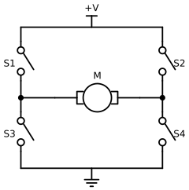

# Actuators and Sensors

## Summary

This chapter compares the actuators found in desktop arms, from hobby servos to serial bus servos and CAN-bus brushless actuators. It covers gear ratios, torque, encoders, feedback, and the torque and speed limits that keep an arm safe. After this chapter, you will be able to explain how a joint holds a position and choose limits for it.

## Concepts Covered

This chapter covers the following 35 concepts from the learning graph:

| Concept | Concept Impact Score |
|---------|-----------------------|
| Actuator | 688 |
| Encoder | 334 |
| Position Feedback | 185 |
| DC Motor | 148 |
| Servo Motor | 146 |
| Serial Bus Servo | 143 |
| STS3215 Servo | 117 |
| Brushless Motor | 106 |
| Damiao Actuator | 102 |
| Torque | 33 |
| Motor Speed | 25 |
| Speed Limit | 24 |
| Gear Ratio | 12 |
| Temperature Sensing | 10 |
| Torque Enable | 10 |
| Torque Limit | 9 |
| Torque Release | 9 |
| Gearbox | 7 |
| Backlash | 6 |
| PID Control | 6 |
| Current Sensing | 3 |
| PWM Signal | 2 |
| RobStride Actuator | 2 |
| Stall Torque | 2 |
| Load Feedback | 2 |
| Hobby Servo | 1 |
| Magnetic Encoder | 1 |
| Velocity Feedback | 1 |
| Overload Protection | 1 |
| Servo Compliance | 1 |
| Motor Controller | 1 |
| Inrush Current | 1 |
| Back-EMF | 1 |
| Force Limit | 1 |
| Runaway Motion | 1 |

## Prerequisites

This chapter builds on concepts from:

- [Chapter 2: Anatomy of a Robot Arm](../02-anatomy-of-a-robot-arm/index.md)
- [Chapter 3: Electricity, Power, and Safety Basics](../03-electricity-power-and-safety/index.md)
- [Chapter 4: Serial and CAN Communication](../04-serial-and-can-communication/index.md)

---

!!! mascot-welcome "Let's Look Inside a Joint!"
    { class="mascot-admonition-img" }
    Every joint of mine is a tiny machine with a motor, gears, a sensor, and a brain, and today we open one up. You will learn why a joint can hold still against gravity, how to read what it feels, and how to set limits so it never pushes too hard. Let's move it!

Chapters 3 and 4 showed how a joint gets its power and its commands. This chapter looks at what happens *inside* the joint when it gets them. A joint is more than a motor. It turns electricity into rotation, it gears that rotation down so that it is strong enough to lift the arm, it measures its own angle, and it keeps adjusting itself until the angle matches the goal. Each of those jobs has a part with a name, and each part has settings that you control from Python.

The chapter follows the signal through a joint. It starts with the **actuator**, the part that makes the motion, and the motors inside it. Then it covers the gears that make the motion strong enough, the sensors that report what the joint is doing, and the three families of complete actuators in this book. The last section explains the control loop that holds a joint at an angle and the limits that stop it from pushing too hard.

## Actuators

An **actuator** is a device that converts energy, here electrical energy, into motion. Every joint of a robot arm has one. The word is used for any part that makes something move, so a small motor is an actuator, and so is a complete package that includes the motor, gears, sensor and controller. This book meets three families of the second kind, and the table compares them. The costs for the motors in the two arms come from the bills of materials that each project publishes.

| | Hobby servo | Serial bus servo | Brushless CAN actuator |
|---|---|---|---|
| Example | MG995 | STS3215 (SO-ARM101) | Damiao DM4310 or RobStride RS00 (reBot-DevArm) |
| How you command it | A pulse width on one signal wire | Packets on a shared serial bus | Frames on a CAN bus |
| What it reports back | Nothing your program can read | Position, speed, load, current, voltage, temperature | Position, speed, torque, temperatures |
| Supply voltage | About 5 to 6 V | 5 to 12 V (Chapter 3) | 24 V or 48 V |
| Cost of one in the arm's bill of materials | Not used in either arm | $13.89 | $120 to $210 |
| Used in this book | Appendix A only | SO-ARM101 | reBot-DevArm B601 |

The cost row is worth a calculation. The SO-ARM100 repository prices the STS3215 servo at $13.89 each, so the six motors of one follower arm cost 6 × $13.89 = $83.34. The reBot-DevArm B601-DM's published bill of materials lists four DM4310 motors at $120 and three DM4340P motors at $175, a total of \( 4 \times 120 + 3 \times 175 = \$1005 \) for the motors alone, about 12 times as much. What the extra money buys is torque, accuracy, and a higher-grade bus, and Chapter 6 weighs whether you need them.

Every actuator in the table has the same four layers, and the rest of the chapter takes them one at a time: a **motor** makes the rotation, a **gearbox** trades speed for strength, a **sensor** measures the result, and a **controller** decides what the motor should do next.

## Motors

### DC Motor

A **DC motor** (brushed DC motor) is a coil of wire that turns between magnets when direct current flows through it. Two small contacts called brushes pass current to the spinning coil. It has two properties that explain almost everything about how a motor behaves in a robot arm. The **torque** a DC motor produces is proportional to the *current* that flows through it, and its *speed* is proportional to the *voltage* across it, less a loss that comes from the next paragraph.

The loss is **back-EMF**, the voltage that a spinning motor generates in its own coil, opposing the supply. A motor is also a generator, and the faster it spins, the larger the voltage it makes against you. The current in a spinning motor is therefore the *difference* between the supply voltage and the back-EMF, divided by the coil's resistance:

\[ I = \frac{V - V_{\text{back}}}{R} \]

where \( V \) is the supply voltage, \( V_{\text{back}} \) is the back-EMF, and \( R \) is the resistance of the winding. Here is a worked example using the STS3215. The seller's listing gives a stall current of 2.0 A at 6 V. With the motor blocked there is no back-EMF at all, so Ohm's law from Chapter 3 gives an effective resistance of \( 6 / 2.0 = 3 \) Ω. The numbers in the table are an illustration based on that estimate, not a measurement of the real motor.

| State of the motor (6 V supply) | Back-EMF | Current | Torque |
|---|---|---|---|
| **Stalled**: blocked, not turning | 0 V | \( 6 / 3 = 2.0 \) A | Maximum (the stall torque) |
| **Lifting a load**: turning slowly | 4.5 V | \( (6 - 4.5) / 3 = 0.5 \) A | Medium |
| **Spinning freely**: no load | 5.55 V | \( (6 - 5.55) / 3 = 0.15 \) A | Almost none |

The table shows why a stalled motor is dangerous. All of the supply voltage is across the coil's small resistance, so the current is at its highest and the heating is at its worst (recall from Chapter 3 that heat grows with the square of the current). It also shows **inrush current**: at the instant a motor starts, it is not turning yet, so it has no back-EMF and draws the stall current for a moment. Six motors starting together can briefly ask the supply for far more than they draw once moving, and a supply with little headroom will sag. The remedies are the ones from the power budget: a supply with margin, and starting motions gently (the servos have an acceleration setting).

!!! mascot-thinking "Torque Follows Current"
    { class="mascot-admonition-img" }
    The single most useful fact about a motor is that its torque is proportional to its current. That means current is a window onto force: a motor that is pushing hard draws a lot of amps, and a motor that is idle draws almost none. Later in this chapter you will use that to tell when a joint is pushing on something.

### Motor Controller

A motor needs a **motor controller**, the electronics that supply it with the right voltage and current and let it run in either direction. A DC motor's direction depends on which way the current flows through it, so the standard controller is an **H-bridge**: four switches arranged in the shape of the letter H, with the motor as the crossbar. In a real controller the switches are transistors. Closing the top-left and bottom-right switches sends current through the motor from left to right, and closing the other diagonal reverses it.

#### Diagram: H-Bridge Motor Driver

<figure markdown="span">
  
  <figcaption>An H-bridge. S1 and S4 closed push current through the motor from left to right, and S2 and S3 closed push it from right to left. Closing both switches of one leg, such as S1 and S3, connects the supply directly to ground. Source: diagrams/h-bridge.py.</figcaption>
</figure>

The last sentence of the caption is the one rule of the H-bridge: the two switches in the same leg must never be closed together. They would connect the supply straight to ground through two switches that have almost no resistance, and the current would be enormous. Controllers are built so that this cannot happen, and the next MicroSim lets you see it.

A controller also sets how *fast* the motor spins. It does this by switching its transistors on and off thousands of times a second, a technique called **PWM** (pulse-width modulation). The fraction of each cycle that the switch is on is the *duty cycle*, and the motor sees the average. A 50 percent duty cycle on a 6 V supply gives an average of 3 V. The same words have a second, separate use, which is worth keeping apart. A hobby servo's **PWM signal** is not power at all: it is a *command*, a pulse once every 20 ms, whose width (1 ms to 2 ms) tells the servo what angle to go to. The hobby servo section below returns to it.

In the next MicroSim you set the four switches of an H-bridge and predict what the motor will do. Orange dots show the current: they follow the closed switches from the supply, through the motor in one direction or the other, and to ground. Pick a combination that the diagram forbids and the sim shows the short circuit.

#### Diagram: H-Bridge Current Paths

<iframe src="../../sims/h-bridge-current-paths/main.html" height="562px" width="100%" scrolling="no"></iframe>

[Run the H-Bridge Current Paths MicroSim fullscreen](../../sims/h-bridge-current-paths/main.html){ .md-button .md-button--primary }

<details markdown="1">
<summary>H-Bridge Current Paths</summary>
Type: microsim
**sim-id:** h-bridge-current-paths<br/>
**Library:** p5.js<br/>
**Status:** Specified<br/>
**Bloom Level:** Understand<br/>
**Bloom Verb:** infer<br/>
**Learning Objective:** The learner will infer what a DC motor does for six combinations of H-bridge switch settings, choosing among forward, reverse, coasts, brakes and short circuit, with at least 5 of 6 correct on the first attempt.

**Prerequisites:** DC motor, torque, current, circuit, motor controller, H-bridge, short circuit, fuse (all defined in the sections above this block and in Chapter 3).

**Evidence of Mastery:** For each of six switch combinations the learner chooses one of five outcomes before the circuit runs, and commits. A choice is correct when it matches the Correct column in Content. Mastery is 5 of 6 correct on the first attempt. Setting the switches freely in Explore mode is exploration, not evidence.

**Misconceptions:** (1) Any two closed switches drive the motor. (Two switches in one leg make a short circuit.) (2) With all switches open the motor stops instantly. (It coasts to a stop.) (3) A motor can only run in one direction. (Reversing the diagonal reverses it.)

**Instructional Rationale:** An Understand-level infer objective asks the learner to apply a rule to a new case and commit to a result. Predicting before the current dots appear forces the learner to trace the path from the supply to ground through the closed switches.

**Content:**

The circuit is the schematic in the chapter figure: a supply rail, four switches S1 (top left), S2 (top right), S3 (bottom left) and S4 (bottom right), a motor between the two leg midpoints, and a ground rail. "Forward" means current flows through the motor from left to right. When a closed path from the supply to ground exists, orange conventional-current dots flow along it with a speed proportional to the current. The five outcomes are: (a) Forward, (b) Reverse, (c) Coasts to a stop, (d) Brakes, (e) Short circuit.

Six combinations in this fixed order (C means closed, O means open):

| # | S1 | S2 | S3 | S4 | Correct | Why (shown as feedback) |
|---|---|---|---|---|---|---|
| 1 | C | O | O | C | (a) Forward | The path is supply, S1, motor from left to right, S4, ground. |
| 2 | O | C | C | O | (b) Reverse | The path is supply, S2, motor from right to left, S3, ground. |
| 3 | O | O | O | O | (c) Coasts to a stop | No path to the supply or ground, so no current is driven, and the motor spins down on its own. |
| 4 | C | O | C | O | (e) Short circuit | S1 and S3 are in the same leg and connect the supply straight to ground, bypassing the motor. |
| 5 | O | O | C | C | (d) Brakes | Both motor terminals connect to ground, so the motor's own back-EMF drives current through the closed loop and slows it quickly. No current comes from the supply. |
| 6 | O | C | O | C | (e) Short circuit | S2 and S4 are in the same leg and connect the supply straight to ground. |

**Provenance:** The switch combinations are written for this sim from the chapter section "Motor Controller". The schematic is drawn from the same design as `diagrams/h-bridge.svg`. The short-circuit warning follows the H-bridge rule stated in the chapter.

**Rules:** A short circuit exists when S1 and S3 are both closed, or S2 and S4 are both closed. Otherwise, forward is S1 and S4 closed with S2 and S3 open, reverse is S2 and S3 closed with S1 and S4 open, brake is S3 and S4 both closed (or S1 and S2 both closed) with the other two open, and every other combination with no closed path leaves the motor coasting. The sim does not model speed. In Explore mode the learner toggles each of the four switches, and a short circuit shows the fastest dots and the message "short circuit: the fuse would blow".

**Learner Activity:**

1. In Explore mode the learner toggles the four switches and watches the current dots, the motor's direction mark and the message. The learner should notice that only one diagonal at a time gives a clean path through the motor.
2. The learner switches to the six combinations. Combination 1 is shown with the switches set and the circuit idle.
3. The learner chooses one of the five outcomes and commits.
4. The circuit runs: the dots flow along the path (or not), and the sim shows whether the answer was correct and the Why text. After combination 6 it shows the score.

**Feedback:** Six combinations, fixed order, one attempt each. Correct: "Correct: <outcome>. <Why>". Incorrect: "Not quite. The result is: <outcome>. <Why>". The correct outcome is revealed after each commit. A running count "Correct: n of 6" is shown and the final screen says whether mastery (5 of 6) was reached.

**Starting State:** Predict mode, combination 1 of 6, with S1 and S4 closed, the circuit idle, and the question "What does the motor do?"

**Chapter Anchors:** The chapter says that S1 and S4 closed drive the motor from left to right, that S2 and S3 closed reverse it, and that two switches in one leg make a short circuit. The sim has six combinations and mastery is 5 of 6.
</details>

### Brushless Motor

A **brushless motor** removes the brushes. The coils stay still, and the magnets are on the part that spins. Because the coils no longer move, the controller must switch the current from coil to coil in the right order to keep the magnets turning, and it must know where the magnets are, which takes a sensor in the motor. The result costs more to drive but has real advantages. There are no brushes to wear out, less friction, less electrical noise, and more torque for the weight. These are the reasons that the reBot-DevArm's actuators are brushless.

The controller of a brushless motor is more complex than an H-bridge, and in the Damiao and RobStride actuators it is *inside the actuator*, along with the sensors and the CAN interface, so you see only a box with power wires and two CAN wires. Their documentation describes them as integrated actuators with a field-oriented-control (FOC) drive, which is the standard method of driving this kind of motor smoothly.

| | Brushed DC motor | Brushless motor |
|---|---|---|
| Moving parts that wear | Brushes and commutator | Bearings only |
| Needs | Two wires and an H-bridge | A three-phase driver and a position sensor |
| Efficiency and life | Lower | Higher |
| Cost to drive | Low | Higher |
| Found in | STS3215 servos, hobby servos | Damiao and RobStride actuators |

## Gears and Torque

A small motor spins fast but is weak. A robot joint needs the opposite: slow and strong. A **gearbox** is a set of gears that makes that trade. The **gear ratio** says how many times the motor turns for each turn of the output, and the STS3215 servos are sold in 1/345, 1/191 and 1/147 versions (Chapter 2). A ratio of 1/345 means that the motor shaft turns 345 times while the output turns once. The output turns 345 times slower and, losing a little to friction, about 345 times stronger.

The **motor speed** is how fast something turns, and the usual units are revolutions per minute (rpm) or degrees per second. The **torque** at a joint is the twisting force, measured in newton-metres (N·m), as in Chapter 2's payload formula \( \tau = m g d \). Spec sheets for small servos often give torque in kilogram-centimetres, the pull of that many kilograms at a distance of 1 cm, and the conversion is \( 1 \text{ kg·cm} = 0.0981 \text{ N·m} \). With a gear ratio \( N \) (such as 345) and an efficiency \( \eta \) (the fraction left after friction), the output follows from the motor:

\[ \omega_{\text{out}} = \frac{\omega_{\text{motor}}}{N}, \qquad \tau_{\text{out}} = \tau_{\text{motor}} \times N \times \eta \]

Here is a worked example with the STS3215. Its listing gives a stall torque of 16.5 kg·cm at 6 V, which is \( 16.5 \times 0.0981 \approx 1.62 \) N·m, and a no-load speed of 0.238 seconds for 60 degrees, which is \( 60 / 0.238 \approx 252 \) degrees per second, or about 42 rpm. Suppose the servo has the 1/345 gearbox (the listing figure applies to one version). Then the motor shaft spins at \( 42 \times 345 \approx 14500 \) rpm, and for an efficiency of 50 percent (an illustrative value), the motor itself produces only \( 1.62 / (345 \times 0.5) \approx 0.0094 \) N·m, or 9.4 millinewton-metres. The gearbox is doing almost all the work of making the joint strong.

**Stall torque** is the largest torque the actuator can produce while blocked, which is also when it draws its stall current. A joint must be chosen with a stall torque comfortably above what it holds, and a joint that holds a load near its stall torque draws its stall current *all the time* and overheats. The gearbox has a cost too. Gears do not mesh perfectly, and the small gap that lets them turn is called **backlash**: when the direction reverses, the motor turns a little before the output moves. A 1/345 gearbox is strong but has noticeable backlash and resists being turned by hand, while the 1/147 gearing in the leader arm is easier to move and makes the leader's job possible. Where the encoder sits matters, as the next section explains.

| Choice | Higher gear ratio number (such as 1/345) | Lower ratio number (such as 1/147) |
|---|---|---|
| Output speed for the same motor | Slower | About 2.35 times faster (345 / 147) |
| Output torque | Higher | Lower |
| Easy to turn by hand | No | Yes |
| Used in the SO-ARM101 for | The follower's joints | The leader's wrist and gripper |

!!! mascot-tip "Convert Units Before You Compare"
    { class="mascot-admonition-img" }
    Servo datasheets mix kg·cm, N·m, and oz·in, and a "19 kg" servo is not 19 kilograms of anything. Convert every torque to N·m (multiply kg·cm by 0.0981) before you compare two actuators, and then compare it with \( m g d \) for your own load.

In the next MicroSim you use the gear equations on five problems: speeds, torques, and a comparison of two ratios.

#### Diagram: Gear Ratio Explorer

<details markdown="1">
<summary>Gear Ratio Explorer</summary>
Type: microsim
**sim-id:** gear-ratio-explorer<br/>
**Library:** p5.js<br/>
**Status:** Specified<br/>
**Bloom Level:** Apply<br/>
**Bloom Verb:** calculate<br/>
**Learning Objective:** The learner will calculate the output speed or torque of a geared actuator, or the motor speed or torque behind it, from the gear ratio and efficiency, to within 2 percent, in five problems, with at least 4 of 5 correct on the first attempt.

**Prerequisites:** torque, motor speed, gearbox, gear ratio, stall torque, efficiency, newton-metre (all defined in the section above this block).

**Evidence of Mastery:** For each of five problems the learner types a number in the unit shown and commits. An answer is correct when it is within 2 percent of the Correct column in Content. Mastery is 4 of 5 correct on the first attempt. Changing the ratio and the motor in Explore mode is exploration, not evidence.

**Misconceptions:** (1) A higher gear ratio makes the output faster. (It makes it slower and stronger.) (2) Gears create torque from nothing. (Power is conserved apart from friction, so the speed falls as the torque rises.) (3) Efficiency does not matter. (It reduces the output torque.)

**Instructional Rationale:** An Apply-level calculate objective needs practice with a formula on new numbers. The sim shows the motor turning many times for each output turn, so the sign of the speed-for-torque trade is seen before it is calculated.

**Content:**

Explore mode shows a motor gear turning \( N \) times for each turn of the output gear. The learner can set the motor speed, the motor torque, the ratio N and the efficiency. Formulas: output speed = motor speed / N; output torque = motor torque × N × efficiency.

| Quantity | Min | Max | Step | Default | Unit |
|---|---|---|---|---|---|
| Gear ratio N | 1 | 400 | 1 | 100 | : 1 |
| Motor speed | 0 | 20000 | 100 | 12000 | rpm |
| Motor torque | 0 | 50 | 1 | 10 | mN·m |
| Efficiency | 20 | 100 | 5 | 60 | percent |

Five problems in this fixed order:

| # | Problem | Unit asked | Correct | Why (shown as feedback) |
|---|---|---|---|---|
| 1 | A motor turns at 12000 rpm through a 100 : 1 gearbox. What is the output speed? | rpm | 120 | 12000 / 100 = 120 rpm. |
| 2 | The STS3215's output turns at 42 rpm through a 345 : 1 gearbox. How fast is the motor shaft? | rpm | 14490 | 42 × 345 = 14490 rpm. |
| 3 | A motor makes 10 mN·m through a 100 : 1 gearbox at 60 percent efficiency. What is the output torque? | N·m | 0.6 | 0.010 × 100 × 0.6 = 0.6 N·m. |
| 4 | An output needs 1.62 N·m through a 345 : 1 gearbox at 50 percent efficiency. What motor torque is needed? | mN·m | 9.39 | 1.62 / (345 × 0.5) = 0.00939 N·m = 9.39 mN·m. |
| 5 | The same motor drives a 147 : 1 joint and a 345 : 1 joint. How many times faster is the 147 : 1 joint? | times | 2.35 | 345 / 147 = 2.347 times faster, and it is that much weaker. |

**Provenance:** The 42 rpm and 1.62 N·m figures follow the STS3215 listing values in the chapter's worked example (0.238 s per 60 degrees and 16.5 kg·cm at 6 V). The other numbers are illustrative, and the sim labels them "illustrative".

**Rules:** Output speed = motor speed / N, output torque = motor torque × N × (efficiency / 100). A typed answer is correct when |typed − correct| / correct <= 0.02 in the unit shown. The typed value has minimum 0, maximum 100000, step 0.01, and no default.

**Learner Activity:**

1. In Explore mode the learner changes the ratio, speed, torque and efficiency and watches the output speed and torque update. The learner should notice that raising N lowers the speed and raises the torque by the same factor, apart from efficiency.
2. The learner switches to the five problems. Problem 1 is shown with the quantities it uses.
3. The learner types an answer and presses Check to commit.
4. The sim shows whether the answer was correct, the working and the Why text, then moves on. After problem 5 it shows the score.

**Feedback:** Five problems, fixed order, one attempt each. Correct: "Correct: <value> <unit>. <Why>". Incorrect: "Not quite. Speed goes down by N and torque goes up by N times the efficiency: <value> <unit>. <Why>". The correct value is revealed after each commit. A running count "Correct: n of 5" is shown and the final screen says whether mastery (4 of 5) was reached.

**Starting State:** Explore mode with the default values, showing an output speed of 120 rpm and an output torque of 0.6 N·m.

**Chapter Anchors:** The chapter's worked example is 16.5 kg·cm = 1.62 N·m, 252 degrees per second = 42 rpm, about 14500 rpm at the motor (14490 exactly), and 9.4 mN·m at the motor for 50 percent efficiency. The ratio comparison is 345 / 147 = 2.35. The sim has five problems and mastery is 4 of 5.
</details>

## Feedback: How a Joint Knows What It Is Doing

A motor that cannot sense its own motion is working blind. Think of walking to a door with your eyes closed: you might get there, but only if nothing is in the way. A joint opens its eyes with **feedback**, sensors that report what the joint is really doing so the controller can correct it. This section covers the sensors in the actuators of this book.

### Encoder

An **encoder** is a sensor that turns the angle of a shaft into a number. Three kinds are common, and the table compares them.

| Kind | How it works | Strengths | Weakness |
|---|---|---|---|
| Potentiometer | A wiper slides on a resistive track, so the voltage depends on the angle | Cheap and simple | Wears out, noisy |
| Optical | A slotted disk interrupts a light beam | Precise | Needs clean, aligned parts |
| Magnetic | A magnet on the shaft, with a sensor chip that reads the direction of its field | No contact, no wear, absolute | Needs the magnet to be well placed |

A **magnetic encoder** is the one used by the actuators in this book: the STS3215 has a 12-bit magnetic encoder, and the Damiao motors have two magnetic encoders each. It is *absolute*, which means it reports the true angle at power-up, with no need to move to a home switch first. (An *incremental* encoder only reports changes, and must be told where it started.) It is also *single-turn* here: it gives the angle within one turn, from 0 to just under 360 degrees, and the number wraps from the highest value back to 0.

The *resolution* of an encoder is the smallest angle it can tell apart, and it is set by the number of bits. A 12-bit encoder has \( 2^{12} = 4096 \) steps per turn, so one step is \( 360 / 4096 \approx 0.088 \) degrees (the figure you used in Chapter 1). A 16-bit encoder, which the Damiao listing gives for its motors, has \( 2^{16} = 65536 \) steps and \( 360 / 65536 \approx 0.0055 \) degrees per step, 16 times finer. Resolution is not the same as accuracy: a fine encoder can still be placed badly, as Chapter 2's accuracy and repeatability section showed.

In the next MicroSim you work with encoder numbers: the size of one step, the conversion between steps and degrees, and a speed calculated from two position readings.

#### Diagram: Encoder Resolution Reader

<details markdown="1">
<summary>Encoder Resolution Reader</summary>
Type: microsim
**sim-id:** encoder-resolution-reader<br/>
**Library:** p5.js<br/>
**Status:** Specified<br/>
**Bloom Level:** Apply<br/>
**Bloom Verb:** calculate<br/>
**Learning Objective:** The learner will calculate the step size of an encoder, convert between encoder steps and degrees, and find a speed from two position readings, to within 1 percent, in five problems, with at least 4 of 5 correct on the first attempt.

**Prerequisites:** encoder, magnetic encoder, absolute and incremental, resolution, bits, position feedback, velocity feedback (all defined in the sections above this block).

**Evidence of Mastery:** For each of five problems the learner types a number in the unit shown and commits. An answer is correct when it is within 1 percent of the Correct column in Content. Mastery is 4 of 5 correct on the first attempt. Turning the dial and changing the bit count in Explore mode is exploration, not evidence.

**Misconceptions:** (1) More bits means a larger step. (It means a smaller step.) (2) The encoder reports total turns. (This one reports the angle within one turn.) (3) A fine encoder is an accurate joint. (Resolution and accuracy are different.)

**Instructional Rationale:** An Apply-level calculate objective needs repeated use of a conversion on new numbers. A dial that shows the steps appear as the shaft turns, with the step size shrinking as the bit count rises, makes the relation visible before it is calculated.

**Content:**

Explore mode shows a shaft angle dial with an encoder of 8 to 16 bits, and the step number, step size and angle update as the learner turns the shaft. The formulas: step size = 360 / 2^bits; angle = steps / 2^bits × 360; steps = angle / 360 × 2^bits; speed = change in angle / time.

| Quantity | Min | Max | Step | Default | Unit |
|---|---|---|---|---|---|
| Encoder bits | 8 | 16 | 1 | 12 | bits |
| Shaft angle | 0 | 359.9 | 0.1 | 90 | degrees |

Five problems in this fixed order:

| # | Problem | Unit asked | Correct | Why (shown as feedback) |
|---|---|---|---|---|
| 1 | How large is one step of a 12-bit encoder? | degrees | 0.0879 | 360 / 4096 = 0.08789 degrees. |
| 2 | How large is one step of a 16-bit encoder? | degrees | 0.00549 | 360 / 65536 = 0.005493 degrees. |
| 3 | A 12-bit encoder reads 3072. What is the angle? | degrees | 270 | 3072 / 4096 × 360 = 270 degrees. |
| 4 | What step number is 45 degrees on a 12-bit encoder? | steps | 512 | 45 / 360 × 4096 = 512. |
| 5 | A 12-bit encoder reads 1000 and then 1100, 0.05 s later. How fast is the joint turning? | degrees per second | 175.8 | 100 steps is 100 / 4096 × 360 = 8.789 degrees, and 8.789 / 0.05 = 175.8 degrees per second. |

**Provenance:** The 12-bit resolution is the STS3215's 4096 steps per turn (LeRobot motor tables). The 16-bit value is the Damiao DM-J4310 listing. The readings in problems 3 to 5 are illustrative.

**Rules:** Step size = 360 / 2^bits. A typed answer is correct when |typed − correct| / correct <= 0.01 in the unit shown. The typed value has minimum 0, maximum 10000, step 0.00001, and no default. Angles wrap: 360 degrees reads as step 0.

**Learner Activity:**

1. In Explore mode the learner turns the shaft and changes the bit count, and watches the step number and the step size. The learner should notice that adding one bit halves the step.
2. The learner switches to the five problems. Problem 1 is shown.
3. The learner types an answer and presses Check to commit.
4. The sim shows whether the answer was correct, the working and the Why text, then moves on. After problem 5 it shows the score.

**Feedback:** Five problems, fixed order, one attempt each. Correct: "Correct: <value> <unit>. <Why>". Incorrect: "Not quite. One turn is 2^bits steps, so <value> <unit>. <Why>". The correct value is revealed after each commit. A running count "Correct: n of 5" is shown and the final screen says whether mastery (4 of 5) was reached.

**Starting State:** Explore mode with a 12-bit encoder at 90 degrees, showing step 1024 and a step size of 0.0879 degrees.

**Chapter Anchors:** The chapter states 4096 steps and about 0.088 degrees for a 12-bit encoder, and 65536 steps and about 0.0055 degrees for 16 bits. The sim has five problems and mastery is 4 of 5.
</details>

### Position Feedback

**Position feedback** is the encoder's reading, returned to the controller so that it can compare where the joint *is* with where it should be. A controller that uses feedback is a **closed-loop** controller: the output (the joint's angle) is measured and fed back to the input. An **open-loop** controller sends a command and hopes. A stepper motor driven without a sensor is open-loop, and so is a hobby servo from the viewpoint of your program, because the servo knows its angle but never tells you.

The difference between the goal and the feedback is the *error*, and it is the signal that every controller in this chapter works on. In Chapter 2's leader and follower table, the leader's elbow read 40.0 degrees while the follower read 38.5, so the follower was behind by an error of 1.5 degrees. With a servo bus, your program can read that feedback as the `Present_Position` register at about the rate the bus allows, and compute the error itself.

!!! mascot-thinking "Feedback Closes the Loop"
    { class="mascot-admonition-img" }
    Without feedback a joint obeys; with feedback a joint *corrects*. That one wire from the sensor back to the controller is what lets an arm hold a position while its load changes, and it is why everything from here on is about the error.

### Velocity, Load, and Current Feedback

Position is not the only thing worth knowing. **Velocity feedback** reports how fast the joint is turning. You can calculate it yourself from two position readings, speed = change in position / change in time (the last problem in the encoder MicroSim), and the STS3215 also reports it in a register. **Load feedback** reports how hard the joint is working, as a number related to the torque it is producing. **Current sensing** reports the motor's current directly. Because torque is proportional to current, the current is the best view into the force at a joint. The STS3215's `Present_Current` register counts in units of about 6.5 milliamps, so a raw reading of 200 means \( 200 \times 6.5 = 1300 \) mA, or 1.3 A.

### Temperature Sensing

**Temperature sensing** reports how hot the motor is. A motor heats up from the current through its coil (the \( I^2 R \) heat of Chapter 3), and a joint that holds a heavy load or pushes on an obstacle can heat up in minutes. The STS3215 reports its temperature in degrees Celsius in the `Present_Temperature` register. Choose a warning threshold below the limit in your servo's manual, and stop the arm when the reading passes it. For example, if the manual lists a limit of 70 degrees, a warning at 55 degrees leaves time to react. Those two numbers are only an illustration: read your own motor's manual.

The table collects the feedback registers of the STS3215 that you can read with the Chapter 4 toolkit. The addresses come from the LeRobot motor tables and the Feetech memory table, and the units from the Feetech memory table.

| Feedback | Register | Address | Size (bytes) | Unit |
|---|---|---|---|---|
| Position | `Present_Position` | 56 | 2 | Steps (4096 per turn) |
| Velocity | `Present_Velocity` | 58 | 2 | Steps per second, with a sign bit (bit 15) |
| Load | `Present_Load` | 60 | 2 | A load value with a sign bit (10 magnitude bits) |
| Voltage | `Present_Voltage` | 62 | 1 | 0.1 V |
| Temperature | `Present_Temperature` | 63 | 1 | Degrees Celsius |
| Current | `Present_Current` | 69 | 2 | About 6.5 mA |

!!! mascot-tip "Log Current and Temperature Every Cycle"
    { class="mascot-admonition-img" }
    Reading position alone shows you what the joint did, but reading current and temperature shows you what it *cost*. Add both to your logs from the start (Chapter 13 builds the logger), and you will spot a joint that is working too hard long before it burns out.

## Servo Motors

A **servo motor** (or servo) is a complete actuator that includes a motor, a gearbox, an encoder and a controller in one case, and that is built to go to the *angle you ask for* and hold it. You give it a goal; it closes the position loop itself. This is the whole point: your program is relieved of running the loop, so one program can command many servos at once. The three families of actuators in this book are all servos in this sense, and they differ in how you give the goal and how much they tell you back.

!!! mascot-thinking "A Servo Is a Loop in a Box"
    { class="mascot-admonition-img" }
    Every servo is the same loop wrapped in a case: read the angle, compare it with the goal, push the motor, repeat. The three families differ in how you set the goal and how much of the loop's inner state they let you see.

### Hobby Servo

A **hobby servo** is the cheap servo of radio-controlled models. It listens for a PWM signal: a pulse every 20 ms (50 times a second), whose width is the command. A pulse of 1.0 ms drives the output to one end of its travel, 1.5 ms to the centre, and 2.0 ms to the other end. The servo measures each pulse and moves to match it, using a potentiometer inside as its feedback. That feedback never leaves the case, so your program cannot read the angle, and there is no way to ask for temperature or load. The servo also has no address, so each one needs its own signal wire. These properties are why a hobby servo cannot serve as the joint of a leader and follower pair, and the appendix on hobby servos tells the story at length. The MicroSim below puts a hobby servo and a bus servo side by side.

#### Diagram: Hobby PWM Servo vs. Serial Bus Servo

<iframe src="../../sims/pwm-vs-bus-servos/main.html" height="592px" width="100%" scrolling="no"></iframe>

[Run the Hobby PWM Servo vs. Serial Bus Servo MicroSim fullscreen](../../sims/pwm-vs-bus-servos/main.html){ .md-button .md-button--primary }

See [Appendix A: Why Hobby PWM Servos Won't Work with the SO-ARM](../../appendices/pwm-servos/index.md) for the full argument.

### Serial Bus Servo

A **serial bus servo** keeps everything good about the hobby servo and fixes what limits it. It has the same four layers inside, but its command is a *packet* on a shared digital bus (Chapter 4) instead of a pulse width. Each servo has an ID, so one pair of wires serves the whole arm. Each can report position, speed, load, voltage, temperature and current, and each exposes its settings, such as its torque limit and PID gains, as registers that you can read and write. For a robot arm that you want to program, read, and record, those properties are what make it the right choice.

### STS3215 Servo

The **STS3215** from Feetech is the serial bus servo inside the SO-ARM101. The table collects its main numbers from the seller's data sheet, the LeRobot tables and the SO-ARM100 repository. Where a figure applies only to one voltage or gear ratio, the table says so.

| Property | Value | Source |
|---|---|---|
| Control | Serial bus, protocol 0, model number 777 | LeRobot motor tables |
| Position sensing | 12-bit magnetic encoder, 4096 steps per turn | LeRobot motor tables |
| Gear ratios in the SO-ARM101 | 1/345, 1/191, 1/147 | LeRobot SO-101 documentation |
| Stall torque, 7.4 V version | 16.5 kg·cm at 6 V, 19.5 kg·cm at 7.4 V | Seller data sheet |
| Stall torque, 12 V version | 30 kg·cm | SO-ARM100 repository |
| No-load speed | 0.238 s per 60 degrees at 6 V | Seller data sheet |
| Stall current | 2.0 A at 6 V | Seller data sheet |
| No-load current | 0.15 A at 6 V | Seller data sheet |
| Registers used in Chapter 4 | `Present_Position`, `Goal_Position` and others | LeRobot motor tables |
| Cost in the SO-ARM100 bill of materials | $13.89 each | SO-ARM100 repository |

### Servo Compliance

**Servo compliance** is how much a joint gives way when something pushes on it. A stiff joint fights every disturbance with a big torque and barely moves. A compliant joint gives way and then pushes back gently. Compliance comes from the controller's settings, mostly the proportional gain and the torque limit that the next section explains: lower them and the joint becomes softer. A compliant joint is kinder to a hand or an object in the gripper, and a stiff one is more accurate.

### Damiao Actuator

The **Damiao actuators** in the reBot-DevArm B601-DM are brushless, integrated joint modules on a CAN bus. Seeed's documentation covers two models, which the project uses in different joints: the DM4310 and the larger DM4340P. Both run from a 24 V supply (15 to 32 V) or a 48 V supply (15 to 52 V), carry two magnetic encoders, and take commands over CAN at 1 Mbps, with a CAN ID for commands and a Master ID for feedback (Chapter 4).

| | DM4310 | DM4340P |
|---|---|---|
| Rated torque | 3 N·m | 9 N·m |
| Peak torque | 7 N·m | 27 N·m |
| Supply voltage | 24 V (15-32 V) or 48 V (15-52 V) | Same |
| Count in the B601-DM | 4 | 3 |
| Price in the B601-DM bill of materials | $120 | $175 |

The rated torque is what the motor can supply continuously, and the peak torque is what it can supply for a short time before it overheats. The distinction is the same as the one between a runner's pace and a sprint. A joint that holds a load all day should be sized against the *rated* torque.

The Damiao motors offer a control mode called **MIT mode**, which gives you the control loop of the next section in the motor itself. A single CAN frame carries a desired position \( q_{des} \), a desired speed \( \dot q_{des} \), two gains \( K_p \) and \( K_d \), and a feed-forward torque \( \tau_{ff} \), and the motor's drive computes the torque 

\[ \tau = K_p (q_{des} - q) + K_d (\dot q_{des} - \dot q) + \tau_{ff} \]

many times a second. The Seeed guide's Python call has the matching form `controlMIT(motor, kp, kd, q, dq, tau)`. A stiff or a compliant joint is therefore simply a choice of \( K_p \) and \( K_d \).

### RobStride Actuator

The **RobStride actuators** in the reBot-DevArm B601-RS are the same idea at a higher voltage: 48 V brushless modules with two magnetic encoders and CAN control. The B601-RS uses four RS00 modules (rated torque 5 N·m, peak 14 N·m) and three RS06 modules (rated 11 N·m, peak 36 N·m). Their bill of materials lists them at $125 and $210 each, and the arm needs a 48 V supply, which Chapter 3 covered.

The next MicroSim practises telling the three families apart. You read eight short descriptions and decide which family each one fits.

#### Diagram: Actuator Type Matcher

<details markdown="1">
<summary>Actuator Type Matcher</summary>
Type: microsim
**sim-id:** actuator-type-matcher<br/>
**Library:** p5.js<br/>
**Status:** Specified<br/>
**Bloom Level:** Understand<br/>
**Bloom Verb:** classify<br/>
**Learning Objective:** The learner will classify eight descriptions of an actuator as a hobby servo, a serial bus servo or a brushless CAN actuator, with at least 7 of 8 correct on the first attempt.

**Prerequisites:** actuator, hobby servo, PWM signal, serial bus servo, STS3215 servo, brushless motor, Damiao actuator, RobStride actuator, position feedback (all defined in the sections above this block).

**Evidence of Mastery:** For each of eight descriptions the learner chooses one of three families and commits. A choice is correct when it matches the Family column in Content. Mastery is 7 of 8 correct on the first attempt. Reading the comparison table in Explore mode is exploration, not evidence.

**Misconceptions:** (1) All servos are controlled by a pulse width. (Only hobby servos are.) (2) A bus servo and a CAN actuator are the same thing. (They use different buses and voltages.) (3) A hobby servo reports its position. (It does not.)

**Instructional Rationale:** An Understand-level classify objective asks the learner to place an example into a category on its features. Using one distinguishing feature per description makes the learner attend to the command method, the feedback, the voltage and the price, which are the properties that separate the three families.

**Content:**

The three families: "Hobby servo", "Serial bus servo", "Brushless CAN actuator". Eight descriptions in this fixed order:

| # | Description | Family | Why (shown as feedback) |
|---|---|---|---|
| 1 | Its command is a pulse of 1.5 ms sent every 20 ms. | Hobby servo | The command is a pulse width, which is the PWM signal of a hobby servo. |
| 2 | Each motor on the three-wire daisy chain has an ID, and the program can read its position, load and temperature. | Serial bus servo | A shared digital bus with IDs and readable registers is a serial bus servo. |
| 3 | It accepts MIT-mode frames with a position, a speed, Kp, Kd and a feed-forward torque. | Brushless CAN actuator | MIT mode is the Damiao actuators' control mode over CAN. |
| 4 | Your program has no way to read how far it has turned. | Hobby servo | The potentiometer feedback stays inside the case. |
| 5 | It is listed at $13.89 each in the SO-ARM100 bill of materials. | Serial bus servo | That is the STS3215 price. |
| 6 | It runs from a 24 V or 48 V supply. | Brushless CAN actuator | The reBot-DevArm's actuators run at 24 V (B601-DM) or 48 V (B601-RS). |
| 7 | It has a 12-bit magnetic encoder and a 1/345 gearbox. | Serial bus servo | Those are the STS3215's encoder and the follower's gear ratio. |
| 8 | It is a low-cost servo with one signal wire and no ID, and the MG995 is an example. | Hobby servo | One signal wire per servo and no address are properties of a hobby servo. |

**Provenance:** The descriptions are written for this sim from the chapter's comparison table and the sections on each family. The $13.89 price is from the SO-ARM100 bill of materials, and the voltages are from the reBot-DevArm repository.

**Rules:** Each description has exactly one correct family. A choice is scored once and cannot be changed after it is committed.

**Learner Activity:**

1. In Explore mode the learner reads the three-column comparison of command, feedback, voltage and cost.
2. The learner switches to the eight descriptions. Description 1 is shown.
3. The learner chooses a family and commits.
4. The sim shows whether the choice was correct, the Why text, and the matching row of the comparison. After description 8 it shows the score.

**Feedback:** Eight descriptions, fixed order, one attempt each. Correct: "Correct: <family>. <Why>". Incorrect: "Not quite. This is a <family>. <Why>". The correct family is revealed after each commit. A running count "Correct: n of 8" is shown and the final screen says whether mastery (7 of 8) was reached.

**Starting State:** Explore mode with the comparison table of the three families and the prompt "Read the table, then try the descriptions."

**Chapter Anchors:** The chapter's comparison table gives the three families' command, feedback, voltage and cost, and the sim has eight descriptions with mastery at 7 of 8.
</details>

## Holding a Position

A servo holds an angle by running a loop thousands of times a second: read the angle, compare it with the goal, push the motor a little harder or softer, and repeat. The rule that turns the error into a push is the heart of the servo.

### PID Control

**PID control** is the most common such rule. It computes the motor's torque as the sum of three terms, each answering a different question about the error \( e \), which is the goal minus the measured position:

\[ u = K_p \, e \; + \; K_i \int e \, dt \; - \; K_d \, \dot{q} \]

where \( u \) is the command (a torque), \( K_p \), \( K_i \) and \( K_d \) are three gains that you choose, and \( \dot q \) is the joint's speed. Each term has a plain meaning:

| Term | Name | Question it answers | Effect when raised | Danger when too high |
|---|---|---|---|---|
| \( K_p e \) | Proportional | How far off am I now? | Faster, stiffer response | Overshoot and oscillation |
| \( K_i \int e \, dt \) | Integral | How long have I been off? | Removes a steady error, such as the pull of gravity | Overshoot (the sum keeps growing while it waits) |
| \( K_d \dot q \) | Derivative (damping) | How fast am I moving? | Calms oscillation | Slow, sluggish, and noisy response |

Put in a sentence: P pushes toward the goal, D brakes the push as the joint speeds up, and I keeps pushing until the last bit of error is gone. The STS3215 has three registers for the position loop (at addresses 21 to 23 in the Feetech memory table), and LeRobot sets them as the `P_Coefficient`, `I_Coefficient` and `D_Coefficient` of each motor. A Damiao motor's \( K_p \) and \( K_d \) come with every MIT-mode frame.

Here are the results of the toy joint of the lab, a joint model with made-up units that is tuned to show each effect. The goal is 90 degrees, and the table shows the final angle, the overshoot, and the time to settle within 2 percent. The *gravity* row adds a constant downward pull, as the weight of an arm does.

| Case | Gains | Final angle | Overshoot | Settles in |
|---|---|---|---|---|
| A: gentle | \( K_p = 5 \) | 90.0 | 0.1% | 2.09 s |
| B: stiff but unbraked | \( K_p = 40 \) | 90.0 | 34.7% | 1.74 s |
| C: stiff and braked | \( K_p = 40, K_d = 10 \) | 90.0 | 0.0% | 1.12 s |
| D: C with gravity | same as C | 85.0 | 0.0% | never |
| E: D plus integral | \( K_i = 100 \) added | 90.0 | 35.5% | 2.60 s |

Case B overshoots because the joint arrives at the goal with speed and cannot stop in time. Case C brakes it with \( K_d \). Case D shows the problem that the integral fixes. With gravity pulling, the proportional push needs an error to exist, \( 200 / 40 = 5 \) degrees in this model, so the joint settles short of its goal. Case E adds \( K_i \), which keeps growing while the error remains and finally pushes the joint to 90, though it overshoots on the way.

!!! mascot-encourage "PID Tuning Is Hard for Everyone"
    { class="mascot-admonition-img" }
    Engineers who tune controllers for a living still do it by trying a value and watching the response. You have already used the same loop to debug code: change one thing, run, look. Change one gain at a time, and keep the arm unloaded while you learn what each does.

In the next MicroSim you tune the toy joint. Sliders set the three gains and a gravity switch, and a plot shows the response. After you explore, five scenarios show a response and its gains, and you choose the change that would fix it.

#### Diagram: PID Step Response

<details markdown="1">
<summary>PID Step Response</summary>
Type: microsim
**sim-id:** pid-step-response<br/>
**Library:** p5.js<br/>
**Status:** Specified<br/>
**Bloom Level:** Understand<br/>
**Bloom Verb:** infer<br/>
**Learning Objective:** The learner will infer which gain change fixes a given step response (raise Kp, add Kd, add Ki, lower Ki, or no change) in five scenarios, with at least 4 of 5 correct on the first attempt.

**Prerequisites:** position feedback, error, PID control, proportional, integral and derivative terms, overshoot, settling time, steady-state error (all defined in the section above this block).

**Evidence of Mastery:** For each of five scenarios the learner sees a plotted response and its gains and chooses one of five changes before the fix is applied. A choice is correct when it matches the Correct column in Content. Mastery is 4 of 5 correct on the first attempt. Moving the gain sliders in Explore mode is exploration, not evidence.

**Misconceptions:** (1) A higher Kp is always better. (It overshoots when it is not braked.) (2) The integral term makes the response faster. (It removes a steady error and can add overshoot.) (3) The derivative term pushes toward the goal. (It brakes the motion.)

**Instructional Rationale:** An Understand-level infer objective asks the learner to reason from a symptom to a cause and a remedy. Showing the response curve with its numbers before the learner chooses links each symptom (slow, overshoot, steady error) to the one term that treats it.

**Content:**

The model is the toy joint from the chapter: unit inertia, friction 4, a goal of 90 degrees, and a time step of 0.01 s over 8 seconds. Each step: error = goal − angle; the integral sum adds error × 0.01; torque = Kp × error + Ki × sum − Kd × speed; speed += (torque − 4 × speed − gravity) × 0.01; angle += speed × 0.01. Gravity is 0 or 200. The units are made up and the sim labels them "illustrative".

| Quantity | Min | Max | Step | Default | Unit |
|---|---|---|---|---|---|
| Kp | 0 | 100 | 5 | 40 | gain |
| Ki | 0 | 300 | 10 | 0 | gain |
| Kd | 0 | 30 | 1 | 0 | gain |
| Gravity | 0 | 200 | 200 | 0 | torque |

The five changes: "Raise Kp", "Add Kd", "Add Ki", "Lower Ki", "No change". Five scenarios in this fixed order:

| # | Gains and gravity | Observed response | Correct | Why (shown as feedback) |
|---|---|---|---|---|
| 1 | Kp 5, Ki 0, Kd 0, gravity 0 | Overshoot 0.1%, settles in 2.09 s, final angle 90.0 | Raise Kp | The response is correct but sluggish, and a higher Kp pushes harder. |
| 2 | Kp 40, Ki 0, Kd 0, gravity 0 | Overshoot 34.7%, settles in 1.74 s | Add Kd | The joint arrives with speed and overshoots, and Kd brakes it. |
| 3 | Kp 40, Ki 0, Kd 10, gravity 200 | Overshoot 0.0%, never settles, final angle 85.0 | Add Ki | Gravity leaves a steady error of 5 degrees, which the integral term removes. |
| 4 | Kp 40, Ki 200, Kd 10, gravity 200 | Overshoot 55.1%, settles in 3.37 s, final angle 90.0 | Lower Ki | The integral has wound up and overshoots, so a smaller Ki is gentler. |
| 5 | Kp 40, Ki 0, Kd 10, gravity 0 | Overshoot 0.0%, settles in 1.12 s, final angle 90.0 | No change | Fast, no overshoot and no steady error. Leave it alone. |

**Provenance:** The model and the values are written for this sim and are the same as the chapter's table and the lab's `armlab/joint.py`. The values in the observed-response column were computed from that model.

**Rules:** Overshoot = (maximum angle − 90) / 90 × 100, floored at 0. Settling time is the earliest time after which the angle stays within 2 percent (±1.8 degrees) of 90, and "never" means it has not settled by 8 seconds. The final angle is the value at 8 seconds. In Explore mode the plot and these three numbers update as the sliders move, and the plot shows the 2 percent band.

**Learner Activity:**

1. In Explore mode the learner moves the sliders and the gravity switch and watches the curve and the three numbers. The learner should notice that Kd calms oscillation, that gravity leaves a gap, and that Ki closes it.
2. The learner switches to the five scenarios. Scenario 1 shows its gains and its plotted response.
3. The learner chooses one of the five changes and commits.
4. The sim applies the change, plots the new response next to the old one, and shows whether the answer was correct and the Why text. After scenario 5 it shows the score.

**Feedback:** Five scenarios, fixed order, one attempt each. Correct: "Correct: <change>. <Why>". Incorrect: "Not quite. The best change is <change>. <Why>". The correct change is revealed after each commit. A running count "Correct: n of 5" is shown and the final screen says whether mastery (4 of 5) was reached.

**Starting State:** Explore mode with Kp 40, Ki 0, Kd 0 and no gravity, showing the 34.7 percent overshoot.

**Chapter Anchors:** The chapter's table lists cases A to E with the numbers above (2.09 s, 34.7%, 1.12 s, a final angle of 85.0, and 35.5%). The sim has five scenarios and mastery is 4 of 5.
</details>

### Torque Enable, Release, and Limit

All of the control above is only active when the motor's torque is turned on. **Torque enable** is the switch that does it: in the STS3215 it is the register `Torque_Enable` at address 40, where 1 turns the motor's drive on and 0 turns it off. **Torque release** is turning it off, which lets the joint go limp. The two are not symmetrical in what they can do to a person. A released joint is free to be moved by hand (useful for moving the leader arm, or setting up) and free to *fall* under gravity (the warning of Chapter 3). In LeRobot, `disable_torque` releases the joints and `enable_torque` turns the drive back on.

!!! mascot-warning "Set the Goal to the Present Position Before You Enable Torque"
    { class="mascot-admonition-img" }
    A servo whose torque comes on starts working toward whatever goal is in its goal register, and that may be an old value far from where the joint is now. The arm can then lunge. Read the present position, write it as the goal, and only then enable torque, with the arm in a safe pose and your hand near the E-stop. Do the changes to the settings while torque is off, which is how LeRobot's own configuration code does it.

A **torque limit** caps how much torque the motor may produce, as a fraction of its maximum. In the STS3215 the `Torque_Limit` register (address 48) takes a value from 0 to 1000, in tenths of a percent, so 500 means 50 percent. Because torque is proportional to current, a torque limit is also a current limit, and it bounds both the push and the heat. A **force limit** is the same idea seen from the outside: the largest force the joint may apply to whatever it touches. It is set indirectly, by a torque limit and the arm's geometry.

**Overload protection** is a motor's own defence against pushing too hard for too long. When the load stays above a threshold, the servo cuts its torque to a lower level on its own. LeRobot's configuration of the SO-101 gripper shows all three settings working together, with its own comments: a maximum torque limit of 500 (50 percent of the maximum "to avoid burnout"), a protection current of 250 (50 percent of the maximum current), and an overload torque of 25 (25 percent torque when overloaded). The gripper is the joint that is most likely to push on something for a long time, so it gets the tightest limits.

!!! mascot-tip "Start Low, Then Raise"
    { class="mascot-admonition-img" }
    When you test a new motion, set the torque limit low (the 30 to 50 percent range) and the speed slow, and raise them only if the joint cannot do the job. A low limit makes a first mistake into a bump instead of a crash. If the arm fails to reach the pose with a low limit, that is information about the load, not a reason to remove the limit.

### Speed Limit

A **speed limit** caps how fast a joint may move. A joint that moves slowly is easier to watch, easier to stop, and gentler to touch. Servos offer it in two ways. In position mode the STS3215 has a speed value and an acceleration value that set how quickly it moves toward a goal. Check the Feetech documentation for your servo, and test with the arm unloaded. In software, you can also cap how far a goal may be from the present position in one step. LeRobot's follower code has a setting for exactly this, `max_relative_target`, which limits the size of each commanded move. The lab's `limit_target` function does the same thing.

### Runaway Motion

**Runaway motion** is a joint that keeps moving when it should not, or moves the wrong way and does not stop. Common causes are a command with the wrong sign (the leader and follower disagreeing about direction, as in Chapter 2), a calibration offset, and a feedback that is reversed so that the error grows instead of shrinking. Reversed feedback is the worst case: the larger the error, the harder the motor pushes *away* from the goal. A runaway joint can slam into its stop, which is why the limits above exist. The defence is layered, as Chapter 3 taught: a low torque limit, a speed limit, a cap on each step, joint limits inside the mechanical stops, a stall check like the one in the lab, a small slow first move at every power-up, and a hand near the E-stop.

!!! mascot-warning "A Joint That Pushes the Wrong Way Gets Stronger"
    { class="mascot-admonition-img" }
    If a first test move goes in the wrong direction, do not wait to see whether it corrects. Press the E-stop, and look for a sign error, a swapped motor ID, or a calibration problem before you try again. Test every new motion with a low torque limit and a small step.

The next MicroSim practises the judgement behind these settings. You are given five tasks, and you choose the torque limit that is high enough to do the job but no higher than it needs to be.

#### Diagram: Joint Limit Chooser

<details markdown="1">
<summary>Joint Limit Chooser</summary>
Type: microsim
**sim-id:** joint-limit-chooser<br/>
**Library:** p5.js<br/>
**Status:** Specified<br/>
**Bloom Level:** Evaluate<br/>
**Bloom Verb:** recommend<br/>
**Learning Objective:** The learner will recommend the torque limit for each of five joint tasks, choosing the smallest option that is at least 1.5 times the torque the task needs, with at least 4 of 5 correct on the first attempt.

**Prerequisites:** torque, torque limit, stall torque, force limit, overload protection, servo compliance, runaway motion (all defined in the sections above this block).

**Evidence of Mastery:** For each of five tasks the learner chooses one of three torque limits and commits. A choice is correct when it matches the Correct limit column in Content, which follows the rule in Rules. Mastery is 4 of 5 correct on the first attempt. Dragging the limit in Explore mode and watching the simulated joint is exploration, not evidence.

**Misconceptions:** (1) The highest limit is the safest because the joint never fails. (A high limit raises the push and the heat in a fault.) (2) The lowest limit is the safest. (The joint cannot do its job, and a joint that struggles overheats.) (3) The limit should equal the torque the task needs. (It needs a margin.)

**Instructional Rationale:** An Evaluate-level recommend objective asks the learner to weigh two risks, too little torque and too much, and to justify a choice by a criterion. A margin rule makes the criterion explicit and checkable, and the feedback names the failure each wrong option would cause.

**Content:**

The rule of thumb for this sim, stated in the chapter, is: choose the smallest available torque limit that is at least 1.5 times the torque the task needs. Torque needs and limits are percentages of the joint's maximum torque. Five tasks in this fixed order:

| # | Task | Torque needed | Options (torque limit) | Correct limit | Why (shown as feedback) |
|---|---|---|---|---|---|
| 1 | The gripper holds a 50 g block. | 15 percent | 20, 30, 100 percent | 30 percent | 1.5 × 15 = 22.5, so 20 is too low. 30 is the smallest that is enough, and 100 is more than the task needs. |
| 2 | The shoulder-lift joint holds the arm up with a 0.3 kg load at reach. | 60 percent | 80, 90, 100 percent | 100 percent | 1.5 × 60 = 90, and 90 is only just enough. With the arm's own weight, 100 is the only option with margin. |
| 3 | The wrist roll turns a light camera. | 10 percent | 10, 20, 50 percent | 20 percent | 1.5 × 10 = 15, so 10 is too low and 20 is the smallest that is enough. |
| 4 | The gripper closes near students during a demo. | 20 percent | 25, 40, 100 percent | 40 percent | 1.5 × 20 = 30, so 25 is too low, and 100 is a needless risk near people. |
| 5 | A first test of an untested program, small and slow. | 30 percent | 30, 50, 100 percent | 50 percent | 1.5 × 30 = 45, so 30 is too low, and a test should not use 100 percent. |

**Provenance:** The tasks and percentages are illustrative and written for this sim, and the sim labels them "illustrative". The idea of a lower limit for the gripper follows LeRobot's SO-101 configuration, which limits the gripper to 50 percent. The 1.5 margin is a teaching rule of thumb, not a standard.

**Rules:** The correct limit is the smallest option with option >= 1.5 × needed. Each task has exactly one such option. In Explore mode the learner drags a torque limit from 0 to 100 percent (step 5, default 50) against a task of a chosen needed torque (10 to 90 percent, step 10, default 30), and the sim shows a joint that either completes the task, completes it with little margin, or stalls because the limit is below the needed torque.

**Learner Activity:**

1. In Explore mode the learner moves the limit and the needed torque and watches a simulated joint hold, strain or fail. The learner should notice that below the needed torque the joint stalls and above it only the fault risk grows.
2. The learner switches to the five tasks. Task 1 shows its needed torque and the three options.
3. The learner chooses one option and commits.
4. The sim shows whether the choice was correct, the margin of each option, and the Why text. After task 5 it shows the score.

**Feedback:** Five tasks, fixed order, one attempt each. Correct: "Correct: <limit> percent. <Why>". Incorrect: "Not quite. The best choice is <limit> percent. <Why>". The correct limit is revealed after each commit. A running count "Correct: n of 5" is shown and the final screen says whether mastery (4 of 5) was reached.

**Starting State:** Explore mode with a 50 percent limit and a task that needs 30 percent, showing the joint holding with margin.

**Chapter Anchors:** The chapter's rule is "smallest limit at least 1.5 times the torque needed", and it cites LeRobot's gripper settings of 50 percent maximum torque, a protection current of 250 and an overload torque of 25. The sim has five tasks and mastery is 4 of 5.
</details>

!!! mascot-neutral "Where These Pieces Get Used"
    { class="mascot-admonition-img" }
    Chapter 8 sets these registers on a real SO-ARM101 as you build it, and Chapter 10 packages them in an `Arm` class. Chapter 11 uses the speed and step limits in the motion loops, and Chapter 13 logs current and temperature for every joint.

## Lab: Read, Tune, and Guard a Joint

In this lab you will extend the `arm-lab` project so that it reads a servo's feedback, tunes a toy joint with PID gains, and guards a joint against a stall. As in Chapter 4, everything runs on the pretend bus and a simulated joint, so no hardware is needed. You will reuse `send`, `parse_status` and the pretend servos you built in Chapter 4.

**Step 1. Activate the project.**

```bash
cd ~/projects/arm-lab
source .venv/bin/activate
git status
```

**Step 2. Teach the toolkit more registers.** Open `armlab/packets.py`. First replace the `REGISTERS` table so that it also holds the torque limit and the feedback registers from this chapter:

```python linenums="1"
REGISTERS = {
    "ID": (5, 1),
    "Baud_Rate": (6, 1),
    "Torque_Enable": (40, 1),
    "Goal_Position": (42, 2),
    "Torque_Limit": (48, 2),
    "Present_Position": (56, 2),
    "Present_Velocity": (58, 2),
    "Present_Load": (60, 2),
    "Present_Voltage": (62, 1),
    "Present_Temperature": (63, 1),
    "Present_Current": (69, 2),
}
```

Then add two functions at the bottom of the file. `decode_sign_magnitude` turns a raw value with a sign bit into a signed number (the bit operations of Chapter 4), and `read_register` sends a READ packet for a register by name and returns its value as an integer:

```python linenums="1"
def decode_sign_magnitude(raw, sign_bit):
    """Return the signed value stored as a sign bit plus a magnitude."""
    magnitude = raw & ((1 << sign_bit) - 1)
    return -magnitude if raw >> sign_bit & 1 else magnitude


def read_register(send, servo_id, name):
    """Read one register from a servo and return its raw integer value."""
    reply = send(read_packet(servo_id, name))
    _, _, data = parse_status(reply)
    return int.from_bytes(data, "little")
```

In `armlab/fakebus.py`, add five lines to `make_servos`, just after the line that sets the temperature, so that the pretend servo has feedback to report:

```python linenums="1"
        memory[40] = 1                                  # Torque_Enable: on
        memory[48:50] = (1000).to_bytes(2, "little")    # Torque_Limit: 100.0 percent
        memory[58:60] = (0x8064).to_bytes(2, "little")  # Present_Velocity: -100 (sign bit set)
        memory[60:62] = (0x0032).to_bytes(2, "little")  # Present_Load: 50
        memory[69:71] = (200).to_bytes(2, "little")     # Present_Current: 200 units
```

**Step 3. Write the feedback script.** It reads all six feedback values from servo 1 of the pretend bus and converts each to its unit, using the register table of this chapter. The current register counts in units of 6.5 mA, the voltage in 0.1 V, and the torque limit in 0.1 percent. Create `feedback_demo.py`:

```python linenums="1"
"""Read a servo's feedback registers from the pretend bus and turn them into units."""

from armlab.fakebus import fake_bus, make_servos
from armlab.packets import decode_sign_magnitude, read_register

servos = make_servos([1])


def send(packet):
    return fake_bus(servos, packet)


ticks = read_register(send, 1, "Present_Position")
speed = decode_sign_magnitude(read_register(send, 1, "Present_Velocity"), 15)
load = read_register(send, 1, "Present_Load")
current_a = read_register(send, 1, "Present_Current") * 0.0065     # 6.5 mA per unit
volts = read_register(send, 1, "Present_Voltage") / 10             # units of 0.1 V
temp_c = read_register(send, 1, "Present_Temperature")
limit = read_register(send, 1, "Torque_Limit") / 10                # units of 0.1 percent

print(f"position  {ticks} ticks = {ticks / 4096 * 360:.1f} degrees")
print(f"speed     {speed} (negative means the other direction)")
print(f"load      {load}")
print(f"current   {current_a:.2f} A")
print(f"voltage   {volts:.1f} V")
print(f"temp      {temp_c} C")
print(f"torque limit {limit:.1f} percent")
```

```bash
python feedback_demo.py
```

```text
position  2048 ticks = 180.0 degrees
speed     -100 (negative means the other direction)
load      50
current   1.30 A
voltage   7.3 V
temp      31 C
torque limit 100.0 percent
```

**Step 4. Write the toy joint.** The module has the model from the PID section. The function `simulate` steps a joint through time. At each step it computes the error, adds it to a running sum for the integral term, forms the torque from the three gains, and updates the speed and the angle (the friction and gravity terms are in the model, as in the table). `overshoot_percent` and `settle_time_s` measure the response. Create `armlab/joint.py`:

```python linenums="1"
"""A toy model of one joint under PID control, in made-up but consistent units."""


def simulate(target, kp, ki=0.0, kd=0.0, gravity=0.0, steps=300, dt=0.01):
    """Return the joint angle (degrees) at every time step, starting from 0.

    The joint has unit inertia and some friction. Each step the controller
    computes a torque from the error (kp), the accumulated error (ki) and the
    speed (kd). gravity is a constant torque that pulls the joint down, like
    the weight of an arm.
    """
    angle, speed, error_sum = 0.0, 0.0, 0.0
    friction = 4.0
    history = []
    for _ in range(steps):
        error = target - angle
        error_sum += error * dt
        torque = kp * error + ki * error_sum - kd * speed
        speed += (torque - friction * speed - gravity) * dt
        angle += speed * dt
        history.append(angle)
    return history


def overshoot_percent(history, target):
    """How far the joint went past the target, as a percent of the target."""
    return max(0.0, (max(history) - target) / target * 100)


def settle_time_s(history, target, dt=0.01, band=0.02):
    """Seconds until the angle stays within the band around the target, or None."""
    for i in range(len(history) - 1, -1, -1):
        if abs(history[i] - target) > band * target:
            return None if i == len(history) - 1 else (i + 1) * dt
    return 0.0
```

Then create `tune_demo.py`, which runs the five cases of the PID section and prints one line for each. The format code `{name:<20}` pads the label to 20 characters and `{...:>8}` right-aligns a number, as in the `show_config.py` of Chapter 1:

```python linenums="1"
"""Try PID gains on the toy joint and compare the responses."""

from armlab.joint import overshoot_percent, settle_time_s, simulate

TARGET = 90
CASES = [
    ("A  kp=5", dict(kp=5)),
    ("B  kp=40", dict(kp=40)),
    ("C  kp=40 kd=10", dict(kp=40, kd=10)),
    ("D  C + gravity 200", dict(kp=40, kd=10, gravity=200)),
    ("E  D + ki=100", dict(kp=40, kd=10, gravity=200, ki=100)),
]

print(f"{'case':<20}{'final':>8}{'overshoot':>11}{'settles in':>12}")
for name, gains in CASES:
    history = simulate(TARGET, steps=800, **gains)
    settle = settle_time_s(history, TARGET)
    settle_text = "never" if settle is None else f"{settle:.2f} s"
    print(f"{name:<20}{history[-1]:>7.1f}{overshoot_percent(history, TARGET):>10.1f}%{settle_text:>12}")
```

```bash
python tune_demo.py
```

```text
case                   final  overshoot  settles in
A  kp=5                90.0       0.1%      2.09 s
B  kp=40               90.0      34.7%      1.74 s
C  kp=40 kd=10         90.0       0.0%      1.12 s
D  C + gravity 200     85.0       0.0%       never
E  D + ki=100          90.0      35.5%      2.60 s
```

The five rows are the table from the PID section, now computed by your own code. Try changing a gain in `CASES` and predict the change in each column before you run it.

**Step 5. Write the guards.** The module has two small functions. `limit_target` caps the distance between a goal and the present position, the same idea as LeRobot's `max_relative_target`, and the chained `max(low, min(goal, high))` is the clamp from Chapter 2. `stalled` reports a stall when the current has been at or above a limit for the last few readings *while the joint barely moved*, which is how a joint pushing on something looks. Create `armlab/guard.py`:

```python linenums="1"
"""Limits that keep a joint safe: a speed limit, a stall check, and a torque release."""


def limit_target(current_deg, target_deg, max_step_deg):
    """Return a target no more than max_step_deg away from the current angle."""
    low, high = current_deg - max_step_deg, current_deg + max_step_deg
    return max(low, min(target_deg, high))


def stalled(currents_a, angles_deg, limit_a, count, moved_deg=1.0):
    """True when the current has been at or above limit_a for the last `count`
    readings while the joint barely moved: the signature of pushing on something."""
    if len(currents_a) < count:
        return False
    high = all(c >= limit_a for c in currents_a[-count:])
    still = max(angles_deg[-count:]) - min(angles_deg[-count:]) < moved_deg
    return high and still
```

**Step 6. Test the guards on a stalled joint.** The script simulates a joint that is asked to go to 90 degrees but hits an obstacle at 45. It uses the model of the DC motor section: the current is proportional to the remaining error (the torque is proportional to the current), capped by the torque limit, and the heat is the sum of the squares of the current. It compares three setups, an unlimited joint, one with a 50 percent torque limit, and one with a 50 percent torque limit plus the stall guard that releases the torque. Create `guard_demo.py`:

```python linenums="1"
"""A joint pushes against an obstacle: compare no limit, a torque limit, and a stall guard."""

from armlab.guard import limit_target, stalled

STALL_A = 2.0          # stall current from the STS3215 listing, in amperes
OBSTACLE_DEG = 45
TARGET_DEG = 90


def push_against_obstacle(torque_limit, guard):
    """Run the joint for 40 steps. Return (step_released, heat) for the run."""
    angle, heat, currents, angles = 0.0, 0.0, [], []
    cap_a = STALL_A * torque_limit
    for step in range(40):
        goal = limit_target(angle, TARGET_DEG, 5)          # at most 5 degrees per step
        angle = min(angle + (goal - angle), OBSTACLE_DEG)  # the obstacle stops the joint
        error = TARGET_DEG - angle
        current = min(0.05 * error, cap_a)                 # torque is proportional to current
        currents.append(current)
        angles.append(angle)
        heat += current ** 2                               # heating grows with current squared
        if guard and stalled(currents, angles, 0.8 * cap_a, 3):
            return step, heat                              # torque release: stop pushing
    return None, heat


print(f"{'setup':<30}{'current':>9}{'heat':>8}  result")
for name, torque_limit, guard in [("no limit, no guard", 1.0, False),
                                  ("torque limit 50 percent", 0.5, False),
                                  ("torque limit 50 percent + guard", 0.5, True)]:
    released, heat = push_against_obstacle(torque_limit, guard)
    current = min(0.05 * (TARGET_DEG - OBSTACLE_DEG), STALL_A * torque_limit)
    result = "pushes the whole run" if released is None else f"released at step {released}"
    print(f"{name:<30}{current:>8.2f}A{heat:>8.1f}  {result}")
```

```bash
python guard_demo.py
```

```text
setup                           current    heat  result
no limit, no guard                2.00A   160.0  pushes the whole run
torque limit 50 percent           1.00A    40.0  pushes the whole run
torque limit 50 percent + guard   1.00A    11.0  released at step 10
```

The torque limit alone cuts the current in half and the heat to a quarter, because heat goes as the current squared. Adding the guard cuts the heat again, because the joint stops pushing as soon as the stall is recognised. The heat units are made up, but the ratios (160, 40, 11) show the order of magnitude of what a limit and a guard buy you.

**Step 7. Record your work.**

```bash
git add .
git commit -m "Add feedback reading, a toy PID joint, and stall guards"
git log --oneline
```

### Check Your Work

Your project is complete when all of these are true:

- `python feedback_demo.py` prints `current   1.30 A` and `speed     -100`.
- `python tune_demo.py` reports 34.7% overshoot for case B and `never` for case D.
- `python guard_demo.py` shows the heat falling from 160.0 to 40.0 to 11.0.
- Earlier scripts (`bus_demo.py`) still run after the changes to `REGISTERS`.
- `git log --oneline` shows a fifth commit.

### Challenge: Tune It Yourself

With gravity set to 200, find gains \( K_p \), \( K_i \) and \( K_d \) that give an overshoot below 5 percent and a settling time of 1.0 seconds or less. Write a loop that tries combinations (\( K_p \) from 20 to 200 in steps of 20, \( K_d \) from 0 to 40 in steps of 5, \( K_i \) from 0 to 300 in steps of 50) and prints the five fastest. Then answer: what do the best answers have in common, and what is the cost of using such a high \( K_p \) on a real arm?

??? note "Click to see one solution"
    Create `search_gains.py`. The loop tries every combination, keeps the ones that meet both rules, and sorts them by settling time:

    ```python linenums="1"
    """Search for PID gains that meet a target on the toy joint."""

    from armlab.joint import overshoot_percent, settle_time_s, simulate

    TARGET = 90
    good = []
    for kp in range(20, 201, 20):
        for kd in range(0, 41, 5):
            for ki in range(0, 301, 50):
                history = simulate(TARGET, kp, ki, kd, gravity=200, steps=400)
                overshoot = overshoot_percent(history, TARGET)
                settle = settle_time_s(history, TARGET)
                if overshoot < 5 and settle is not None and settle <= 1.0:
                    good.append((settle, kp, ki, kd, overshoot))

    good.sort()
    for settle, kp, ki, kd, overshoot in good[:5]:
        print(f"kp={kp:<4}ki={ki:<4}kd={kd:<3}settles in {settle:.2f} s, overshoot {overshoot:.1f}%")
    ```

    The fastest answers use a large \( K_p \) (140 to 200) with a \( K_d \) of 15 to 20 and little or no \( K_i \). With gravity 200, a \( K_p \) of 140 leaves a steady error of only \( 200 / 140 \approx 1.4 \) degrees, which is inside the 2 percent band, so the integral term is not needed. The cost on a real arm is **compliance**: a very stiff joint pushes back hard against any disturbance, including a hand or an obstacle, and it magnifies sensor noise and sign errors. A stiff joint is accurate, and a soft joint is safe, so the right gains are a compromise for the job.

## Summary and Key Takeaways

You now know what is inside a joint and how to read it, tune it, and limit it.

- An **actuator** converts electrical energy into motion. The three families here are the **hobby servo**, the **serial bus servo** and the brushless CAN actuator, and they differ in how they are commanded, what they report, their voltage, and their cost.
- A **DC motor**'s torque is proportional to its current and its speed to its voltage. **Back-EMF** is the voltage a spinning motor generates against the supply, so a stalled motor draws the most current, and **inrush current** is that same surge at start-up. A **motor controller**, built around an **H-bridge**, drives the motor in both directions, and **PWM** sets its average voltage (a hobby servo's **PWM signal** is a command instead). A **brushless motor** has no brushes and needs an electronic driver, which the Damiao and RobStride actuators include.
- A **gearbox** with a **gear ratio** trades speed for **torque**: output speed is the motor speed divided by the ratio, and output torque is the motor torque times the ratio times the efficiency. **Stall torque** is the most a blocked actuator can produce, and **backlash** is the play in the gears.
- An **encoder**, often a **magnetic encoder**, reports the shaft angle. Its bits set its resolution: 12 bits is about 0.088 degrees and 16 bits is about 0.0055 degrees. **Position feedback** closes the loop, and **velocity feedback**, **load feedback**, **current sensing** and **temperature sensing** show how hard the joint is working.
- A **servo motor** packages a motor, gearbox, encoder and controller. The **STS3215** is a serial bus servo with a 12-bit magnetic encoder. **Servo compliance** is how much a joint yields. The **Damiao** and **RobStride** actuators run on 24 V or 48 V over CAN, and their MIT mode runs a PD loop inside the motor.
- **PID control** adds three terms: P pushes toward the goal, D brakes, and I removes a steady error. **Torque enable** and **torque release** turn the drive on and off, a **torque limit** or **force limit** caps the push, a **speed limit** caps how fast the joint moves, and **overload protection** cuts the torque when the load stays high. **Runaway motion** is what the limits are there to stop.

!!! mascot-celebration "You Know How a Joint Works!"
    { class="mascot-admonition-img" }
    You just followed a signal through a whole joint, from the H-bridge and the gears to the encoder and the PID loop, and then you wrote code that reads it, tunes a model of it, and stops it from pushing too hard. That is the knowledge behind every motion in the rest of the book. Let's move it on to Chapter 6!

### Self-Check Questions

Test yourself before you move on. Click each question to reveal an answer.

??? question "1. A motor has a winding resistance of 3 Ω and runs from 6 V. What current does it draw when it is stalled, and why is that dangerous?"
    With no back-EMF, the current is \( 6 / 3 = 2 \) A. The heat in the winding is \( I^2 R = 4 \times 3 = 12 \) W, and it is generated in a small motor with little ability to shed it, so a joint that stays stalled overheats. A torque limit and a stall guard prevent this.

??? question "2. A servo has a 1/345 gearbox and a motor that turns at 12000 rpm. How fast does the output turn, and what happens to the torque?"
    The output turns at \( 12000 / 345 \approx 34.8 \) rpm. The output torque is the motor's torque multiplied by 345 and by the efficiency, so the joint is about 345 times slower and, less friction, about 345 times stronger.

??? question "3. A 12-bit encoder reads 1024. What is the angle, and how big is one step?"
    The angle is \( 1024 / 4096 \times 360 = 90 \) degrees. One step is \( 360 / 4096 \approx 0.088 \) degrees.

??? question "4. A joint overshoots its goal and then rings back and forth. Which gain would you raise, which would you lower, and why?"
    Raise \( K_d \), the derivative term, because it brakes the joint in proportion to its speed and calms oscillation. If it is still too lively, lower \( K_p \), because a smaller proportional push gives the joint less speed on arrival. Do not raise \( K_i \), which adds to overshoot.

??? question "5. An arm's shoulder joint always stops 3 degrees below its goal when holding a load, though it reaches goals fine with no load. What is happening, and what are two remedies?"
    Gravity is pulling the joint down, and with a proportional-only controller a steady error is needed to produce the holding torque. One remedy is to add an integral term, which pushes harder as long as the error remains. The other is to raise \( K_p \), which needs a smaller error for the same torque but makes the joint stiffer.

??? question "6. Why does the SO-101 follower configuration give the gripper a torque limit of 50 percent and an overload torque of 25 percent when it gives the other joints none?"
    The gripper is the joint most likely to push on an object continuously, so it draws a high current for a long time and can burn out. A low torque limit and an overload torque cap the current and the heating, which is the purpose of the limits in this chapter.

Chapter 6 turns from how the arm works to how you get one: how to read a bill of materials, compare a kit with a self-sourced build, and total the cost in Python.
