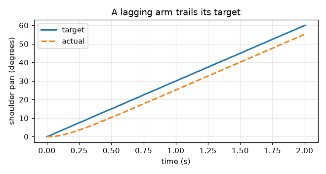
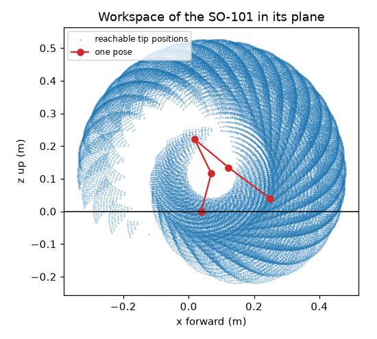

# Logging, Testing, Simulation, and ROS 2

## Summary

This chapter covers the tools that make robot code trustworthy. You will add logging and plotting, write tests with pytest against the fake arm, and use simulation and URDF models before touching hardware. It also gives guided tours of Pinocchio, Isaac Sim, and ROS 2. After this chapter, you will be able to test robot code safely.

## Concepts Covered

This chapter covers the following 23 concepts from the learning graph:

| Concept | Concept Impact Score |
|---------|-----------------------|
| Logging Module | 86 |
| CSV Logging | 78 |
| Matplotlib Plot | 30 |
| Simulation | 17 |
| Pytest | 12 |
| Unit Test | 10 |
| Plotting Trajectories | 7 |
| Success Rate | 7 |
| URDF Model | 6 |
| ROS 2 Tour | 5 |
| ROS Node | 4 |
| ROS Topic | 3 |
| Test Coverage | 2 |
| Physics Simulator | 2 |
| Log Levels | 1 |
| Plotting Workspace | 1 |
| Test Fixtures | 1 |
| Testing Safety Limits | 1 |
| Regression Testing | 1 |
| Pinocchio Library | 1 |
| Isaac Sim Tour | 1 |
| MoveIt Planning | 1 |
| Sim-to-Real Gap | 1 |

## Prerequisites

This chapter builds on concepts from:

- [Chapter 1: Setting Up Python for Robotics](../01-python-setup-for-robotics/index.md)
- [Chapter 2: Anatomy of a Robot Arm](../02-anatomy-of-a-robot-arm/index.md)
- [Chapter 5: Actuators and Sensors](../05-actuators-and-sensors/index.md)
- [Chapter 10: A Python Hardware Library for Robot Arms](../10-python-hardware-library/index.md)
- [Chapter 11: Moving the Arm: Trajectories, Grippers, and Teleoperation](../11-moving-the-arm/index.md)
- [Chapter 12: Kinematics: Where Is the Hand and How Do I Get There](../12-kinematics/index.md)

---

!!! mascot-welcome "Trust, But Verify!"
    { class="mascot-admonition-img" }
    A program that moves me had better be right *before* it runs, and when it is wrong, you want a record of what happened. In this chapter you will give your code a memory with logs, a conscience with automatic tests, and a safe playground with simulators. Let's move it!

Your arm library now does a lot: it converts units, plans smooth moves, runs a pick-and-place state machine, and solves kinematics. Each piece was checked by running a demo and reading the output, which is fine for a few functions and fails as the code grows. Change one line in `units.py`, and nothing tells you that a pick-and-place three modules away just began to miss. And when a real arm does something odd at 3 p.m. on a Tuesday, you have only your memory of what the program was doing.

This chapter adds the tools that professional robot programmers lean on. *Logging* records what the program did, as messages for people and as numbers for plots. *Testing* checks the code automatically, against the fake arm, every time it changes. *Simulation* runs the program against a model of the arm, so that a mistake costs nothing. The last part is a set of guided tours of the larger robotics tools that you will meet in the world: ROS 2, Pinocchio, Isaac Sim and MoveIt. They are tours, and not skills that you must master, but you will know what each is for and how it fits with what you wrote.

## Logging

### The Logging Module

A program that only prints is hard to live with. Prints cannot be turned off, they carry no time or source, and they are all alike, so the one warning that matters is lost among a hundred routine lines. The **logging module** is Python's answer: it is in the standard library, and it separates *what happened* from *whether anyone sees it*. Your code writes a message to a **logger**, and the program's setup decides where the messages go (the screen, a file, or both) and how they look.

Four ideas cover almost everything. A *logger* is created with `logging.getLogger(name)`, and the usual name is `__name__`, the module's own name, so each message says where it came from. Logger names are hierarchical, with dots: a logger called `armlab.drivers` is a child of `armlab`, and a setting on the parent applies to the children. A *handler* sends the messages somewhere: `StreamHandler` to the screen and `FileHandler` to a file. A *formatter* lays out each line, with fields such as `%(asctime)s` for the time, `%(levelname)s` for the level, `%(name)s` for the logger and `%(message)s` for the text. And `logging.basicConfig(level=..., format=..., handlers=[...])` sets all of it up in one call. The lab's `setup_logging` function wraps that call.

A message is written with a method named for its level, such as `logger.warning("%s is near its limit", name)`. Pass the values as separate arguments and not as a pre-built f-string, and logging builds the text only if the message will be shown, which keeps a debug message that nobody reads almost free.

### Log Levels

**Log levels** rank messages by importance, and the program's setup chooses the lowest level that it wants to see. There are five, with numbers that you can compare.

| Level | Number | Use it for | Example |
|---|---|---|---|
| `DEBUG` | 10 | Detail for finding a fault | `write {'shoulder_pan': 20.0}` |
| `INFO` | 20 | Normal events worth knowing | `arm connected (6 joints)` |
| `WARNING` | 30 | Something unexpected that the program handled | `shoulder_pan target 109.0 is within 2 degrees of its limit` |
| `ERROR` | 40 | An operation failed | `failed to read servo 3 after 2 retries` |
| `CRITICAL` | 50 | The program cannot go on, or safety is at risk | `emergency stop pressed; torque disabled` |

If the level is set to `INFO`, then `INFO` and everything above it is shown and `DEBUG` is hidden. The default of the root logger is `WARNING`, which is why a new logger that writes only `INFO` messages seems to print nothing. The same program therefore runs quietly in everyday use and shows every detail when you set the level to `DEBUG` while hunting a bug. You change the level in one place and no message in the code has to change.

!!! mascot-tip "Log the Surprise, Not the Routine"
    { class="mascot-admonition-img" }
    Ask of each message: "Would I want to see this at 3 a.m. when the arm misbehaves?" Details go at `DEBUG`, and events go at `INFO`. Keep `WARNING` and above for things that need a person, so that when one appears, someone looks.

The next MicroSim practises choosing levels.

#### Diagram: Log Level Sorter

<iframe src="../../sims/log-level-sorter/main.html" height="620px" width="100%" scrolling="no"></iframe>

[Run the Log Level Sorter MicroSim fullscreen](../../sims/log-level-sorter/main.html){ .md-button .md-button--primary }

<details markdown="1">
<summary>Log Level Sorter</summary>
Type: microsim
**sim-id:** log-level-sorter<br/>
**Library:** p5.js<br/>
**Status:** Specified<br/>
**Bloom Level:** Understand<br/>
**Bloom Verb:** classify<br/>
**Learning Objective:** The learner will classify eight log messages from an arm program into the five log levels DEBUG, INFO, WARNING, ERROR and CRITICAL, with at least 7 of 8 correct on the first attempt.

**Prerequisites:** logging module, logger, log levels and their numbers (all defined in the sections "The Logging Module" and "Log Levels" above this block).

**Evidence of Mastery:** For each of eight messages the learner chooses one of five levels and commits. A choice is correct when it matches the Level column in Content. Mastery is 7 of 8 correct on the first attempt. Setting the minimum level in Explore mode and watching which messages appear is exploration, not evidence.

**Misconceptions:** (1) Every message should be an error so that it is not missed. (Too many high-level messages hide the ones that matter.) (2) A warning means the program stopped. (It means something unexpected was handled.) (3) A failed operation that the program recovers from is critical. (CRITICAL is for a program that cannot continue or a safety risk.)

**Instructional Rationale:** An Understand-level classify objective asks the learner to sort examples by a rule. Each message is a realistic line from an arm program, so the learner must apply the meaning of the five levels to a concrete event.

**Content:**

Explore mode shows a stream of the eight messages and a control that sets the minimum level. Only messages at or above the minimum are shown, so the learner sees how the same stream looks at each level. Eight messages in this fixed order:

| # | Message | Level | Why (shown as feedback) |
|---|---|---|---|
| 1 | Loop tick 1042 started | DEBUG | A routine detail that is only useful when hunting a fault. |
| 2 | Arm connected on /dev/ttyACM0 | INFO | A normal event worth recording. |
| 3 | Joint elbow_flex temperature is 62 C, above the 60 C warning level | WARNING | Unexpected, but nothing has failed yet, and a person should know. |
| 4 | Failed to read servo 3 after 2 retries | ERROR | An operation failed, even though the program continues. |
| 5 | Emergency stop pressed: torque disabled | CRITICAL | The program cannot go on and safety is involved. |
| 6 | Calibration file loaded: my_follower.json | INFO | A normal event worth recording. |
| 7 | Packet checksum failed on servo 2: retrying (attempt 1 of 2) | WARNING | Something unexpected that the program is handling. |
| 8 | Sent goal position 2106 to servo 1 | DEBUG | A routine detail of one command. |

**Provenance:** The five levels and their meanings are from the chapter section "Log Levels" and the Python logging documentation. The messages are illustrative and written for this sim.

**Rules:** Each message has exactly one correct level. The five levels are ordered DEBUG < INFO < WARNING < ERROR < CRITICAL. In Explore mode a message is shown when its level is at or above the chosen minimum.

**Learner Activity:**

1. In Explore mode the learner sets the minimum level and watches which of the eight messages remain. The learner should notice that at WARNING only three of them are left.
2. The learner switches to the eight messages. Message 1 is shown.
3. The learner chooses a level and commits.
4. The sim shows whether the choice was correct and the Why text, then moves on. After message 8 it shows the score.

**Feedback:** Eight messages, fixed order, one attempt each. Correct: "Correct: <level>. <Why>". Incorrect: "Not quite. This message is <level>. <Why>". The correct level is revealed after each commit. A running count "Correct: n of 8" is shown and the final screen says whether mastery (7 of 8) was reached.

**Starting State:** Explore mode with the minimum level set to DEBUG, showing all eight messages.

**Chapter Anchors:** The chapter lists five levels with numbers 10, 20, 30, 40 and 50, and states that the root logger's default is WARNING. The sim has eight messages and mastery is 7 of 8.
</details>

### CSV Logging

Messages are for people, and *numbers* are for analysis. **CSV logging** writes numbers to a CSV file (Chapter 6), one row per moment, so that a spreadsheet or a plot can read them afterwards. Python's `csv.DictWriter` does it. You give it the column names, call `writeheader()` once, and then `writerow(dictionary)` for each row. Open the file with `newline=""`, as the `csv` documentation says, to stop blank lines appearing on Windows.

Two habits make a log useful. The first is to put *time* in the first column, taken from `time.perf_counter()` (Chapter 11), so that rows can be lined up and plotted. The second is to `flush()` the file after every row, which forces the data out to disk. A program that crashes with a million numbers still in memory leaves an empty file, and a crash is exactly when you want the log. The lab's `CsvLogger` class is a context manager (Chapter 10) that opens the file, writes the header, flushes every row and closes the file at the end.

For a robot the most useful numbers are the *target* and the *actual* position of a joint at every tick of the control loop. Comparing them tells you how well the arm follows its commands, and a growing gap is an early warning of a stalled or overloaded joint (Chapter 5). The lab writes one row per tick with the time, the target and the reading.

### Plotting Trajectories and Workspaces

A **matplotlib plot** turns a column of numbers into a picture, and the picture shows what the column hides. Matplotlib is the standard plotting library for Python. The pattern is short: make a figure and an axis with `fig, ax = plt.subplots()`, draw lines with `ax.plot(x, y)`, label them with `ax.set_xlabel` and `ax.legend`, and save with `fig.savefig("name.png")`. On a computer with no display, or in a script that runs unattended, select the `Agg` backend first (`matplotlib.use("Agg")`), which draws to a file with no window.

**Plotting trajectories** is drawing the target and the actual position against time. The figure from the lab shows an arm whose joint chases its target with a delay of about 0.15 seconds. The two lines run parallel, and the gap between them is the speed of the move times the delay: 30 degrees per second times 0.15 seconds is about 4.5 degrees. Seeing that as a gap is far quicker than reading a thousand numbers. **Plotting workspace** is drawing the points that Chapter 12's sampling found, with one pose of the arm on top, and the picture shows the reach, the hole in the middle, and where the table would cut the arm off.





## Testing

### Unit Tests and Pytest

A **unit test** is a small function that checks one behavior of one piece of code, and says "pass" or "fail" without a person looking. A good one is a few lines: set something up, do the thing, and `assert` what must be true. Because tests run by machine in a fraction of a second, you can run them *all* after every change, and the change that breaks a pick-and-place three modules away is caught in the same minute.

**Pytest** is the tool that finds and runs them. You put test files in a `tests` folder, name each file `test_something.py` and each function `test_something`, and write plain `assert` statements. Run `python -m pytest -q` from the project folder. The `-q` flag keeps the output short, and `python -m` adds the current folder to Python's search path so that your tests can `import armlab`. When an assertion fails, pytest shows both sides of the comparison, which tells you much of what you need. Install it with `python -m pip install pytest pytest-cov`.

A test needs to be *tough on the code, and kind to the reader*. A few rules help. Test one behavior per function and name it as a sentence (`test_a_pose_outside_the_limits_is_refused_and_nothing_is_sent`), so that a failing name reads like a bug report. Test the edges, such as zero, the limit itself and just beyond it, where bugs live. Compare floating-point numbers with `pytest.approx` and not `==`, since \( 0.1 + 0.2 \) is not exactly 0.3 in any language. And check that errors happen as well: `with pytest.raises(JointLimitError):` passes only if the error is raised.

### Fixtures, Safety Limits, and Regression Tests

**Test fixtures** are shared set-up code. Half the tests in this book need a connected fake arm, and writing the same four lines in every test is noise. A fixture is a function marked `@pytest.fixture`. A test that names it as a parameter receives its result. A fixture that uses `yield` runs its set-up before the test and its clean-up after, even if the test fails, so the lab's `arm` fixture connects a fake arm, hands it to the test, and always disconnects it. Fixtures that many test files share live in a file called `conftest.py`, which pytest reads by itself.

**Testing safety limits** is the most valuable test you will write for an arm. It checks that every joint refuses a target just outside its limit and accepts one just inside, and it is cheap: one test with `@pytest.mark.parametrize`, which runs the same function many times with different arguments, covers every joint and both ends. The lab's test does six runs from three lines of code. If someone later changes `move_to` and the check silently disappears, this test fails the same day, long before a real arm does anything surprising. Chapter 17 builds a whole safety layer on the same idea.

A **regression test** pins down behavior that was right once, so that no later change breaks it by accident. The lab's example records the number of poses of a standard move (101) and the pose at its middle (30 degrees). If a change to the planner alters either, the test fails, and you decide whether the change was a mistake or an improvement, in which case you update the test on purpose.

### Success Rate and Test Coverage

Some behavior cannot be a single yes or no. A pick-and-place may succeed on most trials and fail on a few, and the number that describes it is the **success rate**: the successes divided by the trials. The lab runs the state machine of Chapter 11 on 20 trials on the fake arm, with a seeded random generator deciding whether the pretend object is there, so that the "random" trials repeat. It reports 18 successes of 20, or 90 percent, and each failure was a missing object that the grasp check caught. The seed is the important detail. A test whose result changes between runs teaches nothing, so give every random choice in a test a fixed seed. Chapter 17 uses success rates to evaluate agents.

**Test coverage** measures how much of the code the tests ran. The `pytest-cov` plug-in adds `--cov=module` to the command and prints, for each module, the number of statements, the number that no test reached, and the percentage. It is a flashlight, not a score. A line that no test reaches is a line that nothing protects, but a line that was merely executed is not necessarily checked. Use the missing lines as a to-do list, and do not chase 100 percent for its own sake.

The next MicroSim practises reading the failures that pytest prints, which are real messages from the lab's code with a bug put in on purpose.

#### Diagram: Pytest Output Reader

<iframe src="../../sims/pytest-output-reader/main.html" height="620px" width="100%" scrolling="no"></iframe>

[Run the Pytest Output Reader MicroSim fullscreen](../../sims/pytest-output-reader/main.html){ .md-button .md-button--primary }

<details markdown="1">
<summary>Pytest Output Reader</summary>
Type: microsim
**sim-id:** pytest-output-reader<br/>
**Library:** p5.js<br/>
**Status:** Specified<br/>
**Bloom Level:** Analyze<br/>
**Bloom Verb:** attribute<br/>
**Learning Objective:** The learner will attribute each of six pytest failure messages to its most likely cause, with at least 5 of 6 correct on the first attempt.

**Prerequisites:** unit test, pytest, assertion, fixture, pytest.approx, pytest.raises, the Python path (all defined in the section "Testing" above this block).

**Evidence of Mastery:** For each of six failure messages the learner chooses one of six causes and commits. A choice is correct when it matches the Cause column in Content. Mastery is 5 of 6 correct on the first attempt. Reading the cause list in Explore mode is exploration, not evidence.

**Misconceptions:** (1) A failing test always means that the code is wrong. (The test itself can be wrong or incomplete.) (2) Exact equality is fine for decimals. (Rounding makes equal-looking numbers differ.) (3) An error before any test runs is a test failure. (It is a set-up problem: a missing fixture or an import path.)

**Instructional Rationale:** An Analyze-level attribute objective asks the learner to work out the cause behind a pattern. Each message is a real line of pytest output, so the learner must read it as a clue and not as noise.

**Content:**

The six causes: "The code returns a different value than the test expects", "Decimals were compared with exact equality", "A fixture is missing or misspelled", "The test never created the state that it checks", "A check that should have refused did not refuse", "Python cannot find the library". Six messages in this fixed order. They are the real outputs of the lab's code with a bug introduced for each:

| # | Pytest output | Cause | Why (shown as feedback) |
|---|---|---|---|
| 1 | assert 2504 == 2503, where 2504 = deg_to_raw(45, JointCalibration(...)) | The code returns a different value than the test expects | The function gave 2504 and the test said 2503, so one of them is wrong, and the arithmetic (1992 + 45 x 11.375 = 2503.9) says that 2504 is right. |
| 2 | assert (0.1 + 0.2) == 0.3 | Decimals were compared with exact equality | 0.1 + 0.2 is 0.30000000000000004 in binary arithmetic, so use pytest.approx. |
| 3 | fixture 'arm_connected' not found | A fixture is missing or misspelled | The test names a fixture that conftest.py does not define, and the fixture is called arm. |
| 4 | assert 0.0 == 10.0 | The test never created the state that it checks | The test read a joint that was never moved, so it still has its starting value of 0.0. |
| 5 | Failed: DID NOT RAISE JointLimitError | A check that should have refused did not refuse | The call that should have been refused went through, so the limit check is missing. |
| 6 | ModuleNotFoundError: No module named 'armlab' | Python cannot find the library | The tests were run from a place where the project folder is not on the path, so use python -m pytest from the project folder. |

**Provenance:** The six outputs were produced by running pytest 9.1.1 on a copy of the lab's tests with one deliberate bug for each. The causes and remedies are from the chapter section "Testing".

**Rules:** Each message has exactly one correct cause. The six causes are the only choices.

**Learner Activity:**

1. In Explore mode the learner reads the six causes, each with the fix that it usually needs.
2. The learner switches to the six messages. Message 1 is shown.
3. The learner chooses a cause and commits.
4. The sim shows whether the choice was correct and the Why text, then moves on. After message 6 it shows the score.

**Feedback:** Six messages, fixed order, one attempt each. Correct: "Correct: <cause>. <Why>". Incorrect: "Not quite. The likely cause is: <cause>. <Why>". The correct cause is revealed after each commit. A running count "Correct: n of 6" is shown and the final screen says whether mastery (5 of 6) was reached.

**Starting State:** Explore mode with the six causes listed and the prompt "What does this failure message point to?" ready for the first message.

**Chapter Anchors:** The chapter states that tests are run with python -m pytest -q, that decimals are compared with pytest.approx, and that raises is checked with pytest.raises. The sim has six messages and mastery is 5 of 6.
</details>

## Simulation

### Why Simulate

A **simulation** is a program that behaves like the real thing closely enough to test against. You have used one all along: the fake arm is a very simple simulation of an arm, and the pretend bus is one of a servo bus. Simulation matters for robots for the three reasons in Chapter 3's rule, "simulate first, then power on". It is *safe*, since a wrong move in a simulator breaks nothing. It is *fast*, since a program can be run a hundred times in the time it takes to reset a real arm once. And it is *repeatable*, so that a failure can be reproduced exactly. The success rate above could be measured over 20 trials in eight seconds only because the arm was a fake.

### URDF Models

A **URDF model** is the standard description of a robot's body, in XML: a list of *links* (the rigid parts) and *joints* (what connects two links, with a type, an axis and limits), each with positions in a parent frame. URDF stands for Unified Robot Description Format, and it was created for ROS. You met its numbers in Chapter 12, where the SO-101's link offsets came from `so101_new_calib.urdf`. A joint element says where the child is relative to the parent (`origin xyz="0 0 0.2"`), which way it turns (`axis xyz="0 1 0"`), and how far (`limit lower="0" upper="2.4"`). Links can also carry a mass and inertia (for physics) and a shape (for display and collisions). The lab reads a small two-link URDF with Python's standard XML tools and prints its joints, which is all that a URDF is: a structured file that many programs can read.

### Physics Simulators

A **physics simulator** goes beyond geometry and also computes forces, friction, contact and gravity, stepping the world forward in small slices of time. MuJoCo is an open-source one from Google DeepMind that installs with `pip install mujoco` and is widely used in robot learning. A model is written in an XML file and the simulation is advanced with `mujoco.mj_step(model, data)`. The lab simulates a pendulum for one second at 2 ms per step: released 0.5 radians from hanging straight down, it has swung back to +0.27 radians after one second. The SO-ARM100 repository ships MuJoCo versions of the SO-101 (the files with the `.xml` extension in its `Simulation/SO101` folder, plus a `scene.xml`), together with the URDF files and a note on viewing them with the `rerun` tool. Its README does not mention other simulators. Simulators have their own installation limits: at the time of reading the newest MuJoCo wheels were published for Apple-silicon Macs, Linux and Windows, and an Intel Mac needed an older release, so check the install page for your computer.

### The Sim-to-Real Gap

The **sim-to-real gap** is the difference between what a program does in simulation and what it does on the real arm. The research survey by Zhao, Queralta and Westerlund describes it as the gap between the simulated and real worlds that degrades the performance of a policy when it moves to a real robot. The sources are many: friction that the model has wrong, backlash in the gears (Chapter 5), motor lag, bus delay, a camera's noise and lighting, and a calibration that is a degree off. The lab shows the first in miniature. The same trajectory is played on an ideal fake arm, which follows exactly with an error of 0, and on a lagging fake arm, which trails by about 4.5 degrees. A program tuned against the ideal arm would have assumed that it could stop on the target, and a program tested only in simulation inherits every one of the simulator's flattering assumptions. The cure is the one this book follows throughout: test in simulation for logic and safety, then move to the real arm with small, slow moves and compare, using the log, what the arm really did.

!!! mascot-warning "A Passing Simulation Is Not a Safe Arm"
    { class="mascot-admonition-img" }
    Simulation proves your logic and catches silly mistakes, and it cannot prove that the real arm will behave the same. Friction, lag and loose gears are all absent. Treat the first run on the hardware as a new experiment: small, slow, with your hand near the E-stop, and a log running.

## Guided Tours

The rest of the chapter is a set of short tours. You do not need to install any of these tools to continue, and each one tells you where your own code would meet it.

!!! mascot-neutral "Tours, Not Lessons"
    { class="mascot-admonition-img" }
    These tools are big, and each deserves a book of its own. The goal here is a map: what each tool does, what it needs, and how it connects to the `Arm` class, the URDF and the tests you already have. The versions are those read on 2026-10-07, and they change quickly.

### Pinocchio

The **Pinocchio library** is an open-source library for rigid-body kinematics and dynamics, written in C++ with a Python interface (BSD license). Given a URDF it computes forward kinematics, Jacobians, and the forces needed to hold a pose, much faster than hand-written Python. The reBot-DevArm's Python control library is built on it, and LeRobot's kinematics support wraps it through a library called `placo`. It installs with `pip install pin` (the package name is `pin`, and the import name is `pinocchio`), or with conda from `conda-forge`. The lab loads the two-link URDF, runs forward kinematics for a shoulder angle of 0.5 radians and an elbow angle of 1.0 radians, and compares the elbow's position with the transform chain that you wrote in Chapter 12. They agree to four decimals.

### ROS 2

The **ROS 2 tour** starts with the name. **ROS 2** (the Robot Operating System, version 2) is a set of libraries and conventions for building robot software out of many small programs that talk to each other. Despite its name, it is not an operating system. Its two central ideas are small. A **ROS node** is one program in the system, which "should do one logical thing" in the words of the ROS documentation: one node reads the camera, another plans, another drives the motors. A **ROS topic** is a named channel with a message type: a node *publishes* messages to a topic and any number of nodes *subscribe* to it, and the system connects them by discovery, with no addresses to type. A message has a defined shape. For example, `sensor_msgs/JointState` carries arrays of joint `name`, `position`, `velocity` and `effort`, which is the natural way to publish an arm's pose.

Here is the shape of a node in Python, a publisher that sends a counter twice a second (adapted from the official `rclpy` tutorial for the Jazzy release; it needs a ROS 2 installation and is not part of the lab):

```python linenums="1"
import rclpy
from rclpy.node import Node
from std_msgs.msg import String


class MinimalPublisher(Node):
    def __init__(self):
        super().__init__('minimal_publisher')
        self.publisher_ = self.create_publisher(String, 'topic', 10)     # message type, topic name, queue size
        self.timer = self.create_timer(0.5, self.timer_callback)         # call timer_callback every 0.5 s
        self.i = 0

    def timer_callback(self):
        msg = String()
        msg.data = 'Hello World: %d' % self.i
        self.publisher_.publish(msg)
        self.get_logger().info('Publishing: "%s"' % msg.data)
        self.i += 1


def main(args=None):
    rclpy.init(args=args)
    node = MinimalPublisher()
    rclpy.spin(node)                      # keep the node running, calling its callbacks
    node.destroy_node()
    rclpy.shutdown()


if __name__ == '__main__':
    main()
```

Notice how much is familiar: a class, a timer that is a control loop with a callback, a logger with levels, and a message that is a small data object. With `ros2 run`, `ros2 topic list` and `ros2 topic echo`, you can start, list and watch such nodes from the terminal. The Chapter 10 `Arm` class would sit inside one node, publishing a `JointState` and subscribing to targets.

The practical facts, as read on 2026-10-07: the latest long-term-support release is **Lyrical Luth** (released 22 May 2026, supported to May 2031), and the previous ones are Jazzy Jalisco (May 2024, to May 2029), Humble Hawksbill (May 2022, to May 2027) and a non-LTS release, Kilted Kaiju, supported to December 2026. Releases are tied to an operating system: Lyrical's best-supported platforms are Ubuntu 26.04 and Windows 11, Jazzy's are Ubuntu 24.04 and Windows 10, and Humble's is Ubuntu 22.04. macOS is supported only by the community, which means building from source or using the community-maintained RoboStack packages. The reBot-DevArm's README names ROS 2 Humble, and its ROS packages are in separate repositories from the arm's design files. The SO-ARM100 repository has no ROS files. The code above differs slightly from the newest release's version, which changes the `main` function's shutdown handling, so follow the tutorial for your release.

### MoveIt 2 and Isaac Sim

**MoveIt planning** is the motion-planning framework for ROS 2. Given a URDF, it plans collision-free paths for an arm, including inverse kinematics and obstacle avoidance. Its Setup Assistant is a graphical tool that reads the URDF and walks you through defining planning groups, self-collision checks and named poses. It is the industrial-strength version of what Chapters 12 and 19 build in miniature, and it is maintained for the Humble, Jazzy and Kilted releases and for the development branch.

The **Isaac Sim tour** is short, because the tool is heavy. NVIDIA Isaac Sim is a robotics simulator with photorealistic rendering and physics on the GPU, and Isaac Lab is its framework for training robot policies. Its published requirements for the 6.x line are an NVIDIA RTX GPU (a GeForce RTX 4080 with 16 GB of video memory at the least), 32 GB of memory, and Ubuntu or Windows 11. There is no macOS version. It installs with `pip install isaacsim` on Linux with Python 3.12, after accepting NVIDIA's license, and there are other installation routes. Seeed provides USD models and an Isaac Sim teleoperation tutorial for the reBot-DevArm, in repositories separate from the arm's own. Treat Isaac Sim as a destination for readers who have the GPU, and keep the rest of the book's work on tools that run on a laptop.

#### Diagram: ROS Concept Matcher

<iframe src="../../sims/ros-concept-matcher/main.html" height="620px" width="100%" scrolling="no"></iframe>

[Run the ROS Concept Matcher MicroSim fullscreen](../../sims/ros-concept-matcher/main.html){ .md-button .md-button--primary }

<details markdown="1">
<summary>ROS Concept Matcher</summary>
Type: microsim
**sim-id:** ros-concept-matcher<br/>
**Library:** p5.js<br/>
**Status:** Specified<br/>
**Bloom Level:** Remember<br/>
**Bloom Verb:** identify<br/>
**Learning Objective:** The learner will identify the ROS 2 or robot-description term that matches each of eight short descriptions, with at least 7 of 8 correct on the first attempt.

**Prerequisites:** ROS 2, ROS node, ROS topic, message, publisher, subscriber, URDF (all defined in the sections "URDF Models" and "ROS 2" above this block).

**Evidence of Mastery:** For each of eight descriptions the learner chooses one of six terms and commits. A choice is correct when it matches the Term column in Content. Mastery is 7 of 8 correct on the first attempt. Reading the term list in Explore mode is exploration, not evidence.

**Misconceptions:** (1) ROS is an operating system. (It is a set of libraries and conventions that runs on one.) (2) A topic is a program. (A node is a program, and a topic is a named channel.) (3) A publisher sends to a particular subscriber. (It sends to a topic, and any number of subscribers receive it.)

**Instructional Rationale:** A Remember-level identify objective asks the learner to recognize a term from its description. A small set of terms with distinct descriptions lets the learner build the vocabulary that the tour introduces, which is enough to read the ROS documentation.

**Content:**

The six terms: "Node", "Topic", "Message", "Publisher", "Subscriber", "URDF". Eight descriptions in this fixed order:

| # | Description | Term | Why (shown as feedback) |
|---|---|---|---|
| 1 | A program in the ROS 2 graph that does one logical job, like reading a camera. | Node | A node is the unit of computation in ROS 2. |
| 2 | A named channel that nodes publish to and subscribe from. | Topic | A topic carries messages of one type between nodes. |
| 3 | The typed data sent on a topic, like sensor_msgs/JointState. | Message | A message has a defined shape, with named fields. |
| 4 | A node that sends messages on a topic. | Publisher | Publishers send, and they do not need to know who receives. |
| 5 | A node that receives messages from a topic. | Subscriber | Subscribers register a callback for the messages that arrive. |
| 6 | The XML file that describes an arm's links and joints. | URDF | URDF stands for Unified Robot Description Format. |
| 7 | What the command ros2 topic list prints. | Topic | The command lists the topics that exist in the system. |
| 8 | What msg.data holds inside a subscriber's callback. | Message | The callback receives a message object, and data is one of its fields. |

**Provenance:** The terms are from the chapter sections "URDF Models" and "ROS 2", which follow the ROS 2 documentation read on 2026-10-07. The descriptions are written for this sim.

**Rules:** Each description has exactly one correct term. The six terms are the only choices.

**Learner Activity:**

1. In Explore mode the learner reads the six terms with a one-line meaning of each and a picture of nodes connected by a topic.
2. The learner switches to the eight descriptions. Description 1 is shown.
3. The learner chooses a term and commits.
4. The sim shows whether the choice was correct and the Why text, then moves on. After description 8 it shows the score.

**Feedback:** Eight descriptions, fixed order, one attempt each. Correct: "Correct: <term>. <Why>". Incorrect: "Not quite. This describes: <term>. <Why>". The correct term is revealed after each commit. A running count "Correct: n of 8" is shown and the final screen says whether mastery (7 of 8) was reached.

**Starting State:** Explore mode with the six terms listed and a diagram of two nodes joined by one topic.

**Chapter Anchors:** The chapter states that a node should do one logical thing, that a topic is a named channel with a message type, and that JointState has the fields name, position, velocity and effort. The sim has eight descriptions and mastery is 7 of 8.
</details>

## Lab: Log, Test, and Simulate

In this lab you will add logging and a CSV log to the arm library, plot a move, write a test suite with pytest, measure a success rate, and take two short tours with real tools. Nothing needs hardware. The new libraries are `matplotlib` and `pytest`, and the two optional tours use `pin` and `mujoco`. You will extend the `arm-lab` project.

**Step 1. Activate the project and install the tools.**

```bash
cd ~/projects/arm-lab
source .venv/bin/activate
python -m pip install matplotlib pytest pytest-cov
git status
```

**Step 2. Write the logging module.** `setup_logging` configures the standard `logging` module to print to the screen and, if you give it a filename, to a file. `LoggedArm` wraps *any* arm of Chapter 10 and logs what happens to it at the right levels, without changing what the arm does: that is the benefit of the interface. `CsvLogger` is a context manager that writes rows to a CSV file and flushes each one. Create `armlab/logs.py`:

```python linenums="1"
"""Logging for the arm: Python's logging module for events, and a CSV file for numbers."""

import csv
import logging
import sys

from armlab.arm import Arm, Pose

logger = logging.getLogger("armlab")


def setup_logging(level=logging.INFO, filename=None, fmt="%(asctime)s %(levelname)-8s %(name)s: %(message)s"):
    """Send log messages to the screen, and also to a file if a filename is given."""
    handlers = [logging.StreamHandler(sys.stdout)]
    if filename:
        handlers.append(logging.FileHandler(filename, mode="w"))
    logging.basicConfig(level=level, format=fmt, handlers=handlers, force=True)


class LoggedArm(Arm):
    """Wraps any arm and logs what happens to it, without changing what it does."""

    NEAR_LIMIT_DEG = 2.0

    def __init__(self, inner: Arm):
        super().__init__(list(inner.joints.values()))
        self.inner = inner

    def _open(self):
        self.inner.connect()
        logger.info("arm connected (%d joints)", len(self.joints))

    def _close(self):
        self.inner.disconnect()
        logger.info("arm disconnected")

    def _read(self):
        values = self.inner.read_pose().values
        logger.debug("read %s", {name: round(value, 1) for name, value in values.items()})
        return values

    def _write(self, values):
        for name, value in values.items():
            joint = self.joints[name]
            if joint.unit == "deg" and min(value - joint.min, joint.max - value) < self.NEAR_LIMIT_DEG:
                logger.warning("%s target %.1f is within %.0f degrees of its limit", name, value, self.NEAR_LIMIT_DEG)
        logger.debug("write %s", {name: round(value, 1) for name, value in values.items()})
        self.inner.move_to(Pose(values))


class CsvLogger:
    """Writes one row of numbers per call to a CSV file, and flushes each row so a crash loses nothing."""

    def __init__(self, path, fieldnames):
        self.path, self.fieldnames = path, fieldnames

    def __enter__(self):
        self._file = open(self.path, "w", newline="")
        self._writer = csv.DictWriter(self._file, fieldnames=self.fieldnames)
        self._writer.writeheader()
        return self

    def __exit__(self, exc_type, exc_value, traceback):
        self._file.close()
        return False

    def log(self, row):
        self._writer.writerow(row)
        self._file.flush()
```

**Step 3. Watch the log levels.** The script runs the same program twice, with the level set to `INFO` and then to `DEBUG`, and prints the level numbers. Create `log_demo.py`:

```python linenums="1"
"""Logging at different levels, and the numbers of a move in a CSV file."""

import logging

from armlab.arm import FakeArm, Joint, Pose
from armlab.logs import LoggedArm, setup_logging

joints = [Joint("shoulder_pan", 1, -110, 110), Joint("elbow_flex", 2, -97, 97)]

for level in (logging.INFO, logging.DEBUG):
    print(f"--- the same program with the logging level set to {logging.getLevelName(level)} ---")
    setup_logging(level=level, fmt="%(levelname)-8s %(name)s: %(message)s")
    with LoggedArm(FakeArm(joints)) as arm:
        arm.move_to(Pose({"shoulder_pan": 20.0, "elbow_flex": 30.0}))
        arm.move_to(Pose({"shoulder_pan": 109.0, "elbow_flex": 30.0}))      # very close to the limit of 110
        logging.getLogger("armlab.demo").error("a made-up error, to show the ERROR level")

print("--- the level numbers ---")
print({name: getattr(logging, name) for name in ("DEBUG", "INFO", "WARNING", "ERROR", "CRITICAL")})
```

```bash
python log_demo.py
```

```text
--- the same program with the logging level set to INFO ---
INFO     armlab: arm connected (2 joints)
WARNING  armlab: shoulder_pan target 109.0 is within 2 degrees of its limit
ERROR    armlab.demo: a made-up error, to show the ERROR level
INFO     armlab: arm disconnected
--- the same program with the logging level set to DEBUG ---
INFO     armlab: arm connected (2 joints)
DEBUG    armlab: write {'shoulder_pan': 20.0, 'elbow_flex': 30.0}
WARNING  armlab: shoulder_pan target 109.0 is within 2 degrees of its limit
DEBUG    armlab: write {'shoulder_pan': 109.0, 'elbow_flex': 30.0}
ERROR    armlab.demo: a made-up error, to show the ERROR level
INFO     armlab: arm disconnected
--- the level numbers ---
{'DEBUG': 10, 'INFO': 20, 'WARNING': 30, 'ERROR': 40, 'CRITICAL': 50}
```

At `INFO` the debug lines are hidden. At `DEBUG` the same program shows each write, in order. The warning appeared at both levels, because it is above both. Nothing in the program changed between the two runs, and only the level did.

**Step 4. Record, measure and plot a move.** `LaggedArm` is a fake arm whose joints chase their targets with a delay, which is a first step toward a more realistic simulation. `record_trajectory` plays a trajectory and logs the time, the target and the reading at each tick to a CSV file. `read_run` and `tracking_error` read the file back and measure the gap, and `plot_run` and `plot_workspace` draw the two figures of the chapter. Create `armlab/record.py`:

```python linenums="1"
"""Record a move to a CSV file, measure how well the arm followed it, and plot it."""

import csv
import math
import time

from armlab.arm import FakeArm
from armlab.logs import CsvLogger
from armlab.loop import run_loop


class LaggedArm(FakeArm):
    """A fake arm that behaves a little like a real one: its joints chase their targets with a delay."""

    def __init__(self, joints, tau_s=0.15):
        super().__init__(joints)
        self.tau_s = tau_s                        # the time constant: about 63 percent of a step in this time
        self.target = dict(self.values)
        self._last = time.perf_counter()

    def _advance(self):
        now = time.perf_counter()
        gain = 1 - math.exp(-(now - self._last) / self.tau_s)
        self._last = now
        for name in self.values:
            self.values[name] += (self.target[name] - self.values[name]) * gain

    def _read(self):
        self._advance()
        return dict(self.values)

    def _write(self, values):
        self._advance()
        self.writes.append(dict(values))
        self.target.update(values)


def record_trajectory(arm, trajectory, path, joint="shoulder_pan"):
    """Play a trajectory on a connected arm and log, at every tick, the target and the reading of one joint.

    Returns the number of rows written. The CSV has the columns time_s, target and actual.
    """
    def step(tick, seconds):
        target = trajectory.poses[tick]
        arm.move_to(target)
        logger.log({"time_s": round(seconds, 4), "target": round(target.values[joint], 3),
                    "actual": round(arm.read_pose().values[joint], 3)})

    with CsvLogger(path, ["time_s", "target", "actual"]) as logger:
        run_loop(step, trajectory.rate_hz, ticks=len(trajectory.poses))
    return len(trajectory.poses)


def read_run(path):
    """Read a recorded run back as a list of (time, target, actual) tuples of numbers."""
    with open(path, newline="") as f:
        return [(float(r["time_s"]), float(r["target"]), float(r["actual"])) for r in csv.DictReader(f)]


def tracking_error(rows):
    """Return (largest error, root-mean-square error) between the target and the reading, in the joint's unit."""
    errors = [target - actual for _, target, actual in rows]
    return max(abs(e) for e in errors), math.sqrt(sum(e * e for e in errors) / len(errors))


def plot_run(rows, path, title):
    """Save a plot of the target and the reading against time."""
    import matplotlib
    matplotlib.use("Agg")                         # draw to a file, with no window
    import matplotlib.pyplot as plt
    times, targets, actuals = zip(*rows)
    fig, ax = plt.subplots(figsize=(6, 3.2))
    ax.plot(times, targets, label="target", linewidth=2)
    ax.plot(times, actuals, label="actual", linewidth=2, linestyle="--")
    ax.set_xlabel("time (s)")
    ax.set_ylabel("shoulder pan (degrees)")
    ax.set_title(title)
    ax.legend()
    ax.grid(True, alpha=0.3)
    fig.tight_layout()
    fig.savefig(path, dpi=110)
    plt.close(fig)


def plot_workspace(path, pose_deg=(0, -40, 82, -8)):
    """Save a plot of the sampled workspace of the SO-101 in its plane, with one pose of the arm drawn on it."""
    import matplotlib
    matplotlib.use("Agg")
    import matplotlib.pyplot as plt
    from armlab.kinematics import sample_workspace, so101_frames

    x, z = sample_workspace(step_deg=3)
    fig, ax = plt.subplots(figsize=(5, 4.5))
    ax.scatter(x[::7], z[::7], s=1, alpha=0.25, label="reachable tip positions")
    points = so101_frames(*pose_deg)
    ax.plot([0.0388] + [p[0] for p in points], [0.0] + [p[2] for p in points], "o-", color="tab:red", label="one pose")
    ax.axhline(0, color="black", linewidth=1)
    ax.set_xlabel("x forward (m)")
    ax.set_ylabel("z up (m)")
    ax.set_aspect("equal")
    ax.set_title("Workspace of the SO-101 in its plane")
    ax.legend(loc="upper left", fontsize=8)
    fig.tight_layout()
    fig.savefig(path, dpi=110)
    plt.close(fig)
```

**Step 5. Run it on an ideal arm and a lagging one.** Create `record_demo.py`:

```python linenums="1"
"""Record a move on an ideal fake arm and on a lagging one, measure the gap, and plot it."""

from pathlib import Path

from armlab.arm import FakeArm, Joint, Pose
from armlab.motion import plan_move
from armlab.record import LaggedArm, plot_run, plot_workspace, read_run, record_trajectory, tracking_error

joints = [Joint("shoulder_pan", 1, -110, 110), Joint("elbow_flex", 2, -97, 97)]
trajectory = plan_move(Pose({"shoulder_pan": 0.0, "elbow_flex": 0.0}),
                       Pose({"shoulder_pan": 60.0, "elbow_flex": 30.0}), rate_hz=50, v_max=30)
Path("plots").mkdir(exist_ok=True)
Path("logs").mkdir(exist_ok=True)

for name, arm in (("ideal", FakeArm(joints)), ("lagging", LaggedArm(joints, tau_s=0.15))):
    with arm:
        rows_written = record_trajectory(arm, trajectory, f"logs/{name}.csv")
    rows = read_run(f"logs/{name}.csv")
    worst, rms = tracking_error(rows)
    print(f"{name:<8} {rows_written} rows planned, about 100 rows logged: {95 <= len(rows) <= 105}")
    if name == "ideal":
        print(f"         largest error {worst:.1f} degrees")
    else:
        print(f"         the error is near speed x time constant = 30 x 0.15 = 4.5 degrees: {4.0 < worst < 5.5}")
        plot_run(rows, "plots/lagging.png", "A lagging arm trails its target")

plot_workspace("plots/workspace.png")
print("plots written:", sorted(p.name for p in Path("plots").glob("*.png")))
print(Path("logs/lagging.csv").read_text().splitlines()[0], "<- the header of the CSV file")
```

```bash
python record_demo.py
```

```text
ideal    101 rows planned, about 100 rows logged: True
         largest error 0.0 degrees
lagging  101 rows planned, about 100 rows logged: True
         the error is near speed x time constant = 30 x 0.15 = 4.5 degrees: True
plots written: ['lagging.png', 'workspace.png']
time_s,target,actual <- the header of the CSV file
```

The ideal arm follows its target exactly, and the lagging arm trails it by close to the 4.5 degrees that the speed times the delay predicts. That gap is a miniature of the sim-to-real gap. The script wrote `logs/ideal.csv`, `logs/lagging.csv`, and two pictures in the `plots` folder, which are the figures shown earlier in this chapter. Open them to see your own run.

**Step 6. Write the tests.** Five test files go in a `tests` folder, with a `pytest.ini` file that tells pytest where to look. First the shared fixtures. The `joints` fixture returns three joints, and the `arm` fixture connects a fake arm, yields it to the test, and always disconnects it. Create `pytest.ini` and `tests/conftest.py`:

```text
[pytest]
testpaths = tests
```

```python linenums="1"
"""Shared test fixtures: a set of joints, and a connected fake arm."""

import pytest

from armlab.arm import FakeArm, Joint


@pytest.fixture
def joints():
    return [Joint("shoulder_pan", 1, -110, 110), Joint("elbow_flex", 2, -97, 97),
            Joint("gripper", 6, 0, 100, "percent")]


@pytest.fixture
def arm(joints):
    """A fake arm that is connected for the test and always disconnected afterwards."""
    fake = FakeArm(joints)
    fake.connect()
    yield fake
    fake.disconnect()
```

The unit-conversion tests use a calibration written out in the test file, and check the middle of the range, a round trip for five angles with one parametrized function, the held end of the range, the percent scale and radians. Create `tests/test_units.py`:

```python linenums="1"
import math

import pytest

from armlab.calibrate import JointCalibration
from armlab.units import deg_to_rad, deg_to_raw, percent_to_raw, raw_to_deg, raw_to_percent

PAN = JointCalibration(id=1, drive_mode=0, homing_offset=58, range_min=742, range_max=3242)


def test_the_middle_of_the_range_is_zero_degrees():
    assert raw_to_deg(1992, PAN) == 0


@pytest.mark.parametrize("degrees", [-100, -45.5, 0, 10, 89.9])
def test_degrees_survive_a_trip_to_raw_steps_and_back(degrees):
    assert raw_to_deg(deg_to_raw(degrees, PAN), PAN) == pytest.approx(degrees, abs=0.05)


def test_a_target_beyond_the_range_is_held_at_the_end():
    assert deg_to_raw(150, PAN) == PAN.range_max


def test_percent_runs_from_zero_to_one_hundred():
    assert raw_to_percent(PAN.range_min, PAN) == 0
    assert percent_to_raw(100, PAN) == PAN.range_max


def test_radians():
    assert deg_to_rad(180) == pytest.approx(math.pi)
```

The arm tests cover the behavior that every driver depends on: a pose reaches the driver, a pose outside the limits is refused and *nothing is sent*, an unconnected arm refuses to work, a `with` block switches the torque off even after an error, and a step limit slows a big move. Create `tests/test_arm.py`:

```python linenums="1"
import pytest

from armlab.arm import (Command, FakeArm, JointLimitError, NotConnectedError, Pose)


def test_move_to_sends_the_pose_to_the_driver(arm):
    arm.move_to(Pose({"shoulder_pan": 10.0}))
    assert arm.writes == [{"shoulder_pan": 10.0}]


def test_a_pose_outside_the_limits_is_refused_and_nothing_is_sent(arm):
    with pytest.raises(JointLimitError, match="shoulder_pan"):
        arm.move_to(Pose({"shoulder_pan": 140.0}))
    assert arm.writes == []


def test_using_an_arm_that_is_not_connected_fails(joints):
    with pytest.raises(NotConnectedError):
        FakeArm(joints).read_pose()


def test_the_with_block_switches_the_torque_off_even_after_an_error(joints):
    arm = FakeArm(joints)
    with pytest.raises(JointLimitError):
        with arm:
            assert arm.torque
            arm.move_to(Pose({"shoulder_pan": 140.0}))
    assert not arm.torque


def test_a_step_limit_slows_a_big_move(arm):
    arm.execute(Command(Pose({"shoulder_pan": 90.0}), max_step=10.0))
    assert arm.writes[-1]["shoulder_pan"] == 10.0
```

The safety test runs the same check for every joint and both ends, stacking two `parametrize` marks to make six runs from one function, as the chapter described. Create `tests/test_safety_limits.py`:

```python linenums="1"
"""Every joint must refuse a target just outside its limits and accept one just inside."""

import pytest

from armlab.arm import JointLimitError, Pose


@pytest.mark.parametrize("name", ["shoulder_pan", "elbow_flex", "gripper"])
@pytest.mark.parametrize("side", ["min", "max"])
def test_each_limit_is_enforced(arm, name, side):
    joint = arm.joints[name]
    limit = joint.min if side == "min" else joint.max
    outside = limit - 0.1 if side == "min" else limit + 0.1
    inside = limit + 0.1 if side == "min" else limit - 0.1
    with pytest.raises(JointLimitError):
        arm.move_to(Pose({name: outside}))
    arm.move_to(Pose({name: inside}))          # must not raise
    arm.move_to(Pose({name: limit}))           # the limit itself is allowed
```

The motion tests check the planner and include the regression test that pins the standard move, and the kinematics tests check forward kinematics against the URDF number and each inverse kinematics answer by running it forward. Create `tests/test_motion.py` and `tests/test_kinematics.py`:

```python linenums="1"
import pytest

from armlab.arm import Pose
from armlab.motion import Waypoint, check_waypoints, plan_move, trapezoid_times

START = Pose({"shoulder_pan": 0.0, "elbow_flex": 0.0})
END = Pose({"shoulder_pan": 60.0, "elbow_flex": 30.0})


def test_a_move_starts_and_ends_where_asked():
    trajectory = plan_move(START, END, rate_hz=50, v_max=30)
    assert trajectory.poses[0] == START
    assert trajectory.poses[-1].values == pytest.approx(END.values)


def test_the_joint_with_the_longest_way_sets_the_duration():
    assert plan_move(START, END, rate_hz=50, v_max=30).duration == pytest.approx(2.0)


def test_the_trapezoid_example_of_the_chapter():
    assert trapezoid_times(90, 60, 120) == pytest.approx((0.5, 1.0, 2.0, 60))


def test_a_short_move_makes_a_triangle():
    t_accel, t_cruise, total, peak = trapezoid_times(20, 60, 120)
    assert t_cruise == 0
    assert peak < 60


def test_the_waypoint_check_names_the_bad_waypoint(arm):
    problems = check_waypoints(arm, [Waypoint("fine", Pose({"shoulder_pan": 0.0})),
                                     Waypoint("too far", Pose({"shoulder_pan": 130.0}))])
    assert len(problems) == 1 and "too far" in problems[0]


def test_the_standard_move_has_not_changed():
    """A regression test: these numbers were recorded when the planner was known to be right."""
    trajectory = plan_move(START, END, rate_hz=50, v_max=30)
    assert len(trajectory.poses) == 101
    assert trajectory.poses[50].values["shoulder_pan"] == pytest.approx(30.0)
```

```python linenums="1"
import numpy as np
import pytest

from armlab.kinematics import (L1, L2, UnreachableError, so101_ik, so101_tip, two_link_fk, two_link_ik)


def test_forward_kinematics_matches_the_urdf_at_the_zero_pose():
    assert so101_tip(0, 0, 0, 0) == pytest.approx([0.39136, 0.0, 0.22647], abs=1e-4)


@pytest.mark.parametrize("elbow", ["up", "down"])
def test_two_link_ik_goes_forward_to_the_target(elbow):
    theta1, theta2 = two_link_ik(L1, L2, 0.15, 0.10, elbow)
    assert two_link_fk(L1, L2, theta1, theta2) == pytest.approx((0.15, 0.10))


def test_a_target_beyond_the_reach_is_refused():
    with pytest.raises(UnreachableError):
        two_link_ik(L1, L2, 0.30, 0.0)


def test_numerical_ik_reaches_the_target():
    q = so101_ik(0.25, 0.10)
    assert so101_tip(0, *q)[[0, 2]] == pytest.approx([0.25, 0.10], abs=1e-4)
```

**Step 7. Run the tests, and measure coverage.** The `sed` command only removes the run time from the last line, so that your output and the book's agree.

```bash
python -m pytest -q
```

```text
...............................                                          [100%]
31 passed
```

All the tests pass. Now ask which lines of four modules the tests reach:

```bash
python -m pytest -q --cov=armlab.arm --cov=armlab.units --cov=armlab.motion --cov=armlab.kinematics
```

```text
...............................                                          [100%]
================================ tests coverage ================================
_______________ coverage: platform darwin, python 3.13.0-final-0 _______________

Name                   Stmts   Miss  Cover
------------------------------------------
armlab/arm.py             95      5    95%
armlab/kinematics.py      97     37    62%
armlab/motion.py          73     20    73%
armlab/units.py           18      1    94%
------------------------------------------
TOTAL                    283     63    78%
31 passed
```

The first line of the report names your platform and Python version, so yours will differ from the one above. The `arm` and `units` modules are covered in more than 90 percent of their statements. `kinematics` is at 62 percent, because the tests never ran the Jacobian, the workspace sampling, the collision check or the three-dimensional solver. That list of untested lines is your to-do list, and the challenge below asks for one of them.

!!! mascot-tip "Break the Code on Purpose"
    { class="mascot-admonition-img" }
    A test that cannot fail is worth nothing. After you write one, comment out the line of the code that it protects (the limit check in `move_to`, say) and run the tests. If they still pass, the test is not testing what you think, so fix the test before you trust it.

**Step 8. Measure a success rate.** The script runs the pick and place of Chapter 11 on 20 fresh fake arms, quickly and quietly, with a seeded random generator deciding whether the object is there. Create `success_demo.py`:

```python linenums="1"
"""Measure the success rate of the pick-and-place state machine over many trials on the fake arm."""

import contextlib
import io
import random
import time

from armlab.arm import Joint, Pose
from armlab.config import load_config
from armlab.fakeworld import FakeArmWithObject
from armlab.pick import State, Task, run_pick_and_place

config = load_config("config/arm.json")
joints = [Joint(name, j["id"], j["min_deg"], j["max_deg"], "percent" if name == "gripper" else "deg")
          for name, j in config["joints"].items()]


def pose(pan, lift, elbow, wrist_flex, gripper):
    return Pose({"shoulder_pan": pan, "shoulder_lift": lift, "elbow_flex": elbow,
                 "wrist_flex": wrist_flex, "wrist_roll": 0, "gripper": gripper})


def one_trial(object_present):
    """Run the whole task once on a fresh fake arm, quickly and quietly, and return the final state."""
    arm = FakeArmWithObject(joints, object_present=object_present)
    task = Task(arm, pose(35, -30, 50, 40, 100), pose(35, -15, 55, 35, 100), pose(-35, -30, 50, 40, 20),
                pose(-35, -15, 55, 35, 20), rate_hz=100, v_max=1500)
    with arm, contextlib.redirect_stdout(io.StringIO()):          # hide the state names
        return run_pick_and_place(task)


rng = random.Random(7)                                              # a seed, so the "random" trials repeat
TRIALS, P_OBJECT = 20, 0.75
outcomes = [one_trial(rng.random() < P_OBJECT) for _ in range(TRIALS)]
successes = sum(state is State.DONE for state in outcomes)
print(f"{successes} successes in {TRIALS} trials: a success rate of {100 * successes / TRIALS:.0f} percent")
print(f"the object was missing in {TRIALS - successes} trials, and each of those ended in {State.FAILED.name}")
```

```bash
python success_demo.py
```

```text
18 successes in 20 trials: a success rate of 90 percent
the object was missing in 2 trials, and each of those ended in FAILED
```

The result is the same on every run, because of the seed. Try changing the seed or the probability of the object being present and see how the rate moves, and notice that no run ever ended in anything but `DONE` or `FAILED`, never in a half-finished state.

**Step 9. Tour: a URDF with Pinocchio.** This step uses two optional libraries, so install them first with `python -m pip install pin`. Create a small two-link URDF in `config/two_link.urdf`:

```text
<?xml version="1.0"?>
<robot name="two_link_arm">
  <link name="base_link"/>
  <link name="upper_arm">
    <inertial>
      <origin xyz="0 0 0.1" rpy="0 0 0"/>
      <mass value="0.2"/>
      <inertia ixx="0.001" ixy="0" ixz="0" iyy="0.001" iyz="0" izz="0.0001"/>
    </inertial>
    <visual>
      <origin xyz="0 0 0.1" rpy="0 0 0"/>
      <geometry><box size="0.04 0.04 0.2"/></geometry>
    </visual>
  </link>
  <link name="forearm">
    <inertial>
      <origin xyz="0 0 0.1" rpy="0 0 0"/>
      <mass value="0.1"/>
      <inertia ixx="0.0005" ixy="0" ixz="0" iyy="0.0005" iyz="0" izz="0.0001"/>
    </inertial>
    <visual>
      <origin xyz="0 0 0.1" rpy="0 0 0"/>
      <geometry><box size="0.03 0.03 0.2"/></geometry>
    </visual>
  </link>
  <joint name="shoulder" type="revolute">
    <parent link="base_link"/>
    <child link="upper_arm"/>
    <origin xyz="0 0 0.05" rpy="0 0 0"/>
    <axis xyz="0 1 0"/>
    <limit lower="-1.57" upper="1.57" effort="2.0" velocity="3.0"/>
  </joint>
  <joint name="elbow" type="revolute">
    <parent link="upper_arm"/>
    <child link="forearm"/>
    <origin xyz="0 0 0.2" rpy="0 0 0"/>
    <axis xyz="0 1 0"/>
    <limit lower="0" upper="2.4" effort="1.5" velocity="3.0"/>
  </joint>
</robot>
```

The script reads the file with Python's standard XML library, loads it in Pinocchio, runs forward kinematics, and compares the elbow's position with the transform chain of Chapter 12. Create `urdf_demo.py`:

```python linenums="1"
"""Read a URDF file, and check the forward kinematics of Pinocchio against the transform chain of Chapter 12."""

import xml.etree.ElementTree as ET

import numpy as np
import pinocchio as pin

from armlab.geometry import compose, homogeneous, rot_y

URDF = "config/two_link.urdf"

print("1. What the URDF file says (read with the standard library)")
robot = ET.parse(URDF).getroot()
print(f"   robot {robot.get('name')!r} with links {[link.get('name') for link in robot.findall('link')]}")
for joint in robot.findall("joint"):
    limit = joint.find("limit")
    origin = joint.find("origin").get("xyz")
    print(f"   joint {joint.get('name'):<9} type {joint.get('type')}, from {joint.find('parent').get('link')} to "
          f"{joint.find('child').get('link')}, origin {origin}, axis {joint.find('axis').get('xyz')}, "
          f"limits {limit.get('lower')} to {limit.get('upper')} rad")

print("2. Forward kinematics with Pinocchio, for shoulder = 0.5 rad and elbow = 1.0 rad")
model = pin.buildModelFromUrdf(URDF)
data = model.createData()
q = np.array([0.5, 1.0])
pin.forwardKinematics(model, data, q)
for name, placement in zip(model.names, data.oMi):
    print(f"   {name:<9} {np.round(placement.translation, 4)}")

print("3. The same position from the transform chain of Chapter 12")
elbow_origin = compose(homogeneous(translation=(0, 0, 0.05)), homogeneous(rot_y(q[0])),
                       homogeneous(translation=(0, 0, 0.2)))[:3, 3]
print(f"   elbow {np.round(elbow_origin, 4)}, and they agree: {np.allclose(elbow_origin, data.oMi[2].translation)}")
```

```bash
python urdf_demo.py
```

```text
1. What the URDF file says (read with the standard library)
   robot 'two_link_arm' with links ['base_link', 'upper_arm', 'forearm']
   joint shoulder  type revolute, from base_link to upper_arm, origin 0 0 0.05, axis 0 1 0, limits -1.57 to 1.57 rad
   joint elbow     type revolute, from upper_arm to forearm, origin 0 0 0.2, axis 0 1 0, limits 0 to 2.4 rad
2. Forward kinematics with Pinocchio, for shoulder = 0.5 rad and elbow = 1.0 rad
   universe  [0. 0. 0.]
   shoulder  [0.   0.   0.05]
   elbow     [0.0959 0.     0.2255]
3. The same position from the transform chain of Chapter 12
   elbow [0.0959 0.     0.2255], and they agree: True
```

The professional library and the 20 lines that you wrote in Chapter 12 give the same answer to four decimals. That agreement is a good reason to trust your own transform chain, and it is a good test to keep: it checks your code against an independent one.

**Step 10. Tour: a physics simulator.** Install MuJoCo with `python -m pip install mujoco`, then create `mujoco_demo.py`. It was tested with MuJoCo 3.10.0, and another version may differ in the last digit:

```python linenums="1"
"""A physics simulator in a dozen lines: a pendulum released from 0.5 rad, simulated for one second."""

import mujoco

XML = """
<mujoco>
  <option timestep="0.002"/>
  <worldbody>
    <body pos="0 0 1">
      <joint name="hinge" type="hinge" axis="0 1 0"/>
      <geom type="capsule" fromto="0 0 0 0 0 -0.5" size="0.02" mass="1"/>
    </body>
  </worldbody>
</mujoco>
"""
model = mujoco.MjModel.from_xml_string(XML)
data = mujoco.MjData(model)
data.qpos[0] = 0.5                      # start 0.5 rad from hanging straight down
for _ in range(500):                    # 500 steps of 2 ms
    mujoco.mj_step(model, data)
print(f"simulated time {data.time:.1f} s, the pendulum angle is now {data.qpos[0]:+.2f} rad")
```

```bash
python mujoco_demo.py
```

```text
simulated time 1.0 s, the pendulum angle is now +0.27 rad
```

**Step 11. Record your work.**

```bash
git add .
git commit -m "Add logging, CSV records, plots, pytest tests, and simulator tours"
git log --oneline
```

### Check Your Work

Your project is complete when all of these are true:

- `python log_demo.py` shows the `DEBUG` lines only in the second run.
- `python record_demo.py` reports that the lagging arm's error is near 4.5 degrees, and writes two CSV files and two PNG files.
- `python -m pytest -q` reports `31 passed`.
- `python success_demo.py` reports `18 successes in 20 trials`.
- `python urdf_demo.py` says `they agree: True`.
- Earlier scripts (`aim_demo.py`, `pick_demo.py`) still run.
- `git log --oneline` shows a thirteenth commit.

### Challenge: Test the Jacobian

The coverage report showed that `two_link_jacobian` in `armlab/kinematics.py` has no test. Write `tests/test_jacobian.py` with two tests: the determinant of the Jacobian is \( l_1 l_2 \sin\theta_2 \) for several values of \( \theta_2 \) (use `parametrize`), and the Jacobian predicts a small tip movement: nudge \( \theta_1 \) by 0.001 radians, compute the change of the tip with `two_link_fk`, and compare it with the first column of the Jacobian times 0.001.

??? note "Click to see one solution"
    The first test compares a determinant with a formula and the second compares a finite difference with a derivative, both with `pytest.approx` because they are decimals:

    ```python linenums="1"
    import numpy as np
    import pytest

    from armlab.kinematics import L1, L2, two_link_fk, two_link_jacobian


    @pytest.mark.parametrize("theta2_deg", [0, 10, 45, 90, 170])
    def test_the_determinant_is_l1_l2_sin_theta2(theta2_deg):
        theta2 = np.radians(theta2_deg)
        J = two_link_jacobian(L1, L2, np.radians(20), theta2)
        assert np.linalg.det(J) == pytest.approx(L1 * L2 * np.sin(theta2), abs=1e-12)


    def test_the_jacobian_predicts_a_small_movement():
        theta1, theta2, step = np.radians(20), np.radians(60), 0.001
        before = np.array(two_link_fk(L1, L2, theta1, theta2))
        after = np.array(two_link_fk(L1, L2, theta1 + step, theta2))
        predicted = two_link_jacobian(L1, L2, theta1, theta2)[:, 0] * step
        assert after - before == pytest.approx(predicted, abs=1e-6)
    ```

    Running `python -m pytest -q` now shows 37 tests, and the coverage of `kinematics.py` rises, because the Jacobian's lines are no longer unprotected. The second test is the numerical Jacobian idea of Chapter 12 turned into a test: the derivative and the finite difference must agree.

## Summary and Key Takeaways

You can now make robot code leave a record, check itself, and run safely before it touches hardware.

- The **logging module** separates a message from where it is shown, with loggers, handlers and formatters. **Log levels** rank messages from `DEBUG` (10) to `CRITICAL` (50), and the root default is `WARNING`. **CSV logging** writes numbers, with time first, and flushes each row.
- A **matplotlib plot** with the `Agg` backend saves a figure to a file. **Plotting trajectories** shows the gap between target and actual, and **plotting workspace** shows the reach.
- A **unit test** checks one behavior, and **pytest** finds and runs tests with plain `assert`, `pytest.approx` for decimals and `pytest.raises` for errors. **Test fixtures** share set-up and clean-up, and `parametrize` repeats a test. **Testing safety limits** on every joint and **regression testing** of known-good behavior are the most valuable tests for an arm. **Test coverage** shows which lines no test reaches, and a **success rate** with a fixed seed measures a task.
- A **simulation** is safe, fast and repeatable. A **URDF model** describes links and joints in XML, and a **physics simulator** such as MuJoCo steps forces and contacts. The **sim-to-real gap** is what the simulation leaves out, such as lag, friction and backlash.
- The tours: the **Pinocchio library** does kinematics and dynamics from a URDF. **ROS 2** builds software from **ROS nodes** that exchange typed messages on **ROS topics**. **MoveIt planning** plans collision-free paths, and the **Isaac Sim tour** needs an NVIDIA RTX GPU on Linux or Windows.

!!! mascot-celebration "You Can Trust Your Code Now!"
    { class="mascot-admonition-img" }
    You just gave your arm library a memory with logs and CSV files, a conscience with 31 automatic tests, and a safe playground with simulators, and you checked your own transform chain against Pinocchio. From here on, every change is something you can test in a second. Let's move it on to Chapter 14!

[See Annotated References](./references.md)
