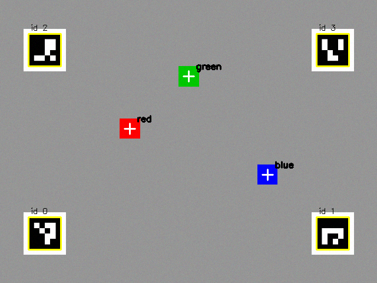

# Cameras, Perception, and Learning from Demonstration

## Summary

This chapter gives the arm eyes and experience. You will capture camera images with OpenCV, calibrate the camera, map pixels to arm coordinates, and then record demonstrations and train and evaluate an imitation policy with LeRobot. After this chapter, you will be able to find an object and reach for it, and describe how learned policies work.

## Concepts Covered

This chapter covers the following 31 concepts from the learning graph:

| Concept | Concept Impact Score |
|---------|-----------------------|
| Camera | 72 |
| USB Webcam | 70 |
| Image Frame | 69 |
| Recording Episodes | 60 |
| OpenCV Library | 36 |
| Imitation Learning | 36 |
| Demonstration Data | 21 |
| Dataset | 20 |
| Color Space | 17 |
| Camera Calibration | 17 |
| Color Thresholding | 16 |
| Contour Detection | 14 |
| Observation and Action | 14 |
| Object Centroid | 13 |
| Policy | 13 |
| LeRobot Library | 12 |
| Camera Extrinsics | 9 |
| Camera Intrinsics | 7 |
| Hand-Eye Calibration | 7 |
| Pixel-to-World Mapping | 6 |
| Object Detection | 6 |
| ACT Policy | 6 |
| GPU Training | 6 |
| Training a Policy | 5 |
| Training Loss | 2 |
| Evaluating a Policy | 2 |
| Replaying Motion | 1 |
| Fiducial Markers | 1 |
| Policy Failure Modes | 1 |
| Overfitting | 1 |
| Hugging Face Hub | 1 |

## Prerequisites

This chapter builds on concepts from:

- [Chapter 1: Setting Up Python for Robotics](../01-python-setup-for-robotics/index.md)
- [Chapter 2: Anatomy of a Robot Arm](../02-anatomy-of-a-robot-arm/index.md)
- [Chapter 11: Moving the Arm: Trajectories, Grippers, and Teleoperation](../11-moving-the-arm/index.md)
- [Chapter 12: Kinematics: Where Is the Hand and How Do I Get There](../12-kinematics/index.md)
- [Chapter 13: Logging, Testing, Simulation, and ROS 2](../13-logging-testing-simulation/index.md)

---

!!! mascot-welcome "Give Me Eyes!"
    { class="mascot-admonition-img" }
    So far I have been moving blind, to places that you typed in. In this chapter I get a camera, and you will teach me to find a block by its color and reach for it. Then I will learn the other way, by watching you do a task a few dozen times. Let's move it!

An arm with no sense of the world does what it is told, at the places it is told, and fails when anything moves. Two ideas change that, and they are the two halves of this chapter. The first is *perception* in the classical way: write code that looks at a camera image, finds the object, and works out where it is in the arm's coordinates, using the kinematics of Chapter 12 to aim the arm. Every step is a short, readable function that you can test, and it works with a handful of lines of OpenCV. The second is *learning from demonstration*: instead of writing the rules, you show the task to the arm a few dozen times, and a program learns a mapping from what the cameras and joints show to what the joints should do next. It is much more general, and much harder to inspect.

The chapter builds a complete chain in the lab, with no camera or arm needed. It draws a synthetic camera picture of a table with markers and colored blocks, finds a block, converts its position to metres, aims the arm with inverse kinematics, and runs the pick and place. It then records demonstrations into a dataset and trains a miniature policy on them, which shows overfitting and failure in a form you can measure. For the real thing, the chapter gives the LeRobot commands to record, train and evaluate a policy on a real SO-101.

## Cameras and Images

### The Camera

A **camera** turns light into numbers: a grid of tiny sensors measures the brightness of red, green and blue light, and the camera sends the grid to the computer many times a second. For a robot arm the camera plays the role of the eye, and where you put it matters as much as which one you buy. A camera fixed *above* the table sees the whole workspace from one view (an overhead or "eye-to-hand" camera), and a camera mounted on the *gripper* sees the object up close and moves with the hand (an "eye-in-hand" or wrist camera). LeRobot's tutorials use one or two fixed cameras, called `front` and `top` or `wrist`.

### USB Webcams and Frames

A **USB webcam** is the cheapest and simplest camera for this book. It plugs into the computer's USB port and appears to the operating system as a video device, which OpenCV can open by its index number: `cv2.VideoCapture(0)` is the first camera. Each call to `read()` returns one picture, called an **image frame**. A frame is a NumPy array (Chapter 12) of shape `(height, width, 3)`, with one number from 0 to 255 for each of the three color channels at each pixel. OpenCV orders the channels **blue, green, red**, and not red, green, blue, which is a famous source of swapped colors when a picture is shown by another library.

```python linenums="1"
import cv2

capture = cv2.VideoCapture(0)               # camera number 0
ok, frame = capture.read()                  # ok is False if no picture arrived
if ok:
    print(frame.shape, frame.dtype)         # for example (480, 640, 3) uint8
capture.release()
```

Two numbers set the cost of a camera: the *resolution* (pixels across and down) and the *frame rate* (pictures per second). A frame at 640 by 480 has 307,200 pixels, and at 1920 by 1080 it has 2,073,600, which is 6.75 times as many numbers to move and to process at every tick. LeRobot's camera documentation lists a tool, `lerobot-find-cameras opencv`, that prints the cameras it finds with their index, the backend that reads them and their default settings, and it warns that identifiers can change after a reboot or a re-plug, so look again when a camera stops working. Its examples use 640 by 480 at 30 frames per second for most recording. A camera must be asked for a resolution that it really supports, or LeRobot reports a mismatch between the picture it received and the size you configured. On a Mac the first use asks permission for the terminal to use the camera, in the system's privacy settings, and the exact steps depend on the system version.

!!! mascot-tip "Fix the Camera Down and Light the Scene"
    { class="mascot-admonition-img" }
    A camera that moves between recordings makes every calibration and every demonstration out of date. Clamp it, with tape if need be, and keep the lighting steady. LeRobot's own advice for a demonstration dataset is to keep the cameras fixed, and a rule of thumb is that you should be able to do the task yourself looking only at the camera image.

### The OpenCV Library

The **OpenCV library** (Open Source Computer Vision) is the standard toolbox for image work, with hundreds of functions for reading frames, changing colors, finding shapes, calibrating cameras and detecting markers. Its Python package is installed with `pip install opencv-python` and imported as `cv2`. A version note matters here. Version 5.0 of the package was released in July 2026, but its Python wheel did not include `cv2.calibrateHandEye`, which this chapter's hand-eye lab needs, while the 4.x line (4.14 was tested) has it. The lab therefore installs `opencv-python<5`. Use that pin, or check that the function exists with `hasattr(cv2, "calibrateHandEye")`, before building on version 5.

### Color Spaces and Color Thresholding

A **color space** is a way of writing a color as numbers. The BGR of a camera frame mixes three brightnesses, which is awkward for the question "is this pixel red?", since a dark red and a light red have very different numbers. The **HSV** color space separates the color itself from its strength: *hue* is the kind of color (red, yellow, green, blue), *saturation* is how strong or pale it is, and *value* is how bright. In OpenCV the hue runs from 0 to 179 (half of the usual 360 degrees, so that it fits in one byte), and saturation and value run from 0 to 255. With full saturation and value, pure red has a hue of 0, yellow 30, green 60 and blue 120. The conversion is one call: `cv2.cvtColor(frame, cv2.COLOR_BGR2HSV)`.

**Color thresholding** keeps the pixels that fall inside a range. `cv2.inRange(hsv, low, high)` returns a *mask*, an image that is 255 where the pixel is inside the range and 0 elsewhere. A range for green is hue 45 to 75, with saturation of at least 120 and value of at least 70, and the minimum saturation and value are what keep gray, white and dark pixels out. Red has a wrinkle, because the hue circle wraps around at 0: red sits at both the bottom (0 to 10) and the top (170 to 179) of the scale, so a red mask needs two ranges, joined with `|`. This is the most common bug in color code.

#### Diagram: HSV Color Classifier

<iframe src="../../sims/hsv-color-classifier/main.html" height="620px" width="100%" scrolling="no"></iframe>

[Run the HSV Color Classifier MicroSim fullscreen](../../sims/hsv-color-classifier/main.html){ .md-button .md-button--primary }

<details markdown="1">
<summary>HSV Color Classifier</summary>
Type: microsim
**sim-id:** hsv-color-classifier<br/>
**Library:** p5.js<br/>
**Status:** Specified<br/>
**Bloom Level:** Understand<br/>
**Bloom Verb:** classify<br/>
**Learning Objective:** The learner will classify eight pixels given as OpenCV HSV values as red, green, blue, or none of the three, according to the thresholds of the chapter, with at least 7 of 8 correct on the first attempt.

**Prerequisites:** color space, HSV, hue, saturation, value, color thresholding, the red wrap-around (all defined in the section "Color Spaces and Color Thresholding" above this block).

**Evidence of Mastery:** For each of eight pixels the learner chooses one of four classes and commits. A choice is correct when it matches the Class column in Content. Mastery is 7 of 8 correct on the first attempt. Changing the hue, saturation and value in Explore mode is exploration, not evidence.

**Misconceptions:** (1) Red is one range of hues. (It wraps around: 0 to 10 and 170 to 179.) (2) Any pixel with a blue hue is blue. (A pale or dark pixel is not inside the range.) (3) Hue alone decides the color. (Saturation and value must be high enough as well.)

**Instructional Rationale:** An Understand-level classify objective asks the learner to sort examples by a rule. Each pixel tests one clause of the rule (a wrap-around, a hue outside every range, low saturation, low value), so the learner must apply all three channels.

**Content:**

Explore mode shows a swatch for a hue, saturation and value that the learner sets, and says which of the three color ranges (if any) contains it.

| Quantity | Min | Max | Step | Default | Unit |
|---|---|---|---|---|---|
| Hue | 0 | 179 | 1 | 60 | OpenCV hue units |
| Saturation | 0 | 255 | 1 | 255 | none |
| Value | 0 | 255 | 1 | 255 | none |

The three ranges, each requiring saturation >= 120 and value >= 70: red is hue 0 to 10 or 170 to 179, green is hue 45 to 75, and blue is hue 100 to 130. The four classes: "Red", "Green", "Blue", "None of the three". Eight pixels in this fixed order:

| # | Pixel (H, S, V) | Class | Why (shown as feedback) |
|---|---|---|---|
| 1 | (5, 200, 200) | Red | Hue 5 is in 0 to 10, and saturation and value are high enough. |
| 2 | (175, 180, 150) | Red | Hue 175 is in 170 to 179, the part of red that wraps around. |
| 3 | (60, 255, 255) | Green | Hue 60 is inside 45 to 75. |
| 4 | (120, 200, 100) | Blue | Hue 120 is inside 100 to 130, and value 100 is at least 70. |
| 5 | (30, 255, 255) | None of the three | Hue 30 is yellow, which none of the three ranges contains. |
| 6 | (60, 40, 200) | None of the three | Saturation 40 is below 120: a pale, grayish pixel with a green hue. |
| 7 | (0, 255, 30) | None of the three | Value 30 is below 70: too dark to tell the color. |
| 8 | (110, 130, 90) | Blue | Hue 110 is in range, and saturation 130 and value 90 are above the minimums. |

**Provenance:** The ranges are those of the chapter's `COLOR_RANGES` table in the lab. The hue values for pure colors (red 0, yellow 30, green 60, blue 120) were checked with OpenCV 4.14 and 5.0. The pixels are illustrative and written for this sim.

**Rules:** A pixel is Red when (0 <= H <= 10 or 170 <= H <= 179) and S >= 120 and V >= 70. It is Green when 45 <= H <= 75 and S >= 120 and V >= 70. It is Blue when 100 <= H <= 130 and S >= 120 and V >= 70. Otherwise it is None of the three.

**Learner Activity:**

1. In Explore mode the learner changes the three channels and watches the swatch and the class. The learner should notice that moving the hue from 5 up to 175 passes through colors that are not red, and that reducing the saturation turns every hue gray.
2. The learner switches to the eight pixels. Pixel 1 is shown as a swatch with its HSV values.
3. The learner chooses a class and commits.
4. The sim shows whether the choice was correct and the Why text, then moves on. After pixel 8 it shows the score.

**Feedback:** Eight pixels, fixed order, one attempt each. Correct: "Correct: <class>. <Why>". Incorrect: "Not quite. This pixel is: <class>. <Why>". The correct class is revealed after each commit. A running count "Correct: n of 8" is shown and the final screen says whether mastery (7 of 8) was reached.

**Starting State:** Explore mode with hue 60, saturation 255 and value 255, showing a green swatch and the class "Green".

**Chapter Anchors:** The chapter states OpenCV hues run from 0 to 179, that pure red, yellow, green and blue have hues of 0, 30, 60 and 120, that red needs two ranges (0 to 10 and 170 to 179), and the minimum saturation of 120 and value of 70. The sim has eight pixels and mastery is 7 of 8.
</details>

### Contours, Centroids, and Object Detection

The mask shows *where* the color is, as a set of white shapes, and a program needs to know *which* shape is the block and *where its middle is*. **Contour detection** finds the outlines of the white regions: `cv2.findContours(mask, cv2.RETR_EXTERNAL, cv2.CHAIN_APPROX_SIMPLE)` returns one outline for each region, and `cv2.contourArea` measures its size in pixels. Keeping only contours above a minimum area throws away specks of noise, and a small clean-up step (`cv2.morphologyEx` with `MORPH_OPEN`) removes isolated noisy pixels before the contours are found.

The **object centroid** is the middle of a shape, the average position of its pixels. OpenCV computes it from the shape's *moments*: `M = cv2.moments(contour)`, and then the centroid is \( c_x = M_{10} / M_{00} \) and \( c_y = M_{01} / M_{00} \), where \( M_{00} \) is the area. Guard against \( M_{00} = 0 \), which an empty contour gives. The pixel position of the centroid, \( (u, v) \), is the program's answer to "where is the block in the picture".

**Object detection** is the general name for finding objects in a picture, and color blobs are its simplest form. They work when objects have distinct colors, the lighting is steady and nothing else is the same color, and they fail when any of those is untrue. The other approach is a *learned* detector, a neural network trained on thousands of labelled pictures to find objects by shape and texture. It copes with variety, needs far more data and computing, and is a tool for later; this chapter's color blobs teach the whole pipeline in a few lines.

### Fiducial Markers

A **fiducial marker** is a printed pattern designed to be found easily and measured exactly. The ArUco markers of OpenCV are small black-and-white square codes. Each carries a number in its pattern, and a detector returns the number and the pixel positions of the marker's four corners. A marker is a landmark with a known size, and a program that sees four of them at known places on the table can work out how pixels map to the table, which is the subject of the next section. OpenCV's `cv2.aruco.ArucoDetector` finds them, and `cv2.aruco.generateImageMarker` makes one to print. The detector's dictionary, such as `DICT_4X4_50` (4 by 4 bits, 50 distinct markers), must be the same one that made the marker.

## Seeing in the Arm's Coordinates

### Camera Intrinsics and the Pinhole Model

A picture gives pixels, and a robot needs metres. The first link is a model of the camera. The **pinhole model** treats the camera as a tiny hole through which light from a point in space at \( (X, Y, Z) \), measured in the camera's frame with Z pointing along the view, lands on the sensor at the pixel

\[ u = f_x \frac{X}{Z} + c_x, \qquad v = f_y \frac{Y}{Z} + c_y \]

The four numbers are the **camera intrinsics**: the focal lengths \( f_x \) and \( f_y \) in pixels (how strongly the lens magnifies) and the principal point \( (c_x, c_y) \) (where the middle of the lens lands on the sensor, usually near the centre of the picture). They are collected in a 3 by 3 matrix, and a real lens adds small *distortion* coefficients that bend straight lines near the edges. A worked example with \( f = 500 \), \( c_x = 320 \), \( c_y = 240 \): a point 0.10 m to the right and 0.50 m in front projects to \( u = 500 \times 0.10 / 0.50 + 320 = 420 \). The same point 1.0 m away would project to \( u = 370 \): farther things look smaller, because of the division by \( Z \).

#### Diagram: Pinhole Projection Calculator

<iframe src="../../sims/pinhole-projection-calculator/main.html" height="620px" width="100%" scrolling="no"></iframe>

[Run the Pinhole Projection Calculator MicroSim fullscreen](../../sims/pinhole-projection-calculator/main.html){ .md-button .md-button--primary }

<details markdown="1">
<summary>Pinhole Projection Calculator</summary>
Type: microsim
**sim-id:** pinhole-projection-calculator<br/>
**Library:** p5.js<br/>
**Status:** Specified<br/>
**Bloom Level:** Apply<br/>
**Bloom Verb:** calculate<br/>
**Learning Objective:** The learner will calculate the pixel position of a point, or the sideways distance of a point from its pixel and depth, using the pinhole camera model with fx = fy = 500 and the principal point (320, 240), for six problems, to within the tolerance shown, with at least 5 of 6 correct on the first attempt.

**Prerequisites:** camera intrinsics, focal length, principal point, pinhole model, pixel (all defined in the section "Camera Intrinsics and the Pinhole Model" above this block).

**Evidence of Mastery:** For each of six problems the learner types a number in the unit shown and commits. An answer is correct when it is within the tolerance in the Tolerance column of Content. Mastery is 5 of 6 correct on the first attempt. Moving the point in Explore mode is exploration, not evidence.

**Misconceptions:** (1) A point twice as far away has twice the pixel offset. (It has half the offset, because of the division by depth.) (2) The pixel (0, 0) is the middle of the picture. (The middle is the principal point, at (320, 240) here.) (3) Pixels and metres are the same scale everywhere. (The scale depends on the depth.)

**Instructional Rationale:** An Apply-level calculate objective needs repeated use of a formula on new numbers with an immediate check. A problem that runs the formula backward from a pixel to a distance shows that depth is needed to recover a position.

**Content:**

Explore mode shows a point in front of a pinhole camera and the pixel where it lands, with X, Y and Z set by the learner.

| Quantity | Min | Max | Step | Default | Unit |
|---|---|---|---|---|---|
| X (right of the view axis) | -0.50 | 0.50 | 0.01 | 0.10 | m |
| Y (below the view axis) | -0.50 | 0.50 | 0.01 | 0.05 | m |
| Z (depth, along the view) | 0.10 | 2.00 | 0.01 | 0.50 | m |

Formulas: u = 500 x X / Z + 320 and v = 500 x Y / Z + 240. Six problems in this fixed order:

| # | Problem | Asked | Correct | Tolerance | Why (shown as feedback) |
|---|---|---|---|---|---|
| 1 | X = 0.10 m, Y = 0.00 m, Z = 0.50 m | u (pixels) | 420 | 1 | u = 500 x 0.10 / 0.50 + 320 = 420. |
| 2 | X = 0.10 m, Y = 0.05 m, Z = 0.50 m | v (pixels) | 290 | 1 | v = 500 x 0.05 / 0.50 + 240 = 290. |
| 3 | X = -0.05 m, Y = 0.00 m, Z = 0.25 m | u (pixels) | 220 | 1 | u = 500 x (-0.05) / 0.25 + 320 = 220. |
| 4 | X = 0.00 m, Y = 0.06 m, Z = 0.30 m | v (pixels) | 340 | 1 | v = 500 x 0.06 / 0.30 + 240 = 340. |
| 5 | X = 0.20 m, Y = 0.00 m, Z = 1.00 m | u (pixels) | 420 | 1 | u = 500 x 0.20 / 1.00 + 320 = 420: a farther point has a smaller offset from the centre. |
| 6 | A point seen at u = 520 at depth Z = 0.50 m. What is X? | X (metres) | 0.200 | 0.001 | X = (u - 320) x Z / 500 = 200 x 0.50 / 500 = 0.200 m. |

**Provenance:** The formula is from the chapter section "Camera Intrinsics and the Pinhole Model". The camera (fx = fy = 500, principal point (320, 240)) is the synthetic camera of the lab. The problems are illustrative and written for this sim.

**Rules:** u = fx X / Z + cx and v = fy Y / Z + cy, with fx = fy = 500, cx = 320 and cy = 240. The inverse is X = (u - cx) Z / fx. An answer is correct when |typed - correct| <= the tolerance.

**Learner Activity:**

1. In Explore mode the learner changes X, Y and Z and watches the pixel move. The learner should notice that doubling Z halves the distance of the pixel from the centre.
2. The learner switches to the six problems. Problem 1 is shown.
3. The learner types a number and presses Check to commit.
4. The sim shows whether the answer was correct, the working and the Why text, then moves on. After problem 6 it shows the score.

**Feedback:** Six problems, fixed order, one attempt each. Correct: "Correct: <value> <unit>. <Why>". Incorrect: "Not quite. The answer is <value> <unit>. <Why>". The correct value is revealed after each commit. A running count "Correct: n of 6" is shown and the final screen says whether mastery (5 of 6) was reached.

**Starting State:** Explore mode with X = 0.10, Y = 0.05 and Z = 0.50, showing the pixel (420, 290).

**Chapter Anchors:** The chapter's worked example is f = 500, centre (320, 240), X = 0.10 m and Z = 0.50 m, which gives u = 420, and the same point at 1.0 m gives u = 370. The sim has six problems and mastery is 5 of 6.
</details>

### Camera Calibration and Extrinsics

**Camera calibration** is finding a camera's intrinsics, and its distortion, from pictures. The standard method photographs a printed chessboard from many angles. OpenCV finds the inner corners in each picture (`cv2.findChessboardCorners`), refines them to a fraction of a pixel (`cv2.cornerSubPix`), and then `cv2.calibrateCamera` solves for the intrinsic matrix, the distortion coefficients, and for each picture the board's position. It also reports an RMS *reprojection error*, the typical distance in pixels between where the model says the corners should be and where they were found, and a value below about half a pixel is good.

The **camera extrinsics** are the camera's position and orientation in the world: a rotation \( R \) and a translation \( t \) that carry a point from the world's frame into the camera's frame (Chapter 12's transforms again). The intrinsics are a property of the camera and its lens, and they stay the same wherever the camera is put. The extrinsics are a property of where it is mounted, and they change whenever you move it. Calibration gives both for each picture of the board.

### Pixel-to-World Mapping

**Pixel-to-world mapping** is the step that turns a pixel into a position on the table. For points on a *flat* surface, such as a table, there is a neat shortcut: a single 3 by 3 matrix called a *homography* maps table coordinates \( (x, y) \) to pixels, and its inverse maps pixels back to the table. You find it with `cv2.findHomography` from pairs of known points, and the ArUco markers supply them. If four markers sit at known places on the table, each marker's four detected corners (in pixels) pair with its four known corners (in metres), which gives 16 pairs, more than the minimum of four, so the fit averages out noise.

Then the whole chain from the picture to the arm is short. Find the block's centroid in pixels, convert it with the homography to \( (x, y) \) in the base frame, set \( z \) to the block's height, and call the inverse kinematics of Chapter 12. The only assumption is that the block sits on the plane of the table, which is what makes one picture enough. The lab does this on a synthetic image, whose camera is perfect, so its errors are a fraction of a millimetre. A real camera has lens distortion, a blurred edge, and imperfect calibration, and errors of millimetres or more are normal, so measure your own with a ruler.

### Hand-Eye Calibration

**Hand-eye calibration** is needed when the camera is mounted on the arm and not fixed to the room. A camera on the gripper sees the target in *its* frame, and the arm needs it in the *base* frame. To convert, the program must know exactly where the camera sits relative to the gripper: a fixed transform \( X \), unknown and measured only by calibration. The method takes several poses of the arm (from forward kinematics) and the matching views of a fixed target (from the camera). It then solves an equation of the form \( A X = X B \) for the unknown \( X \), where \( A \) is how the gripper moved between two poses and \( B \) is how the camera saw the target move. OpenCV's `cv2.calibrateHandEye` does it, with the arm's gripper-to-base transforms and the target-to-camera transforms as inputs. The poses must turn the camera about at least two different axes, or the answer is undetermined.

The lab simulates it. It places a camera with a known mount on the gripper of the SO-101, generates the target views that such a camera would see at eight arm poses, and recovers the mount. With exact measurements the error is zero. With 2 mm of noise in each view of the target, eight poses recover the mount's position to a mean error of 2.8 mm, and only three poses give 6.1 mm, so more varied poses give a better answer.

!!! mascot-encourage "Calibration Math Looks Heavy, but the Idea Is Small"
    { class="mascot-admonition-img" }
    Intrinsics, extrinsics and hand-eye can feel like a heap of matrices, and that is normal. Keep one sentence for each: intrinsics are the camera's own numbers, extrinsics are where the camera is, and hand-eye is where it sits on the arm. Each has one library function, and the lab checks each against a truth that you set yourself.

## Learning from Demonstration

### Imitation Learning, Demonstrations, and Policies

**Imitation learning** teaches a robot by example. A person does the task (a *demonstration*), the robot records what it saw and what was done, and a program learns to produce the same actions in the same situations. The alternative is to write the rules by hand, as you did in Chapter 11. Imitation learning wins when the rules are hard to write, such as picking up a soft or oddly shaped object from a cluttered table, and it loses when you need to know exactly why the arm did what it did.

The learned program is a **policy**: a function that takes the current **observation** (what the robot senses: the joint positions and the camera pictures) and returns an **action** (what to do next: the target joint positions). **Observation and action** are the two halves of every row in the training data. In LeRobot for the SO-101, the observation holds the six joint positions, named `shoulder_pan.pos` through `gripper.pos`, and each camera's picture, and the action is the six target positions that the leader arm had at that moment. Teleoperation of Chapter 11 is therefore also the way to *collect* the data: you move the leader, the follower copies, and the program records both.

**Demonstration data** is the collection of those recordings. Its quality is the quality of the policy, and the same few rules appear in every guide. Keep the cameras fixed. Make sure the object is visible in the camera. Grasp the same way each time. Start with simple variation (the object in a few different places) and add more only when the policy is reliable.

!!! mascot-thinking "A Policy Is a Function Learned from Examples"
    { class="mascot-admonition-img" }
    Everything you wrote in Chapters 10 to 12 maps inputs to outputs by rules that you chose. A policy maps observations to actions by rules that the computer *found* in the data. It is the same kind of object, a function, and so it can be tested the same way: give it observations and check the actions that come out.

### Recording Episodes and Datasets

**Recording episodes** is the collection step. An *episode* is one attempt at the task, from the start to the finish, recorded at a fixed number of frames per second. A **dataset** is the set of episodes, stored in a standard layout. LeRobot's dataset format (version 3.0 in the release read) keeps the numbers (observation state, action, time stamps, episode and frame indices) in Parquet files under `data/`, the camera pictures as MP4 video under `videos/`, and the description (frame rate, the features and their shapes, the totals, statistics) in JSON files under `meta/`. A dataset must be *finalized* at the end of recording, or its files are corrupt, and the record command does it for you. The default place for a dataset on your computer is `~/.cache/huggingface/lerobot/` plus the repository name.

The command is `lerobot-record`. This is the form given in LeRobot's documentation, with the leader and follower of Chapter 8, a camera named `front`, and a dataset named under your Hugging Face user name:

```bash
lerobot-record \
    --robot.type=so101_follower \
    --robot.port=/dev/tty.usbmodem585A0076841 \
    --robot.id=my_awesome_follower_arm \
    --robot.cameras="{ front: {type: opencv, index_or_path: 0, width: 1920, height: 1080, fps: 30}}" \
    --teleop.type=so101_leader \
    --teleop.port=/dev/tty.usbmodem58760431551 \
    --teleop.id=my_awesome_leader_arm \
    --display_data=true \
    --dataset.repo_id=${HF_USER}/record-test \
    --dataset.num_episodes=5 \
    --dataset.single_task="Grab the black cube" \
    --dataset.streaming_encoding=true \
    --dataset.encoder_threads=2
```

The `--robot.id` and `--teleop.id` select the calibration files of Chapter 8, so use the same ids every time. `--dataset.single_task` is the sentence that describes the task, stored with every frame. By default each episode lasts up to 60 seconds, followed by a 60-second reset period in which you put the scene back, and the default is 50 episodes. While recording, the right arrow (or `n`) ends the current episode or reset early, the left arrow (or `r`) cancels the episode and records it again, and Escape (or `q`) stops the session, encodes the videos and uploads. On a Mac without accessibility permission, the keys are read from the terminal, so keep the terminal in front. The command also prints the loop's real rate against the target ("29.88 Hz versus 30 Hz") and the dataset takes its time stamps from the frame numbers. A loop that cannot keep up therefore produces a dataset whose motion plays back too fast. Chapter 11's rule applies: watch the cadence report.

The documentation's advice for the first dataset is to record at least 50 episodes, with 10 episodes at each location of the object, to keep the grasp consistent, and to add variation only after the policy works. The `lerobot-replay` command sends one recorded episode's actions to the follower again, which is **replaying motion**. It is the quickest test that the recording is faithful: if the replay does not do the task, no policy trained on it will.

```bash
lerobot-replay \
    --robot.type=so101_follower \
    --robot.port=/dev/tty.usbmodem58760431541 \
    --robot.id=my_awesome_follower_arm \
    --dataset.repo_id=${HF_USER}/record-test \
    --dataset.episode=0
```

### The LeRobot Library and the Hugging Face Hub

The **LeRobot library** is Hugging Face's open-source toolkit for robot learning, and you have used its parts since Chapter 4: the motor bus, the calibration, teleoperation. It adds datasets, policies, training and evaluation. The release read for this book was version 0.6.1 of 3 August 2026 (the development branch was 0.6.2), and it needs Python 3.12 or newer. Install it from source, in a clean environment, with the extras for the scripts and for training:

```bash
conda create -y -n lerobot python=3.12
conda activate lerobot
git clone https://github.com/huggingface/lerobot.git
cd lerobot
pip install -e ".[core_scripts]"
pip install -e ".[training]"
```

The **Hugging Face Hub** is a website that stores models and datasets, with version history, and LeRobot uses it to share them. A dataset's `repo_id` is `your-user-name/dataset-name`, and recording uploads to the Hub by default (turn that off with `--dataset.push_to_hub=False`). You sign in once with a token that has write access, made at the Hub's settings page, using `hf auth login`. The Hub is public unless you mark a dataset private, so do not put anything in a dataset that you would not show to the world, and remember that a camera sees whatever is in front of it.

### Training, ACT, and the GPU

**Training a policy** is the step in which the computer finds the function. The program takes a batch of frames from the dataset, asks the policy for the action, compares it with the recorded action, and adjusts the policy's numbers to shrink the difference, many thousands of times. The size of the difference, averaged over a batch, is the **training loss**, and a healthy training run shows it falling. The lab shows this with a small policy: the loss starts at 1,812 and falls to 20 within 500 steps. LeRobot prints the loss every 200 steps by default.

The **ACT policy** (Action Chunking with Transformers) is the policy that LeRobot's documentation recommends first. It comes from a 2023 paper by Tony Zhao and colleagues, *Learning Fine-Grained Bimanual Manipulation with Low-Cost Hardware*, which reported 80 to 90 percent success on six real-world tasks from about ten minutes of demonstrations, on a hardware system (ALOHA) built for under $20,000. Its key idea is *action chunking*. Instead of predicting one action at a time, the policy predicts a *chunk* of the next \( k \) actions (100 by default) in one go. That shortens the number of decisions in a task, and so the chance for small errors to pile up. Its network has a ResNet-18 to read the pictures and a transformer to turn pictures and joint positions into the chunk, and about 80 million numbers to learn.

Training the ACT policy is one command. The defaults in LeRobot are 100,000 steps with a batch of 8, a saved checkpoint every 20,000 steps, and a log line every 200:

```bash
lerobot-train \
  --dataset.repo_id=${HF_USER}/record-test \
  --policy.type=act \
  --output_dir=outputs/train/act_so101_test \
  --job_name=act_so101_test \
  --policy.device=cuda \
  --wandb.enable=true \
  --policy.repo_id=${HF_USER}/my_policy
```

**GPU training** matters because the network is large and the arithmetic is the kind that a graphics processor does well. The documentation says training takes "several hours" for 100,000 steps on one GPU, without naming a model of GPU, and offers `--policy.device=mps` for Apple silicon, which works but is slower. Without a GPU, the documentation points to a Google Colab notebook for ACT and to renting a GPU through Hugging Face (`--job.target=a10g-small`, pay-as-you-go, with a default cap of two days). Checkpoints are saved under the output folder, in `checkpoints/`, with a `last` link to the newest. Treat the training time as a rough guide and measure your own.

### Evaluating a Policy, Overfitting, and Failure Modes

**Evaluating a policy** means running it on the arm, and counting. The current tool is `lerobot-rollout`. Older tutorials use `lerobot-record --policy.path=...`, which no longer works that way: `lerobot-record` is now for data collection only, and it refuses dataset names that begin with `eval_`, a prefix reserved for evaluation. This is the form in the ACT documentation:

```bash
lerobot-rollout \
  --strategy.type=base \
  --policy.path=${HF_USER}/act_policy \
  --robot.type=so101_follower \
  --robot.port=/dev/ttyACM0 \
  --robot.cameras="{ front: {type: opencv, index_or_path: 0, width: 640, height: 480, fps: 30}}" \
  --display_data=true \
  --task="Your task description" \
  --duration=60
```

The `base` strategy runs the policy with no recording, and others record the runs, for example `sentry` with a dataset whose name starts with `eval_`. Count the successes over many trials, as Chapter 13's success rate: a policy that succeeds on 8 of 10 tries is not the same as one that succeeds on 80 of 100, and ten trials is too few to tell a good policy from a lucky one.

**Overfitting** is when a policy learns the *noise* in the demonstrations and not the task. It does very well on the examples that it trained on, and badly on a new one. The lab shows it with the same 12 demonstrations. A simple policy leaves a training loss of 20 and puts the tip 11.7 mm from new blocks. A flexible one drives the training loss to zero by copying the jitter in the demonstrations, and then does *worse* on new blocks, at 14.9 mm. The cure is more data (with 60 demonstrations the flexible policy gets down to 5.6 mm) and enough variety in them.

**Policy failure modes** are the characteristic ways that a learned policy goes wrong, and they are worth knowing before you see them on a real arm. The first is running outside the situations that it saw: in the lab, blocks beyond the demonstrated region give errors of about 400 mm, because a flexible function extrapolates wildly. Others are a policy that freezes or loops in a situation that looks like several demonstrations at once, a policy that fails when the lighting or the camera has moved, and one that does well on the first try and degrades as small errors accumulate along the task. In each case the remedy is in the *data*: more episodes in the weak situations, steadier cameras, and recordings that are consistent. And in each case the safety layers of Chapters 15 to 17 apply to a learned policy exactly as they do to a script. A policy is a program that nobody wrote, and the limits in `Arm.move_to` still stand between it and the hardware.

!!! mascot-warning "A Policy Does Not Know Its Limits"
    { class="mascot-admonition-img" }
    A policy can output any numbers, including joint angles beyond the limits, a grasp force that burns out the gripper, or a motion that hits the table. Run every learned action through the same limit checks and step limits as a hand-written one, keep a hand near the E-stop for the first runs, and start with a slow speed.

The next MicroSim practises the judgement that every dataset needs: which episodes to keep.

#### Diagram: Demo Episode Judge

<iframe src="../../sims/demo-episode-judge/main.html" height="620px" width="100%" scrolling="no"></iframe>

[Run the Demo Episode Judge MicroSim fullscreen](../../sims/demo-episode-judge/main.html){ .md-button .md-button--primary }

<details markdown="1">
<summary>Demo Episode Judge</summary>
Type: microsim
**sim-id:** demo-episode-judge<br/>
**Library:** p5.js<br/>
**Status:** Specified<br/>
**Bloom Level:** Evaluate<br/>
**Bloom Verb:** judge<br/>
**Learning Objective:** The learner will judge eight described demonstration episodes as worth keeping or needing to be re-recorded, using the data-collection guidance of the chapter, with at least 7 of 8 correct on the first attempt.

**Prerequisites:** demonstration data, episode, dataset, observation and action, the data-collection guidance (all defined in the section "Imitation Learning, Demonstrations, and Policies" and "Recording Episodes and Datasets" above this block).

**Evidence of Mastery:** For each of eight episodes the learner chooses Keep or Re-record and commits. A choice is correct when it matches the Verdict column in Content. Mastery is 7 of 8 correct on the first attempt. Reading the guidance list in Explore mode is exploration, not evidence.

**Misconceptions:** (1) More variety in every episode is always better. (Variety should be added only after the policy is reliable, and not too fast.) (2) A bad episode can stay because the policy will average it out. (A policy copies inconsistent behaviour.) (3) The camera can be moved between episodes. (The cameras must stay fixed.)

**Instructional Rationale:** An Evaluate-level judge objective asks the learner to decide against criteria and justify the decision. Each episode breaks, or keeps, exactly one of the guidance rules, so the learner must match a described situation to a rule.

**Content:**

The guidance rules the learner can read in Explore mode: keep the cameras fixed; the object must be visible in the camera; grasp consistently; use a few planned locations (about 10 episodes per location) and add variation only after the policy is reliable; cancel and re-record an episode that goes wrong. The two verdicts: "Keep" and "Re-record". Eight episodes in this fixed order:

| # | Episode description | Verdict | Why (shown as feedback) |
|---|---|---|---|
| 1 | The block is visible in the front camera throughout, and the grasp matches the other episodes. | Keep | It follows every guidance rule. |
| 2 | The leader arm and the operator's hand cover the block in the camera for half of the episode. | Re-record | The object must be visible in the camera, and a policy cannot learn from what it cannot see. |
| 3 | The camera was knocked halfway through and now shows a different part of the table. | Re-record | The cameras must stay fixed, or the same pixels mean different places. |
| 4 | The operator grasped the block from the side in this episode and from above in the other 49. | Re-record | The grasp should be consistent, and a policy will copy the inconsistency. |
| 5 | The block is in a different spot from the previous episode, one of the five planned locations. | Keep | Planned variation in the object's location is the right kind of variety. |
| 6 | The operator dropped the block and pressed the left arrow to cancel. | Re-record | The left arrow cancels the episode and records it again, which is the right response to a failed attempt. |
| 7 | A first-day dataset where every episode uses a new location, a new grasp style and a new camera angle. | Re-record | Variation should be added slowly and only after the policy is reliable, so plan fewer changes. |
| 8 | The block is clearly visible, and the operator completes the task in one smooth motion within the time limit. | Keep | It is a clean, consistent demonstration. |

**Provenance:** The rules are from LeRobot's imitation-learning guide (`il_robots.mdx`, read on 2026-10-07), as summarized in the chapter section "Imitation Learning, Demonstrations, and Policies". The episodes are illustrative and written for this sim.

**Rules:** Each episode has exactly one correct verdict. An episode that breaks any guidance rule is "Re-record", and one that breaks none is "Keep".

**Learner Activity:**

1. In Explore mode the learner reads the guidance rules.
2. The learner switches to the eight episodes. Episode 1 is shown.
3. The learner chooses a verdict and commits.
4. The sim shows whether the choice was correct and the Why text, then moves on. After episode 8 it shows the score.

**Feedback:** Eight episodes, fixed order, one attempt each. Correct: "Correct: <verdict>. <Why>". Incorrect: "Not quite. The verdict is: <verdict>. <Why>". The correct verdict is revealed after each commit. A running count "Correct: n of 8" is shown and the final screen says whether mastery (7 of 8) was reached.

**Starting State:** Explore mode with the guidance rules listed and the prompt "Would you keep this episode?" ready for the first episode.

**Chapter Anchors:** The chapter states the advice to record at least 50 episodes with 10 episodes per location, to keep cameras fixed, to keep the object visible, to grasp consistently, and that the left arrow cancels and re-records an episode. The sim has eight episodes and mastery is 7 of 8.
</details>

## Lab: See, Aim, Record, and Learn

In this lab you will do the whole chain on your computer with no camera or arm. A program draws a synthetic overhead camera picture of a table, finds blocks and markers, converts a block's pixel to table coordinates, aims the arm with inverse kinematics, and picks it up. Then it calibrates a camera and a hand-eye mount, records a dataset of demonstrations, and trains a miniature policy. The new libraries are OpenCV and, again, NumPy. You will extend the `arm-lab` project.

**Step 1. Activate the project and install OpenCV.** The pin keeps the 4.x line, which has `calibrateHandEye`.

```bash
cd ~/projects/arm-lab
source .venv/bin/activate
python -m pip install "opencv-python<5"
git status
```

**Step 2. Write the vision module.** It holds a *synthetic camera*, so that you can test everything without a camera and check every answer against a truth that you know. The camera is 0.45 m above the point (0.20, 0) on the table, looking down, with image up equal to the base frame's forward direction. `table_homography` builds the 3 by 3 matrix from the camera's intrinsics and extrinsics, and `render_scene` uses it to draw four ArUco markers and colored square blocks on a gray, noisy table. `find_blobs` is color thresholding, contours and centroids, with the two red ranges. `detect_markers` finds the markers, `pixel_to_world_matrix` fits the homography from their corners, and `pixel_to_world` applies it. Create `armlab/vision.py`:

```python linenums="1"
"""Seeing with OpenCV: a synthetic overhead camera, color blobs, markers, and pixel-to-world mapping."""

import cv2
import numpy as np

WIDTH, HEIGHT = 640, 480
K_TRUE = np.array([[500.0, 0.0, 320.0],
                   [0.0, 500.0, 240.0],
                   [0.0, 0.0, 1.0]])                  # the camera's intrinsic matrix: focal length 500 px
# An overhead camera 0.45 m above the point (0.20, 0.0) on the table, image up = world +x, image right = world -y.
R_TRUE = np.array([[0.0, -1.0, 0.0],
                   [-1.0, 0.0, 0.0],
                   [0.0, 0.0, -1.0]])                 # rotation from world axes to camera axes
T_TRUE = np.array([0.0, 0.20, 0.45])                  # translation: where the world origin is, in camera axes
MARKER_DICT = cv2.aruco.getPredefinedDictionary(cv2.aruco.DICT_4X4_50)
MARKER_SIZE = 0.05                                    # metres
# Four markers on the table: id -> centre (x, y) in metres in the arm's base frame.
MARKER_CENTRES = {0: (0.06, 0.22), 1: (0.06, -0.22), 2: (0.34, 0.22), 3: (0.34, -0.22)}


def table_homography(K=K_TRUE, R=R_TRUE, t=T_TRUE):
    """The 3 x 3 matrix that maps a point (x, y, 1) on the table plane z = 0 to a pixel (u, v, 1) times a scale."""
    return K @ np.column_stack([R[:, 0], R[:, 1], t])


def to_pixels(H, points_xy):
    """Map table points (x, y) in metres to pixels with a homography, as an array of shape (n, 2)."""
    points = np.asarray(points_xy, dtype=float).reshape(-1, 2)
    homogeneous = np.column_stack([points, np.ones(len(points))]) @ H.T
    return homogeneous[:, :2] / homogeneous[:, 2:3]


def marker_world_corners(centre, size=MARKER_SIZE):
    """World corners of a marker in the order OpenCV reports them: top-left, top-right, bottom-right, bottom-left."""
    cx, cy = centre
    h = size / 2
    return np.array([[cx + h, cy + h], [cx + h, cy - h], [cx - h, cy - h], [cx - h, cy + h]])


def render_scene(blocks, seed=1):
    """Draw the table as the camera sees it: gray, noisy, four markers, and square colored blocks.

    blocks is a list of (color in BGR, centre (x, y) in metres, side in metres).
    """
    H = table_homography()
    rng = np.random.default_rng(seed)
    image = np.full((HEIGHT, WIDTH, 3), 150, dtype=np.uint8)
    for marker_id, centre in MARKER_CENTRES.items():
        pad, size = 30, 200
        tag = cv2.aruco.generateImageMarker(MARKER_DICT, marker_id, size)
        tag = cv2.copyMakeBorder(tag, pad, pad, pad, pad, cv2.BORDER_CONSTANT, value=255)
        source = np.float32([[pad, pad], [pad + size, pad], [pad + size, pad + size], [pad, pad + size]])
        destination = np.float32(to_pixels(H, marker_world_corners(centre)))
        warp = cv2.getPerspectiveTransform(source, destination)
        painted = cv2.warpPerspective(cv2.cvtColor(tag, cv2.COLOR_GRAY2BGR), warp, (WIDTH, HEIGHT))
        mask = cv2.warpPerspective(np.full(tag.shape, 255, np.uint8), warp, (WIDTH, HEIGHT)) > 0
        image[mask] = painted[mask]
    for color, (cx, cy), side in blocks:
        h = side / 2
        corners = to_pixels(H, [[cx + h, cy + h], [cx + h, cy - h], [cx - h, cy - h], [cx - h, cy + h]])
        cv2.fillPoly(image, [np.round(corners).astype(np.int32)], color)
    noise = rng.normal(0, 4, image.shape)
    return np.clip(image + noise, 0, 255).astype(np.uint8)


# Hue ranges in OpenCV's HSV, where hue runs from 0 to 179. Red wraps around 0, so it needs two ranges.
COLOR_RANGES = {"red": [((0, 120, 70), (10, 255, 255)), ((170, 120, 70), (179, 255, 255))],
                 "green": [((45, 120, 70), (75, 255, 255))],
                 "blue": [((100, 120, 70), (130, 255, 255))]}


def find_blobs(image_bgr, color, min_area=100):
    """Find regions of one color. Returns a list of (centroid (u, v), area in pixels), largest first."""
    hsv = cv2.cvtColor(image_bgr, cv2.COLOR_BGR2HSV)
    mask = np.zeros(hsv.shape[:2], dtype=np.uint8)
    for low, high in COLOR_RANGES[color]:
        mask |= cv2.inRange(hsv, np.array(low), np.array(high))
    mask = cv2.morphologyEx(mask, cv2.MORPH_OPEN, np.ones((3, 3), np.uint8))       # remove specks of noise
    contours, _ = cv2.findContours(mask, cv2.RETR_EXTERNAL, cv2.CHAIN_APPROX_SIMPLE)
    blobs = []
    for contour in contours:
        area = cv2.contourArea(contour)
        moments = cv2.moments(contour)
        if area >= min_area and moments["m00"] > 0:
            blobs.append(((moments["m10"] / moments["m00"], moments["m01"] / moments["m00"]), area))
    return sorted(blobs, key=lambda blob: -blob[1])


def detect_markers(image_bgr):
    """Find the ArUco markers. Returns {marker id: 4 x 2 array of corner pixels}."""
    detector = cv2.aruco.ArucoDetector(MARKER_DICT, cv2.aruco.DetectorParameters())
    corners, ids, _ = detector.detectMarkers(image_bgr)
    return {} if ids is None else {int(i): c.reshape(4, 2) for i, c in zip(ids.ravel(), corners)}


def pixel_to_world_matrix(detections):
    """Fit the homography from pixels to table coordinates (x, y) in metres, using the markers' corners."""
    pixels = np.vstack([detections[i] for i in sorted(detections)])
    world = np.vstack([marker_world_corners(MARKER_CENTRES[i]) for i in sorted(detections)])
    matrix, _ = cv2.findHomography(pixels, world)
    return matrix


def pixel_to_world(matrix, pixel):
    """Convert a pixel (u, v) to table coordinates (x, y) in metres."""
    x, y, w = matrix @ np.array([pixel[0], pixel[1], 1.0])
    return np.array([x / w, y / w])
```

**Step 3. Find the blocks.** The script draws a red, a blue and a green block at known positions, finds each by color, finds the four markers, and converts each centroid to table coordinates. The numbers in the last column are measured against the truth that the script used to draw the picture. Create `vision_demo.py`:

```python linenums="1"
"""Find colored blocks in a synthetic camera image, find the markers, and turn pixels into table coordinates."""

from pathlib import Path

import cv2
import numpy as np

from armlab.vision import detect_markers, find_blobs, pixel_to_world, pixel_to_world_matrix, render_scene

BLOCKS = [((0, 0, 255), (0.22, 0.09), 0.03), ((255, 0, 0), (0.15, -0.12), 0.03), ((0, 200, 0), (0.30, 0.0), 0.03)]
TRUTH = {"red": (0.22, 0.09), "blue": (0.15, -0.12), "green": (0.30, 0.0)}      # BGR colors above

image = render_scene(BLOCKS)
print(f"1. The image is a NumPy array of shape {image.shape} and type {image.dtype}")
print(f"   the pixel at row 240, column 320 (BGR) is {image[240, 320]}")

print("2. Color thresholding and centroids")
blobs = {color: find_blobs(image, color) for color in TRUTH}
for color, found in blobs.items():
    (u, v), area = found[0]
    print(f"   {color:<5} blob: {len(found)} found, centroid ({u:6.1f}, {v:6.1f}) px, area {area:.0f} px")

print("3. Markers and the pixel-to-world map")
detections = detect_markers(image)
print(f"   markers found: {sorted(detections)}")
matrix = pixel_to_world_matrix(detections)
for color, found in blobs.items():
    x, y = pixel_to_world(matrix, found[0][0])
    tx, ty = TRUTH[color]
    print(f"   {color:<5} estimated ({x:.3f}, {round(y, 3) + 0.0:+.3f}) m, true ({tx:.3f}, {ty:+.3f}) m, "
          f"error {1000 * np.hypot(x - tx, y - ty):.1f} mm")

Path("plots").mkdir(exist_ok=True)
annotated = image.copy()
for color, found in blobs.items():
    u, v = found[0][0]
    cv2.drawMarker(annotated, (round(u), round(v)), (255, 255, 255), cv2.MARKER_CROSS, 18, 2)
    cv2.putText(annotated, color, (round(u) + 12, round(v) - 12), cv2.FONT_HERSHEY_SIMPLEX, 0.5, (0, 0, 0), 2)
for marker_id, corners in detections.items():
    cv2.polylines(annotated, [corners.astype(np.int32)], True, (0, 255, 255), 2)
    cv2.putText(annotated, f"id {marker_id}", tuple(corners[0].astype(int) + [4, -6]), cv2.FONT_HERSHEY_SIMPLEX,
                0.45, (0, 0, 0), 1)
cv2.imwrite("plots/scene.png", annotated)
print("4. Saved plots/scene.png with the detections drawn on it")
```

```bash
python vision_demo.py
```

```text
1. The image is a NumPy array of shape (480, 640, 3) and type uint8
   the pixel at row 240, column 320 (BGR) is [151 153 144]
2. Color thresholding and centroids
   red   blob: 1 found, centroid ( 220.0,  217.5) px, area 1122 px
   blue  blob: 1 found, centroid ( 453.5,  295.5) px, area 1089 px
   green blob: 1 found, centroid ( 320.0,  129.0) px, area 1156 px
3. Markers and the pixel-to-world map
   markers found: [0, 1, 2, 3]
   red   estimated (0.220, +0.090) m, true (0.220, +0.090) m, error 0.3 mm
   blue  estimated (0.150, -0.120) m, true (0.150, -0.120) m, error 0.1 mm
   green estimated (0.300, +0.000) m, true (0.300, +0.000) m, error 0.0 mm
4. Saved plots/scene.png with the detections drawn on it
```

The pixel at the middle of the picture is gray, as it should be, since the table is gray there. Each color gave exactly one blob, and the four markers were found, so the map from pixels to the table has 16 pairs of points. The block positions come out within a third of a millimetre, because this camera is perfect: a real one will not be, and its errors are the reason to calibrate it. The script also saved `plots/scene.png`, the picture below, with the detections drawn on it.



**Step 4. Calibrate a camera.** The script draws 15 pictures of a chessboard from random positions with the true camera, then runs the standard OpenCV calibration on them and checks the result against the intrinsics that drew them. Create `calib_demo.py`:

```python linenums="1"
"""Calibrate a camera from chessboard pictures. The pictures are drawn by the program from a known camera,
so the answer can be checked against the truth."""

import cv2
import numpy as np

from armlab.vision import HEIGHT, K_TRUE, WIDTH

PATTERN = (9, 6)                       # inner corners of the chessboard
SQUARE = 0.025                         # 25 mm squares
SQUARE_PX = 40                         # pixels per square in the flat picture of the board

# A flat picture of the board with a white border of one square.
board = np.full(((PATTERN[1] + 3) * SQUARE_PX, (PATTERN[0] + 3) * SQUARE_PX), 255, np.uint8)
for row in range(PATTERN[1] + 1):
    for col in range(PATTERN[0] + 1):
        if (row + col) % 2 == 0:
            y0, x0 = (row + 1) * SQUARE_PX, (col + 1) * SQUARE_PX
            board[y0:y0 + SQUARE_PX, x0:x0 + SQUARE_PX] = 0


def view(rng):
    """A picture of the board from a random place, drawn with the true camera. Returns the image."""
    rotation_vector = rng.uniform(-0.45, 0.45, 3)
    R, _ = cv2.Rodrigues(rotation_vector)
    centre = np.array([(PATTERN[0] + 1) * SQUARE / 2, (PATTERN[1] + 1) * SQUARE / 2, 0.0]) - SQUARE * np.array([1, 1, 0])
    t = np.array([rng.uniform(-0.05, 0.05), rng.uniform(-0.04, 0.04), rng.uniform(0.40, 0.60)]) - R @ centre
    to_metres = np.diag([SQUARE / SQUARE_PX, SQUARE / SQUARE_PX, 1.0])
    homography = K_TRUE @ np.column_stack([R[:, 0], R[:, 1], t]) @ to_metres
    return cv2.warpPerspective(board, homography, (WIDTH, HEIGHT), borderValue=170)


rng = np.random.default_rng(3)
object_grid = np.zeros((PATTERN[0] * PATTERN[1], 3), np.float32)
object_grid[:, :2] = np.mgrid[0:PATTERN[0], 0:PATTERN[1]].T.reshape(-1, 2) * SQUARE
object_points, image_points = [], []
for _ in range(15):
    image = view(rng)
    found, corners = cv2.findChessboardCorners(image, PATTERN)
    if found:
        corners = cv2.cornerSubPix(image, corners, (11, 11), (-1, -1),
                                   (cv2.TERM_CRITERIA_EPS + cv2.TERM_CRITERIA_MAX_ITER, 30, 0.001))
        object_points.append(object_grid)
        image_points.append(corners)
print(f"1. The chessboard was found in {len(image_points)} of 15 pictures")

rms, K, distortion, rotations, translations = cv2.calibrateCamera(object_points, image_points, (WIDTH, HEIGHT), None, None)
print("2. The calibration result (the true camera has fx = fy = 500, cx = 320, cy = 240, no distortion)")
print(f"   fx within 2 percent of 500: {abs(K[0, 0] - 500) < 10}, fy within 2 percent: {abs(K[1, 1] - 500) < 10}")
print(f"   cx within 5 px of 320: {abs(K[0, 2] - 320) < 5}, cy within 5 px of 240: {abs(K[1, 2] - 240) < 5}")
print(f"   reprojection error under 0.5 pixel: {rms < 0.5}")
print(f"   distortion coefficients are all small: {bool(np.all(np.abs(distortion) < 0.05))}")

print("3. One picture, one set of extrinsics: where is the board relative to the camera?")
R, _ = cv2.Rodrigues(rotations[0])
print(f"   the board is between 0.3 m and 0.7 m from the camera, as it was drawn: "
      f"{0.3 < np.linalg.norm(translations[0]) < 0.7}")
```

```bash
python calib_demo.py
```

```text
1. The chessboard was found in 15 of 15 pictures
2. The calibration result (the true camera has fx = fy = 500, cx = 320, cy = 240, no distortion)
   fx within 2 percent of 500: True, fy within 2 percent: True
   cx within 5 px of 320: True, cy within 5 px of 240: True
   reprojection error under 0.5 pixel: True
   distortion coefficients are all small: True
3. One picture, one set of extrinsics: where is the board relative to the camera?
   the board is between 0.3 m and 0.7 m from the camera, as it was drawn: True
```

The calibration recovered the focal lengths to within 2 percent and the principal point to within 5 pixels, and its reprojection error was under half a pixel. A real camera adds lens distortion, and calibration finds its coefficients too, which is why you take 15 or more pictures, with the board tilted and in every part of the frame.

**Step 5. Hand-eye calibration.** The module builds the 4 by 4 transform of the gripper from your kinematics of Chapter 12, simulates what a camera with a known mount would see of a fixed target at several arm poses, and calls `cv2.calibrateHandEye`. Create `armlab/handeye.py` and the script that uses it:

```python linenums="1"
"""Hand-eye calibration: find where a camera sits on the gripper, from poses of the arm and views of a target."""

import cv2
import numpy as np

from armlab.geometry import compose, homogeneous, rot_y, rot_z
from armlab.kinematics import ELBOW, PAN_AXIS_X, SHOULDER, TIP, WRIST


def tip_transform(pan_deg, lift_deg, elbow_deg, wrist_deg):
    """The 4 x 4 transform of the gripper's frame in the base frame (position and orientation)."""
    return compose(homogeneous(translation=(PAN_AXIS_X, 0, 0)), homogeneous(rot_z(-np.radians(pan_deg))),
                   homogeneous(translation=SHOULDER), homogeneous(rot_y(np.radians(lift_deg))),
                   homogeneous(translation=ELBOW), homogeneous(rot_y(np.radians(elbow_deg))),
                   homogeneous(translation=WRIST), homogeneous(rot_y(np.radians(wrist_deg))),
                   homogeneous(translation=TIP))


def calibrate_eye_in_hand(arm_poses_deg, camera_on_gripper, target_in_base, noise_mm=0.0, seed=0):
    """Simulate views of a fixed target from a camera on the gripper, and recover the camera's mount.

    arm_poses_deg: list of (pan, lift, elbow, wrist) at which the target is seen.
    camera_on_gripper: the true 4 x 4 transform of the camera in the gripper's frame (the unknown).
    target_in_base: the 4 x 4 transform of the target in the base frame.
    Returns (rotation error in degrees, translation error in metres) of the recovered mount.
    """
    rng = np.random.default_rng(seed)
    R_g2b, t_g2b, R_t2c, t_t2c = [], [], [], []
    for pose in arm_poses_deg:
        gripper = tip_transform(*pose)                                   # where the gripper is, from kinematics
        target_in_camera = np.linalg.inv(gripper @ camera_on_gripper) @ target_in_base   # what the camera sees
        R_g2b.append(gripper[:3, :3])
        t_g2b.append(gripper[:3, 3].reshape(3, 1))
        R_t2c.append(target_in_camera[:3, :3])
        t_t2c.append((target_in_camera[:3, 3] + rng.normal(0, noise_mm / 1000, 3)).reshape(3, 1))
    R, t = cv2.calibrateHandEye(R_g2b, t_g2b, R_t2c, t_t2c, method=cv2.CALIB_HAND_EYE_TSAI)
    true_R, true_t = camera_on_gripper[:3, :3], camera_on_gripper[:3, 3]
    angle = np.degrees(np.arccos(np.clip((np.trace(R.T @ true_R) - 1) / 2, -1, 1)))
    return angle, float(np.linalg.norm(t.ravel() - true_t))
```

```python linenums="1"
"""Recover the position of a camera mounted on the gripper, from simulated views of a fixed target."""

import numpy as np

from armlab.geometry import homogeneous, rot_y
from armlab.handeye import calibrate_eye_in_hand

camera_on_gripper = homogeneous(rot_y(np.radians(20)), translation=(0.03, 0.0, 0.05))   # the unknown mount
target_in_base = homogeneous(translation=(0.28, 0.02, 0.0))                              # a board on the table
poses = [(0, 0, 0, 0), (20, 10, 20, -10), (-20, 15, 30, 10), (30, -10, 40, 20), (-30, 20, 10, -20),
         (10, 25, 35, 15), (-10, -5, 25, 25), (25, 30, 20, 0)]

print("1. Eight arm poses, exact measurements")
angle, distance = calibrate_eye_in_hand(poses, camera_on_gripper, target_in_base)
print(f"   rotation error {angle:.3f} degrees, position error {1000 * distance:.3f} mm")

print("2. With 2 mm of noise on each measurement of the target's position, averaged over 20 noisy trials")
for count in (8, 3):
    errors = [1000 * calibrate_eye_in_hand(poses[:count], camera_on_gripper, target_in_base, noise_mm=2.0, seed=seed)[1]
              for seed in range(20)]
    print(f"   {count} poses: mean position error {np.mean(errors):.1f} mm, worst {max(errors):.1f} mm")
```

```bash
python handeye_demo.py
```

```text
1. Eight arm poses, exact measurements
   rotation error 0.000 degrees, position error 0.000 mm
2. With 2 mm of noise on each measurement of the target's position, averaged over 20 noisy trials
   8 poses: mean position error 2.8 mm, worst 4.7 mm
   3 poses: mean position error 6.1 mm, worst 10.9 mm
```

The first line is the mathematics being exact. The two lines of the second item are the practical lesson: noise in the measurements costs millimetres, and more varied poses cost less. The exact numbers depend on your OpenCV version, so expect them to differ by about a tenth of a millimetre.

**Step 6. See, aim and pick.** This script is the chain of the chapter in four steps: find the red block, convert its pixel to table coordinates, solve the inverse kinematics for a grasp from above, and run the pick-and-place state machine of Chapter 11 on the fake arm. Create `reach_object_demo.py`:

```python linenums="1"
"""See a block, work out where it is, aim the arm at it, and pick it up and put it in the bin (all simulated)."""

import numpy as np

from armlab.arm import Joint, Pose
from armlab.config import load_config
from armlab.fakeworld import FakeArmWithObject
from armlab.kinematics import so101_ik_3d, so101_tip
from armlab.pick import Task, run_pick_and_place
from armlab.vision import detect_markers, find_blobs, pixel_to_world, pixel_to_world_matrix, render_scene

config = load_config("config/arm.json")
joints = [Joint(name, j["id"], j["min_deg"], j["max_deg"], "percent" if name == "gripper" else "deg")
          for name, j in config["joints"].items()]


def pose_at(x, y, z, gripper):
    pan, lift, elbow, wrist = so101_ik_3d(x, y, z, pitch_deg=90.0)
    return Pose({"shoulder_pan": pan, "shoulder_lift": lift, "elbow_flex": elbow, "wrist_flex": wrist,
                 "wrist_roll": 0.0, "gripper": gripper})


TRUE_BLOCK = (0.22, 0.09)
image = render_scene([((0, 0, 255), TRUE_BLOCK, 0.03)])              # a red block on the table

print("1. See: find the red block and the markers")
(u, v), area = find_blobs(image, "red")[0]
matrix = pixel_to_world_matrix(detect_markers(image))
print(f"   red blob at pixel ({u:.1f}, {v:.1f}), {area:.0f} px, and the markers give a table map")

print("2. Locate: pixel to table coordinates")
x, y = pixel_to_world(matrix, (u, v))
print(f"   the block is at ({x:.3f}, {y:.3f}) m; it really is at {TRUE_BLOCK}, an error of "
      f"{1000 * np.hypot(x - TRUE_BLOCK[0], y - TRUE_BLOCK[1]):.1f} mm")

print("3. Aim: inverse kinematics for a grasp from above")
pick, pick_above = pose_at(x, y, 0.03, 100), pose_at(x, y, 0.07, 100)
bin_above, bin_pose = pose_at(0.20, -0.10, 0.07, 20), pose_at(0.20, -0.10, 0.03, 20)
angles = [pick.values[j] for j in ("shoulder_pan", "shoulder_lift", "elbow_flex", "wrist_flex")]
tip = so101_tip(*angles)
print(f"   pick pose: pan {angles[0]:+.1f}, lift {angles[1]:+.1f}, elbow {angles[2]:+.1f}, wrist {angles[3]:+.1f}; "
      f"forward kinematics puts the tip at ({tip[0]:.3f}, {tip[1]:.3f}, {tip[2]:.3f}) m")

print("4. Act: the pick and place of Chapter 11, on the fake arm")
arm = FakeArmWithObject(joints)
with arm:
    result = run_pick_and_place(Task(arm, pick_above, pick, bin_above, bin_pose, rate_hz=100, v_max=600))
print(f"   result: {result.name}")
```

```bash
python reach_object_demo.py
```

```text
1. See: find the red block and the markers
   red blob at pixel (220.0, 217.5), 1122 px, and the markers give a table map
2. Locate: pixel to table coordinates
   the block is at (0.220, 0.090) m; it really is at (0.22, 0.09), an error of 0.3 mm
3. Aim: inverse kinematics for a grasp from above
   pick pose: pan -26.4, lift +11.0, elbow +5.1, wrist +73.9; forward kinematics puts the tip at (0.220, 0.090, 0.030) m
4. Act: the pick and place of Chapter 11, on the fake arm
   APPROACH
   DESCEND
   GRASP
   LIFT
   TRANSPORT
   LOWER
   RELEASE
   RETREAT
   DONE
   result: DONE
```

Move the block by changing `TRUE_BLOCK` and run it again, as long as the new place is within reach. The state machine follows, because nothing in it knew where the block was: the pose came from the picture.

!!! mascot-tip "Test Vision Against a Truth You Know"
    { class="mascot-admonition-img" }
    The synthetic picture works as a test bench because you drew the blocks, so the right answer is known to the millimeter. Whenever you change the detection code, rerun this script, and a wrong threshold or a swapped axis shows up at once as an error that is not small.

**Step 7. Record a dataset.** `RecordingArm` wraps any arm and records an (observation, action) pair every time a target is sent. `save_episode` and `write_info` write them in a layout modelled on LeRobot's: numbers under `data/`, and a `meta/info.json` with the frame rate, the features and their shapes, and the totals. `replay` sends an episode's actions to an arm again. Create `armlab/dataset.py`:

```python linenums="1"
"""A tiny dataset of demonstrations, laid out like LeRobot's: observation, action, episodes, and a metadata file."""

import json
from pathlib import Path

import numpy as np

from armlab.arm import Arm, Pose
from armlab.loop import run_loop


class RecordingArm(Arm):
    """Wraps an arm and records an (observation, action) pair every time a target is sent to it."""

    def __init__(self, inner: Arm):
        super().__init__(list(inner.joints.values()))
        self.inner = inner
        self.names = list(inner.joints)
        self.observations, self.actions = [], []

    def _open(self):
        self.inner.connect()

    def _close(self):
        self.inner.disconnect()

    def _read(self):
        return self.inner.read_pose().values

    def _write(self, values):
        state = self.inner.read_pose().values                     # the observation: where the joints are now
        self.observations.append([state[n] for n in self.names])
        self.actions.append([values.get(n, state[n]) for n in self.names])   # the action: where they are told to go
        self.inner.move_to(Pose(values))

    def take_episode(self):
        """Return the frames recorded so far as two arrays, and start a fresh episode."""
        episode = np.array(self.observations, dtype=np.float32), np.array(self.actions, dtype=np.float32)
        self.observations, self.actions = [], []
        return episode


def save_episode(root, index, observations, actions, fps):
    """Write one episode to root/data/episode_NNN.npz, with a frame index and a timestamp for every frame."""
    (Path(root) / "data").mkdir(parents=True, exist_ok=True)
    frames = np.arange(len(observations))
    np.savez(Path(root) / "data" / f"episode_{index:03d}.npz", observation_state=observations, action=actions,
             frame_index=frames, timestamp=frames / fps, episode_index=np.full(len(frames), index))


def write_info(root, names, fps, episode_lengths):
    """Write root/meta/info.json: the frame rate, the features and their shapes, and the totals."""
    (Path(root) / "meta").mkdir(parents=True, exist_ok=True)
    joint_names = [f"{name}.pos" for name in names]
    info = {"format": "armlab-mini, modelled on LeRobotDataset v3", "fps": fps,
            "features": {"observation.state": {"dtype": "float32", "shape": [len(names)], "names": joint_names},
                         "action": {"dtype": "float32", "shape": [len(names)], "names": joint_names}},
            "total_episodes": len(episode_lengths), "total_frames": int(sum(episode_lengths)),
            "episode_lengths": episode_lengths}
    (Path(root) / "meta" / "info.json").write_text(json.dumps(info, indent=2))
    return info


def load_episode(root, index):
    """Read an episode back as a dictionary of arrays."""
    with np.load(Path(root) / "data" / f"episode_{index:03d}.npz") as episode:
        return {key: episode[key] for key in episode.files}


def replay(arm, episode, names, fps):
    """Send the recorded actions to an arm, one per tick of a loop at the recording rate."""
    actions = episode["action"]

    def step(tick, seconds):
        arm.move_to(Pose({name: float(actions[tick][i]) for i, name in enumerate(names)}))

    run_loop(step, fps, ticks=len(actions))
```

The script records three episodes of the pick and place with the block in three places, saves them as a dataset, prints the metadata and one frame, and replays episode 0 on a new arm. Create `dataset_demo.py`:

```python linenums="1"
"""Record three demonstrations of a pick and place, save them as a dataset, look at it, and replay one."""

import contextlib
import io
import json
import shutil

import numpy as np

from armlab.arm import FakeArm, Joint, Pose
from armlab.config import load_config
from armlab.dataset import RecordingArm, load_episode, replay, save_episode, write_info
from armlab.fakeworld import FakeArmWithObject
from armlab.kinematics import so101_ik_3d
from armlab.pick import Task, run_pick_and_place

FPS = 50
config = load_config("config/arm.json")
joints = [Joint(name, j["id"], j["min_deg"], j["max_deg"], "percent" if name == "gripper" else "deg")
          for name, j in config["joints"].items()]
names = [joint.name for joint in joints]


def pose_at(x, y, z, gripper):
    pan, lift, elbow, wrist = so101_ik_3d(x, y, z, pitch_deg=90.0)
    return Pose({"shoulder_pan": pan, "shoulder_lift": lift, "elbow_flex": elbow, "wrist_flex": wrist,
                 "wrist_roll": 0.0, "gripper": gripper})


shutil.rmtree("dataset", ignore_errors=True)
lengths = []
print("1. Record three episodes: the same task with the block in three places")
for index, (x, y) in enumerate([(0.20, 0.10), (0.18, 0.00), (0.22, -0.08)]):
    recorder = RecordingArm(FakeArmWithObject(joints))
    task = Task(recorder, pose_at(x, y, 0.07, 100), pose_at(x, y, 0.03, 100), pose_at(0.20, -0.10, 0.07, 20),
                pose_at(0.20, -0.10, 0.03, 20), rate_hz=FPS, v_max=400)
    with recorder, contextlib.redirect_stdout(io.StringIO()):
        state = run_pick_and_place(task)
    observations, actions = recorder.take_episode()
    save_episode("dataset", index, observations, actions, FPS)
    lengths.append(len(observations))
    print(f"   episode {index}: block at ({x:.2f}, {y:+.2f}), {state.name}, {len(observations)} frames")

print("2. The metadata file")
info = write_info("dataset", names, FPS, lengths)
print(json.dumps({k: info[k] for k in ("fps", "total_episodes", "total_frames")}))
print("   features:", {key: value["shape"] for key, value in info["features"].items()})

print("3. One frame of episode 0: an observation and the action that followed it")
episode = load_episode("dataset", 0)
print(f"   frame 40 at {episode['timestamp'][40]:.2f} s")
print(f"   observation.state {np.round(episode['observation_state'][40], 1)}")
print(f"   action            {np.round(episode['action'][40], 1)}")

print("4. Replay episode 0 on a new fake arm")
arm = FakeArm(joints)
with arm:
    replay(arm, episode, names, FPS)
    final = [arm.read_pose().values[n] for n in names]
print(f"   the replay ended where the recording's last action pointed: {np.allclose(final, episode['action'][-1], atol=1e-3)}")
print(f"   commands sent {len(arm.writes)} of {len(episode['action'])} recorded frames: "
      f"{abs(len(arm.writes) - len(episode['action'])) <= 2}")
```

```bash
python dataset_demo.py
```

```text
1. Record three episodes: the same task with the block in three places
   episode 0: block at (0.20, +0.10), DONE, 64 frames
   episode 1: block at (0.18, +0.00), DONE, 60 frames
   episode 2: block at (0.22, -0.08), DONE, 59 frames
2. The metadata file
{"fps": 50, "total_episodes": 3, "total_frames": 183}
   features: {'observation.state': [6], 'action': [6]}
3. One frame of episode 0: an observation and the action that followed it
   frame 40 at 0.80 s
   observation.state [-8.   2.1 -0.4 88.3  0.  20. ]
   action            [ 0.   2.1 -0.4 88.3  0.  10. ]
4. Replay episode 0 on a new fake arm
   the replay ended where the recording's last action pointed: True
   commands sent 64 of 64 recorded frames: True
```

Look at frame 40. The *observation* is where the joints were (the gripper at 20 percent, closing on the block) and the *action* is where they were told to go (a gripper at 10 percent, still closing), so the action is a step ahead of the observation. That gap is what a policy learns. The replay sent exactly the recorded number of commands and ended at the last recorded action.

**Step 8. Train a toy policy.** The policy learns the map from a block's pixel position to the joint angles that reach it, from demonstrations in which the angles carry a little human jitter. `features` lets a linear fit bend by adding products of the inputs, `fit` is least squares, and `train_by_gradient_descent` shows the training loss falling. Create `armlab/policy.py`:

```python linenums="1"
"""A toy imitation-learning policy: learn the mapping from where a block looks to the joint angles that reach it."""

import numpy as np

from armlab.kinematics import so101_ik_3d, so101_tip
from armlab.vision import table_homography, to_pixels


def observe(world_xy):
    """What the camera gives the policy: the pixel position of a block, scaled to about -1 to 1."""
    pixels = to_pixels(table_homography(), world_xy)
    return (pixels - np.array([320.0, 240.0])) / 160.0


def demonstrate(positions, noise_deg=1.5, seed=0):
    """Pretend a person guides the arm to each block: the action is the IK answer plus a little human jitter."""
    rng = np.random.default_rng(seed)
    actions = np.array([so101_ik_3d(x, y, 0.03) for x, y in positions])
    return actions + rng.normal(0, noise_deg, actions.shape)


def features(observations, degree):
    """Turn (u, v) into the terms u^i v^j with i + j <= degree, which lets a linear fit bend."""
    u, v = observations[:, 0], observations[:, 1]
    return np.column_stack([u ** i * v ** j for i in range(degree + 1) for j in range(degree + 1 - i)])


def fit(observations, actions, degree):
    """Least-squares fit: the weights that make features(obs) @ weights as close to the actions as possible."""
    weights, *_ = np.linalg.lstsq(features(observations, degree), actions, rcond=None)
    return weights


def predict(weights, observations, degree):
    return features(observations, degree) @ weights


def train_by_gradient_descent(observations, actions, steps=2000, rate=0.1, report=500):
    """Fit a straight-line (degree 1) policy by gradient descent, returning the weights and the loss every `report` steps."""
    X = features(observations, 1)
    weights = np.zeros((X.shape[1], actions.shape[1]))
    scale = actions.std(axis=0)
    losses = []
    for step in range(steps + 1):
        error = X @ weights - actions
        if step % report == 0:
            losses.append((step, float(np.mean(error ** 2))))
        weights -= rate * (2 / len(X)) * X.T @ error
    return weights, losses


def tip_error_mm(predicted_angles, world_xy):
    """How far (in mm) the tip lands from the block when the arm is given the policy's joint angles."""
    errors = []
    for angles, (x, y) in zip(predicted_angles, world_xy):
        tip = so101_tip(*angles)
        errors.append(1000 * np.linalg.norm(tip - np.array([x, y, 0.03])))
    return np.array(errors)
```

The script reports the dataset, the training loss, the overfitting of a flexible policy on few demonstrations, the improvement from more data, and a failure outside the demonstrated region. Create `policy_demo.py`:

```python linenums="1"
"""Imitation learning in miniature: learn from demonstrations, watch the loss, and see overfitting and failure."""

import numpy as np

from armlab.policy import demonstrate, fit, observe, predict, tip_error_mm, train_by_gradient_descent

rng = np.random.default_rng(5)


def positions(count, x_range, y_range):
    return np.column_stack([rng.uniform(*x_range, count), rng.uniform(*y_range, count)])


TRAIN_X, TRAIN_Y = (0.14, 0.24), (-0.10, 0.10)
demo_xy = positions(12, TRAIN_X, TRAIN_Y)
demo_obs, demo_actions = observe(demo_xy), demonstrate(demo_xy)
print(f"1. A dataset of {len(demo_xy)} demonstrations: observations {demo_obs.shape}, actions {demo_actions.shape}")
print(f"   the first observation (scaled pixels) {np.round(demo_obs[0], 2)} goes with the action {np.round(demo_actions[0], 1)} degrees")

print("2. Training loss: a straight-line policy, learning by gradient descent")
weights, losses = train_by_gradient_descent(demo_obs, demo_actions)
for step, loss in losses:
    print(f"   step {step:>4}: mean squared error {loss:9.2f}")
print(f"   the loss fell by more than 90 percent: {losses[-1][1] < 0.1 * losses[0][1]}")

test_xy = positions(60, TRAIN_X, TRAIN_Y)
print("3. Overfitting: the same 12 demonstrations, a simple policy and a very flexible one")
for degree in (1, 5):
    w = fit(demo_obs, demo_actions, degree)
    training_loss = np.mean((predict(w, demo_obs, degree) - demo_actions) ** 2)
    test = tip_error_mm(predict(w, observe(test_xy), degree), test_xy)
    print(f"   degree {degree}: training loss {training_loss:7.2f}, typical tip error on new blocks {np.median(test):5.1f} mm")
print("   the flexible policy drives the training loss to nearly 0 by copying the jitter in the demonstrations")

print("4. More demonstrations help: 60 demonstrations with the flexible policy")
more_xy = positions(60, TRAIN_X, TRAIN_Y)
w = fit(observe(more_xy), demonstrate(more_xy, seed=1), 5)
errors = tip_error_mm(predict(w, observe(test_xy), 5), test_xy)
print(f"   typical error on new blocks {np.median(errors):.1f} mm; "
      f"{100 * np.mean(errors < 10):.0f} percent land within 10 mm of the block")

print("5. A failure mode: blocks beyond the region that the demonstrations covered")
far_xy = positions(40, (0.26, 0.28), (-0.06, 0.06))
errors = tip_error_mm(predict(w, observe(far_xy), 5), far_xy)
print(f"   typical error on blocks outside the demonstrated region: {np.median(errors):.0f} mm, "
      f"and {100 * np.mean(errors < 10):.0f} percent land within 10 mm")
```

```bash
python policy_demo.py
```

```text
1. A dataset of 12 demonstrations: observations (12, 2), actions (12, 4)
   the first observation (scaled pixels) [ 0.09 -0.14] goes with the action [ 4.3  1.1 18.8 71. ] degrees
2. Training loss: a straight-line policy, learning by gradient descent
   step    0: mean squared error   1811.66
   step  500: mean squared error     20.21
   step 1000: mean squared error     20.18
   step 1500: mean squared error     20.18
   step 2000: mean squared error     20.18
   the loss fell by more than 90 percent: True
3. Overfitting: the same 12 demonstrations, a simple policy and a very flexible one
   degree 1: training loss   20.18, typical tip error on new blocks  11.7 mm
   degree 5: training loss    0.00, typical tip error on new blocks  14.9 mm
   the flexible policy drives the training loss to nearly 0 by copying the jitter in the demonstrations
4. More demonstrations help: 60 demonstrations with the flexible policy
   typical error on new blocks 5.6 mm; 78 percent land within 10 mm of the block
5. A failure mode: blocks beyond the region that the demonstrations covered
   typical error on blocks outside the demonstrated region: 399 mm, and 0 percent land within 10 mm
```

Read the five items as a short course in learning. The loss falls at the start and then flattens at a value above zero, because the straight-line policy cannot bend to fit and the demonstrations are noisy. The flexible policy reaches a loss of zero and does *worse* on new blocks. Sixty demonstrations help it, and a block outside the region of the demonstrations gives an error of hundreds of millimetres, which is the mark of a policy being asked something it never saw. A real ACT policy is far more capable than a polynomial, and it has these same failure modes.

**Step 9. Record your work.**

```bash
git add .
git commit -m "Add vision, calibration, hand-eye, dataset recording, and a toy policy"
git log --oneline
```

### Check Your Work

Your project is complete when all of these are true:

- `python vision_demo.py` finds the markers `[0, 1, 2, 3]` and reports errors under 1 mm for all three blocks.
- `python calib_demo.py` prints `True` on every line.
- `python handeye_demo.py` shows a mean error for 8 poses smaller than for 3 poses.
- `python reach_object_demo.py` ends with `result: DONE`.
- `python dataset_demo.py` records 3 episodes and 183 frames, and the replay line says `True`.
- `python policy_demo.py` shows a flexible policy with a training loss of `0.00` and a worse error than the simple one on new blocks.
- Earlier scripts and `python -m pytest -q` still pass.
- `git log --oneline` shows a fourteenth commit.

### Challenge: A Second Camera Angle

Change the synthetic camera so that it sits 0.55 m above the table instead of 0.45 m, edit nothing else, and run `vision_demo.py`. Predict first, using the pinhole formula, how the red block's pixel position will change, then explain why the markers still give a correct map to the table.

??? note "Click to see one solution"
    In `armlab/vision.py`, change `T_TRUE = np.array([0.0, 0.20, 0.45])` to `np.array([0.0, 0.20, 0.55])`. The red block is 0.02 m forward of the camera's axis and 0.09 m to the left. With the camera 0.45 m up it is at pixel (220.0, 217.5), because \( 500 \times 0.09 / 0.45 = 100 \) pixels from the centre. At 0.55 m the offsets shrink by the ratio of the depths, \( 0.45 / 0.55 = 0.82 \): \( 100 \times 0.82 = 81.8 \) pixels, so the block moves to about (238.2, 221.8), nearer the middle of the picture. The markers also move, and they move by the same rule, so the homography fitted from them changes to match. The estimate of the block's position on the table is therefore unchanged, to the same fraction of a millimetre. That is the value of fiducial markers: they let the map follow the camera if it moves or is mounted differently.

## Summary and Key Takeaways

You can now find an object in a picture and reach for it, and you know how a learned policy is built and tested.

- A **camera** gives **image frames**, which are NumPy arrays in blue, green, red order. A **USB webcam** opens with `cv2.VideoCapture(index)`, and resolution and frame rate set the cost. The **OpenCV library** installs as `opencv-python`; use `<5` while the version 5 wheel lacks `calibrateHandEye`.
- A **color space** such as HSV separates hue from strength, with hues from 0 to 179 in OpenCV, and **color thresholding** with `cv2.inRange` makes a mask (red needs two ranges). **Contour detection** finds the shapes, the **object centroid** is \( M_{10}/M_{00} \) and \( M_{01}/M_{00} \), and **object detection** by color is the simplest kind. **Fiducial markers** (ArUco) give landmarks of known size.
- The pinhole model \( u = f_x X / Z + c_x \) uses the **camera intrinsics**, found by **camera calibration** with a chessboard. The **camera extrinsics** say where the camera is. **Pixel-to-world mapping** uses a homography fitted from markers, for points on the table plane. **Hand-eye calibration** finds the mount of a camera on the gripper from several arm poses.
- **Imitation learning** learns a **policy**, a function from **observation and action** pairs found in **demonstration data**. **Recording episodes** with `lerobot-record` builds a **dataset** (Parquet, MP4 and JSON), and **replaying motion** with `lerobot-replay` tests it. The **LeRobot library** and the **Hugging Face Hub** hold the tools and the sharing.
- **Training a policy** with `lerobot-train` lowers the **training loss**. The **ACT policy** predicts chunks of 100 actions, and **GPU training** takes hours. **Evaluating a policy** uses `lerobot-rollout` and many trials. **Overfitting** copies the noise in the demonstrations, and **policy failure modes** such as running outside the demonstrated situations call for better data and the same safety limits as any other program.

!!! mascot-neutral "Where the Learning Goes Next"
    { class="mascot-admonition-img" }
    The next chapters put a language model in charge of choosing what to do. It will use these pieces as its tools: the camera to see, the kinematics to aim, and the policies and state machines to act. Chapter 17 is about keeping all of it safe.

### Self-Check Questions

Test yourself before you move on. Click each question to reveal an answer.

??? question "1. A camera frame has shape (480, 640, 3). How many numbers is that, and which channel comes first?"
    There are \( 480 \times 640 \times 3 = 921{,}600 \) numbers, one for each of three channels at each of 307,200 pixels. OpenCV's channel order is blue, green, red.

??? question "2. Why does a mask for red need two hue ranges?"
    Hue is a circle, and red sits where it wraps around: hues near 0 and hues near 179 are both red. One range from 0 to 10 and another from 170 to 179 are joined with an OR.

??? question "3. A point is 0.20 m to the right of the view axis and 0.80 m in front of a camera with f = 500 and cx = 320. At which pixel column does it appear?"
    \( u = 500 \times 0.20 / 0.80 + 320 = 445 \).

??? question "4. Why can one homography turn pixels into table positions, and when does it stop working?"
    A flat surface is a two-dimensional plane, so a 3 by 3 matrix maps its points to pixels and back. It stops working for objects off the plane, such as a block's top face or an object in the air, because the same pixel then corresponds to many heights.

??? question "5. A flexible policy has a training loss of 0.00 and a worse error on new examples than a simple one. What is this called, and what are two remedies?"
    It is overfitting. Remedies are more demonstrations (so that the noise averages out) and a simpler or more constrained policy. Making the demonstrations more consistent also helps.

??? question "6. An old tutorial says to evaluate with `lerobot-record --policy.path=...`. What should you use today, and why does the dataset name matter?"
    Use `lerobot-rollout`. The `lerobot-record` command is now for data collection only, and it rejects dataset names that start with `eval_`, a prefix reserved for policy evaluation runs.

Chapter 15 introduces the other kind of intelligence in this book: AI agents that decide what to do, and the tools, typed and bounded, through which they may act on the arm.

[See Annotated References](./references.md)
