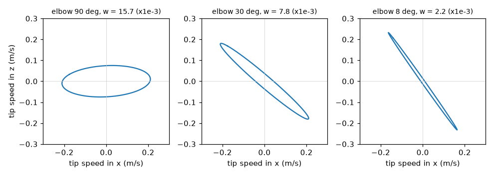
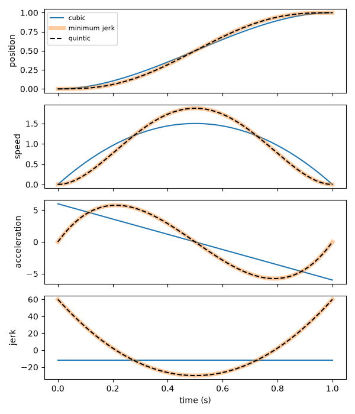
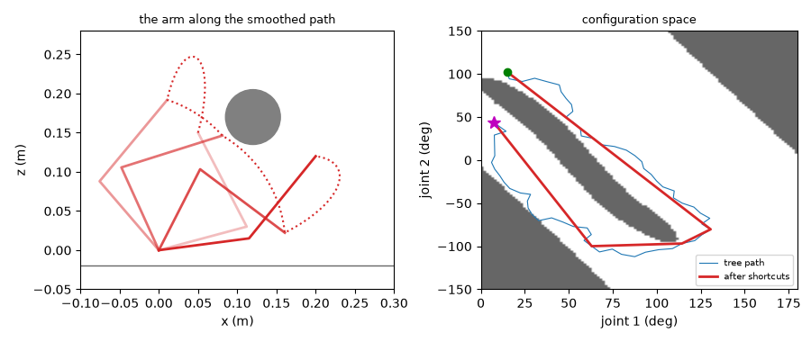
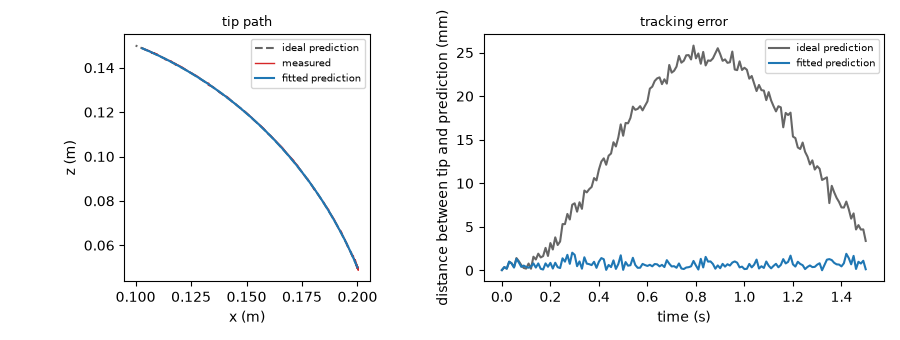
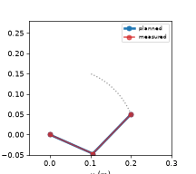

# Optional Advanced Chapter: The Mathematics of Arm Paths

## Summary

This optional chapter is for readers who want the mathematics behind arm paths. It covers rotation matrices and quaternions, the Jacobian and singularities, polynomial and minimum-jerk trajectories, path planning around obstacles, and predicting a path and comparing it with the real arm. After this chapter, you will be able to predict and check an arm's path in Python.

## Concepts Covered

This chapter covers the following 53 concepts from the learning graph:

| Concept | Concept Impact Score |
|---------|-----------------------|
| Derivative as Rate of Change | 19 |
| Matrix Multiplication | 14 |
| Configuration Space | 14 |
| Linear Algebra with NumPy | 13 |
| Path vs Trajectory | 12 |
| Numerical Differentiation | 8 |
| Boundary Conditions | 8 |
| Cubic Polynomial Trajectory | 7 |
| Obstacle Representation | 7 |
| Path Prediction | 7 |
| Numerical Jacobian | 6 |
| Static Torque Estimate | 6 |
| Sampling-Based Planning | 6 |
| Jacobian Pseudoinverse | 5 |
| Manipulability | 5 |
| SciPy Interpolation | 5 |
| RRT Algorithm | 5 |
| Predicted vs Measured Path | 5 |
| Axis-Angle Rotation | 4 |
| Damped Least Squares | 4 |
| Cubic Spline | 4 |
| Tracking Error | 4 |
| Quaternion | 3 |
| Moment Arm | 3 |
| Euler Angles | 2 |
| Quaternion Rotation | 2 |
| Jacobian-Based IK | 2 |
| Condition Number | 2 |
| Quintic Polynomial Trajectory | 2 |
| Jerk | 2 |
| Time Scaling | 2 |
| Gravity Load on Joints | 2 |
| Path Smoothing | 2 |
| Joint-Limit Constrained Planning | 2 |
| Gimbal Lock | 1 |
| SLERP | 1 |
| Velocity Kinematics | 1 |
| Manipulability Ellipse | 1 |
| Singularity Avoidance | 1 |
| Minimum-Jerk Trajectory | 1 |
| Via-Point Trajectory | 1 |
| Velocity Limit Scaling | 1 |
| Cartesian Straight-Line Path | 1 |
| Path Parameterization | 1 |
| Servo Torque Margin | 1 |
| Shortcut Smoothing | 1 |
| Path Safety Check | 1 |
| Forward Simulation of Paths | 1 |
| RMSE | 1 |
| Maximum Deviation | 1 |
| Prediction Error Sources | 1 |
| SciPy Optimize | 1 |
| Matplotlib Animation | 1 |

## Prerequisites

This chapter builds on concepts from:

- [Chapter 1: Setting Up Python for Robotics](../01-python-setup-for-robotics/index.md)
- [Chapter 2: Anatomy of a Robot Arm](../02-anatomy-of-a-robot-arm/index.md)
- [Chapter 3: Electricity, Power, and Safety Basics](../03-electricity-power-and-safety/index.md)
- [Chapter 5: Actuators and Sensors](../05-actuators-and-sensors/index.md)
- [Chapter 10: A Python Hardware Library for Robot Arms](../10-python-hardware-library/index.md)
- [Chapter 11: Moving the Arm: Trajectories, Grippers, and Teleoperation](../11-moving-the-arm/index.md)
- [Chapter 12: Kinematics: Where Is the Hand and How Do I Get There](../12-kinematics/index.md)
- [Chapter 13: Logging, Testing, Simulation, and ROS 2](../13-logging-testing-simulation/index.md)

---

!!! mascot-welcome "Welcome to the Optional Math Chapter!"
    { class="mascot-admonition-img" }
    You can run every project in this book without this chapter, so reading it is a choice. If you chose it, you want to know *why* my paths look the way they do, and how to predict them before I move. I will carry the heavy parts, and Python will check every formula. Let's move it!

The rest of the book showed what to *do*: calibrate, move, solve inverse kinematics, plan, and stay safe. This chapter explains what is *underneath*. Why does a joint-space move bow the tip sideways? What is a quaternion, and why do robots prefer them? Why do the joints race when the arm straightens out, and what does a damped step do about it? Why is the "smooth" move of Chapter 11 not the smoothest possible? How do you plan a path around a block, and how well can you predict where the tip will really go?

The chapter has seven parts: tools (derivatives and matrices), rotations, velocity and the Jacobian, trajectories, loads on the joints, planning around obstacles, and prediction. Each part follows one rule: *every formula is checked by code*. The lab builds six small modules, each with a script that prints real numbers, and a test suite that compares them with SciPy and with exact results. The arm used throughout is the flat two-link model of Chapter 12, with the SO-101's upper arm of 116 mm and forearm of 135 mm (taken from the URDF), so that the numbers mean something. It is an *approximation* of the real arm, which has small offsets out of the plane, and each part says where that matters.

!!! mascot-encourage "Read the Words, Run the Code, Skip the Algebra if You Like"
    { class="mascot-admonition-img" }
    Every section states the idea in plain words first, then gives the formula, then the lab checks it with numbers. If a derivation looks heavy, skip it: the code shows that the result is right, and the result is what you use.

## Tools: Rates of Change and Matrices

### Derivative as Rate of Change

A **derivative as rate of change** says how fast a quantity changes: the derivative of a joint's angle with respect to time is its angular speed, and the derivative of speed is its acceleration. In symbols, for a function \( f(t) \),

\[ \frac{df}{dt} = \lim_{h \to 0} \frac{f(t+h) - f(t)}{h} \]

Everything in the chapter is built from a few such rates: speed (rate of change of position), acceleration (rate of change of speed), **jerk** (rate of change of acceleration, which is how suddenly the acceleration itself changes, and so how hard the arm is jolted), and the Jacobian (the rate of change of the tip position with each joint angle). A derivative is also a *slope*: the speed is the slope of the position curve, and a joint standing still has a flat one.

### Numerical Differentiation

You often have numbers and not a formula: the samples that the arm logged at 100 Hz. **Numerical differentiation** estimates the derivative from the samples. The simplest estimate takes a small step \( h \) and uses the formula above without the limit, which is the *forward difference*. A better one looks on both sides:

\[ f'(t) \approx \frac{f(t+h) - f(t-h)}{2h} \]

which is the *central difference*, and its error shrinks with \( h^2 \) where the forward difference only shrinks with \( h \). NumPy's `np.gradient` does the central version for samples. There is a trade-off in the choice of \( h \): a large step gives a *truncation* error (the formula is only an approximation), and a tiny step gives a *round-off* error (the computer subtracts two numbers that are almost equal and loses digits). The lab shows both on the sine function at \( x = 1 \), where the true slope is \( \cos 1 = 0.540302 \).

### Matrix Multiplication and Linear Algebra with NumPy

**Matrix multiplication** combines two grids of numbers into one: entry \( (i, j) \) of the product \( AB \) is the sum of row \( i \) of \( A \) times column \( j \) of \( B \). It matters because it is how transforms combine (Chapter 12): first apply \( B \), then \( A \), and write \( AB \). The key fact is that **order matters**: \( AB \neq BA \) in general. Turning the \( x \) axis by 90° about \( x \) and then about \( z \) is not the same as the other order, and the lab prints both results to show it.

**Linear algebra with NumPy** gives you the operations that the rest of the chapter uses, each in a line. `A @ B` is the product. `np.linalg.solve(A, b)` finds the \( x \) for which \( A x = b \). `np.linalg.pinv(A)` is the pseudoinverse, which works even for a matrix that has no ordinary inverse. `np.linalg.svd(A, compute_uv=False)` returns the *singular values*, which say how much \( A \) stretches the space in each direction. And `np.linalg.cond(A)` gives the ratio of the largest to the smallest of them. Use `solve` and not `inv` when you can: it is faster and more accurate.

## Rotations in Four Forms

A rotation in three dimensions has three degrees of freedom, and there are four common ways to write one. Each is good at something, and a robot program often converts between them.

### Euler Angles and Gimbal Lock

**Euler angles** describe a rotation as three turns about three axes in a fixed order, such as yaw (about the vertical \( z \) axis), then pitch (about \( y \)), then roll (about \( x \)). They are easy to picture and to type, and they are what most people mean by "orientation". Their weakness is **gimbal lock**: when the middle angle is ±90°, the first and third turns act about the same axis, and one degree of freedom is lost. In the lab, a yaw of 0.5 rad with a roll of 0.2 rad and a pitch of 90° is *exactly the same rotation* as a yaw of 0.3 rad with a roll of 0: only the *difference* of yaw and roll matters, and there is no way to recover both from the matrix. Near gimbal lock the angles also change wildly for a small change of orientation. A robot that works in Euler angles has to avoid, or detect, this pose.

### Axis-Angle Rotation

An **axis-angle rotation** says that every 3D rotation is a single turn by an angle \( \theta \) about one axis \( \hat n \). Rodrigues' formula turns it into a matrix:

\[ R = I + \sin\theta\, K + (1 - \cos\theta)\, K^2, \qquad K = \begin{pmatrix} 0 & -n_z & n_y \\ n_z & 0 & -n_x \\ -n_y & n_x & 0 \end{pmatrix} \]

where \( K \) is the matrix for which \( K v = \hat n \times v \), the cross product. Going the other way, \( \theta = \arccos\big((\operatorname{trace} R - 1)/2\big) \), and the axis comes from the off-diagonal differences of \( R \). Axis-angle has no gimbal lock, but it is awkward to combine, and the axis is undefined when there is no rotation.

### Quaternions and Quaternion Rotation

A **quaternion** stores a rotation as four numbers \( q = (w, x, y, z) \) built from the axis and angle: \( q = (\cos\tfrac{\theta}{2},\ \sin\tfrac{\theta}{2}\,\hat n) \). A quaternion that stands for a rotation has length 1. Two facts to remember: \( q \) and \( -q \) are *the same rotation*, and the half angle is what makes the formulas work.

**Quaternion rotation** turns a vector \( v \) by sandwiching it: write \( v \) as the quaternion \( (0, v) \), and compute \( q\,(0, v)\,q^{*} \), where \( q^{*} = (w, -x, -y, -z) \) is the conjugate (the inverse, for a unit quaternion). Combining two rotations is the quaternion product \( q_a q_b \), which agrees with the matrix product \( R_a R_b \). The lab verifies all of it against SciPy's `Rotation`. (A warning: SciPy writes quaternions as \( (x, y, z, w) \), with the \( w \) last, and this chapter writes \( w \) first. Check the order of any library before you mix them.) Quaternions are small, have no gimbal lock, are cheap to multiply and renormalize, and interpolate well. That is why robot libraries use them inside, even when they show you Euler angles.

### SLERP

**SLERP**, spherical linear interpolation, finds the rotations *between* two orientations at a constant angular speed. With \( \cos\Omega = q_0 \cdot q_1 \),

\[ \operatorname{slerp}(q_0, q_1, t) = \frac{\sin\big((1-t)\Omega\big)\, q_0 + \sin(t\Omega)\, q_1}{\sin\Omega} \]

If the dot product is negative, negate \( q_1 \) first, so that the rotation takes the short way round. The lab turns from no rotation to 120° about \( z \) and reports the angle at a quarter, a half and three quarters of the way: SLERP gives 30°, 60° and 90°, steps of equal size. A straight blend of the four numbers, made unit length again, gives 27.8°, 60° and 92.2°, so the orientation speeds up in the middle. For a camera or a gripper that should turn smoothly, use SLERP.

!!! mascot-thinking "Pick the Form That Fits the Job"
    { class="mascot-admonition-img" }
    Euler angles are for people to read and type, matrices are for transforming points, axis-angle is for "turn this much about that line", and quaternions are for storing, combining and interpolating. Convert freely, but keep each in its job, and watch the pitch of 90 degrees.

#### Diagram: Quaternion Calculator

<iframe src="../../sims/quaternion-calculator/main.html" height="620px" width="100%" scrolling="no"></iframe>

[Run the Quaternion Calculator MicroSim fullscreen](../../sims/quaternion-calculator/main.html){ .md-button .md-button--primary }

<details markdown="1">
<summary>Quaternion Calculator</summary>
Type: microsim
**sim-id:** quaternion-calculator<br/>
**Library:** p5.js<br/>
**Status:** Specified<br/>
**Bloom Level:** Apply<br/>
**Bloom Verb:** calculate<br/>
**Learning Objective:** The learner will calculate quaternion components, turn angles and SLERP angles from given rotations, to within 0.1 of the unit shown, in six problems, with at least 5 of 6 correct on the first attempt.

**Prerequisites:** quaternion, unit quaternion, axis and angle, SLERP, dot product (all defined in the section "Rotations in Four Forms" above this block).

**Evidence of Mastery:** For each of six problems the learner types a number in the unit shown and commits. An answer is correct when it is within 0.1 of the Correct column in Content. Mastery is 5 of 6 correct on the first attempt. Changing the axis and angle in Explore mode is exploration, not evidence.

**Misconceptions:** (1) The w of a quaternion is the cosine of the full angle. (It is the cosine of half the angle.) (2) SLERP at one quarter of the way is a quarter of the numbers. (It is a quarter of the angle.) (3) The angle between two rotations is the arccosine of the dot product. (It is twice that.)

**Instructional Rationale:** An Apply-level calculate objective needs repeated use of a few formulas on new numbers with an immediate check. The half angle is the step that most learners miss, so each formula appears in at least one problem.

**Content:**

Explore mode shows two sliders, for the axis (about x, y or z) and the angle, and the resulting quaternion. Formulas: q = (cos(angle / 2), sin(angle / 2) x axis); angle = 2 x arccos(w); w = the square root of (1 - x^2 - y^2 - z^2) for a unit quaternion; SLERP at fraction t between no turn and a turn of A degrees is a turn of t x A degrees; the angle between two rotations whose quaternions have dot product d is 2 x arccos(d).

| Quantity | Min | Max | Step | Default | Unit |
|---|---|---|---|---|---|
| Angle | 0 | 180 | 5 | 90 | degrees |
| Axis | x | z | one of three | z | none |

Six problems in this fixed order:

| # | Problem | Unit asked | Correct | Why (shown as feedback) |
|---|---|---|---|---|
| 1 | What is w of the unit quaternion for a 60 degree turn about the x axis? (Answer as w x 100.) | w x 100 | 86.6 | w = cos(30 degrees) = 0.866, and 0.866 x 100 = 86.6. |
| 2 | A unit quaternion has w = 0.5. What angle does it turn? | degrees | 120.0 | angle = 2 x arccos(0.5) = 2 x 60 = 120 degrees. |
| 3 | A unit quaternion has x = 0.6 and y = z = 0. What is w? (Answer as w x 100, positive w.) | w x 100 | 80.0 | w = the square root of (1 - 0.36) = 0.8, and 0.8 x 100 = 80.0. |
| 4 | SLERP from no turn to a 120 degree turn about z, one quarter of the way. What angle has been turned? | degrees | 30.0 | A quarter of 120 degrees is 30 degrees. |
| 5 | SLERP from no turn to a 150 degree turn about z, at t = 0.4. What angle has been turned? | degrees | 60.0 | 0.4 x 150 = 60 degrees. |
| 6 | Two unit quaternions have a dot product of 0.5. What is the angle between the two rotations? | degrees | 120.0 | The angle is 2 x arccos(0.5) = 120 degrees. |

**Provenance:** The formulas are from the chapter section "Rotations in Four Forms" and were checked against SciPy's Rotation in the lab. The problems are illustrative and written for this sim.

**Rules:** w = cos(angle / 2). angle = 2 x arccos(w). w = the square root of (1 - x^2 - y^2 - z^2). SLERP turns an angle that is t times the total. The angle between rotations = 2 x arccos(dot product). An answer is correct when |typed - correct| <= 0.1.

**Learner Activity:**

1. In Explore mode the learner changes the axis and the angle and watches the four numbers of the quaternion.
2. The learner switches to the six problems. Problem 1 is shown.
3. The learner types a number and presses Check to commit.
4. The sim shows whether the answer was correct, the working and the Why text, then moves on. After problem 6 it shows the score.

**Feedback:** Six problems, fixed order, one attempt each. Correct: "Correct: <value> <unit>. <Why>". Incorrect: "Not quite. The answer is <value> <unit>. <Why>". The correct value is revealed after each commit. A running count "Correct: n of 6" is shown and the final screen says whether mastery (5 of 6) was reached.

**Starting State:** Explore mode with the axis z and an angle of 90 degrees, showing the quaternion 0.7071, 0, 0, 0.7071.

**Chapter Anchors:** The chapter's quaternion is (cos of half the angle, sin of half the angle times the axis), and SLERP from no turn to 120 degrees about z gives 30, 60 and 90 degrees at a quarter, a half and three quarters. The sim has six problems and mastery is 5 of 6.
</details>

## Velocity, the Jacobian, and Singularities

### Velocity Kinematics

**Velocity kinematics** relates the speeds of the joints to the speed of the hand. Chapter 12 introduced the Jacobian \( J(q) \), the matrix for which

\[ \dot p = J(q)\,\dot q \]

where \( \dot q \) is the vector of joint speeds and \( \dot p \) is the tip speed. For the two-link arm, with joint angles \( \theta_1 \) and \( \theta_2 \),

\[ J = \begin{pmatrix} -l_1 \sin\theta_1 - l_2 \sin(\theta_1+\theta_2) & -l_2 \sin(\theta_1+\theta_2) \\ l_1 \cos\theta_1 + l_2 \cos(\theta_1+\theta_2) & l_2 \cos(\theta_1+\theta_2) \end{pmatrix}, \qquad \det J = l_1 l_2 \sin\theta_2 \]

The **numerical Jacobian** gets the same matrix without any formula, by nudging each joint by a tiny angle and watching how the tip moves (one column per joint). The lab compares it with the formula at joint angles of 40° and 70°: the two agree to \( 10^{-7} \). This matters for arms with no tidy formula, such as the SO-101 with all its offsets, where the numerical Jacobian of Chapter 12 is what the inverse kinematics used.

### Jacobian-Based IK, the Pseudoinverse and Damped Least Squares

**Jacobian-based IK** solves inverse kinematics by repeating small steps. If the tip is at \( p \) and the target is \( p^{*} \), the error is \( e = p^{*} - p \), and one step changes the joints by \( \Delta q \) such that \( J\,\Delta q \approx e \). Update the angles, compute the new error, and repeat until the error is tiny. The question is how to find \( \Delta q \).

The **Jacobian pseudoinverse** \( J^{+} \) gives \( \Delta q = J^{+} e \). For a square, non-singular \( J \) it is the ordinary inverse. It is *exact* in one step of the linearized problem, which is its charm, and its danger: near a singular pose \( J \) has a tiny singular value \( \sigma_{\min} \), and \( J^{+} \) has a huge one, \( 1/\sigma_{\min} \). A small error in the unlucky direction asks for an enormous joint motion.

**Damped least squares** (DLS, due to Wampler and to Nakamura and Hanafusa in 1986) gives up a little exactness for a lot of safety:

\[ \Delta q = J^{\mathsf T}\big(J J^{\mathsf T} + \lambda^2 I\big)^{-1} e \]

The *damping* \( \lambda \) keeps the step bounded: the largest gain is about \( 1/(2\lambda) \) instead of \( 1/\sigma_{\min} \). It is the method behind the numerical IK of Chapter 12, and the reBot's control library uses the same idea, with a damping of \( 10^{-6} \) that grows when the error is large. LeRobot's kinematics wraps a solver that takes a fixed small number of Newton steps (8 by default) from the current joints, and gives orientation a low weight. The lab compares the methods in two ways. First, it asks the tip to move in a straight line to a point *outside* the arm's reach of 0.251 m, at \( (0.26, 0) \). The pseudoinverse tries too hard: its largest joint step in one control step is 427.6°, and the arm ends in a nonsense pose with the elbow wound round to 814°. DLS takes steps of at most 4.6° and settles at the nearest point the arm can reach, \( (0.251, 0) \). Second, it solves IK for \( (0.15, 0.10) \) *starting from the singular pose* with both joints at zero. Both methods arrive, but the pseudoinverse winds the joints round, ending at −374.8° and 808.5°, which are the same pose as −14.8° and 88.5° plus whole turns, while DLS goes straight to −14.8° and 88.5°. An arm with joint limits could not follow the first path at all.

### Manipulability, the Ellipse and the Condition Number

How well can the arm move the tip at a given pose? **Manipulability**, a measure due to Yoshikawa (1985), is

\[ w = \sqrt{\det\big(J J^{\mathsf T}\big)} \]

For a square \( J \) this is \( |\det J| \), so for the two-link arm \( w = l_1 l_2 |\sin\theta_2| \): large when the elbow is bent a right angle, zero when the arm is straight. The **manipulability ellipse** shows what this means. Take all joint-speed vectors of length 1, and map each through \( J \): the tip-speed vectors fill an ellipse. A round, large ellipse means the tip can move equally well in every direction. A long thin ellipse means that it moves fast along one line and hardly at all across it, and a flat one is a singularity.



The **condition number** \( \kappa = \sigma_{\max}/\sigma_{\min} \), from the singular values, measures the same thing as a ratio: 1 for a round ellipse, large for a thin one, and infinite at a singularity. The lab prints both as the elbow straightens from 90° to 0°, with joint 1 at 30°: \( w \) falls from 0.0157 to 0.0000 (it matches \( l_1 l_2 |\sin\theta_2| \) exactly), and \( \kappa \) climbs from 2.8 through 14.7 at 20° and 297 at 1° to infinity.

### Singularity Avoidance

**Singularity avoidance** means keeping the arm away from poses where \( w \) is small, or softening the maths when it cannot. Three tools, in order of effort. *Plan away from it*: choose paths whose manipulability stays above a floor, and keep the elbow bent. *Damp near it*: use DLS with a damping that grows as \( w \) falls below a threshold \( w_0 \), as Nakamura and Hanafusa proposed:

\[ \lambda^2 = \lambda_{\max}^2\Big(1 - \big(w/w_0\big)^2\Big) \ \text{ if } w < w_0, \qquad \lambda = 0 \ \text{ otherwise} \]

So the steps are exact where it is safe and tame where it is not. The lab's `adaptive_damping` does this, with \( w_0 = 0.004 \) and \( \lambda_{\max} = 0.05 \). *Limit the speed*: scale all joint speeds down so that none exceeds its limit, which the time-scaling section below does. A robot that stops before a singularity is annoying, and one that does not is dangerous.

#### Diagram: Manipulability Calculator

<iframe src="../../sims/manipulability-calculator/main.html" height="620px" width="100%" scrolling="no"></iframe>

[Run the Manipulability Calculator MicroSim fullscreen](../../sims/manipulability-calculator/main.html){ .md-button .md-button--primary }

<details markdown="1">
<summary>Manipulability Calculator</summary>
Type: microsim
**sim-id:** manipulability-calculator<br/>
**Library:** p5.js<br/>
**Status:** Specified<br/>
**Bloom Level:** Apply<br/>
**Bloom Verb:** calculate<br/>
**Learning Objective:** The learner will calculate the manipulability of a two-link arm from its link lengths and elbow bend, and compare two poses, to within 0.1 of the unit shown, in six problems, with at least 5 of 6 correct on the first attempt.

**Prerequisites:** Jacobian, determinant, manipulability, singular pose, sine (all defined in the section "Velocity, the Jacobian, and Singularities" above this block and in Chapter 12).

**Evidence of Mastery:** For each of six problems the learner types a number in the unit shown and commits. An answer is correct when it is within 0.1 of the Correct column in Content. Mastery is 5 of 6 correct on the first attempt. Moving the sliders in Explore mode is exploration, not evidence.

**Misconceptions:** (1) Manipulability depends on the shoulder angle. (For a two-link arm it depends only on the elbow bend and the link lengths.) (2) A straight arm is the most manipulable. (It is a singularity, with zero.) (3) Halving the bend halves the manipulability. (It follows the sine, so it falls more slowly at first and then faster.)

**Instructional Rationale:** An Apply-level calculate objective needs repeated use of one formula on new numbers. The formula w = l1 x l2 x |sin(bend)| is short, so the work is in the sine and the units, and a ratio problem shows how fast w falls near a singularity.

**Content:**

Explore mode shows two sliders for the elbow bend and the shoulder angle, the manipulability w, the condition number, and a small drawing of the ellipse. Link lengths are 0.116 m and 0.135 m unless a problem says otherwise. Answers are in units of 0.001 (that is, w x 1000). Formula: w = l1 x l2 x |sin(bend)|.

| Quantity | Min | Max | Step | Default | Unit |
|---|---|---|---|---|---|
| Elbow bend | 0 | 180 | 1 | 90 | degrees |
| Shoulder angle | 0 | 180 | 5 | 30 | degrees |

Six problems in this fixed order:

| # | Problem | Unit asked | Correct | Why (shown as feedback) |
|---|---|---|---|---|
| 1 | Links of 0.116 m and 0.135 m, elbow bent 90 degrees. What is w? | w x 1000 | 15.7 | w = 0.116 x 0.135 x 1 = 0.01566, so 15.7 in units of 0.001. |
| 2 | The same arm, elbow bent 30 degrees. What is w? | w x 1000 | 7.8 | w = 0.01566 x 0.5 = 0.00783, so 7.8. |
| 3 | The same arm, elbow bent 10 degrees. What is w? | w x 1000 | 2.7 | w = 0.01566 x sin(10 degrees) = 0.01566 x 0.1736 = 0.00272, so 2.7. |
| 4 | The same arm, elbow bent 45 degrees. What is w? | w x 1000 | 11.1 | w = 0.01566 x 0.7071 = 0.01107, so 11.1. |
| 5 | Links of 0.2 m and 0.2 m, elbow bent 60 degrees. What is w? | w x 1000 | 34.6 | w = 0.2 x 0.2 x 0.866 = 0.03464, so 34.6. |
| 6 | How many times smaller is w with the elbow bent 5 degrees than with it bent 90 degrees? | times | 11.5 | w(90) / w(5) = 1 / sin(5 degrees) = 1 / 0.08716 = 11.5. |

**Provenance:** The formula is the chapter's w = l1 x l2 x |sin(bend)|, which the lab checks against the square root of det(J J^T). The link lengths are the SO-101's upper arm and forearm from its URDF. The problems are illustrative and written for this sim.

**Rules:** w = l1 x l2 x |sin(bend)|. Answers are w x 1000, except problem 6, which is a ratio. An answer is correct when |typed - correct| <= 0.1.

**Learner Activity:**

1. In Explore mode the learner moves the sliders and watches w, the condition number and the ellipse.
2. The learner switches to the six problems. Problem 1 is shown.
3. The learner types a number and presses Check to commit.
4. The sim shows whether the answer was correct, the working and the Why text, then moves on. After problem 6 it shows the score.

**Feedback:** Six problems, fixed order, one attempt each. Correct: "Correct: <value> <unit>. <Why>". Incorrect: "Not quite. The answer is <value> <unit>. <Why>". The correct value is revealed after each commit. A running count "Correct: n of 6" is shown and the final screen says whether mastery (5 of 6) was reached.

**Starting State:** Explore mode with the elbow bent 90 degrees and the shoulder at 30 degrees, showing w = 15.7 (x 0.001) and a condition number of 2.8.

**Chapter Anchors:** The chapter's manipulability of the two-link arm is l1 x l2 x |sin(bend)|, equal to 0.01566 for 0.116 m and 0.135 m links at a right angle, and it falls to zero as the arm straightens. The sim has six problems and mastery is 5 of 6.
</details>

## Trajectories

### Path vs Trajectory

A **path vs trajectory** distinction is the difference between *where* and *where and when*. A *path* is a shape in space (or in joint space): a list of poses, with no time on it. A *trajectory* is a path *and* a schedule: the pose at every instant, and so the speed and acceleration. Chapter 11 made trajectories out of paths with a speed profile. The same path can be driven by a gentle trajectory or a violent one, and the arm only cares about the trajectory.

**Path parameterization** is the step that connects the two: describe the path by a variable \( s \) that runs from 0 to 1, and then choose \( s(t) \), a function of time, as the schedule. The natural variable is *arc length*, the distance along the path, because then equal steps of \( s \) are equal steps in space. The lab takes a path whose points are unevenly spaced (15.3, 15.1, ... 13.7 mm apart) and re-samples it so that every step is 14.5 mm.

The *shape* of a path also depends on the space that you draw it in. A **Cartesian straight-line path** is straight in the space of the tip: do inverse kinematics at every point along the line. A path that is straight in *joint space* moves every joint at a proportional rate, and its tip takes a curved route. The lab joins the same two end poses, with the tip at \( (0.20, 0.05) \) and \( (0.10, 0.15) \), both ways: the joint-space line bows up to 14.2 mm away from the straight line, while the Cartesian line stays within 0.000 mm of it, and needs the joints to move by 31.7° and 18.7°, not in proportion. Use joint space when only the end matters, and Cartesian space when the *route* matters, as when carrying a full cup.

### Boundary Conditions

**Boundary conditions** are the values that a trajectory must have at its two ends: the position, and perhaps the speed and the acceleration. They are what make a trajectory *fit* the moves around it. A move that starts from rest has zero speed at the start. A move that continues the previous one must start at the speed that the previous move ended with, or the arm jerks. A polynomial of degree \( n \) has \( n+1 \) coefficients, so it can meet \( n+1 \) conditions: a cubic meets four, a quintic six.

### Cubic Polynomial Trajectory

A **cubic polynomial trajectory** is \( q(t) = a_0 + a_1 t + a_2 t^2 + a_3 t^3 \), and it meets four conditions: the position and the speed at both ends. With a start position \( q_0 \), an end position \( q_f \), start and end speeds \( v_0 \) and \( v_f \), and a duration \( T \), the coefficients are

\[ a_0 = q_0,\quad a_1 = v_0,\quad a_2 = \frac{3(q_f - q_0)}{T^2} - \frac{2v_0 + v_f}{T},\quad a_3 = -\frac{2(q_f - q_0)}{T^3} + \frac{v_0 + v_f}{T^2} \]

With \( v_0 = v_f = 0 \) this is the \( 3s^2 - 2s^3 \) smooth ramp of Chapter 11. The lab checks the boundary conditions for a cubic that *starts already moving* at 0.5 units/s and ends at rest: position 0 to 1, speed 0.50 at the start and 0.00 at the end. The weakness of a cubic is in what it does not control. Its acceleration is a straight line in time, and at rest-to-rest it starts at \( 6\Delta/T^2 \) with no gentle build-up: the acceleration *jumps* from zero at the instant the move begins, which means an instantly large force and a jolt.

### Quintic Polynomial Trajectory

A **quintic polynomial trajectory** has six coefficients and meets six conditions: the position, the speed *and the acceleration* at both ends. Solve for the coefficients as a linear system, \( A\,a = b \), where each row of \( A \) is one boundary condition. The lab does it in four lines with `np.linalg.solve`. With zero speed and zero acceleration at both ends, the acceleration starts and ends at zero: the force builds up gradually, with no jump.

### Minimum-Jerk Trajectory

A **minimum-jerk trajectory** is the rest-to-rest motion that makes the total jerk as small as possible. Flash and Hogan (1985) found that human reaching movements follow it closely. Its formula is

\[ q(t) = q_0 + (q_f - q_0)\big(10 s^3 - 15 s^4 + 6 s^5\big), \qquad s = t/T \]

and the lab shows it to be *exactly* the quintic with zero speed and acceleration at both ends (the coefficients are equal). Its peak speed is \( 1.875\,\Delta/T \), at the midpoint, and its peak acceleration is \( 10/\sqrt{3}\,\Delta/T^2 \approx 5.77\,\Delta/T^2 \). Compare the two rest-to-rest polynomials, for a move of 1 unit in 1 second:

| | Peak speed | Peak acceleration | Peak jerk | Acceleration at the start | Integral of jerk squared |
|---|---|---|---|---|---|
| Cubic | 1.500 | 6.000 | 12.0 | 6.00 | 144.0 |
| Quintic = minimum jerk | 1.875 | 5.773 | 60.0 | 0.00 | 720.0 |

Notice that the cubic's *integral of jerk squared* is smaller. It does not contradict the name, and it shows what the name means. The cubic's acceleration jumps from 0 to 6 at the start, and a jump is an infinite jerk for an instant, which the polynomial does not count. The minimum-jerk trajectory is the best of those that start and end with zero acceleration. (The test suite also checks that adding a non-zero speed at the ends makes the integral larger.) The minimum-jerk motion is gentler at both ends, because the arm eases in and eases out with no jump in acceleration.



### Numerical Differentiation of a Trajectory, and Jerk

Chapter 13 logged positions. To know the speed and the jerk of what the arm *did*, differentiate the log: once for speed, twice for acceleration, three times for jerk. Each differentiation makes noise worse, because it amplifies differences. The lab differentiates the samples of the minimum-jerk position at three rates and compares them with the exact speed: the largest error is 0.023 at 20 samples per second, 0.00099 at 100, and \( 10^{-5} \) at 1000. For logs with sensor noise, smooth first, or fit a spline and differentiate that.

### Via-Point Trajectory, Cubic Spline and SciPy Interpolation

A **via-point trajectory** passes through several poses on the way, at set times. Straight lines between the via points are easy and bad: the position is continuous, but the speed jumps at every point. A **cubic spline** is a chain of cubic polynomials, one between each pair of points, joined so that the position, the speed *and* the acceleration are continuous at every join. **SciPy interpolation** makes one in a line: `CubicSpline(times, positions, bc_type=((1, v0), (1, vf)))`, where `bc_type` sets the boundary conditions (a "clamped" spline fixes the end speeds), and the result can be called with a derivative order to get speed and acceleration. The lab runs both through the via points 0.0, 0.5, 0.4 and 1.0 at 0, 1, 2 and 3 s. The spline's largest acceleration is 2.96 and its speed is continuous at the via points, while the straight-line version has speed jumps of up to 0.70 units/s. (`np.interp` is the straight-line version.)

### Time Scaling and Velocity Limit Scaling

**Time scaling** stretches a trajectory in time without changing its path. If the duration \( T \) becomes \( kT \), the speeds fall by a factor of \( k \), the accelerations by \( k^2 \), and the jerks by \( k^3 \). In the lab, doubling the duration of a minimum-jerk move halves its peak speed (0.750 to 0.375 for a unit move over 2.5 s) and quarters its peak acceleration (0.924 to 0.231). This is how you meet a limit: the peak speed of a minimum-jerk move is \( 1.875\Delta/T \), so the shortest duration that keeps the speed under \( v_{\max} \) is \( T = 1.875\Delta/v_{\max} \), and the one that keeps the acceleration under \( a_{\max} \) is \( T = \sqrt{5.77\,\Delta/a_{\max}} \). Take the larger of the two.

**Velocity limit scaling** is the same idea for several joints at once. Each joint would take its own shortest time, but they must *arrive together*, or the tip would swing off its path. The slowest joint sets the duration, and the others are slowed to match. In the lab, three joints that move 1.0, 0.5 and 2.0 units, with limits of 1.5 units/s and 6 units/s², need 1.250, 0.694 and 2.500 s alone, so the common duration is 2.500 s.

!!! mascot-tip "Slow the Whole Move, Not One Joint"
    { class="mascot-admonition-img" }
    If one joint is too fast for its limit, stretch the time of *every* joint by the same factor. The path stays the same shape, only slower. If you clip one joint's speed alone, the joints stop moving in step and the tip leaves its path.

#### Diagram: Polynomial Order Chooser

<iframe src="../../sims/polynomial-order-chooser/main.html" height="620px" width="100%" scrolling="no"></iframe>

[Run the Polynomial Order Chooser MicroSim fullscreen](../../sims/polynomial-order-chooser/main.html){ .md-button .md-button--primary }

<details markdown="1">
<summary>Polynomial Order Chooser</summary>
Type: microsim
**sim-id:** polynomial-order-chooser<br/>
**Library:** p5.js<br/>
**Status:** Specified<br/>
**Bloom Level:** Analyze<br/>
**Bloom Verb:** differentiate<br/>
**Learning Objective:** The learner will differentiate eight trajectory requirements as needing a cubic, a quintic or a cubic spline, with at least 7 of 8 correct on the first attempt.

**Prerequisites:** boundary conditions, cubic polynomial trajectory, quintic polynomial trajectory, via points, cubic spline (all defined in the section "Trajectories" above this block).

**Evidence of Mastery:** For each of eight requirements the learner chooses one of three kinds and commits. A choice is correct when it matches the Kind column in Content. Mastery is 7 of 8 correct on the first attempt. Reading the comparison table in Explore mode is exploration, not evidence.

**Misconceptions:** (1) A higher degree is always smoother. (A polynomial only controls the conditions it is given.) (2) One polynomial can pass through any number of via points well. (A chain of cubics in a spline does it without wild swings.) (3) A cubic can keep the acceleration continuous with the last move. (It has no coefficient left for acceleration.)

**Instructional Rationale:** An Analyze-level differentiate objective asks the learner to separate cases that look alike. The deciding fact is how many conditions are specified, and whether there are several via points, so the learner must count conditions and not look at the words.

**Content:**

The three kinds: "Cubic" (four conditions: position and speed at both ends, one move), "Quintic" (six conditions: position, speed and acceleration at both ends, one move), "Cubic spline" (several via points joined with continuous speed and acceleration). Eight requirements in this fixed order:

| # | Requirement | Kind | Why (shown as feedback) |
|---|---|---|---|
| 1 | Move one joint from 0 to 1 radian in 2 seconds, starting and ending at rest. | Cubic | Position and speed at both ends are four conditions, and a cubic has four coefficients. |
| 2 | The same move, but the acceleration must also be zero at both ends. | Quintic | Six conditions need six coefficients. |
| 3 | The move starts while the joint is already turning at 0.5 radians per second, and ends at rest. | Cubic | The start speed is one of the four conditions of a cubic. |
| 4 | The move must continue exactly from the end acceleration of the previous move. | Quintic | Matching an acceleration is a fifth and sixth condition. |
| 5 | The joint must pass through four via points at set times, with a continuous speed and acceleration. | Cubic spline | Several via points joined smoothly are what a spline is for. |
| 6 | A rest-to-rest move where the force must build up gently, with no jump in acceleration at the start. | Quintic | Zero acceleration at the ends is what the quintic can control. |
| 7 | A quick rest-to-rest move where only the position and the speed at the ends matter. | Cubic | Four conditions are enough, and a cubic is the simpler choice. |
| 8 | A path that passes through six via points and ends at rest. | Cubic spline | A chain of cubics avoids the swings of a high-degree polynomial through many points. |

**Provenance:** The kinds and their condition counts follow the chapter section "Trajectories". The requirements are illustrative and written for this sim.

**Rules:** Each requirement has exactly one correct kind. Count the conditions: four means a cubic, six means a quintic, and several via points mean a spline.

**Learner Activity:**

1. In Explore mode the learner reads the three kinds and the number of conditions each controls.
2. The learner switches to the eight requirements. Requirement 1 is shown.
3. The learner chooses a kind and commits.
4. The sim shows whether the choice was correct and the Why text, then moves on. After requirement 8 it shows the score.

**Feedback:** Eight requirements, fixed order, one attempt each. Correct: "Correct: <kind>. <Why>". Incorrect: "Not quite. This needs a: <kind>. <Why>". The correct kind is revealed after each commit. A running count "Correct: n of 8" is shown and the final screen says whether mastery (7 of 8) was reached.

**Starting State:** Explore mode with the three kinds listed and the prompt "How many conditions must be met?" ready for the first requirement.

**Chapter Anchors:** The chapter says that a cubic meets four boundary conditions, a quintic six, and that a cubic spline joins cubics through via points with continuous position, speed and acceleration. The sim has eight requirements and mastery is 7 of 8.
</details>

## Loads on the Joints

### Gravity Load on Joints, Moment Arm and Static Torque Estimate

Even standing still, an arm works: **gravity load on joints** is the pull of the weight of the links and of whatever the gripper holds, which each joint's servo must resist. Chapter 2 gave the formula for one mass, and here it is applied to every joint. The key quantity is the **moment arm**, the *horizontal* distance from the joint to the line of the weight. The torque of a mass \( m \) is

\[ \tau = m\,g\,d \]

with \( d \) the moment arm. The same 0.2 kg load uses 10 percent of the servo's stall torque at a moment arm of 0.10 m and 31 percent at 0.30 m: three times the distance, three times the torque. A **static torque estimate** adds this up for every mass beyond a joint. In the lab, the shoulder-lift torque is the sum, over the upper arm, forearm, wrist, gripper and any payload, of \( m g d \), with \( d \) measured from the lift axis, and the elbow torque is the sum over the masses beyond the elbow. The lab uses the SO-101's link masses from its URDF (upper arm 0.103 kg, forearm 0.104 kg, wrist 0.079 kg, gripper and jaw 0.087 + 0.012 kg), and it *places each link's mass at the middle of its segment*. That is an assumption, and a rough one: the URDF holds the real centers of mass, and a more careful estimate would use them. (The reBot's control library goes further, and computes gravity compensation with the Pinocchio library from the full URDF.)

### Servo Torque Margin

The **servo torque margin** is how many times the load fits into the servo's strength:

\[ \text{margin} = \frac{\tau_{\text{stall}}}{\tau_{\text{load}}} \]

Below 1 the servo cannot hold the load. A margin of at least 2 is a comfortable target for a classroom, since a joint working near its stall torque draws a large current and heats (Chapter 5), and the figure of 2 is a rule of thumb used here, not a manufacturer's number. The lab takes the stall torque of the 7.4 V STS3215 from the seller's data sheet of Chapter 5, 19.5 kg·cm = 1.913 N·m. The table shows the result for three poses and three payloads. The margin shown is that of each joint.

| Pose | Payload | Shoulder lift | Elbow | Wrist |
|---|---|---|---|---|
| Outstretched (tip at 0.39 m) | none | 0.55 N·m (3.5) | 0.46 N·m (4.2) | 0.15 N·m (12.4) |
| | 0.5 kg | 2.13 N·m (0.9) | 1.90 N·m (1.0) | 0.94 N·m (2.0) |
| Folded home (tip at 0.16 m) | none | 0.01 N·m (283) | 0.38 N·m (5.1) | 0.07 N·m (27) |
| | 0.5 kg | 0.47 N·m (4.0) | 1.39 N·m (1.4) | 0.43 N·m (4.5) |

With the arm outstretched, a payload of 0.5 kg gives the shoulder a margin of 0.9, so *it cannot be held*, while in the folded pose the same payload leaves a margin of 1.4 at the elbow. This is why a payload figure means little without a pose (Chapter 2), and why the "about 0.5 kg" that sellers list for the SO-ARM101 cannot be taken as a promise at full reach. These numbers rest on the simplified masses and on the seller's torque, so read them as an estimate of the *pattern*, and measure before you rely on them.

## Planning Around Obstacles

### Configuration Space and Obstacle Representation

The **configuration space** of an arm is the space of all its joint settings: for the two-link arm, the plane of \( (\theta_1, \theta_2) \). A *point* in it is a whole arm pose, and a *path* in it is a motion of the whole arm. Planning in configuration space turns the arm into a single point, and that simplifies the thinking, at the cost of making obstacles strange.

**Obstacle representation** is how the planner knows what is in the way. In the workspace, an obstacle is a shape: here, a circle of radius 35 mm in the arm's plane, plus the table. The planner turns it into a yes-or-no question: *does the arm in configuration \( q \) touch an obstacle?* The lab answers it by placing points along each link and checking their distance from the obstacle, with a 5 mm margin. A thin circle in the workspace becomes a long diagonal *band* of forbidden configurations in the configuration space, because many different poses push some part of the arm into the same place.

### Joint-Limit Constrained Planning

**Joint-limit constrained planning** keeps every sample and every point of the path inside the joint limits. The lab's flat arm has limits of 0 to 180° and −150° to 150°, which belong to *this model* and are not the SO-101's calibrated limits. The planner only draws its random samples from inside the limits, and the safety check rejects any configuration outside them. A planner that ignored limits would find paths that the arm cannot follow, as the pseudoinverse above wound its elbow to 814°.

### Sampling-Based Planning and the RRT Algorithm

A map of the whole configuration space is cheap for two joints and impossible for six, since the number of cells grows exponentially. **Sampling-based planning** does not map it. It draws random configurations, tests them, and builds a path from the free ones. The **RRT algorithm** (rapidly-exploring random tree, LaValle 1998) is the classic example. Its steps:

1. Start a tree with one node at the start configuration.
2. Draw a random configuration. (Now and then, with a small probability, use the goal itself, which pulls the tree toward it.)
3. Find the tree node nearest to it.
4. *Steer*: move from that node a fixed step toward the random configuration.
5. If the segment from the node to the new point is free, add the new point to the tree.
6. Stop when a node is within a tolerance of the goal and the last segment is free, and read off the path by walking back from the goal to the start.

The lab problem puts the start at a tip position of \( (0.05, 0.15) \) and the goal at \( (0.20, 0.12) \), on either side of the obstacle. The straight line between them in joint space is *not* free. The tree finds a way in 663 to 806 nodes over five seeds, a path of 64 to 73 points. (The random numbers are seeded, so the run repeats.) RRT is *probabilistic*: it finds a path if one exists, given enough samples, but not the shortest one, and not the same one each time.

### Path Smoothing, Shortcut Smoothing and the Path Safety Check

The RRT path is jagged, and it is long: 498 to 573 degrees of total joint motion in the lab, to get round an obstacle that a straight line of 59° would cross. **Path smoothing** shortens and straightens it. **Shortcut smoothing** is the simplest method: pick two random points on the path, and if the straight segment between them is free, cut out everything in between. Repeat a few hundred times. In the lab, 200 tries bring the path to 5 or 6 points and 426 to 459°. A smoother path is shorter, and the arm's trajectory on it is easier to make smooth.

Smoothing makes new segments that the planner never tested, so it must be followed by a **path safety check**: walk along every segment of the final path, at a resolution of 1.5°, and test every sample for collisions and limits. The lab's `path_is_safe` does this, and it passes for the raw and the smoothed path of seed 0, and fails for the straight line. The resolution is a choice: a coarse check can step over a thin obstacle, so make it finer than the smallest obstacle divided by the arm's reach. A path that has *not* been checked at this level is not a plan, only a hope.



!!! mascot-warning "Smoothing Can Break a Safe Path, So Check Again"
    { class="mascot-admonition-img" }
    A shortcut joins two points that the planner never connected, and the straight segment between them may touch the obstacle. Run the safety check on the finished path, at a resolution finer than your smallest obstacle, and again whenever the obstacles move.

#### Diagram: RRT Step Tracer

<iframe src="../../sims/rrt-step-tracer/main.html" height="620px" width="100%" scrolling="no"></iframe>

[Run the RRT Step Tracer MicroSim fullscreen](../../sims/rrt-step-tracer/main.html){ .md-button .md-button--primary }

<details markdown="1">
<summary>RRT Step Tracer</summary>
Type: microsim
**sim-id:** rrt-step-tracer<br/>
**Library:** p5.js<br/>
**Status:** Specified<br/>
**Bloom Level:** Apply<br/>
**Bloom Verb:** execute<br/>
**Learning Objective:** The learner will execute one step of the RRT algorithm by hand, finding the distance to the nearest node and the coordinates of the new node, to within 0.1 of the unit shown, in six problems, with at least 5 of 6 correct on the first attempt.

**Prerequisites:** configuration space, tree, nearest node, step size, steering (all defined in the section "Planning Around Obstacles" above this block).

**Evidence of Mastery:** For each of six problems the learner types a number in the unit shown and commits. An answer is correct when it is within 0.1 of the Correct column in Content. Mastery is 5 of 6 correct on the first attempt. Moving the nodes and the random point in Explore mode is exploration, not evidence.

**Misconceptions:** (1) The new node is the random point. (It is a fixed step from the nearest node toward the random point, unless the point is nearer than a step.) (2) The nearest node is the most recent one. (It is the one at the smallest distance from the random point.) (3) The step moves the tree toward the goal. (It moves toward the random point.)

**Instructional Rationale:** An Apply-level execute objective asks the learner to carry out a procedure. The step has three small parts (nearest, direction, step), and doing them by hand on easy numbers shows what the planner does thousands of times.

**Content:**

Explore mode shows a grid of the configuration space (in units of 10 degrees), a few tree nodes, one random point, and the step size, with the nearest node, the distance and the new node drawn. Formulas: distance = the square root of (dx^2 + dy^2); the new node = the nearest node + step x (dx, dy) / distance, when the distance is larger than the step, and the random point itself otherwise. No obstacles are used in the problems.

| Quantity | Min | Max | Step | Default | Unit |
|---|---|---|---|---|---|
| Step size | 0.5 | 3.0 | 0.5 | 1.0 | grid units |
| Random point x | 0 | 10 | 0.1 | 3.0 | grid units |
| Random point y | 0 | 10 | 0.1 | 4.0 | grid units |

Six problems in this fixed order. A grid unit is 10 degrees.

| # | Problem | Unit asked | Correct | Why (shown as feedback) |
|---|---|---|---|---|
| 1 | The tree has one node at (0, 0). The random point is (3, 4) and the step is 1. What is the x of the new node? | grid units | 0.6 | The distance is 5, so the new node is (0, 0) + 1 x (3, 4) / 5 = (0.6, 0.8). |
| 2 | The same step. What is the y of the new node? | grid units | 0.8 | The y part of (0.6, 0.8) is 0.8. |
| 3 | The tree has nodes at (0, 0) and (4, 0). The random point is (6, 3). How far is the nearest node from the random point? | grid units | 3.6 | (4, 0) is nearest: the distance is the square root of (4 + 9) = 3.6. |
| 4 | The same tree, point and a step of 1. What is the x of the new node? | grid units | 4.6 | The new node is (4, 0) + 1 x (2, 3) / 3.606 = (4.555, 0.832), so x is 4.6. |
| 5 | The tree has one node at (2, 2). The random point is (2.3, 2.4) and the step is 1. What is the x of the new node? | grid units | 2.3 | The point is only 0.5 away, nearer than a step, so the new node is the random point itself. |
| 6 | The tree has nodes at (0, 0) and (5, 5). The random point is (6, 8) and the step is 2. What is the y of the new node? | grid units | 6.9 | (5, 5) is nearest, at a distance of 3.162. The new node is (5, 5) + 2 x (1, 3) / 3.162 = (5.632, 6.897), so y is 6.9. |

**Provenance:** The step is the RRT step described in the chapter section "Sampling-Based Planning and the RRT Algorithm" (LaValle 1998), without obstacles. The problems are illustrative and written for this sim.

**Rules:** distance = the square root of (dx^2 + dy^2). new node = nearest + step x (dx, dy) / distance, if distance > step; otherwise the new node is the random point. An answer is correct when |typed - correct| <= 0.1.

**Learner Activity:**

1. In Explore mode the learner moves the random point and the step size and watches the nearest node and the new node.
2. The learner switches to the six problems. Problem 1 is shown with its picture.
3. The learner types a number and presses Check to commit.
4. The sim shows whether the answer was correct, the working and the Why text, then moves on. After problem 6 it shows the score.

**Feedback:** Six problems, fixed order, one attempt each. Correct: "Correct: <value> <unit>. <Why>". Incorrect: "Not quite. The answer is <value> <unit>. <Why>". The correct value is revealed after each commit. A running count "Correct: n of 6" is shown and the final screen says whether mastery (5 of 6) was reached.

**Starting State:** Explore mode with one node at (0, 0), a random point at (3, 4) and a step of 1, showing the new node at (0.6, 0.8).

**Chapter Anchors:** The chapter's RRT draws a random configuration, finds the nearest node, steers a fixed step toward it, and keeps the new node if the segment is free. The sim has six problems and mastery is 5 of 6.
</details>

## Predicting a Path and Checking It

### Path Prediction and Forward Simulation of Paths

**Path prediction** is saying where the tip *will* go before it goes there. The simplest prediction is the plan itself: if the arm does what it is told, the tip follows the forward kinematics of the commanded joint angles. A better one *simulates* the arm: **forward simulation of paths** runs a model of the arm's response forward in time, from the command, to see what happens. The lab's model for each joint has two imperfections that every servo has. It *lags*: it closes a fraction of the remaining gap at each step, which is a first-order lag with a time constant \( \tau \),

\[ q_{k+1} = q_k + \alpha\,(c_k - q_k), \qquad \alpha = 1 - e^{-\Delta t/\tau} \]

where \( c_k \) is the command, and it has a *delay*: it sees the command \( d \) seconds late. Chapter 13's `LaggedArm` was the same idea, and here the model is fitted and the effect on the tip is measured.

### Predicted vs Measured Path, Tracking Error, RMSE and Maximum Deviation

A prediction is worth only what it is *checked* against. **Predicted vs measured path** is the comparison of the prediction with a log of what the arm really did. The difference at each instant is the **tracking error**, the distance between the predicted and the measured tip. Two numbers summarize it. The **RMSE**, the root-mean-square error,

\[ \text{RMSE} = \sqrt{\frac{1}{N}\sum_{k=1}^{N} e_k^2} \]

is the typical size of the error, with large errors counting more. The **maximum deviation** \( \max_k e_k \) is the worst error anywhere. Report both: a path can have a small RMSE and one bad spot, and the bad spot is where the arm hits something.

The measurement in the lab is a *stand-in*: a program that makes a log with the lag (0.12 s), a delay (20 ms), 0.5° of gear backlash and 0.15° of sensor noise, so that the true values are known. A real arm's log would take the place of it, as Chapter 13 recorded one. For a minimum-jerk move of 1.5 s from \( (0.20, 0.05) \) to \( (0.10, 0.15) \), the ideal prediction is 16.2 mm away from the measurement in RMSE, and 25.8 mm at worst, at sample 79 of 151, near the middle of the move, where the speed is highest.

Look at the left panel of the figure below. The *path* of the prediction and of the measurement look the same, because a lagging joint travels the same route, only later. The error is in the *timing*: at each instant the arm is a little behind where the plan says it should be. That is the difference between a path and a trajectory, once more.

### SciPy Optimize and Fitting the Model

A model with the wrong constants predicts badly. **SciPy optimize** finds the constants that make a model fit the data. `scipy.optimize.least_squares(residuals, x0, bounds=...)` takes a function that returns the *residuals* (here, the simulated joint angles minus the measured ones) and searches for the parameters that make their sum of squares smallest, within bounds. The lab fits the time constant and the delay. It finds a time constant of 0.127 s and a delay of 0.025 s, close to the 0.120 s and 0.020 s that made the measurement (the two are partly interchangeable, so the fit trades some of one for the other). With them, the RMSE falls from 16.2 mm to **0.81 mm**, and the maximum deviation from 25.8 to 2.0 mm.



### Prediction Error Sources

What is left after the fit? **Prediction error sources** are the things that the model leaves out, and the useful habit is to measure each one *alone*. The lab does it by making a stand-in arm with only one imperfection and comparing it with the ideal prediction, over the same move:

| Source | RMSE | Maximum |
|---|---|---|
| Servo lag (0.12 s) | 12.75 mm | 19.81 mm |
| Delay (20 ms) | 2.31 mm | 3.64 mm |
| Calibration offset (1°) | 5.45 mm | 5.72 mm |
| Gear backlash (0.5°) | 1.30 mm | 1.43 mm |
| Sensor noise (0.15°) | 0.65 mm | 1.81 mm |

The lag dominates, and it is the one that the model captures, so most of the 16.2 mm disappears with the fit. The calibration offset is next, and *no fit of lag and delay can remove it*, because it is a constant. It needs the calibration of Chapter 8. Backlash and noise set the floor. Other sources are not in the table: the sag of the arm under its own weight (the static torque of the last section, acting on a real servo that is not infinitely stiff), errors in the link lengths, and timing jitter in the control loop of Chapter 11. A slower move reduces the lag error, which grows with speed, and leaves the constant errors as they were.

### Matplotlib Animation

A table of errors says how big; a picture says where and when. **Matplotlib animation** draws the arm moving. `FuncAnimation(figure, draw, frames=...)` calls a `draw` function for each frame, and `PillowWriter` saves the frames as a GIF that opens in any browser. The lab animates the planned arm and the measured arm together: the red arm is visibly late for most of the move, and the two meet again at the end, when the move has finished and the lag has caught up.



## Lab: Predict and Check an Arm's Path

In this lab you will build six small modules, each with a script that prints real numbers and a test suite that checks them against SciPy and against exact results. Everything uses the flat two-link model of the SO-101 (upper arm 116 mm, forearm 135 mm), and nothing needs hardware, a key or a network. You will extend the `arm-lab` project and use NumPy, SciPy and Matplotlib, which the earlier chapters installed.

**Step 1. Activate the project and check the libraries.**

```bash
cd ~/projects/arm-lab
source .venv/bin/activate
python -c "import numpy, scipy, matplotlib; print(numpy.__version__, scipy.__version__, matplotlib.__version__)"
git status
```

**Step 2. Derivatives and rotations.** The first module has the numerical derivatives, and the rotations in four forms. Read `matrix_to_euler_zyx`: it returns a flag for gimbal lock. Read `slerp`: it flips the sign of `q1` when the dot product is negative. Create `armlab/pathmath.py`:

```python linenums="1"
"""The mathematics under arm paths: derivatives from samples, and rotations in four forms."""

import numpy as np

from armlab.geometry import rot_y, rot_z


# ---------------------------------------------------------------- numerical differentiation

def forward_difference(function, x, step=1e-6):
    """The slope of a function at x, from x and a point a little ahead of it."""
    return (function(x + step) - function(x)) / step


def central_difference(function, x, step=1e-5):
    """The slope of a function at x, from a point on each side. It is more accurate than the forward difference."""
    return (function(x + step) - function(x - step)) / (2 * step)


def derivative_of_samples(times, values):
    """The rate of change of sampled data, point by point (central differences inside, one-sided at the ends)."""
    return np.gradient(np.asarray(values, dtype=float), np.asarray(times, dtype=float))


# ---------------------------------------------------------------- rotations

def rot_x(angle_rad):
    """The 3 x 3 matrix for a turn about the x axis."""
    c, s = np.cos(angle_rad), np.sin(angle_rad)
    return np.array([[1.0, 0.0, 0.0],
                     [0.0, c, -s],
                     [0.0, s, c]])


def skew(vector):
    """The matrix K for which K @ v is the cross product vector x v."""
    x, y, z = vector
    return np.array([[0.0, -z, y],
                     [z, 0.0, -x],
                     [-y, x, 0.0]])


def axis_angle_matrix(axis, angle_rad):
    """Rodrigues' formula: the rotation matrix for a turn of an angle about a unit axis."""
    axis = np.asarray(axis, dtype=float)
    k = skew(axis / np.linalg.norm(axis))
    return np.eye(3) + np.sin(angle_rad) * k + (1 - np.cos(angle_rad)) * (k @ k)


def matrix_to_axis_angle(matrix):
    """The unit axis and the angle (0 to pi) of a rotation matrix. For no rotation the axis is not defined, and x is returned."""
    angle = np.arccos(np.clip((np.trace(matrix) - 1) / 2, -1.0, 1.0))
    if angle < 1e-9:
        return np.array([1.0, 0.0, 0.0]), 0.0
    if abs(angle - np.pi) < 1e-6:                                    # a half turn: the axis comes from the diagonal
        axis = np.sqrt(np.clip((np.diag(matrix) + 1) / 2, 0.0, None))
        return axis / np.linalg.norm(axis), angle
    axis = np.array([matrix[2, 1] - matrix[1, 2], matrix[0, 2] - matrix[2, 0], matrix[1, 0] - matrix[0, 1]])
    return axis / (2 * np.sin(angle)), angle


def euler_zyx_matrix(yaw, pitch, roll):
    """Three turns in order: roll about x, then pitch about y, then yaw about z, all about the fixed axes."""
    return rot_z(yaw) @ rot_y(pitch) @ rot_x(roll)


def matrix_to_euler_zyx(matrix):
    """Yaw, pitch and roll from a rotation matrix, and a flag that is True at gimbal lock (pitch of +/- 90 degrees)."""
    sin_pitch = -matrix[2, 0]
    if abs(sin_pitch) > 1 - 1e-9:                                    # gimbal lock: yaw and roll turn the same axis
        yaw = np.arctan2(-matrix[0, 1], matrix[1, 1])                # so only their combination is known; set roll to 0
        return yaw, np.copysign(np.pi / 2, sin_pitch), 0.0, True
    return (np.arctan2(matrix[1, 0], matrix[0, 0]), np.arcsin(sin_pitch),
            np.arctan2(matrix[2, 1], matrix[2, 2]), False)


# ---------------------------------------------------------------- quaternions (w, x, y, z)

def quat_from_axis_angle(axis, angle_rad):
    """The unit quaternion [cos(a/2), sin(a/2) * axis] for a turn of an angle about a unit axis."""
    axis = np.asarray(axis, dtype=float)
    axis = axis / np.linalg.norm(axis)
    return np.concatenate(([np.cos(angle_rad / 2)], np.sin(angle_rad / 2) * axis))


def quat_multiply(a, b):
    """The product a * b: the rotation b, followed by the rotation a."""
    aw, ax, ay, az = a
    bw, bx, by, bz = b
    return np.array([aw * bw - ax * bx - ay * by - az * bz,
                     aw * bx + ax * bw + ay * bz - az * by,
                     aw * by - ax * bz + ay * bw + az * bx,
                     aw * bz + ax * by - ay * bx + az * bw])


def quat_conjugate(q):
    """The inverse rotation, for a unit quaternion."""
    return np.array([q[0], -q[1], -q[2], -q[3]])


def quat_rotate(q, vector):
    """Rotate a vector by a unit quaternion: q * (0, v) * conjugate(q)."""
    rotated = quat_multiply(quat_multiply(q, np.concatenate(([0.0], vector))), quat_conjugate(q))
    return rotated[1:]


def quat_to_matrix(q):
    """The 3 x 3 rotation matrix of a unit quaternion."""
    w, x, y, z = q
    return np.array([[1 - 2 * (y * y + z * z), 2 * (x * y - w * z), 2 * (x * z + w * y)],
                     [2 * (x * y + w * z), 1 - 2 * (x * x + z * z), 2 * (y * z - w * x)],
                     [2 * (x * z - w * y), 2 * (y * z + w * x), 1 - 2 * (x * x + y * y)]])


def quat_from_matrix(matrix):
    """The unit quaternion of a rotation matrix, with w >= 0 (q and -q are the same rotation)."""
    axis, angle = matrix_to_axis_angle(matrix)
    q = quat_from_axis_angle(axis, angle)
    return q if q[0] >= 0 else -q


def slerp(q0, q1, t):
    """Spherical linear interpolation: the rotation a fraction t of the way from q0 to q1 along the shortest turn."""
    q0, q1 = np.asarray(q0, dtype=float), np.asarray(q1, dtype=float)
    dot = float(np.dot(q0, q1))
    if dot < 0:                                                      # q1 and -q1 are the same rotation: take the short way
        q1, dot = -q1, -dot
    if dot > 0.9995:                                                 # nearly the same: a straight blend is fine
        blend = q0 + t * (q1 - q0)
        return blend / np.linalg.norm(blend)
    omega = np.arccos(dot)
    return (np.sin((1 - t) * omega) * q0 + np.sin(t * omega) * q1) / np.sin(omega)
```

The script prints the six experiments of the sections above. Create `rotation_demo.py`:

```python linenums="1"
"""Derivatives from numbers, matrix products that depend on order, and a rotation in four forms."""

import numpy as np

from armlab.pathmath import (axis_angle_matrix, central_difference, euler_zyx_matrix, forward_difference,
                             matrix_to_axis_angle, matrix_to_euler_zyx, quat_from_axis_angle, quat_multiply,
                             quat_rotate, quat_to_matrix, rot_x, slerp)
from armlab.geometry import rot_z

print("1. Numerical differentiation: the slope of sin at x = 1 is cos(1) = 0.540302")
for step in (1e-1, 1e-3, 1e-5, 1e-8, 1e-12):
    forward = forward_difference(np.sin, 1.0, step) - np.cos(1.0)
    central = central_difference(np.sin, 1.0, step) - np.cos(1.0)
    print(f"   step {step:7.0e}: forward error {forward:+.2e}, central error {central:+.2e}")

print("2. Matrix multiplication depends on order: turn the x axis vector by 90 degrees about x and z")
quarter = np.radians(90)
x_axis = np.array([1.0, 0.0, 0.0])
print("   rot_z then rot_x:", np.round(rot_x(quarter) @ rot_z(quarter) @ x_axis, 3))
print("   rot_x then rot_z:", np.round(rot_z(quarter) @ rot_x(quarter) @ x_axis, 3))

print("3. Axis-angle: a 90 degree turn about z, as a matrix, and back again")
matrix = axis_angle_matrix([0, 0, 1], quarter)
print(np.round(matrix, 3))
axis, angle = matrix_to_axis_angle(matrix)
print(f"   recovered axis {np.round(axis, 3)} and angle {np.degrees(angle):.1f} degrees")

print("4. Euler angles and gimbal lock: two different (yaw, roll) at a pitch of 90 degrees")
first = euler_zyx_matrix(0.5, np.pi / 2, 0.2)
second = euler_zyx_matrix(0.3, np.pi / 2, 0.0)
print(f"   (yaw 0.5, pitch 90, roll 0.2) and (yaw 0.3, pitch 90, roll 0.0) are the same rotation: {np.allclose(first, second)}")
yaw, pitch, roll, locked = matrix_to_euler_zyx(first)
print(f"   going back from the matrix gives yaw {yaw:.2f}, pitch {np.degrees(pitch):.0f}, roll {roll:.2f}, gimbal lock detected: {locked}")

print("5. Quaternions: the same 90 degree turn, a vector rotated by it, and two turns combined")
q = quat_from_axis_angle([0, 0, 1], quarter)
print("   q =", np.round(q, 4), " rotates (1, 0, 0) to", np.round(quat_rotate(q, x_axis), 3))
qx = quat_from_axis_angle([1, 0, 0], quarter)
print("   quaternion product matches matrix product:", np.allclose(quat_to_matrix(quat_multiply(qx, q)), rot_x(quarter) @ rot_z(quarter)))
print("   q and -q are the same rotation:", np.allclose(quat_to_matrix(q), quat_to_matrix(-q)))

print("6. SLERP: the angle turned at each quarter of the way from no turn to a 120 degree turn")
start, end = quat_from_axis_angle([0, 0, 1], 0.0), quat_from_axis_angle([0, 0, 1], np.radians(120))
for fraction in (0.25, 0.5, 0.75):
    spherical = slerp(start, end, fraction)
    blended = start + fraction * (end - start)
    blended /= np.linalg.norm(blended)                                # a straight blend of the numbers, made unit length
    print(f"   t = {fraction:.2f}: slerp {np.degrees(2 * np.arccos(spherical[0])):6.2f} degrees, "
          f"straight blend {np.degrees(2 * np.arccos(blended[0])):6.2f} degrees")
```

```bash
python rotation_demo.py
```

```text
1. Numerical differentiation: the slope of sin at x = 1 is cos(1) = 0.540302
   step   1e-01: forward error -4.29e-02, central error -9.00e-04
   step   1e-03: forward error -4.21e-04, central error -9.01e-08
   step   1e-05: forward error -4.21e-06, central error -5.59e-12
   step   1e-08: forward error -1.41e-08, central error -2.97e-09
   step   1e-12: forward error +4.32e-05, central error +4.32e-05
2. Matrix multiplication depends on order: turn the x axis vector by 90 degrees about x and z
   rot_z then rot_x: [0. 0. 1.]
   rot_x then rot_z: [0. 1. 0.]
3. Axis-angle: a 90 degree turn about z, as a matrix, and back again
[[ 0. -1.  0.]
 [ 1.  0.  0.]
 [ 0.  0.  1.]]
   recovered axis [0. 0. 1.] and angle 90.0 degrees
4. Euler angles and gimbal lock: two different (yaw, roll) at a pitch of 90 degrees
   (yaw 0.5, pitch 90, roll 0.2) and (yaw 0.3, pitch 90, roll 0.0) are the same rotation: True
   going back from the matrix gives yaw 0.30, pitch 90, roll 0.00, gimbal lock detected: True
5. Quaternions: the same 90 degree turn, a vector rotated by it, and two turns combined
   q = [0.7071 0.     0.     0.7071]  rotates (1, 0, 0) to [0. 1. 0.]
   quaternion product matches matrix product: True
   q and -q are the same rotation: True
6. SLERP: the angle turned at each quarter of the way from no turn to a 120 degree turn
   t = 0.25: slerp  30.00 degrees, straight blend  27.80 degrees
   t = 0.50: slerp  60.00 degrees, straight blend  60.00 degrees
   t = 0.75: slerp  90.00 degrees, straight blend  92.20 degrees
```

Read it against the text. The forward difference is best at a step near \( 10^{-8} \), and both get worse at \( 10^{-12} \): that is the round-off. The two orders of rotation point the vector along different axes. At a pitch of 90°, two different sets of Euler angles gave one rotation, and the function reported gimbal lock. And SLERP turned 30°, 30° and 30° while the straight blend did not.

**Step 3. The Jacobian.** The second module has manipulability, the condition number, the ellipse, the two steps, and the line tracker. Read `dls_step`, which is the formula of the section in one line, and `adaptive_damping`. Create `armlab/velocity.py`:

```python linenums="1"
"""Velocity kinematics of a flat two-link arm: the Jacobian, how well the arm can move in each direction, and steps that stay sane near singularities."""

import numpy as np

from armlab.kinematics import UnreachableError, two_link_fk, two_link_ik, two_link_jacobian

L1, L2 = 0.1160, 0.1350               # the SO-101's upper arm and forearm, from the URDF (a flat approximation, see Chapter 12)


def manipulability(jacobian):
    """Yoshikawa's measure sqrt(det(J J^T)): zero at a singularity, larger when the arm moves easily in every direction."""
    return float(np.sqrt(max(np.linalg.det(jacobian @ jacobian.T), 0.0)))


def condition_number(jacobian):
    """The ratio of the largest to the smallest singular value: 1 is perfect, and it grows without limit at a singularity."""
    singular = np.linalg.svd(jacobian, compute_uv=False)
    return float("inf") if singular[-1] < 1e-12 else float(singular[0] / singular[-1])


def manipulability_ellipse(jacobian, count=100):
    """Points on the ellipse that unit-length joint-speed vectors sweep out at the tip: its shape is how the tip can move."""
    angle = np.linspace(0, 2 * np.pi, count)
    return jacobian @ np.vstack([np.cos(angle), np.sin(angle)])


def pinv_step(jacobian, error):
    """The joint change for a small tip error, from the pseudoinverse: it is exact, and it explodes near a singularity."""
    return np.linalg.pinv(jacobian) @ error


def dls_step(jacobian, error, damping):
    """Damped least squares: J^T (J J^T + damping^2 I)^-1 error. A little error in the answer buys a bounded step."""
    return jacobian.T @ np.linalg.solve(jacobian @ jacobian.T + damping ** 2 * np.eye(2), error)


def adaptive_damping(jacobian, threshold=0.004, max_damping=0.05):
    """Damping that is zero far from a singularity and grows as manipulability falls below the threshold (Nakamura and Hanafusa)."""
    w = manipulability(jacobian)
    return 0.0 if w >= threshold else max_damping * np.sqrt(1 - (w / threshold) ** 2)


def jacobian_ik(target, start, method="dls", damping=0.02, iterations=200, tolerance=1e-6):
    """Inverse kinematics by repeated Jacobian steps. Returns (angles, error in m, iterations used)."""
    q = np.array(start, dtype=float)
    for count in range(1, iterations + 1):
        error = np.asarray(target) - np.array(two_link_fk(L1, L2, *q))
        if np.linalg.norm(error) < tolerance:
            return q, float(np.linalg.norm(error)), count
        jacobian = two_link_jacobian(L1, L2, *q)
        q = q + (pinv_step(jacobian, error) if method == "pinv" else dls_step(jacobian, error, damping))
    return q, float(np.linalg.norm(np.asarray(target) - np.array(two_link_fk(L1, L2, *q)))), iterations


def track_line(start_xy, end_xy, q0, steps=60, method="dls", damping=0.02):
    """Move the tip along a straight line by resolved-rate steps. Returns (joint angles at every step, largest joint step in rad)."""
    q = np.array(q0, dtype=float)
    path, largest = [q.copy()], 0.0
    for fraction in np.linspace(0, 1, steps + 1)[1:]:
        goal = (1 - fraction) * np.asarray(start_xy) + fraction * np.asarray(end_xy)
        error = goal - np.array(two_link_fk(L1, L2, *q))
        jacobian = two_link_jacobian(L1, L2, *q)
        if method == "adaptive":
            step = dls_step(jacobian, error, adaptive_damping(jacobian))
        else:
            step = pinv_step(jacobian, error) if method == "pinv" else dls_step(jacobian, error, damping)
        largest = max(largest, float(np.max(np.abs(step))))
        q = q + step
        path.append(q.copy())
    return np.array(path), largest
```

Create `jacobian_math_demo.py`:

```python linenums="1"
"""The Jacobian as a map from joint speeds to tip speeds: how well it works, where it fails, and how to stay safe near a failure."""

from pathlib import Path

import matplotlib
import numpy as np

matplotlib.use("Agg")
import matplotlib.pyplot as plt

from armlab.kinematics import numeric_jacobian, two_link_fk, two_link_ik, two_link_jacobian
from armlab.velocity import (L1, L2, condition_number, jacobian_ik, manipulability, manipulability_ellipse,
                             track_line)

Path("figures").mkdir(exist_ok=True)
q = np.radians([40.0, 70.0])

print("1. The Jacobian of the flat arm at joint angles 40 and 70 degrees")
exact = two_link_jacobian(L1, L2, *q)
estimate = numeric_jacobian(lambda v: np.array(two_link_fk(L1, L2, *v)), q)
print(np.round(exact, 4))
print(f"   the numerical Jacobian differs from it by at most {np.max(np.abs(exact - estimate)):.1e}")
print("   tip speed for a joint speed of 1 rad/s at each joint:", np.round(exact @ np.array([1.0, 1.0]), 4), "m/s")

print("2. Linear algebra with NumPy: solve for the joint speeds that move the tip at 0.1 m/s along x")
speeds = np.linalg.solve(exact, [0.1, 0.0])
print("   joint speeds (rad/s):", np.round(speeds, 4), "-> the tip moves", np.round(exact @ speeds, 4))
print("   the pseudoinverse gives the same answer for a square, non-singular J:", np.allclose(np.linalg.pinv(exact) @ [0.1, 0.0], speeds))

print("3. Manipulability and condition number as the elbow straightens (joint 1 at 30 degrees)")
print("   elbow bend  manipulability  l1*l2*|sin|  condition number")
for bend in (90, 45, 20, 5, 1, 0):
    j = two_link_jacobian(L1, L2, np.radians(30), np.radians(bend))
    print(f"   {bend:>8} deg  {manipulability(j):>13.6f}  {L1 * L2 * abs(np.sin(np.radians(bend))):>11.6f}  {condition_number(j):>16.1f}")

print("4. Track a straight line of the tip with three kinds of step")
start_xy = (0.15, 0.05)
q_start = np.array(two_link_ik(L1, L2, *start_xy))
for label, goal in (("a point inside the reach (0.20, 0.00)", (0.20, 0.0)), ("a point outside the reach (0.26, 0.00)", (0.26, 0.0))):
    print("  ", label)
    for method in ("pinv", "dls", "adaptive"):
        path, largest = track_line(start_xy, goal, q_start, method=method)
        tip = two_link_fk(L1, L2, *path[-1])
        print(f"     {method:<9} largest joint step {np.degrees(largest):7.2f} degrees, ends at ({tip[0]:.3f}, {tip[1]:+.3f}) with elbow bend {np.degrees(path[-1][1]):7.1f} degrees")

print("5. Jacobian-based inverse kinematics for the point (0.15, 0.10) from a start of (0, 0) degrees")
for method in ("pinv", "dls"):
    angles, error, count = jacobian_ik((0.15, 0.10), (0.0, 0.0), method=method)
    print(f"   {method:<5} {count:>3} iterations, error {error:.1e} m, angles {np.round(np.degrees(angles), 1)} degrees")

fig, axes = plt.subplots(1, 3, figsize=(9, 3.2))
for ax, bend in zip(axes, (90, 30, 8)):
    angles = np.radians([30.0, bend])
    j = two_link_jacobian(L1, L2, *angles)
    ellipse = manipulability_ellipse(j)
    ax.plot(ellipse[0], ellipse[1], color="tab:blue")
    ax.axhline(0, color="0.8", lw=0.5), ax.axvline(0, color="0.8", lw=0.5)
    ax.set_title(f"elbow {bend} deg, w = {manipulability(j) * 1000:.1f} (x1e-3)", fontsize=9)
    ax.set_aspect("equal"), ax.set_xlim(-0.3, 0.3), ax.set_ylim(-0.3, 0.3)
    ax.set_xlabel("tip speed in x (m/s)")
axes[0].set_ylabel("tip speed in z (m/s)")
fig.tight_layout()
fig.savefig("figures/ellipses.png", dpi=110)
print("6. Saved figures/ellipses.png")
```

```bash
python jacobian_math_demo.py
```

```text
1. The Jacobian of the flat arm at joint angles 40 and 70 degrees
[[-0.2014 -0.1269]
 [ 0.0427 -0.0462]]
   the numerical Jacobian differs from it by at most 1.0e-07
   tip speed for a joint speed of 1 rad/s at each joint: [-0.3283 -0.0035] m/s
2. Linear algebra with NumPy: solve for the joint speeds that move the tip at 0.1 m/s along x
   joint speeds (rad/s): [-0.3138 -0.2901] -> the tip moves [0.1 0. ]
   the pseudoinverse gives the same answer for a square, non-singular J: True
3. Manipulability and condition number as the elbow straightens (joint 1 at 30 degrees)
   elbow bend  manipulability  l1*l2*|sin|  condition number
         90 deg       0.015660     0.015660               2.8
         45 deg       0.011073     0.011073               6.3
         20 deg       0.005356     0.005356              14.7
          5 deg       0.001365     0.001365              59.4
          1 deg       0.000273     0.000273             297.2
          0 deg       0.000000     0.000000               inf
4. Track a straight line of the tip with three kinds of step
   a point inside the reach (0.20, 0.00)
     pinv      largest joint step    0.63 degrees, ends at (0.200, -0.000) with elbow bend    74.6 degrees
     dls       largest joint step    0.63 degrees, ends at (0.200, -0.000) with elbow bend    74.6 degrees
     adaptive  largest joint step    0.63 degrees, ends at (0.200, -0.000) with elbow bend    74.6 degrees
   a point outside the reach (0.26, 0.00)
     pinv      largest joint step  427.56 degrees, ends at (0.114, -0.128) with elbow bend   814.1 degrees
     dls       largest joint step    4.59 degrees, ends at (0.251, -0.000) with elbow bend    -0.1 degrees
     adaptive  largest joint step    7.16 degrees, ends at (0.251, -0.000) with elbow bend     3.6 degrees
5. Jacobian-based inverse kinematics for the point (0.15, 0.10) from a start of (0, 0) degrees
   pinv    8 iterations, error 2.9e-07 m, angles [-374.8  808.5] degrees
   dls     6 iterations, error 6.1e-07 m, angles [-14.8  88.5] degrees
6. Saved figures/ellipses.png
```

Find the two numbers of the text: the pseudoinverse's largest step of 427.56° when the target is outside the reach, against 4.59° for damped least squares, and the singular start, where the pseudoinverse ends at −374.8° and 808.5°, the same pose as DLS's −14.8° and 88.5° plus whole turns. The script also saved `figures/ellipses.png`:


**Step 4. Trajectories.** The third module has the polynomials, a spline, time scaling and the two kinds of straight line. Read `quintic`: its six rows are the six boundary conditions, and `np.linalg.solve` does the rest. Create `armlab/trajectories.py`:

```python linenums="1"
"""Trajectories as mathematics: polynomials with boundary conditions, minimum jerk, splines, time scaling, and paths."""

import numpy as np
from numpy.polynomial import Polynomial
from scipy.interpolate import CubicSpline

from armlab.kinematics import two_link_fk, two_link_ik


class Profile:
    """One joint's motion: a polynomial in time that runs from 0 to duration seconds."""

    def __init__(self, polynomial, duration):
        self.polynomial, self.duration = polynomial, duration

    def sample(self, rate_hz=100):
        """Time, position, velocity, acceleration and jerk, from the polynomial and its derivatives."""
        t = np.linspace(0.0, self.duration, int(round(self.duration * rate_hz)) + 1)
        p = self.polynomial
        return t, p(t), p.deriv(1)(t), p.deriv(2)(t), p.deriv(3)(t)

    def peaks(self):
        """The largest speed, acceleration and jerk, as magnitudes."""
        _, _, v, a, j = self.sample(2000 / self.duration)
        return {"speed": float(np.max(np.abs(v))), "acceleration": float(np.max(np.abs(a))), "jerk": float(np.max(np.abs(j)))}

    def squared_jerk(self):
        """The integral of jerk squared over the motion: the quantity that a minimum-jerk trajectory makes as small as it can."""
        t, _, _, _, j = self.sample(20000 / self.duration)
        return float(np.sum(j[:-1] ** 2 * np.diff(t)))


def cubic(q0, qf, duration, v0=0.0, vf=0.0):
    """The cubic that meets four boundary conditions: position and velocity at both ends."""
    T, d = duration, qf - q0
    return Profile(Polynomial([q0, v0, 3 * d / T ** 2 - (2 * v0 + vf) / T, -2 * d / T ** 3 + (v0 + vf) / T ** 2]), T)


def quintic(q0, qf, duration, v0=0.0, vf=0.0, a0=0.0, af=0.0):
    """The quintic that meets six boundary conditions: position, velocity and acceleration at both ends (a 6 x 6 linear system)."""
    T = duration
    A = np.array([[1, 0, 0, 0, 0, 0],
                  [0, 1, 0, 0, 0, 0],
                  [0, 0, 2, 0, 0, 0],
                  [1, T, T ** 2, T ** 3, T ** 4, T ** 5],
                  [0, 1, 2 * T, 3 * T ** 2, 4 * T ** 3, 5 * T ** 4],
                  [0, 0, 2, 6 * T, 12 * T ** 2, 20 * T ** 3]], dtype=float)
    return Profile(Polynomial(np.linalg.solve(A, [q0, v0, a0, qf, vf, af])), T)


def minimum_jerk(q0, qf, duration):
    """The minimum-jerk motion from rest to rest: q0 + (qf - q0)(10 s^3 - 15 s^4 + 6 s^5), with s = t / duration."""
    T, d = duration, qf - q0
    return Profile(Polynomial([q0, 0, 0, 10 * d / T ** 3, -15 * d / T ** 4, 6 * d / T ** 5]), T)


def via_point_spline(times, positions, v0=0.0, vf=0.0):
    """A cubic spline through the via points, with the given speeds at the two ends. Position, velocity and acceleration are continuous."""
    return CubicSpline(times, positions, bc_type=((1, v0), (1, vf)))


def linear_through(times, positions, rate_hz=100):
    """Straight-line interpolation between the via points: continuous position, but the velocity jumps at every point."""
    t = np.linspace(times[0], times[-1], int(round((times[-1] - times[0]) * rate_hz)) + 1)
    return t, np.interp(t, times, positions)


# ---------------------------------------------------------------- time scaling

SPEED_FACTOR = {"cubic": 1.5, "minimum_jerk": 1.875}                 # peak speed = factor * distance / duration
ACCELERATION_FACTOR = {"cubic": 6.0, "minimum_jerk": 10 / np.sqrt(3)}   # peak acceleration = factor * distance / duration^2


def duration_for_limits(distance, v_limit, a_limit, kind="minimum_jerk"):
    """The shortest duration whose peak speed and peak acceleration both stay inside the limits."""
    distance = abs(distance)
    return max(SPEED_FACTOR[kind] * distance / v_limit, float(np.sqrt(ACCELERATION_FACTOR[kind] * distance / a_limit)))


def synchronized_duration(distances, v_limits, a_limits, kind="minimum_jerk"):
    """One duration for all joints (velocity limit scaling): the slowest joint sets it, and the others are slowed to match."""
    return max(duration_for_limits(d, v, a, kind) for d, v, a in zip(distances, v_limits, a_limits))


# ---------------------------------------------------------------- paths

def point_line_distance(points, a, b):
    """The distance of each point from the straight line through a and b."""
    a, b, points = np.asarray(a, float), np.asarray(b, float), np.asarray(points, float)
    d = (b - a) / np.linalg.norm(b - a)
    offsets = points - a
    return np.abs(offsets[:, 0] * d[1] - offsets[:, 1] * d[0])


def arc_length(points):
    """The running length along a path through points, starting at 0."""
    points = np.asarray(points, float)
    return np.concatenate(([0.0], np.cumsum(np.linalg.norm(np.diff(points, axis=0), axis=1))))


def parameterize_by_length(points, count):
    """Path parameterization: points along the path at equal arc-length steps, whatever the spacing of the input."""
    s = arc_length(points)
    wanted = np.linspace(0, s[-1], count)
    return np.column_stack([np.interp(wanted, s, np.asarray(points, float)[:, i]) for i in range(points.shape[1])])


def joint_space_line(l1, l2, start_xy, end_xy, count=41):
    """The joint angles for a straight line in JOINT space between the two end poses (same elbow), and where the tip goes."""
    q_start, q_end = np.array(two_link_ik(l1, l2, *start_xy)), np.array(two_link_ik(l1, l2, *end_xy))
    q = np.array([(1 - f) * q_start + f * q_end for f in np.linspace(0, 1, count)])
    tip = np.array([two_link_fk(l1, l2, *row) for row in q])
    return q, tip


def cartesian_line(l1, l2, start_xy, end_xy, count=41):
    """The joint angles for a straight line in CARTESIAN space (inverse kinematics at every point), and where the tip goes."""
    points = np.array([(1 - f) * np.asarray(start_xy) + f * np.asarray(end_xy) for f in np.linspace(0, 1, count)])
    q = np.array([two_link_ik(l1, l2, x, z) for x, z in points])
    return q, points
```

Create `trajectory_math_demo.py`:

```python linenums="1"
"""Paths and trajectories: polynomials with boundary conditions, minimum jerk, splines, time scaling, and straight lines."""

from pathlib import Path

import matplotlib
import numpy as np

matplotlib.use("Agg")
import matplotlib.pyplot as plt

from armlab.pathmath import derivative_of_samples
from armlab.trajectories import (arc_length, cartesian_line, cubic, duration_for_limits, joint_space_line, linear_through,
                                 minimum_jerk, parameterize_by_length, point_line_distance, quintic,
                                 synchronized_duration, via_point_spline)
from armlab.velocity import L1, L2

Path("figures").mkdir(exist_ok=True)
T, D = 1.0, 1.0

print("1. Three polynomials for a move of 1 unit in 1 second, from rest to rest")
profiles = {"cubic": cubic(0, D, T), "quintic": quintic(0, D, T), "minimum jerk": minimum_jerk(0, D, T)}
print("                  peak speed  peak accel  peak jerk  accel at start  integral of jerk squared")
for name, profile in profiles.items():
    peaks = profile.peaks()
    acceleration_at_start = profile.polynomial.deriv(2)(0.0)
    print(f"   {name:<13} {peaks['speed']:>10.3f}  {peaks['acceleration']:>10.3f}  {peaks['jerk']:>9.1f}  "
          f"{acceleration_at_start:>14.2f}  {profile.squared_jerk():>24.1f}")
print("   the quintic with zero speed and acceleration at both ends IS the minimum-jerk motion:",
      np.allclose(profiles["quintic"].polynomial.coef, profiles["minimum jerk"].polynomial.coef))

print("2. Boundary conditions: a cubic that starts already moving at 0.5 units/s and ends at rest")
moving = cubic(0, D, T, v0=0.5)
print(f"   position at the ends {moving.polynomial(0):.2f} and {moving.polynomial(T):.2f}, "
      f"speed at the ends {moving.polynomial.deriv(1)(0):.2f} and {moving.polynomial.deriv(1)(T):.2f}")

print("3. Numerical differentiation of the samples of the minimum-jerk position, against the exact speed")
for rate in (20, 100, 1000):
    t, q, v, _, _ = profiles["minimum jerk"].sample(rate)
    print(f"   {rate:>4} samples per second: the largest error in speed is {np.max(np.abs(derivative_of_samples(t, q) - v)):.1e}")

print("4. Via points at 0, 1, 2 and 3 seconds: a cubic spline against straight lines")
times, positions = [0, 1, 2, 3], [0.0, 0.5, 0.4, 1.0]
spline = via_point_spline(times, positions)
t = np.linspace(0, 3, 301)
tl, ql = linear_through(times, positions)
print(f"   spline: largest acceleration {np.max(np.abs(spline(t, 2))):.2f}, speed is continuous at the via points: "
      f"{abs(spline(1 - 1e-6, 1) - spline(1 + 1e-6, 1)) < 1e-4}")
steps = np.diff(ql) * 100
print(f"   straight lines: the speed jumps by up to {np.max(np.abs(np.diff(steps))):.2f} units/s at a via point")

print("5. Time scaling: the shortest minimum-jerk duration inside the limits of three joints")
distances, v_limits, a_limits = [1.0, 0.5, 2.0], [1.5, 1.5, 1.5], [6.0, 6.0, 6.0]
for d, v, a in zip(distances, v_limits, a_limits):
    print(f"   a joint that moves {d} unit alone needs {duration_for_limits(d, v, a):.3f} s")
common = synchronized_duration(distances, v_limits, a_limits)
print(f"   all three, to arrive together: {common:.3f} s (the slowest joint decides)")
slow = minimum_jerk(0, 1.0, 2 * common)
print(f"   doubling the duration halves the peak speed ({minimum_jerk(0, 1.0, common).peaks()['speed']:.3f} -> {slow.peaks()['speed']:.3f}) "
      f"and quarters the peak acceleration ({minimum_jerk(0, 1.0, common).peaks()['acceleration']:.3f} -> {slow.peaks()['acceleration']:.3f})")

print("6. A path is only a shape. Two paths between the same end points, with the tip at (0.20, 0.05) and (0.10, 0.15)")
start, end = (0.20, 0.05), (0.10, 0.15)
q_joint, tip_joint = joint_space_line(L1, L2, start, end)
q_cart, tip_cart = cartesian_line(L1, L2, start, end)
print(f"   straight in joint space: the tip strays up to {1000 * point_line_distance(tip_joint, start, end).max():.1f} mm from the straight line")
print(f"   straight in Cartesian space: the tip strays up to {1000 * point_line_distance(tip_cart, start, end).max():.3f} mm, and the joints move by "
      f"{np.degrees(np.abs(q_cart[-1] - q_cart[0])).round(1)} degrees")
uneven = tip_joint[::4]
even = parameterize_by_length(tip_joint, len(uneven))
print(f"   spacing of the points of the joint-space path: {np.round(1000 * np.diff(arc_length(uneven)), 1)} mm")
print(f"   after parameterizing by arc length, all steps are:  {np.round(1000 * np.diff(arc_length(even)), 1)} mm")

fig, axes = plt.subplots(4, 1, figsize=(6, 7), sharex=True)
styles = {"cubic": dict(lw=1.5), "minimum jerk": dict(lw=5, alpha=0.4), "quintic": dict(lw=1.5, ls="--", color="black")}
for name in ("cubic", "minimum jerk", "quintic"):                    # the quintic is drawn last: it lies exactly on the minimum-jerk curve
    t, q, v, a, j = profiles[name].sample(200)
    for ax, series in zip(axes, (q, v, a, j)):
        ax.plot(t, series, label=name, **styles[name])
for ax, label in zip(axes, ("position", "speed", "acceleration", "jerk")):
    ax.set_ylabel(label)
axes[0].legend(loc="upper left", fontsize=8)
axes[-1].set_xlabel("time (s)")
fig.tight_layout()
fig.savefig("figures/profiles.png", dpi=100)
print("7. Saved figures/profiles.png")
```

```bash
python trajectory_math_demo.py
```

```text
1. Three polynomials for a move of 1 unit in 1 second, from rest to rest
                  peak speed  peak accel  peak jerk  accel at start  integral of jerk squared
   cubic              1.500       6.000       12.0            6.00                     144.0
   quintic            1.875       5.773       60.0            0.00                     720.0
   minimum jerk       1.875       5.773       60.0            0.00                     720.0
   the quintic with zero speed and acceleration at both ends IS the minimum-jerk motion: True
2. Boundary conditions: a cubic that starts already moving at 0.5 units/s and ends at rest
   position at the ends 0.00 and 1.00, speed at the ends 0.50 and 0.00
3. Numerical differentiation of the samples of the minimum-jerk position, against the exact speed
     20 samples per second: the largest error in speed is 2.3e-02
    100 samples per second: the largest error in speed is 9.9e-04
   1000 samples per second: the largest error in speed is 1.0e-05
4. Via points at 0, 1, 2 and 3 seconds: a cubic spline against straight lines
   spline: largest acceleration 2.96, speed is continuous at the via points: True
   straight lines: the speed jumps by up to 0.70 units/s at a via point
5. Time scaling: the shortest minimum-jerk duration inside the limits of three joints
   a joint that moves 1.0 unit alone needs 1.250 s
   a joint that moves 0.5 unit alone needs 0.694 s
   a joint that moves 2.0 unit alone needs 2.500 s
   all three, to arrive together: 2.500 s (the slowest joint decides)
   doubling the duration halves the peak speed (0.750 -> 0.375) and quarters the peak acceleration (0.924 -> 0.231)
6. A path is only a shape. Two paths between the same end points, with the tip at (0.20, 0.05) and (0.10, 0.15)
   straight in joint space: the tip strays up to 14.2 mm from the straight line
   straight in Cartesian space: the tip strays up to 0.000 mm, and the joints move by [31.7 18.7] degrees
   spacing of the points of the joint-space path: [15.3 15.1 14.9 14.8 14.6 14.4 14.3 14.1 13.9 13.7] mm
   after parameterizing by arc length, all steps are:  [14.5 14.5 14.5 14.5 14.5 14.5 14.5 14.5 14.5 14.5] mm
7. Saved figures/profiles.png
```

Check the table of the text against the first block: the cubic's acceleration at the start is 6.00 and the quintic's is 0.00, and the quintic *is* the minimum-jerk motion. Check that the joint-space line strays 14.2 mm and the Cartesian one does not, and that doubling the duration halved the speed. The script saved `figures/profiles.png`, the four curves of each kind.


!!! mascot-neutral "A Model Is Honest About What It Leaves Out"
    { class="mascot-admonition-img" }
    The torque model puts each link's mass at the middle of the segment, and the planner's arm has limits that are not the SO-101's. Say so in the code and in the report. A prediction that tells you its assumptions is one you can trust to the right degree.

**Step 5. Loads.** The fourth module has the static torques and the margin. Read `static_torques` and see how the moment arm is the `x` distance between each mass and the joint. Create `armlab/statics.py`:

```python linenums="1"
"""Holding still against gravity: moment arms, static torque at each joint, and the margin left in the servo."""

import numpy as np

from armlab.kinematics import so101_frames

G = 9.81                                    # m/s^2
KG_CM_TO_NM = 0.0981                        # 1 kg.cm = 0.0981 N.m
STALL_TORQUE_NM = 19.5 * KG_CM_TO_NM        # the STS3215 7.4 V listing: 19.5 kg.cm at 7.4 V (a seller's figure, see Chapter 5)

# Link masses in kg from the SO-101 URDF. The lower arm and wrist are the masses that hang beyond the elbow and wrist joints.
MASSES = {"upper_arm": 0.103, "lower_arm": 0.104, "wrist": 0.079, "gripper": 0.087 + 0.012}


def torque_about(joint_xz, mass_points):
    """Static torque in N.m about a joint: the sum of m g (horizontal distance), where each distance is a moment arm."""
    return float(sum(m * G * (x - joint_xz[0]) for m, (x, _) in mass_points))


def static_torques(lift_deg, elbow_deg, wrist_deg, payload_kg=0.0):
    """Gravity torque at the lift, elbow and wrist joints in the arm's plane, in N.m.

    Each link's mass is placed at the middle of its segment, an assumption: the real centers of mass are in the URDF.
    A payload hangs at the tip. A positive torque is a pull that the servo must resist.
    """
    shoulder, elbow, wrist, tip = (p[[0, 2]] for p in so101_frames(0.0, lift_deg, elbow_deg, wrist_deg))
    masses = [(MASSES["upper_arm"], (shoulder + elbow) / 2), (MASSES["lower_arm"], (elbow + wrist) / 2),
              (MASSES["wrist"], wrist), (MASSES["gripper"] + payload_kg, tip)]
    beyond_elbow, beyond_wrist = masses[1:], masses[2:]
    return {"shoulder_lift": torque_about(shoulder, masses),
            "elbow_flex": torque_about(elbow, beyond_elbow),
            "wrist_flex": torque_about(wrist, beyond_wrist)}


def torque_margin(torque_nm, limit_nm=STALL_TORQUE_NM):
    """How many times the load fits in the servo's stall torque. Below 1 the servo cannot hold it, and 2 or more is comfortable."""
    return float("inf") if abs(torque_nm) < 1e-12 else limit_nm / abs(torque_nm)
```

Create `statics_demo.py`:

```python linenums="1"
"""Gravity on the joints: moment arms, static torque, and how much of the servo's strength is left."""

from armlab.kinematics import so101_frames
from armlab.statics import G, STALL_TORQUE_NM, static_torques, torque_margin

print(f"1. A moment arm: the torque of a 0.2 kg load, m g d, at two horizontal distances (stall torque {STALL_TORQUE_NM:.2f} N.m)")
for distance in (0.10, 0.30):
    torque = 0.2 * G * distance
    print(f"   d = {distance:.2f} m: {torque:.3f} N.m, which uses {100 * torque / STALL_TORQUE_NM:.0f} percent of the stall torque")

POSES = {"outstretched": (0, 0, 0), "half raised": (-50, 40, 0), "folded home": (-90, 90, 60)}
print("2. Static torque in N.m at each joint, and the margin (stall torque divided by the load), for three poses")
print("   pose           payload   shoulder_lift       elbow_flex        wrist_flex")
for name, pose in POSES.items():
    tip = so101_frames(0, *pose)[-1]
    for payload in (0.0, 0.2, 0.5):
        torques = static_torques(*pose, payload_kg=payload)
        cells = "   ".join(f"{torques[joint]:5.2f} (x{torque_margin(torques[joint]):5.1f})" for joint in torques)
        print(f"   {name:<13}  {payload:>4.1f} kg   {cells}   tip at x = {tip[0]:.2f} m" if payload == 0.0
              else f"   {'':<13}  {payload:>4.1f} kg   {cells}")
print("3. Which poses can hold 0.5 kg with a margin of at least 1?")
for name, pose in POSES.items():
    margins = {joint: torque_margin(t) for joint, t in static_torques(*pose, payload_kg=0.5).items()}
    worst = min(margins, key=margins.get)
    print(f"   {name:<13} worst joint is {worst} with a margin of {margins[worst]:.2f}: {'holds' if margins[worst] >= 1 else 'cannot hold'}")
```

```bash
python statics_demo.py
```

```text
1. A moment arm: the torque of a 0.2 kg load, m g d, at two horizontal distances (stall torque 1.91 N.m)
   d = 0.10 m: 0.196 N.m, which uses 10 percent of the stall torque
   d = 0.30 m: 0.589 N.m, which uses 31 percent of the stall torque
2. Static torque in N.m at each joint, and the margin (stall torque divided by the load), for three poses
   pose           payload   shoulder_lift       elbow_flex        wrist_flex
   outstretched    0.0 kg    0.55 (x  3.5)    0.46 (x  4.2)    0.15 (x 12.4)   tip at x = 0.39 m
                   0.2 kg    1.18 (x  1.6)    1.04 (x  1.8)    0.47 (x  4.1)
                   0.5 kg    2.13 (x  0.9)    1.90 (x  1.0)    0.94 (x  2.0)
   half raised     0.0 kg    0.23 (x  8.4)    0.45 (x  4.2)    0.15 (x 12.5)   tip at x = 0.29 m
                   0.2 kg    0.66 (x  2.9)    1.02 (x  1.9)    0.46 (x  4.1)
                   0.5 kg    1.32 (x  1.5)    1.87 (x  1.0)    0.93 (x  2.1)
   folded home     0.0 kg    0.01 (x282.8)    0.38 (x  5.1)    0.07 (x 27.1)   tip at x = 0.16 m
                   0.2 kg    0.19 (x  9.9)    0.78 (x  2.4)    0.21 (x  9.0)
                   0.5 kg    0.47 (x  4.0)    1.39 (x  1.4)    0.43 (x  4.5)
3. Which poses can hold 0.5 kg with a margin of at least 1?
   outstretched  worst joint is shoulder_lift with a margin of 0.90: cannot hold
   half raised   worst joint is elbow_flex with a margin of 1.02: holds
   folded home   worst joint is elbow_flex with a margin of 1.37: holds
```

The 0.2 kg load used 10 and then 31 percent of the stall torque for a moment arm of 0.10 m and 0.30 m. With the arm outstretched, 0.5 kg gives the shoulder a margin of 0.90, so it cannot be held, and the same payload in the half-raised and folded poses can.

**Step 6. Planning.** The fifth module has the collision check, the configuration-space map, the RRT, the shortcut smoother and the safety check. Read `rrt` against the six steps of the text, and note that `segment_free` checks every 1.5°. Create `armlab/planning.py`:

```python linenums="1"
"""Planning around obstacles: configuration space, collision checks, a sampling-based planner (RRT), and path smoothing."""

import numpy as np

from armlab.kinematics import two_link_fk
from armlab.velocity import L1, L2

# A flat model of the arm: joint 1 from the +x axis, joint 2 the bend at the elbow, base at the origin, x forward and z up.
# These limits belong to this model. They are not the SO-101's calibrated limits.
LIMITS = np.radians([(0.0, 180.0), (-150.0, 150.0)])
TABLE_Z = -0.02                                          # the table, 2 cm below the base
OBSTACLES = [((0.12, 0.17), 0.035)]                      # circles in the plane: (center x, z), radius in meters


def link_points(q, per_link=10):
    """Points along both links, for collision checks: more points mean fewer thin obstacles slipping between them."""
    elbow = np.array([L1 * np.cos(q[0]), L1 * np.sin(q[0])])
    tip = np.array(two_link_fk(L1, L2, q[0], q[1]))
    first = [elbow * f for f in np.linspace(0, 1, per_link)]
    second = [elbow + (tip - elbow) * f for f in np.linspace(0, 1, per_link)]
    return np.array(first + second)


def in_collision(q, obstacles=OBSTACLES, margin=0.005):
    """True if the arm in configuration q touches an obstacle (with a margin) or goes below the table."""
    points = link_points(q)
    if points[:, 1].min() < TABLE_Z:
        return True
    return any(np.min(np.linalg.norm(points - np.array(center), axis=1)) < radius + margin for center, radius in obstacles)


def within_limits(q):
    return bool(np.all(q >= LIMITS[:, 0]) and np.all(q <= LIMITS[:, 1]))


def segment_free(a, b, step_rad=np.radians(1.5)):
    """Path safety check for one straight segment in joint space: every sample along it is inside the limits and free."""
    count = max(2, int(np.ceil(np.max(np.abs(b - a)) / step_rad)) + 1)
    return all(within_limits(q) and not in_collision(q) for q in (a + (b - a) * f for f in np.linspace(0, 1, count)))


def path_is_safe(path, step_rad=np.radians(1.5)):
    """Check a whole path, segment by segment, at the resolution of step_rad."""
    return all(segment_free(a, b, step_rad) for a, b in zip(path[:-1], path[1:]))


def configuration_space_map(resolution=180):
    """A grid over (joint 1, joint 2): True where the arm collides. Plotted, the obstacle becomes a blob in this space."""
    q1 = np.linspace(LIMITS[0, 0], LIMITS[0, 1], resolution)
    q2 = np.linspace(LIMITS[1, 0], LIMITS[1, 1], resolution)
    return q1, q2, np.array([[in_collision(np.array([a, b])) for a in q1] for b in q2])


def rrt(start, goal, seed=0, step_rad=np.radians(8.0), goal_bias=0.1, max_nodes=3000, tolerance=np.radians(8.0)):
    """A rapidly-exploring random tree. Returns the path as an array of configurations, or None if no path was found in time."""
    rng = np.random.default_rng(seed)
    nodes, parents = [np.asarray(start, float)], [-1]
    for _ in range(max_nodes):
        sample = np.asarray(goal, float) if rng.random() < goal_bias else rng.uniform(LIMITS[:, 0], LIMITS[:, 1])
        nearest = int(np.argmin(np.linalg.norm(np.array(nodes) - sample, axis=1)))
        direction = sample - nodes[nearest]
        distance = np.linalg.norm(direction)
        new = sample if distance <= step_rad else nodes[nearest] + direction / distance * step_rad
        if not segment_free(nodes[nearest], new):
            continue
        nodes.append(new)
        parents.append(nearest)
        if np.linalg.norm(new - goal) < tolerance and segment_free(new, np.asarray(goal, float)):
            nodes.append(np.asarray(goal, float))
            parents.append(len(nodes) - 2)
            path, index = [], len(nodes) - 1
            while index != -1:
                path.append(nodes[index])
                index = parents[index]
            return np.array(path[::-1]), len(nodes)
    return None, len(nodes)


def path_length(path):
    return float(np.sum(np.linalg.norm(np.diff(path, axis=0), axis=1)))


def shortcut(path, seed=0, tries=200):
    """Shortcut smoothing: pick two points on the path, and if the straight segment between them is free, cut out everything between."""
    rng = np.random.default_rng(seed)
    path = [p for p in path]
    for _ in range(tries):
        if len(path) < 3:
            break
        i, j = sorted(rng.choice(len(path), size=2, replace=False))
        if j - i >= 2 and segment_free(path[i], path[j]):
            path = path[:i + 1] + path[j:]
    return np.array(path)
```

Create `planning_demo.py`:

```python linenums="1"
"""Planning around an obstacle: the configuration space, a random tree, shortcut smoothing, and a safety check."""

from pathlib import Path

import matplotlib
import numpy as np

matplotlib.use("Agg")
import matplotlib.pyplot as plt

from armlab.kinematics import two_link_fk, two_link_ik
from armlab.planning import (LIMITS, OBSTACLES, configuration_space_map, link_points, path_is_safe, path_length, rrt,
                             segment_free, shortcut, within_limits)
from armlab.velocity import L1, L2

Path("figures").mkdir(exist_ok=True)
start = np.array(two_link_ik(L1, L2, 0.05, 0.15))
goal = np.array(two_link_ik(L1, L2, 0.20, 0.12))
degrees = np.degrees

print("1. The problem, in joint space (configuration space)")
print(f"   start {np.round(degrees(start), 1)} degrees, goal {np.round(degrees(goal), 1)} degrees, "
      f"joint limits {LIMITS[0].round(2).tolist()} and {LIMITS[1].round(2).tolist()} rad")
q1, q2, collides = configuration_space_map(120)
print(f"   the obstacle is a circle of radius {OBSTACLES[0][1]} m in the plane; with the table, it blocks {100 * collides.mean():.0f} percent of the configurations")
print(f"   the straight line between start and goal in joint space is free: {segment_free(start, goal)}")

print("2. A rapidly-exploring random tree, for five seeds")
results = []
for seed in range(5):
    path, nodes = rrt(start, goal, seed=seed)
    smooth = shortcut(path, seed=1)
    results.append((path, smooth))
    print(f"   seed {seed}: {nodes:>4} nodes, path of {len(path):>2} points and {degrees(path_length(path)):>4.0f} degrees; "
          f"after shortcuts {len(smooth):>2} points and {degrees(path_length(smooth)):>4.0f} degrees")
path, smooth = results[0]

print("3. Path safety check on the seed 0 paths, at a resolution of 1.5 degrees")
print(f"   raw path safe: {path_is_safe(path)}, smoothed path safe: {path_is_safe(smooth)}")
print(f"   every point of both paths is inside the joint limits: {all(within_limits(p) for p in np.vstack([path, smooth]))}")
broken = np.array([start, goal])
print(f"   the straight line, checked the same way, is safe: {path_is_safe(broken)}")

fig, (left, right) = plt.subplots(1, 2, figsize=(9, 3.8))
right.imshow(collides, origin="lower", extent=[0, 180, -150, 150], aspect="auto", cmap="Greys", alpha=0.6)
right.plot(degrees(path[:, 0]), degrees(path[:, 1]), color="tab:blue", lw=0.8, label="tree path")
right.plot(degrees(smooth[:, 0]), degrees(smooth[:, 1]), color="tab:red", lw=2, label="after shortcuts")
right.plot(*degrees(start), "go"), right.plot(*degrees(goal), "m*", markersize=10)
right.set_xlabel("joint 1 (deg)"), right.set_ylabel("joint 2 (deg)"), right.legend(fontsize=7, loc="lower right")
right.set_title("configuration space", fontsize=9)
for (cx, cz), radius in OBSTACLES:
    left.add_patch(plt.Circle((cx, cz), radius, color="0.5"))
for i, q in enumerate(smooth):
    points = link_points(q, 2)
    elbow = link_points(q, 2)[1]
    left.plot(*np.array([[0, 0], elbow, points[-1]]).T, color="tab:red", alpha=0.3 + 0.7 * i / (len(smooth) - 1), lw=2)
dense = np.vstack([a + (b - a) * f for a, b in zip(smooth[:-1], smooth[1:]) for f in np.linspace(0, 1, 40, endpoint=False)])
tip_trace = np.array([two_link_fk(L1, L2, *q) for q in dense])
left.plot(tip_trace[:, 0], tip_trace[:, 1], ":", color="tab:red", lw=1.5, label="tip")
left.axhline(-0.02, color="0.4", lw=1)
left.set_aspect("equal"), left.set_xlim(-0.1, 0.3), left.set_ylim(-0.05, 0.28)
left.set_xlabel("x (m)"), left.set_ylabel("z (m)"), left.set_title("the arm along the smoothed path", fontsize=9)
fig.tight_layout()
fig.savefig("figures/cspace.png", dpi=100)
print("4. Saved figures/cspace.png")
```

```bash
python planning_demo.py
```

```text
1. The problem, in joint space (configuration space)
   start [ 15.  102.3] degrees, goal [ 7.5 43.5] degrees, joint limits [0.0, 3.14] and [-2.62, 2.62] rad
   the obstacle is a circle of radius 0.035 m in the plane; with the table, it blocks 28 percent of the configurations
   the straight line between start and goal in joint space is free: False
2. A rapidly-exploring random tree, for five seeds
   seed 0:  663 nodes, path of 67 points and  522 degrees; after shortcuts  5 points and  445 degrees
   seed 1:  688 nodes, path of 64 points and  498 degrees; after shortcuts  6 points and  426 degrees
   seed 2:  806 nodes, path of 68 points and  522 degrees; after shortcuts  5 points and  458 degrees
   seed 3:  778 nodes, path of 73 points and  573 degrees; after shortcuts  5 points and  459 degrees
   seed 4:  696 nodes, path of 69 points and  530 degrees; after shortcuts  5 points and  436 degrees
3. Path safety check on the seed 0 paths, at a resolution of 1.5 degrees
   raw path safe: True, smoothed path safe: True
   every point of both paths is inside the joint limits: True
   the straight line, checked the same way, is safe: False
4. Saved figures/cspace.png
```

The random tree needed between 663 and 806 nodes, and the safety check passed for its paths and failed for the straight line. The script saved `figures/cspace.png`:


**Step 7. Prediction.** The last module has the simulation, the stand-in measurement, the metrics and the fit. Read `fit_servo`: it hands `least_squares` a function of two parameters that returns the residuals. Create `armlab/predict.py`:

```python linenums="1"
"""Predicting a path before the arm moves, and comparing the prediction with what the arm did."""

import numpy as np
from scipy.optimize import least_squares

from armlab.kinematics import two_link_fk
from armlab.velocity import L1, L2


def simulate_servo(command, rate_hz, tau, delay_s=0.0):
    """Forward simulation: how a joint with a time lag and a delay follows a command.

    command is an array of joint angles, one row per time step. Each joint closes a fraction of its gap every step
    (a first-order lag with time constant tau), and it sees the command delay_s seconds late.
    """
    command = np.asarray(command, dtype=float)
    t = np.arange(len(command)) / rate_hz
    delayed = np.column_stack([np.interp(t - delay_s, t, command[:, j]) for j in range(command.shape[1])])
    alpha = 1.0 if tau <= 0 else 1 - np.exp(-1 / (rate_hz * tau))
    out = [command[0].copy()]
    for row in delayed[1:]:
        out.append(out[-1] + alpha * (row - out[-1]))
    return np.array(out)


def synthetic_measurement(command, rate_hz, tau=0.12, delay_s=0.02, backlash_rad=np.radians(0.5),
                          noise_rad=np.radians(0.15), offset_rad=0.0, seed=0):
    """A stand-in for a log from the real arm: lag, delay, gear play, sensor noise and an offset that the model does not know about."""
    follows = simulate_servo(command, rate_hz, tau, delay_s)
    play = follows.copy()
    for k in range(1, len(play)):                                    # backlash: the output follows only once the play is taken up
        gap = follows[k] - play[k - 1]
        play[k] = np.where(gap > backlash_rad / 2, follows[k] - backlash_rad / 2,
                           np.where(gap < -backlash_rad / 2, follows[k] + backlash_rad / 2, play[k - 1]))
    rng = np.random.default_rng(seed)
    return play + offset_rad + rng.normal(0, noise_rad, play.shape)


def tip_path(joint_angles):
    """The tip positions (x, z) for every row of joint angles."""
    return np.array([two_link_fk(L1, L2, *row) for row in joint_angles])


def tracking_error(predicted_tip, measured_tip):
    """The distance in meters between the predicted and measured tip at every time step."""
    return np.linalg.norm(np.asarray(predicted_tip) - np.asarray(measured_tip), axis=1)


def rmse(errors):
    """The root-mean-square error: the typical size of the error, with large errors counting more."""
    return float(np.sqrt(np.mean(np.asarray(errors) ** 2)))


def max_deviation(errors):
    """The worst error anywhere along the path."""
    return float(np.max(errors))


def fit_servo(command, measured, rate_hz):
    """Find the time constant and delay that make the simulation match a measurement, by least squares (scipy.optimize)."""
    def residuals(parameters):
        return (simulate_servo(command, rate_hz, parameters[0], parameters[1]) - measured).ravel()
    result = least_squares(residuals, x0=[0.05, 0.0], bounds=([1e-3, 0.0], [1.0, 0.1]))
    return float(result.x[0]), float(result.x[1])
```

Create `predict_demo.py`:

```python linenums="1"
"""Predict where the tip will go, compare with a measurement, fit the model, list the error sources, and animate the result."""

from pathlib import Path

import matplotlib
import numpy as np

matplotlib.use("Agg")
import matplotlib.pyplot as plt
from matplotlib.animation import FuncAnimation, PillowWriter

from armlab.kinematics import two_link_ik
from armlab.predict import (fit_servo, max_deviation, rmse, simulate_servo, synthetic_measurement, tip_path,
                            tracking_error)
from armlab.trajectories import minimum_jerk
from armlab.velocity import L1, L2

Path("figures").mkdir(exist_ok=True)
RATE, DURATION = 100, 1.5
start, end = np.array(two_link_ik(L1, L2, 0.20, 0.05)), np.array(two_link_ik(L1, L2, 0.10, 0.15))
command = np.column_stack([minimum_jerk(a, b, DURATION).sample(RATE)[1] for a, b in zip(start, end)])
mm = lambda meters: 1000 * meters

print("1. Path prediction: the planned minimum-jerk move, as a tip path")
ideal = tip_path(command)
print(f"   {len(command)} samples at {RATE} Hz, from ({ideal[0, 0]:.3f}, {ideal[0, 1]:.3f}) to ({ideal[-1, 0]:.3f}, {ideal[-1, 1]:.3f}) m")

print("2. Predicted against measured: the ideal prediction (the arm does exactly what it is told) against a log")
measured_joints = synthetic_measurement(command, RATE)
measured = tip_path(measured_joints)
error = tracking_error(ideal, measured)
print(f"   RMSE {mm(rmse(error)):.1f} mm, maximum deviation {mm(max_deviation(error)):.1f} mm, at sample {int(np.argmax(error))} of {len(error)}")

print("3. Fit the model to the measurement with scipy.optimize.least_squares")
tau, delay = fit_servo(command, measured_joints, RATE)
predicted = tip_path(simulate_servo(command, RATE, tau, delay))
fitted_error = tracking_error(predicted, measured)
print(f"   fitted time constant {tau:.3f} s and delay {delay:.3f} s (the stand-in arm was made with 0.120 s and 0.020 s)")
print(f"   RMSE {mm(rmse(fitted_error)):.2f} mm, maximum deviation {mm(max_deviation(fitted_error)):.2f} mm")

print("4. Prediction error sources: the ideal prediction against an arm that has only one imperfection")
NONE = dict(tau=0.0, delay_s=0.0, backlash_rad=0.0, noise_rad=0.0, offset_rad=0.0)
SOURCES = {"servo lag (0.12 s)": dict(tau=0.12), "delay (20 ms)": dict(delay_s=0.02),
           "gear backlash (0.5 deg)": dict(backlash_rad=np.radians(0.5)), "sensor noise (0.15 deg)": dict(noise_rad=np.radians(0.15)),
           "calibration offset (1 deg)": dict(offset_rad=np.radians(1.0))}
for name, setting in SOURCES.items():
    only = tip_path(synthetic_measurement(command, RATE, **{**NONE, **setting}))
    e = tracking_error(ideal, only)
    print(f"   {name:<27} RMSE {mm(rmse(e)):>5.2f} mm, maximum {mm(max_deviation(e)):>5.2f} mm")

fig, (left, right) = plt.subplots(1, 2, figsize=(9, 3.4))
left.plot(*ideal.T, "--", color="0.4", label="ideal prediction")
left.plot(*measured.T, color="tab:red", lw=1, label="measured")
left.plot(*predicted.T, color="tab:blue", lw=1.5, label="fitted prediction")
left.set_aspect("equal"), left.set_xlabel("x (m)"), left.set_ylabel("z (m)"), left.legend(fontsize=7)
left.set_title("tip path", fontsize=9)
time = np.arange(len(command)) / RATE
right.plot(time, mm(error), color="0.4", label="ideal prediction")
right.plot(time, mm(fitted_error), color="tab:blue", label="fitted prediction")
right.set_xlabel("time (s)"), right.set_ylabel("distance between tip and prediction (mm)"), right.legend(fontsize=7)
right.set_title("tracking error", fontsize=9)
fig.tight_layout()
fig.savefig("figures/predict.png", dpi=100)
print("5. Saved figures/predict.png")

fig2, ax = plt.subplots(figsize=(3.6, 3.2))
ax.set_xlim(-0.05, 0.3), ax.set_ylim(-0.05, 0.28), ax.set_aspect("equal")
ax.set_xlabel("x (m)"), ax.set_ylabel("z (m)")
ax.plot(*ideal.T, ":", color="0.6")
planned_arm, = ax.plot([], [], "o-", color="tab:blue", lw=3, label="planned")
real_arm, = ax.plot([], [], "o-", color="tab:red", lw=2, alpha=0.7, label="measured")
ax.legend(fontsize=7, loc="upper right")
simulated = measured_joints


def pose(angles):
    elbow = (L1 * np.cos(angles[0]), L1 * np.sin(angles[0]))
    tip = (elbow[0] + L2 * np.cos(angles[0] + angles[1]), elbow[1] + L2 * np.sin(angles[0] + angles[1]))
    return [0, elbow[0], tip[0]], [0, elbow[1], tip[1]]


def draw(frame):
    planned_arm.set_data(*pose(command[frame]))
    real_arm.set_data(*pose(simulated[frame]))
    return planned_arm, real_arm


FuncAnimation(fig2, draw, frames=range(0, len(command), 3), interval=60).save("figures/arm_path.gif", writer=PillowWriter(fps=15), dpi=60)
print(f"6. Saved figures/arm_path.gif ({Path('figures/arm_path.gif').stat().st_size // 1024} kilobytes)")
```

```bash
python predict_demo.py
```

```text
1. Path prediction: the planned minimum-jerk move, as a tip path
   151 samples at 100 Hz, from (0.200, 0.050) to (0.100, 0.150) m
2. Predicted against measured: the ideal prediction (the arm does exactly what it is told) against a log
   RMSE 16.2 mm, maximum deviation 25.8 mm, at sample 79 of 151
3. Fit the model to the measurement with scipy.optimize.least_squares
   fitted time constant 0.127 s and delay 0.025 s (the stand-in arm was made with 0.120 s and 0.020 s)
   RMSE 0.81 mm, maximum deviation 2.03 mm
4. Prediction error sources: the ideal prediction against an arm that has only one imperfection
   servo lag (0.12 s)          RMSE 12.75 mm, maximum 19.81 mm
   delay (20 ms)               RMSE  2.31 mm, maximum  3.64 mm
   gear backlash (0.5 deg)     RMSE  1.30 mm, maximum  1.43 mm
   sensor noise (0.15 deg)     RMSE  0.65 mm, maximum  1.81 mm
   calibration offset (1 deg)  RMSE  5.45 mm, maximum  5.72 mm
5. Saved figures/predict.png
6. Saved figures/arm_path.gif (119 kilobytes)
```

The RMSE fell from 16.2 mm to 0.81 mm after the fit, and the table of error sources shows that the lag was by far the largest. The script saved two files, `figures/predict.png` and the animation `figures/arm_path.gif`. Open the GIF in a browser and watch the red arm run late.


**Step 8. Write the tests.** The suite gets 29 more tests, in a file that checks each module against an independent result: SciPy's `Rotation` for the rotations, the numerical Jacobian for the analytic one, the known peaks of the minimum-jerk motion (1.875 and \( 10/\sqrt{3} \)), the exact moment-arm relation, and a planner that must produce a path that passes its own safety check. Create `tests/test_pathmath.py`:

```python linenums="1"
import numpy as np
import pytest
from scipy.spatial.transform import Rotation

from armlab.kinematics import numeric_jacobian, two_link_fk, two_link_ik, two_link_jacobian
from armlab.pathmath import (axis_angle_matrix, central_difference, euler_zyx_matrix, forward_difference,
                             matrix_to_axis_angle, matrix_to_euler_zyx, quat_from_axis_angle, quat_from_matrix,
                             quat_multiply, quat_rotate, quat_to_matrix, slerp)
from armlab.planning import in_collision, path_is_safe, path_length, rrt, segment_free, shortcut, within_limits
from armlab.predict import fit_servo, rmse, simulate_servo, synthetic_measurement, tip_path, tracking_error
from armlab.statics import G, STALL_TORQUE_NM, static_torques, torque_margin
from armlab.trajectories import (cartesian_line, cubic, duration_for_limits, joint_space_line, minimum_jerk,
                                 point_line_distance, quintic, via_point_spline)
from armlab.velocity import (L1, L2, adaptive_damping, condition_number, jacobian_ik, manipulability, track_line)


def test_the_central_difference_is_more_accurate_than_the_forward_difference():
    exact = np.cos(1.0)
    assert abs(central_difference(np.sin, 1.0, 1e-3) - exact) < abs(forward_difference(np.sin, 1.0, 1e-3) - exact) / 100


def test_axis_angle_euler_and_quaternion_agree_with_scipy():
    axis, angle = np.array([1.0, 2.0, -0.5]), 1.1
    unit = axis / np.linalg.norm(axis)
    assert np.allclose(axis_angle_matrix(axis, angle), Rotation.from_rotvec(unit * angle).as_matrix())
    assert np.allclose(euler_zyx_matrix(0.3, -0.4, 0.9), Rotation.from_euler("ZYX", [0.3, -0.4, 0.9]).as_matrix())
    q = quat_from_axis_angle(axis, angle)
    scipy_q = Rotation.from_rotvec(unit * angle).as_quat()                    # SciPy orders a quaternion x, y, z, w
    assert np.allclose(q, np.roll(scipy_q, 1))


def test_a_matrix_survives_a_round_trip_through_axis_angle_and_quaternion():
    matrix = euler_zyx_matrix(0.7, 0.2, -1.0)
    axis, angle = matrix_to_axis_angle(matrix)
    assert np.allclose(axis_angle_matrix(axis, angle), matrix)
    assert np.allclose(quat_to_matrix(quat_from_matrix(matrix)), matrix)


def test_a_quaternion_rotates_a_vector_like_its_matrix_and_multiplies_like_matrices():
    a, b = quat_from_axis_angle([1, 0, 0], 0.5), quat_from_axis_angle([0, 1, 1], -1.2)
    v = np.array([0.3, -0.2, 0.9])
    assert np.allclose(quat_rotate(a, v), quat_to_matrix(a) @ v)
    assert np.allclose(quat_to_matrix(quat_multiply(a, b)), quat_to_matrix(a) @ quat_to_matrix(b))
    assert np.allclose(quat_to_matrix(a), quat_to_matrix(-a))


def test_gimbal_lock_loses_a_degree_of_freedom():
    assert np.allclose(euler_zyx_matrix(0.5, np.pi / 2, 0.2), euler_zyx_matrix(0.3, np.pi / 2, 0.0))
    assert matrix_to_euler_zyx(euler_zyx_matrix(0.5, np.pi / 2, 0.2))[3]
    assert not matrix_to_euler_zyx(euler_zyx_matrix(0.5, 0.4, 0.2))[3]


def test_slerp_turns_at_a_constant_rate_and_takes_the_short_way():
    start, end = quat_from_axis_angle([0, 0, 1], 0.0), quat_from_axis_angle([0, 0, 1], np.radians(120))
    angles = [2 * np.arccos(slerp(start, end, f)[0]) for f in (0.25, 0.5, 0.75)]
    assert np.allclose(np.degrees(angles), [30, 60, 90])
    assert np.allclose(slerp(start, -end, 0.5), slerp(start, end, 0.5))


def test_the_analytic_jacobian_matches_the_numerical_one():
    q = np.radians([40.0, 70.0])
    estimate = numeric_jacobian(lambda v: np.array(two_link_fk(L1, L2, *v)), q)
    assert np.allclose(two_link_jacobian(L1, L2, *q), estimate, atol=1e-5)


@pytest.mark.parametrize("bend", [90, 45, 10, 1])
def test_manipulability_of_the_two_link_arm_is_l1_l2_sin_of_the_bend(bend):
    j = two_link_jacobian(L1, L2, 0.5, np.radians(bend))
    assert manipulability(j) == pytest.approx(L1 * L2 * np.sin(np.radians(bend)), rel=1e-6)


def test_the_condition_number_grows_to_infinity_at_a_singularity():
    j = lambda bend: two_link_jacobian(L1, L2, 0.5, np.radians(bend))
    assert condition_number(j(90)) < condition_number(j(20)) < condition_number(j(2))
    assert condition_number(j(0)) == float("inf")


def test_damped_steps_stay_bounded_when_the_pseudoinverse_blows_up():
    start = np.array(two_link_ik(L1, L2, 0.15, 0.05))
    _, pinv_largest = track_line((0.15, 0.05), (0.26, 0.0), start, method="pinv")
    path, dls_largest = track_line((0.15, 0.05), (0.26, 0.0), start, method="dls")
    assert pinv_largest > 20 * dls_largest and np.degrees(dls_largest) < 10
    assert np.allclose(two_link_fk(L1, L2, *path[-1]), (L1 + L2, 0.0), atol=1e-3)


def test_adaptive_damping_is_zero_far_from_a_singularity_and_positive_near_one():
    assert adaptive_damping(two_link_jacobian(L1, L2, 0.5, np.radians(80))) == 0.0
    assert adaptive_damping(two_link_jacobian(L1, L2, 0.5, np.radians(3))) > 0.0


def test_jacobian_ik_reaches_a_reachable_target():
    angles, error, _ = jacobian_ik((0.15, 0.10), (0.3, 0.8))
    assert error < 1e-5 and np.allclose(two_link_fk(L1, L2, *angles), (0.15, 0.10), atol=1e-5)


@pytest.mark.parametrize("make", [cubic, quintic, minimum_jerk])
def test_every_polynomial_meets_its_boundary_conditions(make):
    p = make(0.2, 1.7, 2.0).polynomial
    assert p(0) == pytest.approx(0.2) and p(2.0) == pytest.approx(1.7)
    assert p.deriv(1)(0) == pytest.approx(0.0) and p.deriv(1)(2.0) == pytest.approx(0.0)


def test_the_quintic_is_the_minimum_jerk_motion_and_has_its_known_peaks():
    assert np.allclose(quintic(0, 1, 1).polynomial.coef, minimum_jerk(0, 1, 1).polynomial.coef)
    peaks = minimum_jerk(0, 1, 1).peaks()
    assert peaks["speed"] == pytest.approx(1.875, rel=1e-4) and peaks["acceleration"] == pytest.approx(10 / np.sqrt(3), rel=1e-4)
    assert cubic(0, 1, 1).polynomial.deriv(2)(0) == pytest.approx(6.0)                    # a cubic starts with a jump in acceleration


def test_a_cubic_can_start_with_a_speed_and_the_minimum_jerk_motion_has_the_least_squared_jerk():
    moving = cubic(0, 1, 1, v0=0.5).polynomial
    assert moving.deriv(1)(0) == pytest.approx(0.5) and moving.deriv(1)(1) == pytest.approx(0.0)
    zero_acceleration_at_both_ends = quintic(0, 1, 1)
    other = quintic(0, 1, 1, v0=0.0, vf=0.0, a0=0.0, af=0.0)
    assert zero_acceleration_at_both_ends.squared_jerk() == pytest.approx(other.squared_jerk())
    harsher = quintic(0, 1, 1, v0=0.3, vf=-0.3)
    assert harsher.squared_jerk() > zero_acceleration_at_both_ends.squared_jerk()


def test_doubling_the_duration_halves_the_peak_speed_and_quarters_the_peak_acceleration():
    fast, slow = minimum_jerk(0, 1, 1).peaks(), minimum_jerk(0, 1, 2).peaks()
    assert slow["speed"] == pytest.approx(fast["speed"] / 2, rel=1e-4)
    assert slow["acceleration"] == pytest.approx(fast["acceleration"] / 4, rel=1e-4)
    assert duration_for_limits(1.0, 1.5, 6.0) == pytest.approx(1.25)


def test_a_spline_through_via_points_has_a_continuous_speed():
    spline = via_point_spline([0, 1, 2, 3], [0.0, 0.5, 0.4, 1.0])
    assert abs(spline(1 - 1e-7, 1) - spline(1 + 1e-7, 1)) < 1e-5
    assert spline(0, 1) == pytest.approx(0.0) and spline(3, 1) == pytest.approx(0.0)


def test_a_cartesian_line_is_straight_and_a_joint_space_line_is_not():
    start, end = (0.20, 0.05), (0.10, 0.15)
    _, joint_tip = joint_space_line(L1, L2, start, end)
    q, cart_tip = cartesian_line(L1, L2, start, end)
    assert point_line_distance(cart_tip, start, end).max() < 1e-9
    assert point_line_distance(joint_tip, start, end).max() > 0.01
    assert np.allclose([two_link_fk(L1, L2, *row) for row in q], cart_tip)


def test_torque_grows_with_the_payload_and_the_moment_arm():
    light, heavy = static_torques(0, 0, 0), static_torques(0, 0, 0, payload_kg=0.2)
    assert heavy["shoulder_lift"] > light["shoulder_lift"]
    assert static_torques(-90, 90, 60)["shoulder_lift"] < light["shoulder_lift"] / 10        # folded: the moment arm is tiny
    tip_x = 0.391
    assert heavy["shoulder_lift"] - light["shoulder_lift"] == pytest.approx(0.2 * G * (tip_x - 0.0690), abs=0.01)
    assert torque_margin(STALL_TORQUE_NM / 2) == pytest.approx(2.0) and torque_margin(0.0) == float("inf")


def test_the_obstacle_blocks_the_straight_joint_line_but_the_tree_finds_a_safe_way_round():
    start, goal = np.array(two_link_ik(L1, L2, 0.05, 0.15)), np.array(two_link_ik(L1, L2, 0.20, 0.12))
    assert not in_collision(start) and not in_collision(goal) and not segment_free(start, goal)
    path, _ = rrt(start, goal, seed=3)
    assert path is not None and path_is_safe(path) and all(within_limits(q) for q in path)
    smooth = shortcut(path, seed=1)
    assert path_is_safe(smooth) and path_length(smooth) <= path_length(path) and len(smooth) < len(path)
    assert np.allclose(smooth[0], start) and np.allclose(smooth[-1], goal)


def test_a_goal_that_cannot_be_reached_returns_no_path():
    start = np.array(two_link_ik(L1, L2, 0.05, 0.15))
    inside_the_table = np.array([np.radians(-5.0), 0.0])                  # outside the joint limits, so no sample reaches it
    assert rrt(start, inside_the_table, max_nodes=150)[0] is None


def test_the_error_of_identical_paths_is_zero_and_rmse_counts_large_errors_more():
    path = tip_path(np.column_stack([np.linspace(0.2, 1.0, 20), np.linspace(0.1, 0.5, 20)]))
    assert rmse(tracking_error(path, path)) == 0.0
    assert rmse([0.0, 0.0, 0.0, 4.0]) > np.mean([0.0, 0.0, 0.0, 4.0])


def test_the_fit_recovers_the_lag_and_delay_that_made_the_measurement():
    t = np.linspace(0, 1, 101)
    command = np.column_stack([np.sin(2 * t), np.cos(3 * t)])
    measured = simulate_servo(command, 100, tau=0.1, delay_s=0.03)
    tau, delay = fit_servo(command, measured, 100)
    assert tau == pytest.approx(0.1, rel=0.1) and delay == pytest.approx(0.03, abs=0.01)


def test_a_fitted_model_predicts_a_noisy_measurement_far_better_than_an_ideal_one():
    t = np.linspace(0, 1.5, 151)
    command = np.column_stack([0.3 + 0.5 * np.sin(2 * t), 1.2 - 0.4 * np.sin(2 * t)])
    measured = synthetic_measurement(command, 100)
    ideal_error = rmse(tracking_error(tip_path(command), tip_path(measured)))
    tau, delay = fit_servo(command, measured, 100)
    fitted_error = rmse(tracking_error(tip_path(simulate_servo(command, 100, tau, delay)), tip_path(measured)))
    assert fitted_error < ideal_error / 5
```

```bash
python -m pytest -q
```

```text
........................................................................ [ 88%]
.........                                                                [100%]
81 passed
```

**Step 9. Record your work.**

```bash
git add .
git commit -m "Add the mathematics of arm paths: rotations, Jacobian, trajectories, loads, planning and prediction"
git log --oneline
```

### Check Your Work

Your project is complete when all of these are true:

- `python rotation_demo.py` shows SLERP turning 30, 60 and 90 degrees, and gimbal lock detected at a pitch of 90 degrees.
- `python jacobian_math_demo.py` shows a largest pseudoinverse step of 427.56 degrees and a largest damped step of 4.59 degrees for a target outside the reach.
- `python trajectory_math_demo.py` shows a peak speed of 1.875 and a peak acceleration of 5.773 for the minimum-jerk motion, and a joint-space line that strays 14.2 mm.
- `python statics_demo.py` shows that 0.5 kg cannot be held with the arm outstretched (a margin of 0.90).
- `python planning_demo.py` shows a straight line that is not free, five trees that find a safe path, and a path that passes the safety check.
- `python predict_demo.py` shows an RMSE of 16.2 mm that falls to 0.81 mm after the fit.
- `python -m pytest -q` reports `81 passed`.
- The five pictures and the GIF are in `figures/`.
- `git log --oneline` shows a nineteenth commit.

### Challenge: A Slower Move Is Easier to Predict

Run the minimum-jerk move of `predict_demo.py` with durations of 1.5 s, 3.0 s and 6.0 s, and report the RMSE of the *ideal* prediction against the stand-in measurement for each. Does halving the speed halve the error? Which of the error sources of the table should *not* shrink?

??? note "Click to see one solution"
    Wrap the lines of the demo that make the command and the measurement in a loop over the duration:

    ```python linenums="1"
    for duration in (1.5, 3.0, 6.0):
        command = np.column_stack([minimum_jerk(a, b, duration).sample(RATE)[1] for a, b in zip(start, end)])
        measured = tip_path(synthetic_measurement(command, RATE))
        error = tracking_error(tip_path(command), measured)
        print(f"{duration} s: RMSE {1000 * rmse(error):.2f} mm, maximum {1000 * max_deviation(error):.2f} mm")
    ```

    It prints 16.20 mm and 25.81 mm for 1.5 s, 8.94 mm and 14.65 mm for 3.0 s, and 5.13 mm and 9.07 mm for 6.0 s. Doubling the duration does not halve the error. The lag error is proportional to the speed, so it falls with the duration, but the calibration offset, the backlash and the noise do not depend on the speed at all, and they form a floor. The lesson for a real arm is that slowing down helps *until the constant errors dominate*, and after that only better calibration helps.

## Summary and Key Takeaways

You can now predict an arm's path, and check the prediction against a log.

- A **derivative as rate of change** gives speed, acceleration and **jerk**. **Numerical differentiation** estimates it from samples, and the central difference beats the forward one, until round-off. **Matrix multiplication** combines transforms, and order matters. **Linear algebra with NumPy** gives `solve`, `pinv`, `svd` and `cond` in one line each.
- Rotations come in four forms. **Euler angles** are easy to read and suffer **gimbal lock** at a pitch of 90 degrees. **Axis-angle rotation** is one turn about one axis, by Rodrigues' formula. A **quaternion** stores it as (cos of half the angle, sin of half the angle times the axis), and **quaternion rotation** sandwiches a vector. **SLERP** turns at a constant rate.
- **Velocity kinematics** is \( \dot p = J \dot q \). The **numerical Jacobian** needs no formula. **Jacobian-based IK** steps with the **Jacobian pseudoinverse**, which is exact and explodes near a singularity, or with **damped least squares**, which stays bounded. **Manipulability** is \( \sqrt{\det(JJ^{\mathsf T})} \), the **manipulability ellipse** shows its shape, the **condition number** its ratio, and **singularity avoidance** plans around, damps near, or slows down at the poses where it is small.
- A **path vs trajectory** is a shape against a shape with time on it, and **path parameterization** links them. A **Cartesian straight-line path** is straight in the tip's space and a joint-space line is not. **Boundary conditions** decide the degree: a **cubic polynomial trajectory** meets four, a **quintic polynomial trajectory** six, and the **minimum-jerk trajectory** is the quintic from rest to rest. A **via-point trajectory** uses a **cubic spline**, which **SciPy interpolation** builds in one line. **Time scaling** and **velocity limit scaling** slow the whole move to meet the limits.
- **Gravity load on joints** is \( m g d \) summed over the masses, where \( d \) is the **moment arm**. A **static torque estimate** adds it up, and the **servo torque margin** divides the stall torque by it. Payload depends on pose.
- **Configuration space** turns the arm into a point, and **obstacle representation** gives a yes-or-no collision check. **Joint-limit constrained planning** keeps inside the limits. **Sampling-based planning**, in the **RRT algorithm**, grows a random tree toward random points. **Path smoothing** by **shortcut smoothing** shortens the path, and the **path safety check** must follow.
- **Path prediction** uses **forward simulation of paths** with a lag and a delay. **Predicted vs measured path** is judged by the **tracking error**, the **RMSE** and the **maximum deviation**. **SciPy optimize** fits the model, and **prediction error sources** are measured one at a time: lag dominated here, and a calibration offset is untouched by the fit. **Matplotlib animation** shows the result in motion.

!!! mascot-celebration "You Can Predict My Path Before I Move!"
    { class="mascot-admonition-img" }
    You turned rotations into four forms, tamed the Jacobian near a singularity, designed minimum-jerk moves, planned around an obstacle with a random tree, and predicted my tip to within a millimeter once the lag was fitted. That is the end of the book. Now go and build something with me!

[See Annotated References](./references.md)
