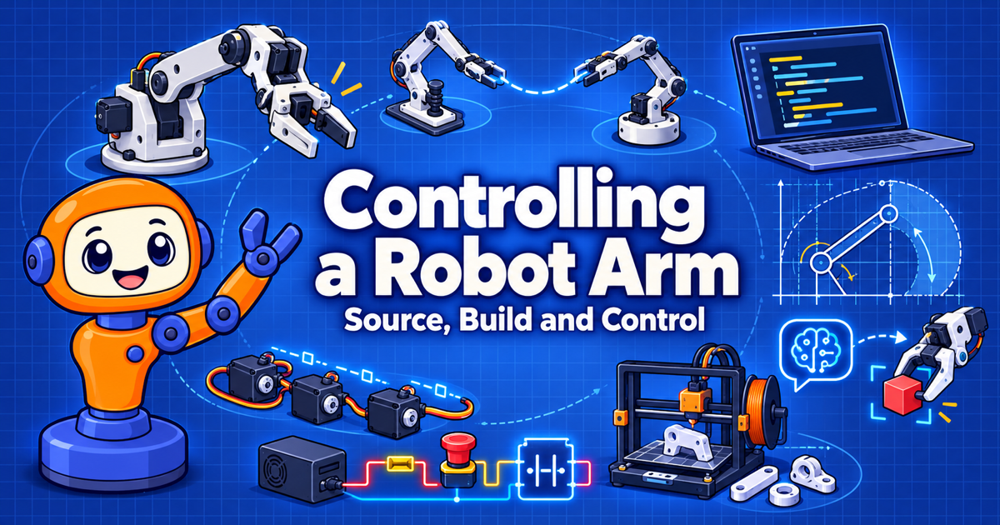

# Controlling a Robot Arm

<figure markdown>
  { width="100%" }
</figure>

An interactive intelligent textbook on sourcing parts, building, and programming low-cost robot arms, using the open-source SO-ARM100 and the Seeed Studio reBot-DevArm as hands-on case studies.

!!! mascot-welcome "Hi, Builder! I'm Servo."
    { class="mascot-admonition-img" }
    This is a Python book that happens to move a real robot. Pick a starting point below and let's move it!

## Start Here

-   :material-rocket-launch: **[Chapter 1: Setting Up Python for Robotics](chapters/01-python-setup-for-robotics/index.md)**

    ---

    Begin at the beginning. You will have a clean Python project that is ready to talk to a real arm.

-   :material-book-open-variant: **[List of Chapters](chapters/index.md)**

    ---

    All 19 chapters, from the anatomy of an arm to AI agents that command one safely.

-   :material-cart: **[Sourcing Parts and Planning a Budget](chapters/06-sourcing-parts-and-budget/index.md)**

    ---

    Planning to buy an arm? Read this before you spend any money. The [Procurement Notes](procurement-notes.md) show what we actually paid.

-   :material-shield-alert: **[Electricity, Power, and Safety](chapters/03-electricity-power-and-safety/index.md)**

    ---

    Fuses, emergency stops, and common grounds. Read this before you power on anything.

## Build and Program Your Arm

Two open-source arms, one learning path.

- **[Building and Calibrating the SO-ARM100](chapters/08-building-the-so-arm/index.md)** — the low-cost, 3D-printed entry point.
- **[Building the reBot-DevArm](chapters/09-building-the-rebot-devarm/index.md)** — the higher-payload step up, and how to choose between the two.
- **[A Python Hardware Library for Robot Arms](chapters/10-python-hardware-library/index.md)** — one Python class that drives either arm.
- **[Kinematics](chapters/12-kinematics/index.md)** — where the hand is and how to get it where you want it.
- **[AI Agents, Tools, and OpenClaw Skills](chapters/15-agents-and-openclaw-skills/index.md)** — connect an AI agent to your arm.

## Learn by Doing

- **[MicroSims](sims/index.md)** — interactive simulations you can drag, slide, and click, such as the [Two-Link Workspace Explorer](sims/two-link-workspace-explorer/index.md) and the [Ohm's Law Explorer](sims/ohms-law-explorer/index.md).
- **[Hands-On Labs](labs/index.md)** — small, low-cost labs to practice on before you touch a full robot arm.
- **[Glossary](glossary.md)** — short, precise definitions of every key term.
- **[FAQ](faq.md)** — answers to the questions readers ask most.

## Stories

!!! mascot-tip "Don't Miss the Stories"
    { class="mascot-admonition-img" }
    Some ideas stick better as a story. Check the [List of Robot Arm Stories](stories/index.md) for illustrated tales, and come back often because more will be added.

The collection is small today and will keep growing. Start with
[The Lobster and the Arm (OpenClaw)](stories/openclaw-lobster-and-the-arm/index.md),
or browse the [Story Ideas](stories/story-ideas.md) to see what is coming.

## Search This Book

!!! mascot-tip "Looking for Something? Search!"
    { class="mascot-admonition-img" }
    The fastest way to find a servo model, a wiring term, or a Python function is the **search box** at the top of every page.

Click the search box, or press `S` or `F` on your keyboard from any page.
Suggestions appear as you type, matching words are highlighted on the page you
open, and you can share a search link with a classmate. Try searching for
`STS3215`, `CAN bus`, or `inverse kinematics`.

## About This Book

- **[About](about.md)** — who the book is for, the prerequisites, and how to read it.
- **[Course Description](course-description.md)** — the learning outcomes the whole book is built from.
- **[Learning Graph](learning-graph/index.md)** — how the concepts depend on each other, so prerequisites always come first. Explore it interactively in the [Learning Graph Viewer](sims/graph-viewer/index.md).
- **[Contact](contact.md)** and **[License](license.md)** — send feedback, and learn how you can reuse this material.
