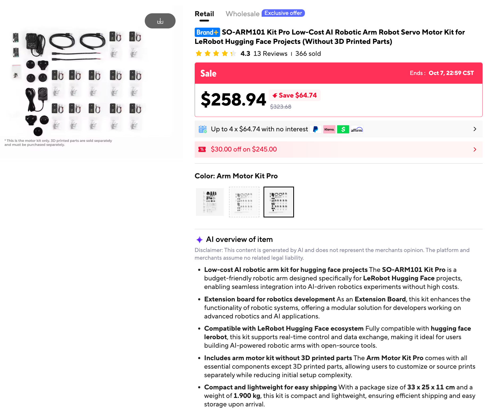

# Procurement Notes

Running notes on what we bought to build the robot arm, where we bought it,
and what it really cost. Prices include shipping and sales tax unless noted,
because the landed cost is what a student actually pays.

## SO-ARM101 Kit (AliExpress)

| | |
|---|---|
| Date purchased | 2026-10-06 |
| Vendor | AliExpress |
| Shipped to | Minnesota |
| Item | SO-ARM101 Kit Pro Low-Cost AI Robotic Arm Robot Servo Motor Kit for LeRobot Hugging Face Projects (Without 3D Printed Parts) |
| Variant | Arm Motor Kit Pro |
| **Total paid (shipping and sales tax included)** | **$332.04** |

### Order total breakdown

| Line | Amount |
|---|---|
| Subtotal (kit) | $258.94 |
| Shipping | $46.55 |
| Sales tax | $26.05 |
| Retail Delivery Fee | $0.50 |
| **Total** | **$332.04** |

AliExpress groups the sales tax and the Retail Delivery Fee under "Additional
charges" ($26.55) at checkout. Neither is a tariff.

- **Sales tax:** AliExpress is a marketplace facilitator, so state law
  requires it to collect sales tax and pass it to the tax authorities.
- **Retail Delivery Fee:** Colorado and Minnesota charge this fee on orders
  with at least one taxable item shipped to those states. This order shipped
  to Minnesota. The fee is non-refundable once the goods have shipped.

### What the listing showed

- Sale price at the time of purchase: $258.94 (list $323.68, sale ended Oct 7).
- Package: 33 x 25 x 11 cm, 1.9 kg.
- 4.3 stars from 13 reviews, 366 sold.
- This is the **motor kit only**. The listing states that the 3D-printed
  structural parts are sold separately and must be purchased or printed on
  your own.

### Cost notes

- The landed cost of $332.04 is well above the $258.94 sticker price. Shipping,
  sales tax and the delivery fee add $73.10 (about 28%), so budget for them when you tell
  students what the kit costs.
- Still to source: the 3D-printed parts for the arm (print them ourselves or
  order them). See the parts list below. The printed parts are budgeted at
  $20 or more, so the whole pair comes to about $350 ($332.04 for the kit).

## 3D-Printed Parts

The SO-ARM101 is a **leader and follower pair**. You move the leader by hand
and the follower copies it, so most parts are printed once for each arm. The
file names come from the open-source
[SO-ARM100 repository](https://github.com/TheRobotStudio/SO-ARM100), which
also covers the SO-101.

### Common parts (print for both arms)

| STL file | What it is |
|---|---|
| `Base_SO101.stl` | Base plate that clamps to the table and carries the shoulder-pan motor. |
| `Base_motor_holder_SO101.stl` | Cradle that holds the shoulder-pan motor in the base. |
| `Motor_holder_SO101_Base.stl` | Bracket for the shoulder-lift motor, mounted on the base side. |
| `Under_arm_SO101.stl` | Forearm link between the elbow and the wrist. |
| `Upper_arm_SO101.stl` | Upper arm link between the shoulder and the elbow. |
| `Rotation_Pitch_SO101.stl` | Joint piece that rotates the shoulder and holds the upper arm. |
| `Motor_holder_SO101_Wrist.stl` | Bracket for the wrist-flex motor. |
| `Wrist_Roll_Pitch_SO101.stl` | Wrist housing that gives the wrist its pitch and roll. |
| `WaveShare_Mounting_Plate_SO101.stl` | Plate that mounts the Waveshare servo driver board. |

### Leader-only parts (the arm you move by hand)

| STL file | What it is |
|---|---|
| `Handle_SO101.stl` | Grip you hold to move the leader. |
| `Trigger_SO101.stl` | Trigger that stands in for the follower's gripper. |
| `Wrist_Roll_SO101.stl` | The leader's wrist roll piece. |

### Follower-only parts (the arm that does the work)

| STL file | What it is |
|---|---|
| `Moving_Jaw_SO101.stl` | Movable jaw of the gripper. |
| `Wrist_Roll_Follower_SO101.stl` | The follower's wrist roll piece, which also forms the fixed half of the gripper. |

### Print settings

- **Material:** PLA+
- **Nozzle and layer height:** 0.4 mm nozzle at 0.2 mm layers, or 0.6 mm
  nozzle at 0.4 mm layers
- **Infill:** 15%
- **Supports:** everywhere, ignoring slopes steeper than 45°. Avoid supports
  inside horizontal screw holes.
- **Bed:** The repository provides pre-arranged single-file plates for
  220×220 mm beds (Ender 3 class) and 205×250 mm beds (Prusa/UP class).

### Optional add-ons

The repository also lists compliant grippers, wrist-camera mounts, overhead
camera mounts, and tactile sensor parts. None are needed for the baseline arm.

### Open questions

- **Quantities:** The repository lists unique files, not counts. We assume the
  common parts are printed twice, once per arm. Confirm this against the
  assembly guide before printing.
- **Infill:** Some commercial kits use 30% infill for the follower and 15% for
  the leader and clamps. We use the repository's 15% as the baseline.
- **Table clamps:** Each base needs a clamp to hold it to the desk. Confirm
  whether these are printed parts and add them to the list.
- **Buy instead of print:** Seeed sells
  [both arms' printed parts](https://uk.robotshop.com/products/seeedstudio-so-arm101-ai-arm-3d-printed-parts)
  as a product, if you don't have a printer.
