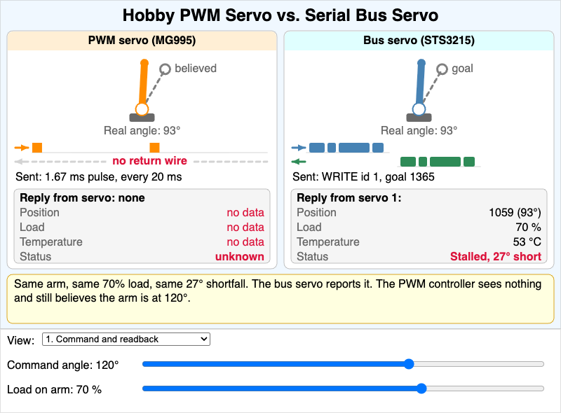

# MicroSims

MicroSims are small, interactive educational simulations — each one focused on
a single concept. They live under `docs/sims/<sim-name>/` and are embedded
into chapters via iframes.

New MicroSims can be created with the `microsim-generator` skill, which routes
to the appropriate library (p5.js, Chart.js, vis-network, Mermaid, Leaflet,
Plotly, Venn.js).

## Catalog

- **[Hobby PWM Servo vs. Serial Bus Servo](pwm-vs-bus-servos/index.md)**

    

    Why an MG995 hobby servo cannot replace the STS3215 bus servos in an
    SO-ARM100/101: command and readback, leader/follower, and wiring.
    Used in [Appendix A](../appendices/pwm-servos/index.md).

- **[Robot Arm Part Identifier](robot-arm-part-identifier/index.md)**

    Explore and then take a quiz on the seven named parts of a six-axis robot arm:
    base, shoulder, upper arm, elbow, forearm, wrist, and end effector.
    Used in [Chapter 2](../chapters/02-anatomy-of-a-robot-arm/index.md).

- **[Two-Link Workspace Explorer](two-link-workspace-explorer/index.md)**

    Seven reachability problems for a flat two-link arm, then an explore mode where link lengths and the elbow limit reshape the shaded workspace ring.
    Used in [Chapter 2](../chapters/02-anatomy-of-a-robot-arm/index.md).

- **[Leader and Follower Mirror](leader-follower-mirror/index.md)**

    Predict where a follower arm's joint ends up when it copies a leader: the copy rule, the follower's joint limits, and calibration error.
    Used in [Chapter 2](../chapters/02-anatomy-of-a-robot-arm/index.md).

- **[Ohm's Law Explorer](ohms-law-explorer/index.md)**

    Change the supply voltage and load resistance, watch animated current dots speed up and slow down, then solve five target-current and target-power challenges.
    Used in [Chapter 3](../chapters/03-electricity-power-and-safety/index.md).

- **[Wire Voltage-Drop Explorer](wire-voltage-drop-explorer/index.md)**

    Pick a wire gauge, length and load current and see the voltage lost in the wires, then choose the thinnest safe wire for five loads.
    Used in [Chapter 3](../chapters/03-electricity-power-and-safety/index.md).

- **[Fuse and E-Stop Power Path](protected-power-path/index.md)**

    Predict whether the arm runs, the fuse blows, or the E-stop stops it, and watch the current dots stop or flow.
    Used in [Chapter 3](../chapters/03-electricity-power-and-safety/index.md).

- **[Common Ground Loop](common-ground-loop/index.md)**

    Predict what a motor driver's input reads with and without a shared ground wire, and watch the signal current loop appear and vanish.
    Used in [Chapter 3](../chapters/03-electricity-power-and-safety/index.md).

- **[H-Bridge Current Paths](h-bridge-current-paths/index.md)**

    Set the four switches of an H-bridge and predict whether the motor runs forward, reverses, coasts, brakes or short-circuits, with animated current dots.
    Used in [Chapter 5](../chapters/05-actuators-and-sensors/index.md).

<!-- Add new MicroSims to the catalog as they are built. -->

