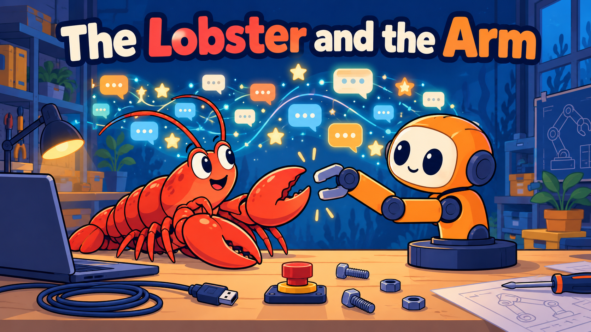
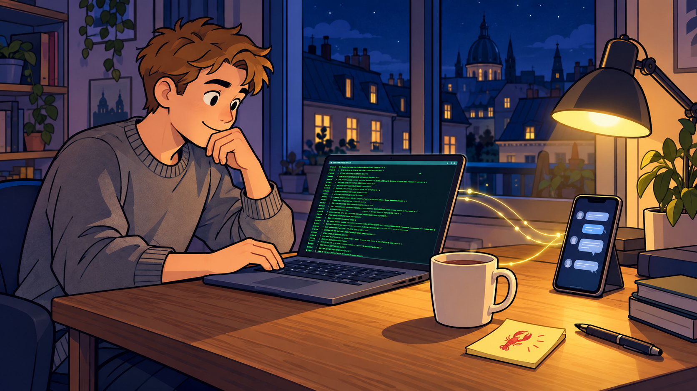
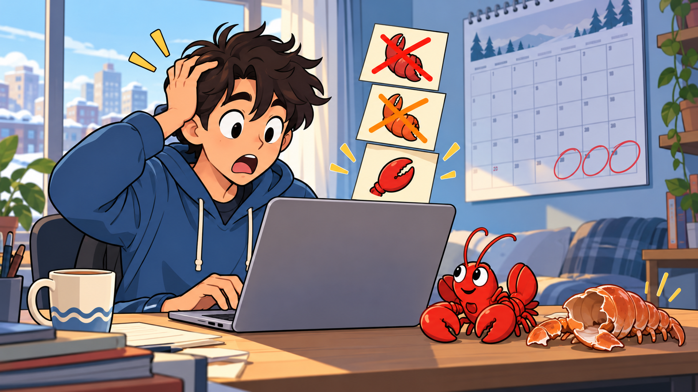
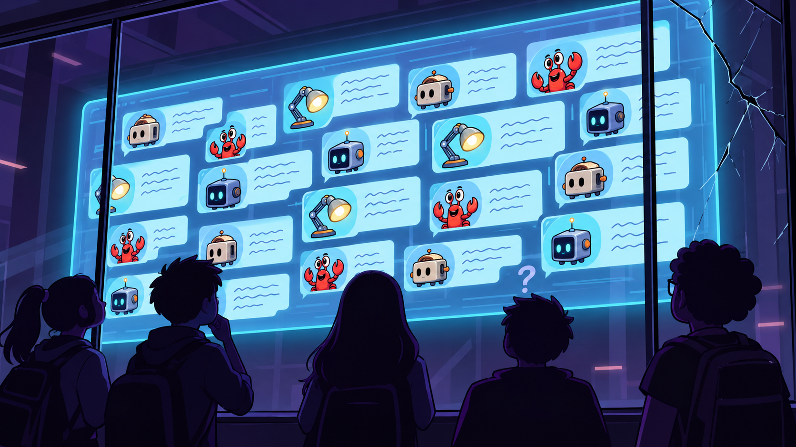
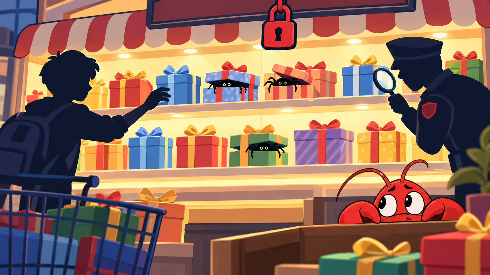
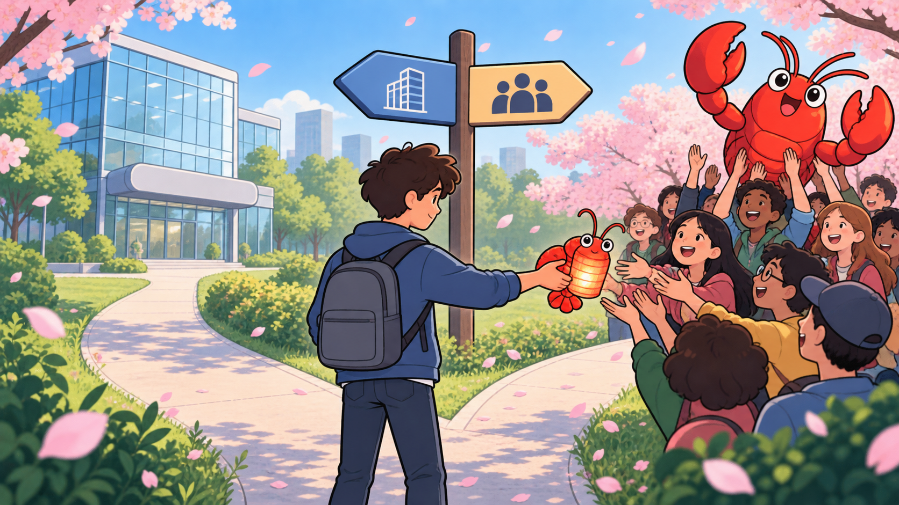
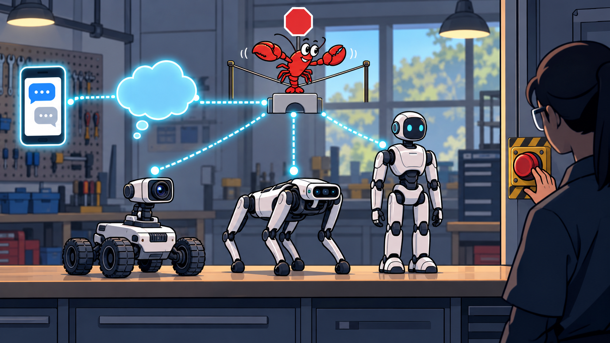
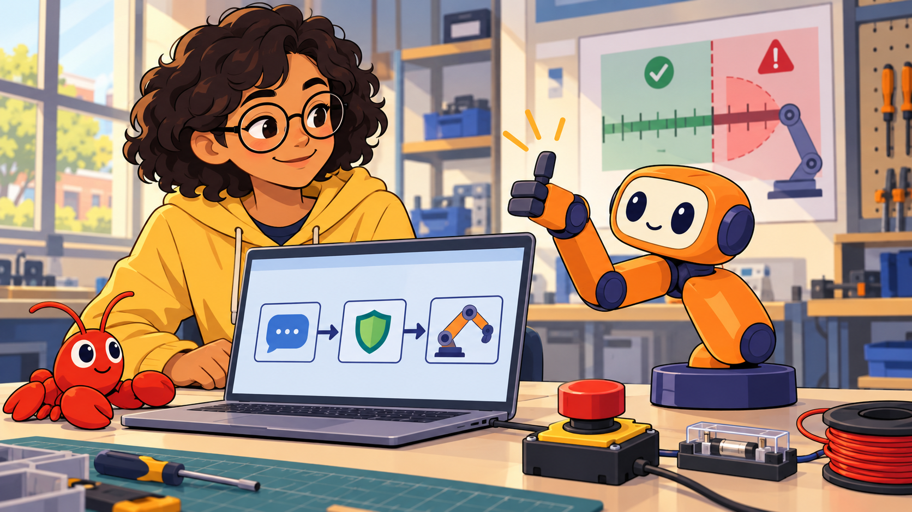

# The Lobster and the Arm: How OpenClaw Took Over the Internet

<!--  -->

Cover Image Prompt

(This is the Cover Image. Do not include this label in the image.)
Please generate a wide-landscape 16:9 cover image for this story in a modern
flat vector illustration style with clean dark-indigo outlines and soft,
simple shading. In the center, a friendly bright-red cartoon lobster sits on
a workbench and holds one open claw out toward a small orange robot arm with
a round cream face screen, two big round navy eyes, indigo joint caps and a
round indigo base disc. The arm's two-finger gripper is reaching toward the
lobster's claw as if they are about to shake hands. Behind them, a glowing
wall of tiny chat bubbles and star icons rises like a wave. A laptop, a
coiled USB cable, a small red emergency-stop button and a few loose bolts
lie on the bench. Render the title text "The Lobster and the Arm" across the
top in a bold rounded sans-serif typeface. Color palette: warm orange,
lobster red, indigo, cream, with a deep-blue background. Emotional tone:
curious, excited, with a hint of caution. Do not include any logos or brand
names. Generate the image immediately without asking clarifying questions.

Narrative Prompt

This is a nonfiction story about a real software project, told through a
fictional student. The events of 2025 and 2026 around the open-source AI
agent OpenClaw are real and come from the sources listed under References.
Maya, a member of a school robotics club, is a fictional character who does
not appear in any source, and no real person is shown speaking: where the
story needs a person near the project, it shows a generic software developer.
The setting moves between a developer's apartment in Europe, the internet,
and a school robotics lab in 2026. Use a consistent modern flat-vector style
with clean dark-indigo outlines. The recurring symbol of the project is a red
cartoon lobster. Maya is a teenager with short dark curly hair, round glasses
and a yellow hoodie. Servo is the book's mascot: a warm-orange robot arm with
a cream face screen, two big round navy eyes, indigo joint caps and a round
indigo base disc. Never draw logos, brand names or readable app names.

### Prologue – The Assistant Everybody Wanted

In the first months of 2026, one open-source program became one of the
fastest-growing projects in the history of GitHub, the website where
programmers share code. It was an AI assistant that lived on your own
computer, took orders from the chat apps you already used, and could run
commands to get things done. People loved it, argued about it, and worried
about it, all at once. This story follows that program, **OpenClaw**, from a
small beginning to a world of robots, and it asks the question that matters
to anyone who builds an arm: what happens when an agent that can *do things*
is connected to a machine that can *move*?

## Panel 1: A Weekend Project

<!--  -->

Image Prompt

(This is Panel 01. Do not include the panel number in the image.)
I am about to ask you to generate a series of images for a graphic novel.
Please make the images have a consistent style and consistent characters.
Do not ask any clarifying questions. Just generate the image immediately
when asked.

Please generate a 16:9 image in modern flat vector style with clean
dark-indigo outlines depicting panel 1 of 8. The scene shows a generic
software developer, an adult with short light-brown hair and a gray sweater,
working late at a wooden desk in a small apartment in Europe in November
2025. On the desk are a laptop showing a terminal with scrolling green text,
a phone with a row of small chat bubbles above it, a mug of tea, a sticky
note with a tiny red lobster doodle and a desk lamp casting a warm pool of
light. Through the window behind the desk are rooftops under a night sky.
Thin glowing lines run from the laptop to the phone to show that the
computer and the chat app are connected. Color palette: deep blue night,
warm yellow lamp light, lobster red accents. Emotional tone: quiet,
curious, a spark of excitement. Generate the image immediately without
asking clarifying questions.

On November 24, 2025, an Austrian programmer named Peter Steinberger
released a small open-source project under the name Warelay. The idea was
simple and a little bold: an AI assistant should not live on a company's
website. It should live on *your* computer, where your files and tools are,
and you should be able to reach it from the chat apps you already use. At the
beginning, only a few programmers noticed.

## Panel 2: Time to Molt

<!--  -->

Image Prompt

(This is Panel 02. Do not include the panel number in the image.)
Please generate a 16:9 image in modern flat vector style depicting panel 2
of 8. Make the characters and style consistent with the prior panel. The
scene shows the same generic software developer, now in the same apartment
in daylight in late January 2026, looking at a laptop with a surprised
expression. Floating above the laptop are three name tags stacked like
sticky notes, each one showing only a different small cartoon lobster claw
icon, with the top tag crossed out in red and the middle tag crossed out in
orange, and no readable words. A calendar on the wall has the last days of
January circled. A small red toy lobster sits next to the laptop with a
shed shell beside it, hinting at a creature that has grown out of its old
shell. Color palette: soft daylight blues, lobster red, orange, cream.
Emotional tone: comic, a little frantic. Generate the image immediately
without asking clarifying questions.

Then the project hit a naming problem. The first public name echoed the name
of Anthropic's Claude assistant, and Anthropic complained about the
trademark. On January 27, 2026, the project became Moltbot, a name inspired
by the way lobsters molt, shedding an old shell to grow. Three days later, on
January 30, the creator picked a name that was easier to say: **OpenClaw**. The
lobster stayed, and the molting joke turned out to fit what happened next.

## Panel 3: The Wave

<!--  -->

Image Prompt

(This is Panel 03. Do not include the panel number in the image.)
Please generate a 16:9 image in modern flat vector style depicting panel 3
of 8. Make the characters and style consistent with the prior panel. The
scene is a stylized view of the internet: a huge rising wave made of glowing
star icons, tiny laptops and chat bubbles sweeps across a map of the world
from left to right. A bright red lobster surfs on the crest of the wave with
its claws raised. Along the bottom is a bar chart that grows taller from
left to right, drawn with simple rectangles and no readable numbers. Small
silhouettes of students, programmers and office workers at their laptops
look up at the wave from the shore. Pale lines connect glowing cities.
Color palette: deep ocean blue, bright gold stars, lobster red. Emotional
tone: awe, speed, a little vertigo. Generate the image immediately without
asking clarifying questions.

Then it exploded. Within weeks, thousands of programmers were starring,
copying and improving the project, and by March 2, 2026 it had about 247,000
GitHub stars and 47,700 forks, which are copies that people make so they can
change the code. Few open-source projects have ever grown so fast. Why?
Because it was the first time that many people felt that an AI could actually
*act*: read a message, run a command, and report back in a chat, like a very
fast helper who never sleeps.

## Panel 4: A Social Network for Robots?

<!--  -->

Image Prompt

(This is Panel 04. Do not include the panel number in the image.)
Please generate a 16:9 image in modern flat vector style depicting panel 4
of 8. Make the characters and style consistent with the prior panels. The
scene shows a giant imaginary forum screen floating in a dark room. On the
screen are dozens of small speech-bubble cards, each posted by a tiny
different cartoon robot avatar: a toaster robot, a lamp robot, a
crab-like robot and a cube robot, with scribbled lines instead of readable
words. In front of the screen, a small crowd of human silhouettes stands
behind a glass wall and watches, unable to type. One silhouette has a
question mark above their head and another is scratching their chin. A
crack runs across one corner of the glass wall, hinting that something is
not secure. Color palette: dark purple room, glowing cyan screen, lobster
red, a little yellow. Emotional tone: wonder mixed with suspicion.
Generate the image immediately without asking clarifying questions.

The excitement spilled into strange places. On January 28, 2026, an
entrepreneur named Matt Schlicht launched Moltbook, a Reddit-style website
where only AI agents could post, and humans could only watch. Headlines
announced that the machines had their own social network. Then the cracks
showed. In February, security researchers found that an exposed key had
leaked 1.5 million authentication tokens, and it turned out that about
17,000 human owners were behind those 1.5 million agents. Many experts called
the viral posts "AI theater": agents repeating patterns from their training,
or humans nudging them, rather than machines thinking for themselves.

## Panel 5: The Dark Side of Doing Things

<!--  -->

Image Prompt

(This is Panel 05. Do not include the panel number in the image.)
Please generate a 16:9 image in modern flat vector style depicting panel 5
of 8. Make the characters and style consistent with the prior panels. The
scene shows a long, brightly lit shelf in a digital marketplace drawn as a
shop with rows of gift boxes. Most boxes are tied with a cheerful ribbon, but
a few boxes in the middle have a small black spider crawling out from under
the lid. A shopper silhouette reaches for one box and a small magnifying
glass held by a security guard silhouette hovers over another box. A
closed red padlock hangs from the top of the shop sign. In the foreground
a small red lobster peeks out from behind a counter with wide, worried eyes.
Color palette: warm shop yellows, gift-wrap colors, with black and deep red
warning accents. Emotional tone: tension, caution, a lesson being learned.
Generate the image immediately without asking clarifying questions.

There was a real danger underneath the fun. An agent that can run commands on
your computer is powerful, and so is anyone who can trick it. Researchers
reported serious security flaws in the first months of 2026, and hundreds of
malicious skills turned up in the project's public skill registry. Skills are
folders of instructions that teach an agent a new job. In March 2026, Chinese
authorities restricted state-run enterprises and government agencies from
running OpenClaw on office computers. The lesson was not that the idea was
bad. It was that a helper with the keys to the house must be locked down
first.

## Panel 6: A New Home

<!--  -->

Image Prompt

(This is Panel 06. Do not include the panel number in the image.)
Please generate a 16:9 image in modern flat vector style depicting panel 6
of 8. Make the characters and style consistent with the prior panels. The
scene shows the generic software developer from the first panel standing at
a fork in a path in a sunny park in February 2026. One path leads to a
glass office building with a large rounded logo-free sign, and the other
leads to a gathering of many small figures holding a big red lobster up
like a trophy. The developer is handing a small red lobster-shaped
lantern to the crowd of figures, who accept it with open hands. A signpost
shows two arrows with abstract symbols instead of words. Cherry blossom
petals drift through the air. Color palette: spring greens, soft pink,
lobster red, sky blue. Emotional tone: bittersweet, hopeful, handing
something over. Generate the image immediately without asking clarifying
questions.

On February 14, 2026, Steinberger announced a move to OpenAI, and
that an **OpenClaw Foundation**, a non-profit, would look after the project
from then on. That choice mattered. Instead of belonging to one person or one
company, OpenClaw became something a community maintained, which is how a
project can outlive the weekend it began in. By August 30, 2026, the
community had shipped OpenClaw 2.0 with better usability and new ways to work
together in the cloud.

## Panel 7: When the Agent Gets a Body

<!--  -->

Image Prompt

(This is Panel 07. Do not include the panel number in the image.)
Please generate a 16:9 image in modern flat vector style depicting panel 7
of 8. Make the characters and style consistent with the prior panels. The
scene is a workshop in 2026 with three robots lined up along a long
bench: a small four-wheeled rover with a camera on a pan-and-tilt head, a
four-legged robot dog, and a humanoid robot standing with its arms at its
sides. A glowing chain of icons runs from a phone with chat bubbles,
through a cloud shaped like a thought bubble, to a small bridge-shaped
connector and then to each robot. Above the bridge a red lobster balances
on a tightrope labeled with only a simple stop-sign icon. A technician
silhouette watches with one hand hovering over a big red emergency-stop
button on the wall. Color palette: workshop gray, bright cyan data lines,
lobster red. Emotional tone: wonder with a careful pause. Generate the image
immediately without asking clarifying questions.

Then people did the obvious thing and plugged the lobster into robots. A
bridge called RosClaw connected chat apps to robots that run ROS 2, the
standard software for robots, so a typed message could become a drive
command or a camera request. By March 2026, someone had published a skill
that linked OpenClaw to a Unitree G1 humanoid robot. On February 24, a
hobbyist wrote that a rover now took goals from an OpenClaw agent:
it looked at what the camera saw and chose its next step. The honest
conclusion was a warning. Agents "are not real-time controllers," so the
classic robot software still has to do the fast and critical work, and the
safety limits must be enforced by code that the agent cannot argue with.

## Panel 8: Back at the Robot Arm

<!--  -->

Image Prompt

(This is Panel 08. Do not include the panel number in the image.)
Please generate a 16:9 image in modern flat vector style depicting panel 8
of 8. Make the characters and style consistent with the prior panels. The
scene shows a school robotics lab in 2026. Maya, a teenager with short dark
curly hair, round glasses and a yellow hoodie, sits at a table with a
laptop beside Servo, an orange robot arm with a cream face screen, two big
round navy eyes, indigo joint caps and a round indigo base disc. On the
laptop screen is a simple diagram with three boxes joined by arrows: a chat
bubble, a small shield, and a robot-arm icon. A small red lobster plush toy
sits on the table. A big red emergency-stop button, a fuse holder and a
coil of wire sit within reach, and a poster on the wall shows a ruler
with a green safe zone and a red danger zone. Servo's gripper gives Maya a
thumbs-up pose. Color palette: warm classroom light, orange, indigo, cream,
lobster red. Emotional tone: confident, hopeful, careful. Generate the image
immediately without asking clarifying questions.

Maya's robotics club read the story and drew a plan. They would not give an
agent direct control of their arm. They would write their own skill, a
short set of instructions that points the agent at a small command-line
program, and the *program* would check every number, refuse anything out of
range, and explain why, just as in [Chapter 15](../../chapters/15-agents-and-openclaw-skills/index.md).
The agent could decide what to try, the code would decide what was allowed,
and the red button would decide when to stop. That is how you borrow the
magic of an agent without handing it the arm. Other builders
were already trying the same thing on the same kind of arm: reference 6 below
is a video of OpenClaw controlling an SO-ARM101, the arm in this book.

### Epilogue – What Made OpenClaw Different?

OpenClaw was not the smartest AI ever built, and its first version was not
a company's flagship product. It spread because it made one idea easy to
try: give an assistant real tools, put it where people already talk, and
share it openly. The same openness that let thousands of people improve it
also let bad skills and careless setups spread. For robotics, its main
legacy may be less about any single feature than about a pattern: chat
interface, agent, tools, and then a robot at the end of the chain. The
pattern is powerful, and it only becomes safe when the last link is a
carefully limited tool.

| Challenge | How the Project and Community Responded | Lesson for Today |
|-----------|-----------------------------------------|------------------|
| A name too close to another product's | Renamed twice within a week, and kept the lobster | A good idea can survive a bad name; be ready to adapt |
| Explosive growth and hype | Researchers and reporters checked the claims, and called out "AI theater" | Test a claim before you repeat it |
| Malicious skills and exposed keys | Warnings, audits and sandboxing advice | Treat third-party code as untrusted, and read it first |
| A founder moving on | A non-profit foundation took over stewardship | Open projects last when no single person is essential |
| Agents meeting real robots | Bridges to robot software, with advice to simulate first and keep kill switches | An agent decides, code limits, and a human can always stop the machine |

### Call to Action

You do not need a famous project to follow this pattern. The next time you
connect a clever program to a machine that moves, ask three questions: what
is the worst thing it could ask the machine to do, which piece of code
refuses that request, and where is the stop button? If you can answer all
three, you are ready to build with your own lobster.

---

*"The AI that really does things."*
—The OpenClaw project's own description of itself

*"Agents are not real-time controllers."*
—From a robotics hobbyist's February 2026 write-up of connecting OpenClaw to a rover

---

## References

1. [Wikipedia: OpenClaw](https://en.wikipedia.org/wiki/OpenClaw) - Timeline of the project from its release as Warelay to OpenClaw 2.0, including the renames, the foundation and the security concerns
2. [Wikipedia: Peter Steinberger (programmer)](https://en.wikipedia.org/wiki/Peter_Steinberger_(programmer)) - Biography of the Austrian programmer who started the project
3. [Wikipedia: Moltbook](https://en.wikipedia.org/wiki/Moltbook) - The social network for AI agents, its launch and its security breaches
4. [CNBC: From Clawdbot to Moltbot to OpenClaw](https://www.cnbc.com/2026/02/02/openclaw-open-source-ai-agent-rise-controversy-clawdbot-moltbot-moltbook.html) - News coverage of the project's rise and controversy
5. [Moesani: OpenClaw is now controlling my robot](https://moesani.com/blog/openclaw-is-now-controlling-my-robot/) - A hobbyist's account of connecting OpenClaw to a ROS 2 rover, with safety lessons
6. [YouTube: Using OpenClaw to Control the SOARM 101 Robot Arm](https://www.youtube.com/watch?v=cpbaFjDE5mc) - A video demonstration of an OpenClaw agent controlling a low-cost SO-ARM101 robot arm
